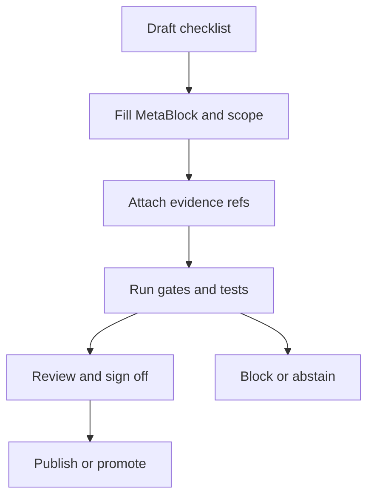

<!-- [KFM_META_BLOCK_V2]
doc_id: kfm://doc/<uuid>
title: Checklist — <short name>
type: standard
version: v1
status: draft
owners: <team or names>
created: YYYY-MM-DD
updated: YYYY-MM-DD
policy_label: public|restricted|...
related:
  - <relative/path/or/kfm://id>
tags:
  - kfm
  - checklist
notes:
  - Template file. Copy and fill; do not publish as-is.
[/KFM_META_BLOCK_V2] -->

# Checklist — <short name>
One-line purpose: a reusable, governed checklist for reviewing and promoting a KFM artifact (dataset, pipeline change, story publish, policy change, release).

---

## Impact
<!--
REQUIRED top-of-file “impact block” (keep it compact).
Replace badge placeholders and fields before using this checklist in a PR/review.
-->

 <!-- TODO -->
 <!-- TODO -->
 <!-- TODO -->

- **Owners:** `<team or names>`
- **Reviewers:** `<names/teams>`
- **Decision target date:** `YYYY-MM-DD`
- **Applies to:** `<dataset_slug | story_id | service/api | repo_path | other>`

**Quick links:** [Scope](#scope) · [Gate summary](#gate-summary) · [Checklist](#checklist) · [Sign-off](#sign-off) · [Appendix](#appendix)

---

## How to use this template
1. Copy this file to the doc/review location you want (example: `docs/reviews/<yyyy-mm-dd>__<short-name>.md`).
2. Fill the MetaBlock and Impact fields.
3. Delete sections that do not apply (but keep **Gate summary** + **Sign-off**).
4. If any required gate is **UNKNOWN**, mark the overall decision as **ABSTAIN** and list the smallest verification steps.

---

## Scope
### What is being reviewed
- **Artifact kind:** `<dataset | pipeline | api | story | policy | release | other>`
- **Change summary:** `<what changed and why>`
- **Time window (if applicable):** `<start … end>`
- **Geo scope (if applicable):** `<statewide | county | generalized region | bbox | other>`

### Where it fits
- **Repo path(s):** `<path(s)>`
- **Upstream inputs:** `<sources, datasets, services>`
- **Downstream outputs:** `<catalogs, tiles, graph, UI, story nodes, focus mode>`

### Acceptable inputs
- `<what belongs here>`
- `<constraints: formats, schemas, sensitivity classes>`

### Exclusions
- `<what must not go here>`
- `<where it should go instead>`

---

## Gate summary
> Keep this section up to date while you work. It is the “one screen” that reviewers scan first.

| Gate | Status (pass/block/na/unknown) | Evidence / link |
| --- | --- | --- |
| Metadata (MetaBlock complete) | unknown | `<link>` |
| Evidence resolvable (refs resolve, policy allows) | unknown | `<link>` |
| License + terms captured | unknown | `<link>` |
| Sensitivity classification correct | unknown | `<link>` |
| Validation thresholds met | unknown | `<link>` |
| Provenance + run receipt present | unknown | `<link>` |
| Determinism / reproducibility checks | unknown | `<link>` |
| API/contracts updated (if applicable) | na | `<link>` |
| Security posture (secrets, SBOM, signing) | unknown | `<link>` |
| Ops readiness (logs, metrics, rollback) | unknown | `<link>` |
| Docs updated | unknown | `<link>` |

**Overall decision:** `<PASS | BLOCK | ABSTAIN>`

**Decision rationale (1–3 bullets):**
- `<reason 1>`
- `<reason 2>`

**If BLOCK/ABSTAIN: smallest steps to reach PASS**
1. `<step>`
2. `<step>`

---

## Checklist

### 1) Metadata and identity
- [ ] MetaBlock is present and complete (doc_id, title, type, version, status, owners, created/updated, policy_label).
- [ ] `doc_id` is stable (do not regenerate on edits; only set once when you create the doc).
- [ ] `updated` reflects meaningful edits.
- [ ] All referenced IDs/paths resolve (relative links work; kfm:// IDs are valid and stable).

### 2) Claims and evidence discipline
- [ ] Every meaningful claim is labeled `CONFIRMED`, `PROPOSED`, or `UNKNOWN`.
- [ ] **CONFIRMED** claims have at least one EvidenceRef (prefer `dcat://`, `stac://`, `prov://`, `doc://`; avoid raw URLs when possible).
- [ ] **UNKNOWN** claims list the smallest verification steps to make them CONFIRMED.
- [ ] If the artifact will be published: citations/refs are resolvable through the evidence resolver, and policy allows the bundle.

#### Claims table (copy rows as needed)
| Claim ID | Claim text | Label (CONFIRMED/PROPOSED/UNKNOWN) | EvidenceRef(s) | Verification steps if UNKNOWN |
| --- | --- | --- | --- | --- |
| claim.001 | `<text>` | UNKNOWN | `<dcat://…>` | `<steps>` |

### 3) Policy, sensitivity, and licensing
- [ ] A `policy_label` is set for the artifact and matches intent (public, public_generalized, restricted, etc.).
- [ ] Sensitivity risks are evaluated (PII risk, sensitive-location risk, inadvertent-harm risk).
- [ ] Required redactions/generalizations are applied and documented (and do not leak restricted detail).
- [ ] License/terms are captured with retrieval date and attribution needs are documented.
- [ ] Default posture is **fail closed** (if license/policy/sensitivity gates fail, promotion/publish is blocked).

### 4) Data lifecycle and promotion gates
> Use this section when the artifact moves across zones: RAW → WORK → PROCESSED → PUBLISHED.

- [ ] Identity: dataset/story/service has stable ID and versioning scheme.
- [ ] Schema: contract/schema exists and is validated.
- [ ] Extents: temporal + spatial extents are recorded (and generalized if required).
- [ ] Validation: results meet explicit thresholds; failures are surfaced (not ignored).
- [ ] Provenance: inputs, transforms, and tool versions are recorded.
- [ ] Integrity: checksums/digests exist for inputs and outputs.
- [ ] Audit: run record exists (who/what/when/why + policy decisions).
- [ ] Promotion does not bypass governed APIs (no UI direct-to-DB/storage paths).

### 5) Provenance, run receipts, and reproducibility
- [ ] A run receipt exists for the relevant pipeline/run (or a “dry run” receipt if appropriate).
- [ ] Receipt includes: run_id, dataset_version_id (if applicable), spec_hash, inputs, outputs, validation status, policy decision, environment, timestamps.
- [ ] A reviewer can reproduce the run or at least reproduce the checks from recorded inputs + parameters.
- [ ] If applicable: catalogs (STAC/DCAT/PROV) are emitted and cross-links validated.

### 6) Validation and QA
- [ ] Schema validation passes.
- [ ] Cross-link integrity passes (STAC/DCAT/PROV refs resolve).
- [ ] Domain checks pass (examples: geometry validity, required fields present, range checks).
- [ ] Regression tests updated/added for the change.
- [ ] Determinism checks: rerun produces identical digests (or documented acceptable non-determinism).

### 7) Architecture and contracts
- [ ] No client/UI bypasses governed APIs (no direct storage/DB access).
- [ ] API changes are contract-first (OpenAPI/schema updated) and compatible (or a migration plan exists).
- [ ] Core logic does not bypass repository/adapter layers to reach storage.
- [ ] Invariants are encoded as tests/CI checks (fail closed), not tribal memory.

### 8) Security and supply chain
- [ ] No secrets committed (tokens/keys/credentials).
- [ ] Dependencies reviewed; SBOM and vulnerability scanning run where required.
- [ ] Artifacts are signed/attested where required; verification is part of CI gates.
- [ ] Access follows least privilege; authN/authZ tested for governed endpoints.

### 9) Reliability and operations
- [ ] Logs are structured and sufficient for audit/debug (include run_id / decision_id where relevant).
- [ ] Metrics/traces exist for critical workflows.
- [ ] SLOs are defined for critical APIs/pipelines (or explicitly deferred with rationale).
- [ ] Runbook exists (or updated) for ops-significant changes.
- [ ] Rollback plan exists and is documented (especially for production releases).

### 10) Documentation and communication
- [ ] Directory README updates (purpose, where it fits, inputs, exclusions) where behavior changed.
- [ ] User-facing docs include “trust surfaces” (dataset version, license, evidence access).
- [ ] Change log / release notes updated (if applicable).
- [ ] Known limitations and risks are documented (non-sensational; avoid definitive judgments when uncertain).

---

## Sign-off
| Role | Name | Date | Decision |
| --- | --- | --- | --- |
| Owner | `<name>` | `YYYY-MM-DD` | `<approve/block>` |
| Reviewer | `<name>` | `YYYY-MM-DD` | `<approve/block>` |
| Steward (if required) | `<name>` | `YYYY-MM-DD` | `<approve/block>` |

---

## Appendix

### Checklist flow (illustrative)

Scenario add-ons: Dataset onboarding

- [ ] Dataset onboarding spec exists and is canonical (inputs to spec_hash).
- [ ] Spec includes: authority, access method, endpoints, cadence, terms snapshot.
- [ ] Normalization mapping exists (canonical fields, units, CRS).
- [ ] Outputs are declared (artifact types and paths) and match emitted outputs.
- [ ] Watcher/update detection exists (opens PR or triggers pipeline).

Scenario add-ons: Story Node publishing

- [ ] Story Node markdown includes citations and evidence section.
- [ ] Story Node sidecar captures map state + citations + review state.
- [ ] Publishing requires citations resolve and review state is recorded.

Scenario add-ons: Policy pack change

- [ ] Policy is default deny and has unit tests.
- [ ] Fixtures cover allow and deny examples.
- [ ] CI blocks merges on policy test failures.

---

_Back to top: [Impact](#impact)_
