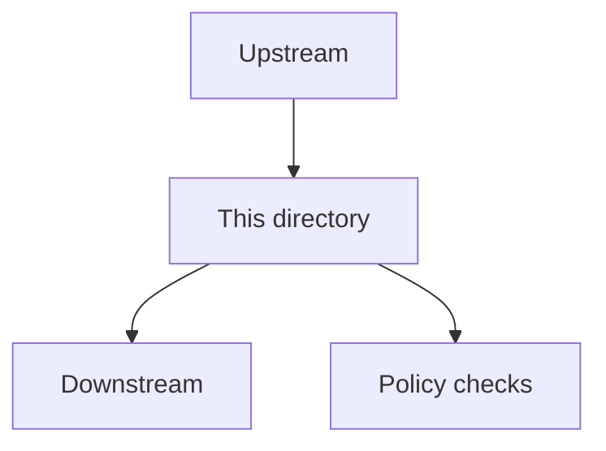

<!-- [KFM_META_BLOCK_V2]
doc_id: kfm://doc/TBD
title: TEMPLATE — Directory README
type: standard
version: v1
status: draft
owners: ["@kfm/core"]
created: YYYY-MM-DD
updated: YYYY-MM-DD
policy_label: public
related: ["docs/governance/ROOT_GOVERNANCE.md", "docs/templates/standard/"]
tags: [kfm, template, docs]
notes: ["Copy this file into a directory as README.md and replace all <PLACEHOLDER> values."]
[/KFM_META_BLOCK_V2] -->

<a id="top"></a>

# <DIRECTORY_TITLE>
<One-line purpose. What is this directory for?>

> **Status:** <experimental|active|stable|deprecated>
> • **Owners:** <@team-or-github-handles>
> • **Policy:** <public|restricted|internal>
> • **Last updated:** <YYYY-MM-DD>
>
>   
>
> **Jump to:** [Scope](#scope) · [Where it fits](#where-it-fits) · [Inputs](#inputs) · [Exclusions](#exclusions) · [Directory tree](#directory-tree) · [Quickstart](#quickstart) · [Usage](#usage) · [Diagram](#diagram) · [Tables](#tables) · [Definition of done](#definition-of-done) · [FAQ](#faq)

---

## Scope

What this directory **does**:

- <Bullet>
- <Bullet>

What this directory **does not** do (high level):

- <Bullet>
- <Bullet>

### Constraints and invariants

- <Invariant #1 — e.g., “UI/clients must not access storage directly; all access crosses governed APIs.”>
- <Invariant #2 — e.g., “Fail-closed policy gates on promotion to PUBLISHED.”>

> NOTE: If this directory contains governed artifacts (datasets, catalogs, policy), link to the governing policy docs and state the enforcement mechanism (CI gate, OPA policy, validator, etc.).

[Back to top](#top)

---

## Where it fits

**Path:** `<repo>/<path/to/this/directory>`

**Upstream inputs:**

- <Upstream module/path → what it provides>

**Downstream consumers:**

- <Downstream module/path → what it expects from this directory>

**API / trust boundary (if applicable):**

- <Which governed API endpoints (or CLI) are the only allowed access path?>

[Back to top](#top)

---

## Inputs

Acceptable inputs for this directory:

- <File types>
- <Schema/contracts>
- <Naming conventions>

If inputs are validated, describe:

- **Validator:** `<tool/path>`
- **Command:** `<exact command>`
- **Fail behavior:** <fail-closed|warn-only> (default should be fail-closed for governed lanes)

[Back to top](#top)

---

## Exclusions

What must **not** go here (and where it goes instead):

- <Bad thing> → <Correct location>
- <Bad thing> → <Correct location>

[Back to top](#top)

---

## Directory tree

```text
<path/to/this/directory>/
  README.md
  <subdir>/
    <file>
  <subdir>/
    <file>
```

[Back to top](#top)

---

## Quickstart

```bash
# PSEUDOCODE: replace placeholders to match your environment.
cd <repo-root>

# Example: run local checks
make -C <path/to/this/directory> test

# Example: validate artifacts (schemas / contracts)
python -m <package>.validate --input <file-or-dir>
```

[Back to top](#top)

---

## Usage

### Common tasks

1. <Task>
2. <Task>
3. <Task>

### Example

```bash
# PSEUDOCODE: show the most common real invocation.
<command> --help
```

[Back to top](#top)

---

## Diagram

> IMPORTANT: Every directory README must include at least one diagram.



[Back to top](#top)

---

## Tables

Use tables for registries, matrices, inventories, and contracts.


| Item | Type | Purpose | Owner | Notes |
|---|---|---|---|---|
| `<file-or-subdir>` | `<spec|code|data|template>` | <Why it exists> | <@owner> | <Notes> |
| `<file-or-subdir>` | `<spec|code|data|template>` | <Why it exists> | <@owner> | <Notes> |

[Back to top](#top)

---

## Definition of done

A directory is considered “ready” when:

- [ ] **Purpose is explicit** (one-line purpose + scope).
- [ ] **Where-it-fits is explicit** (upstream + downstream dependencies).
- [ ] **Inputs/exclusions are explicit** (what belongs here vs elsewhere).
- [ ] **At least one diagram** exists and is up to date.
- [ ] **Quickstart** contains copy/paste commands (or labeled pseudocode).
- [ ] **Contracts/gates** are described (schema validators, policy checks, CI steps).
- [ ] **Security/PII/sensitivity stance** is stated if relevant.
- [ ] **Rollback path** is documented for ops-significant artifacts.

### Optional (recommended for governed lanes)

- [ ] Provenance metadata exists (who/what/when/why; links to run records).
- [ ] Checksums/digests exist for published artifacts.
- [ ] Promotion gates exist (RAW → WORK → PROCESSED → PUBLISHED).

[Back to top](#top)

---

## FAQ

**Q: <Question?>**

A: <Answer. Link to a doc or runbook if this is operational.>

**Q: <Question?>**

A: <Answer.>

[Back to top](#top)

---

## Appendix

<details>
<summary>Longer notes, rationale, and references</summary>

- Rationale: <why this directory is structured this way>
- Risks: <what commonly goes wrong>
- Alternatives: <what we considered and why we did not choose it>

</details>
