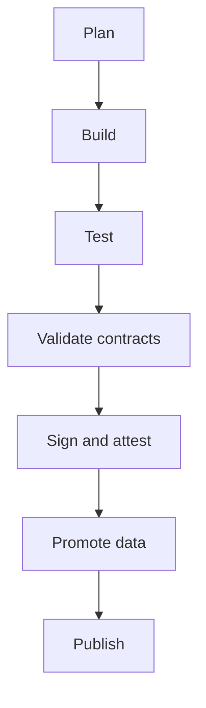

<!-- [KFM_META_BLOCK_V2]
doc_id: kfm://doc/45708c1d-15ca-41c9-b8a3-42bef0bf7196
title: TEMPLATE — Release Notes
type: standard
version: v1
status: draft
owners: kfm-core
created: 2026-03-05
updated: 2026-03-05
policy_label: public
related: [docs/governance/ROOT_GOVERNANCE.md, docs/specs, docs/templates/standard]
tags: [kfm, template, release-notes]
notes: [Copy this template for each release; remove template guidance blocks before publishing.]
[/KFM_META_BLOCK_V2] -->

# TEMPLATE — Release Notes
A copy-paste template for publishing KFM releases with evidence, governance, and rollback clarity.

> **Status:** template  
> **Owners:** `kfm-core` (update for your team)  
> **Badges:**     
> **Quick links:** [Release metadata](#release-metadata) · [Summary](#summary) · [Breaking changes](#breaking-changes) · [Data and catalog changes](#data-and-catalog-changes) · [Validation and evidence](#validation-and-evidence) · [Release readiness checklist](#release-readiness-checklist)

---

## How to use this template

1. Copy this file to your release notes location.
   - **PROPOSED:** `docs/releases/<YYYY>/RELEASE__<TAG>.md`
2. Replace every placeholder like `<THIS>`.
3. Delete every block marked **TEMPLATE GUIDANCE** before publishing.

### Release flow



---

## Evidence discipline

KFM uses a strict “cite or abstain” posture. In release notes, treat *every user-visible claim* as something that must be backed by evidence.

Use these labels consistently:

- **CONFIRMED** — Shipped in this release and backed by evidence (tag or commit, PRs, CI run, catalog artifacts, digests).
- **PROPOSED** — Planned but not shipped yet (allowed in **draft** notes only; must be removed before publishing).
- **UNKNOWN** — Not verified yet; include the smallest steps needed to make it **CONFIRMED**; must be resolved before publishing.

**Template rule:** Any section that says “Required before publish” must not contain **PROPOSED** or **UNKNOWN** entries in the final document.

---

## KFM invariants

These are non-negotiable system invariants. Release notes must call out any change that affects them.

- **CONFIRMED:** Trust membrane remains intact: UI and external clients never access storage or databases directly.
- **CONFIRMED:** Policy is fail-closed and default-deny on governed API requests and Focus Mode outputs.
- **CONFIRMED:** Dataset promotions require integrity proofs plus catalog triplets.
- **CONFIRMED:** Focus Mode answers must cite evidence or abstain.

---

## Scope

### Purpose
Release notes are the public, auditable record of **what changed**, **why it changed**, **who is affected**, and **how to validate and roll back**.

### Where it fits
- Path: `docs/templates/standard/TEMPLATE__RELEASE_NOTES.md`
- Downstream: `docs/releases/**` (or your chosen release-notes directory)

### Acceptable inputs
- Release tag or commit (immutable identifier)
- CI run URLs or workflow run IDs
- Evidence artifacts (SBOM, signatures, attestations, receipts)
- Contract validation outputs (STAC, DCAT, PROV)
- Change list (PRs, issues), with links

### Exclusions
- Marketing copy without technical substance
- Sensitive details that increase risk (see [Safety and sensitivity](#safety-and-sensitivity))
- Unverified claims (**UNKNOWN**) in published notes
- “Roadmap” items that did not ship (**PROPOSED**) in published notes

[Back to top](#template--release-notes)

---

## Release metadata

**Required before publish.**

Fill this block in full.

```yaml
release:
  name: "<RELEASE_NAME>"
  tag: "<GIT_TAG_OR_RELEASE_ID>"
  date_utc: "<YYYY-MM-DD>"
  type: "<release|hotfix|rc>"
  status: "<draft|published>"
  commit:
    sha: "<GIT_SHA>"
    compare_url: "<COMPARE_URL>"
  owners:
    - "<@team-or-person>"
  approvals:
    - "<@approver>"
  distribution:
    artifacts_uri: "<WHERE_BINARY_OR_DATA_ARTIFACTS_LIVE>"
    sbom_uri: "<SBOM_URI>"
    provenance_uri: "<PROV_URI>"
  support_window:
    start_utc: "<YYYY-MM-DD>"
    end_utc: "<YYYY-MM-DD>"
```

[Back to top](#template--release-notes)

---

## Summary

**Required before publish.**

### What changed
- **CONFIRMED:** <One sentence summary of the most important user-visible change.>
- **CONFIRMED:** <Second most important change.>

### Who is affected
- **CONFIRMED:** <User groups or systems impacted.>
- **CONFIRMED:** <Data producers, API consumers, UI users, operators.>

### Upgrade urgency
Choose one:

- **CONFIRMED:** Routine
- **CONFIRMED:** Recommended
- **CONFIRMED:** Urgent

### Rollback posture
- **CONFIRMED:** <Rollback is supported via `<MECHANISM>` to `<PRIOR_TAG>`; see [Rollback plan](#rollback-plan).>

---

## Compatibility

**Required before publish if anything changes in APIs, schemas, drivers, or infra.**

| Surface | Previous | New | Notes |
|---|---:|---:|---|
| API contract | `<vX>` | `<vY>` | **CONFIRMED:** <Breaking? Add link to migration section.> |
| Neo4j | `<vX>` | `<vY>` | **CONFIRMED:** <Driver compatibility + rollback note.> |
| PostGIS | `<vX>` | `<vY>` | **CONFIRMED:** <Migration note.> |
| UI | `<vX>` | `<vY>` | **CONFIRMED:** <Browser support changes.> |
| Pipelines | `<vX>` | `<vY>` | **CONFIRMED:** <Orchestrator and connector changes.> |

---

## Breaking changes

**Required before publish if any exist. If none, explicitly say “None”.**

> TEMPLATE GUIDANCE: Every breaking change must include impact, migration, and rollback.  
> If you can’t write those, you do not understand the break well enough to ship it.

### Breaking change 1 — `<TITLE>`
- **CONFIRMED:** Component: `<COMPONENT>`
- **CONFIRMED:** Impact: <Who breaks and how they will notice.>
- **CONFIRMED:** Migration:
  1. <Step 1>
  2. <Step 2>
- **CONFIRMED:** Rollback: <How to back out, and what data is at risk.>
- **CONFIRMED:** Evidence: <PR, CI run, contract validation outputs>

---

## Features and improvements

### Added
- **CONFIRMED:** <Feature> — Evidence: <PR or issue refs>
- **CONFIRMED:** <Feature> — Evidence: <PR or issue refs>

### Changed
- **CONFIRMED:** <Behavior change> — Evidence: <PR or issue refs>

### Deprecated
- **CONFIRMED:** <Deprecation> — Removal target: `<VERSION or DATE>` — Evidence: <PR or issue refs>

[Back to top](#template--release-notes)

---

## Fixes

- **CONFIRMED:** <Bug fix> — Evidence: <PR or issue refs>
- **CONFIRMED:** <Bug fix> — Evidence: <PR or issue refs>

---

## Security

**Required before publish. If there are no security changes, explicitly state that.**

### Security changes
- **CONFIRMED:** <Vulnerability fixed or hardening applied.> Evidence: <CVE, PR, scan output>

### Supply-chain integrity
- **CONFIRMED:** SBOM published at `<SBOM_URI>`.
- **CONFIRMED:** Artifacts are signed or attested; verification steps in [Validation and evidence](#validation-and-evidence).

### Access control and policy
- **CONFIRMED:** <OPA or policy changes, new denies or allow rules, default-deny posture retained.>

---

## Data and catalog changes

**Required before publish for any release that ships data, schemas, connectors, catalogs, or policy.**

> TEMPLATE GUIDANCE: Dataset promotion should be fail-closed. If catalogs or provenance are missing, the release should not ship.

### Dataset lifecycle promotions
List each dataset that moved zones.

| dataset_id | Promotion | New dataset version | License | Sensitivity | Catalog links | Artifact digests |
|---|---|---|---|---|---|---|
| `<dataset_id>` | `<RAW→WORK>` | `<YYYY-MM-DD or hash>` | `<SPDX>` | `<public|restricted|...>` | `<DCAT> <STAC> <PROV>` | `<sha256:...>` |

### Catalog contract changes
- **CONFIRMED:** STAC profile change: <what changed and why> — Evidence: <schema diff + validator output>
- **CONFIRMED:** DCAT profile change: <what changed and why> — Evidence: <schema diff + validator output>
- **CONFIRMED:** PROV profile change: <what changed and why> — Evidence: <schema diff + validator output>

### Provenance and receipts
- **CONFIRMED:** <Run receipts emitted or updated; includes hashes, fetch validators, and artifact digests.>
- **CONFIRMED:** <Attestations updated for promoted artifacts.>

### Redactions and sensitivity
- **CONFIRMED:** <Any redaction or sensitivity reclassification, including rationale + policy reference.>

[Back to top](#template--release-notes)

---

## API changes

### Added endpoints
- **CONFIRMED:** `GET /<path>` — <what it returns> — Evidence: <OpenAPI diff + tests>

### Changed endpoints
- **CONFIRMED:** `POST /<path>` — <behavior change> — Migration: <steps> — Evidence: <OpenAPI diff + tests>

### Removed endpoints
- **CONFIRMED:** `DELETE /<path>` — <removal rationale> — Replacement: `<alt>` — Evidence: <OpenAPI diff + tests>

---

## UI and Story changes

- **CONFIRMED:** <UI change> — Impact: <who sees it> — Evidence: <PR + screenshots>
- **CONFIRMED:** <Story node template change> — Evidence: <PR + rendering diff>

---

## Operations

### Deployment and infrastructure
- **CONFIRMED:** <Docker, K8s, base image change> — Evidence: <PR + build logs>

### Observability
- **CONFIRMED:** <New metrics, traces, logs> — Evidence: <PR + dashboard link>
- **CONFIRMED:** <SLO change> — Evidence: <SLO doc + review approval>

### Performance
- **CONFIRMED:** <Perf improvement or regression> — Evidence: <benchmark + methodology>

---

## Safety and sensitivity

KFM is default-deny when sensitivity is unclear.

- **CONFIRMED:** No sensitive location targeting details are included in these notes.
- **UNKNOWN:** If sensitive content might have shipped, perform: (1) policy review, (2) redaction pass, (3) re-issue notes.

---

## Known issues

**Required before publish. If none, explicitly say “None”.**

- **CONFIRMED:** <Issue> — Workaround: <steps> — ETA: `<date or version>` — Evidence: <issue link>

---

## Validation and evidence

**Required before publish.**

### What was validated
- **CONFIRMED:** Unit and integration tests passed.
- **CONFIRMED:** Contract validators passed.
- **CONFIRMED:** Signature verification passed for shipped artifacts.

### How to verify this release
```bash
# Verify tag exists locally
git fetch --tags
git tag --list "<GIT_TAG_OR_RELEASE_ID>"

# Verify signatures
cosign verify --keyless "<ARTIFACT_URI>"

# Validate catalog contracts
node tools/validators/validate_stac.js "<PATH_TO_STAC_JSON>"
node tools/validators/validate_dcat.js "<PATH_TO_DCAT_JSON>"
```

### Evidence index
| Evidence | Location | Digest |
|---|---|---|
| CI run | `<URL or ID>` | `<sha256:...>` |
| SBOM | `<SBOM_URI>` | `<sha256:...>` |
| Provenance | `<PROV_URI>` | `<sha256:...>` |
| Policy eval | `<OPA_BUNDLE_URI>` | `<sha256:...>` |
| Catalog bundle | `<CATALOG_URI>` | `<sha256:...>` |

---

## Rollback plan

**Required before publish.**

1. **CONFIRMED:** Roll back `<COMPONENT>` to `<PRIOR_TAG>`.
2. **CONFIRMED:** Restore `<DB or DATA>` from `<BACKUP_REF>`.
3. **CONFIRMED:** Re-run validation gates and re-publish catalogs.

### Backout triggers
- **CONFIRMED:** <Metric threshold or error pattern>
- **CONFIRMED:** <Data validation failure>

[Back to top](#template--release-notes)

---

## Release readiness checklist

**Required before publish.**

- [ ] All sections labeled “Required before publish” contain only **CONFIRMED** statements.
- [ ] Release tag and commit SHA are present and correct.
- [ ] Breaking changes include impact, migration, and rollback.
- [ ] All shipped datasets have checksums and STAC/DCAT/PROV catalogs.
- [ ] Any policy changes were reviewed and regression-tested.
- [ ] SBOM is published and artifact signatures verify.
- [ ] Known issues section is complete or explicitly “None”.
- [ ] Rollout and backout plans are actionable.

---

## Appendix

<details>
<summary>Full change list</summary>

### PRs and issues
- `<PR or issue>` — <title>

### Commit range
- `<FROM_SHA>` … `<TO_SHA>`

### Diffstat
- `<FILES_CHANGED>` files changed, `<INSERTIONS>` insertions, `<DELETIONS>` deletions

</details>
