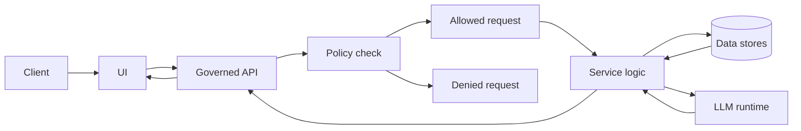

<!-- [KFM_META_BLOCK_V2]
doc_id: kfm://doc/08e10bd2-956c-4d8a-8e24-25040564cec7
title: "RUNBOOK — <COMPONENT_NAME>"
type: standard
version: v1
status: draft
owners: <TEAM_OR_HANDLES>
created: 2026-03-05
updated: 2026-03-05
policy_label: restricted
related: [
  "docs/governance/ROOT_GOVERNANCE.md",
  "docs/governance/ETHICS.md",
  "docs/specs/qa/README.md",
  "docs/runbooks/"
]
tags: [kfm, runbook, template]
notes: ["Template file. Copy to docs/runbooks/<AREA>/<RUNBOOK_NAME>.md and replace placeholders."]
[/KFM_META_BLOCK_V2] -->

# RUNBOOK — <COMPONENT_NAME>

> **Status:** stable (template) · **Owners:** `<TEAM>` · **On-call:** `<ROTATION>`  
> **Policy label:** `<public|restricted|...>` · **Last updated:** `<YYYY-MM-DD>` · **Review cadence:** `<e.g., 90d>`  
> **Badges:** TODO (build) · TODO (deploy) · TODO (SLO) · TODO (policy gates)  
> **Quick nav:** [Scope](#scope) · [Quickstart](#quickstart) · [Health checks](#health-checks) · [Deploy](#deploy) · [Rollback](#rollback) · [Incident response](#incident-response) · [Appendix](#appendix)

---

## Scope

**What this runbook covers (CONFIRMED|PROPOSED|UNKNOWN):**
- <Example: Operating the KFM Focus Mode API service (FastAPI + OPA) in dev/stage/prod.>
- <Example: Deploying the service, validating health/SLOs, incident response, and rollback.>

**What “done” looks like (CONFIRMED|PROPOSED|UNKNOWN):**
- <Example: Service is reachable, policy gates pass, and key endpoints meet SLO targets.>

**Audience:**
- Operators / SRE
- Developers on-call
- Security / governance reviewers (as needed)

---

## Where it fits in KFM

**Path:** `docs/runbooks/<AREA>/<RUNBOOK_NAME>.md`  
**Upstream dependencies (CONFIRMED|PROPOSED|UNKNOWN):**
- <Ingestion pipelines>
- <Catalog triplet: DCAT + STAC + PROV>
- <Secret manager / CI>

**Downstream dependents (CONFIRMED|PROPOSED|UNKNOWN):**
- <Governed API clients>
- <UI (React)>
- <Focus Mode assistant>

**Architecture invariants (MUST, fail-closed):**
- UI/clients never access DB/storage directly; all access crosses the governed API + policy boundary.  
- Requests must be policy-checked (default-deny) before data leaves the server.  
- Promotion of datasets/outputs must be gated (RAW → WORK → PROCESSED → PUBLISHED) with catalogs + integrity proofs.
- Focus Mode answers must cite evidence or abstain; every answer should emit an audit reference.

---

## Acceptable inputs

- Component/service name(s): `<COMPONENT_NAME>`
- Environments: `<dev|stage|prod>`
- Entry points: `<URLs, hostnames, namespaces>`
- Deployment method: `<docker compose|k8s|systemd>`
- Evidence links: `<CI run URL, ticket URL, change request ID>`

---

## Exclusions

- **Design docs / architecture rationale** (belongs in `docs/architecture/…`)
- **Policy authoring** beyond operational checks (belongs in `policy/…`)
- **Data modeling guidance** (belongs in `docs/data-model/…`)
- **One-off local experiments** (belongs in `docs/sandbox/…` and MUST NOT be promoted)

---

## Directory tree

```text
docs/
  runbooks/
    <AREA>/
      <RUNBOOK_NAME>.md
  templates/
    standard/
      TEMPLATE__RUNBOOK.md  # source template (this file)
```

---

## Quickstart

> Replace placeholders and keep commands copy/paste-able.  
> Mark destructive commands clearly.

### 1) Identify environment + current version

```bash
# Example (pseudocode): show running version and git SHA
kubectl -n <namespace> get deploy <deployment> -o=jsonpath='{.spec.template.spec.containers[0].image}' && echo
```

### 2) Run the minimum health checks

```bash
# Example (pseudocode): basic liveness/ready checks
curl -fsS "<BASE_URL>/healthz" && echo "OK"
curl -fsS "<BASE_URL>/readyz" && echo "READY"
```

### 3) Validate policy gate is fail-closed

```bash
# Example (pseudocode): an unauthorized request MUST be denied
curl -i "<BASE_URL>/protected" | head
```

---

## System overview

### Definitions

| Term | Meaning | Status |
|---|---|---|
| Trust membrane | A hard boundary: clients talk only to governed APIs, never directly to data stores. | CONFIRMED |
| Fail-closed | On error/uncertainty, deny access or stop promotion rather than “best-effort” allow. | CONFIRMED |
| Catalog triplet | DCAT + STAC + PROV artifacts required at evidence boundary. | CONFIRMED |

### Data flow



---

## Environments and configuration

| Env | Namespace | Base URL | Data zone | Secrets source | Status |
|---|---|---|---|---|---|
| dev | `<k8s-ns>` | `<https://dev…>` | `<RAW|WORK>` | `<vault|k8s secret|.env>` | UNKNOWN |
| stage | `<k8s-ns>` | `<https://stage…>` | `<WORK|PROCESSED>` | `<vault|k8s secret|.env>` | UNKNOWN |
| prod | `<k8s-ns>` | `<https://prod…>` | `<PROCESSED|PUBLISHED>` | `<vault|k8s secret|.env>` | UNKNOWN |

### Config contract

- **DO NOT** commit secrets.  
- **DO** pin versions (images, charts, drivers, schema versions) in prod.  
- **DO** record changes (ticket + commit + CI run) in the [Change log](#change-log).

---

## Health checks

### Service-level checks

| Check | Command / Query | Expected result | Evidence artifact | Status |
|---|---|---|---|---|
| Liveness | `curl -fsS <BASE_URL>/healthz` | `200 OK` | `healthz.txt` | UNKNOWN |
| Readiness | `curl -fsS <BASE_URL>/readyz` | `200 OK` | `readyz.txt` | UNKNOWN |
| Policy deny | `curl -i <BASE_URL>/protected` | `401/403` | `policy_deny.txt` | UNKNOWN |
| Evidence mode | `curl -fsS <BASE_URL>/evidence/status` | includes commit+run IDs | `evidence_status.json` | UNKNOWN |

### Data integrity checks (promotion gates)

| Gate | Minimum required outputs | Verification | Fail-closed rule |
|---|---|---|---|
| RAW → WORK | immutable raw snapshot + receipt | checksums present | deny promotion if missing |
| WORK → PROCESSED | deterministic transform outputs | recompute hashes, schema validate | deny promotion if mismatch |
| PROCESSED → PUBLISHED | DCAT + STAC + PROV published | validators + policy checks | deny publish if any validator fails |

---

## Deploy

> Keep deploy instructions deterministic and reversible.  
> Every deploy MUST have a rollback plan.

### Preconditions

- [ ] Change request / ticket: `<LINK>`
- [ ] CI run (tests + policy regression) is green: `<LINK>`
- [ ] Backup/restore plan verified for this release lane
- [ ] Stakeholder comms plan for prod changes

### Deploy procedure

```bash
# Example (pseudocode): apply manifest / helm upgrade
helm upgrade --install <release> <chart> -n <namespace> -f values.yaml
```

### Post-deploy validation

- [ ] [Health checks](#health-checks) pass
- [ ] SLO burn rate acceptable for `<window>`
- [ ] Policy deny test confirms fail-closed behavior
- [ ] Evidence artifacts uploaded (logs, diffs, validation outputs)

---

## Rollback

### Rollback decision matrix

| Symptom | Rollback? | Alternative mitigation | Who decides | Status |
|---|---:|---|---|---|
| Elevated 5xx | Yes if > `<threshold>` for `<minutes>` | scale up, clear cache | On-call lead | UNKNOWN |
| Policy bypass risk | Immediate rollback | disable endpoint, rotate keys | Security on-call | UNKNOWN |
| Latency regression | Maybe | tune, rollback canary only | SRE | UNKNOWN |

### Rollback procedure

```bash
# Example (pseudocode): rollback to previous revision
helm rollback <release> <revision> -n <namespace>
```

### Post-rollback

- [ ] Re-run [Health checks](#health-checks)
- [ ] Capture evidence: before/after metrics, diffs, incident/ticket links
- [ ] Open follow-up issue for root cause analysis

---

## Monitoring and alerting

### SLOs

| Signal | SLO target | Measurement window | Alert threshold | Status |
|---|---|---|---|---|
| Availability | `<99.9%>` | `<30d>` | `<error budget burn>` | UNKNOWN |
| P95 latency | `<ms>` | `<1h>` | `<ms>` | UNKNOWN |
| Policy denials | `<expected baseline>` | `<1h>` | `spike` | UNKNOWN |
| Data freshness | `<max lag>` | `<24h>` | `lag > max` | UNKNOWN |

### Logs and traces

- Log locations: `<stdout|file|ELK|Loki>`
- Trace IDs: `<how to find request traces>`
- Redaction rules: `<what must be removed>`

---

## Incident response

> Capture evidence first, then mitigate.  
> Treat governance failures as **severity upgrades**.

### Severity levels

| Sev | Definition | Example | Paging |
|---:|---|---|---|
| 1 | Safety/security/policy breach or high-impact outage | policy bypass, data exfil risk | immediate |
| 2 | Partial outage / major degradation | >5% errors, high latency | urgent |
| 3 | Minor degradation | isolated endpoint issues | business hours |
| 4 | Informational | noisy alerts | as needed |

### Triage checklist (fail-closed)

- [ ] Identify env + blast radius (dev/stage/prod)
- [ ] Confirm policy is enforcing deny-by-default
- [ ] Check error budget burn and recent deploys
- [ ] Preserve evidence artifacts (logs, metrics screenshots, CI run, diffs)
- [ ] Decide mitigate vs rollback using the [Rollback decision matrix](#rollback-decision-matrix)

### Common incident playbooks

#### A) High error rate (5xx spike)

1. **Confirm (UNKNOWN → CONFIRMED):**
   - <which dashboard/metric proves it?>
2. **Mitigate (choose one):**
   - scale replicas  
   - rollback  
   - disable feature flag  
3. **Validate:**
   - health checks + SLO stabilization
4. **Evidence to attach:**
   - graphs, logs, timestamps, change IDs

#### B) Policy denial rate spike

1. Check for:
   - token expiry / auth outage
   - policy bundle update
   - upstream identity provider issues
2. Mitigate:
   - revert policy bundle
   - rollback auth changes
3. Validate:
   - deny behavior is correct (not permissive)
   - authorized flows work

#### C) Data promotion blocked (validator/policy fail)

1. **Do not bypass.**  
2. Identify failed gate:
   - schema validation
   - checksum mismatch
   - missing catalogs (DCAT/STAC/PROV)
   - missing attestation/signature
3. Fix root cause, re-run pipeline, re-validate.

---

## Troubleshooting matrix

| Symptom | Likely cause | Fast diagnostic | Safe mitigation | Status |
|---|---|---|---|---|
| 401/403 everywhere | auth misconfig | check auth provider + logs | rollback auth config | UNKNOWN |
| 200 but wrong data | stale cache or wrong env | compare dataset/version IDs | purge cache, verify routing | UNKNOWN |
| policy allows too much | policy bundle regression | run policy tests | emergency rollback policy | UNKNOWN |

---

## Evidence discipline

> Every meaningful claim should be labeled: **CONFIRMED / PROPOSED / UNKNOWN**.  
> If **UNKNOWN**, list the smallest verification step to make it **CONFIRMED**.

| Claim | Status | Evidence link/artifact | Verification step |
|---|---|---|---|
| `<Example: /readyz checks DB connectivity>` | UNKNOWN | `<link>` | run `curl …` and capture output |
| `<Example: rollback restores SLOs within 5m>` | UNKNOWN | `<link>` | conduct staged rollback rehearsal |

---

## Change log

| Date | Change | Ticket | PR | Operator | Notes |
|---|---|---|---|---|---|
| `<YYYY-MM-DD>` | `<summary>` | `<link>` | `<link>` | `<name>` | `<notes>` |

---

## Task list gates

Before marking this runbook **published**:

- [ ] All placeholders replaced (search for `<` and `>`).
- [ ] Quickstart commands verified in **dev** and **stage**.
- [ ] At least one rollback rehearsal completed and evidence linked.
- [ ] SLOs defined and alerting routes verified.
- [ ] Policy checks documented and tested (fail-closed).
- [ ] Backup/restore steps are executable and tested.
- [ ] Sensitive info reviewed; secrets removed/redacted.
- [ ] Mermaid diagram updated to match reality.
- [ ] “Evidence discipline” table has at least one CONFIRMED entry.

---

## FAQ

**Q: Can I bypass a policy gate to unblock a release?**  
A: No. Escalate to governance/security and fix the underlying contract mismatch.

**Q: Where do I put one-off operator notes?**  
A: Use the [Change log](#change-log) and attach evidence artifacts; avoid long free-form notes in prod runbooks.

---

## Appendix

<details>
<summary>Command reference (examples)</summary>

### Kubernetes snippets

```bash
kubectl -n <namespace> get pods -owide
kubectl -n <namespace> describe pod <pod>
kubectl -n <namespace> logs <pod> --since=30m
```

### Docker Compose snippets

```bash
docker compose ps
docker compose logs --tail=200 -f
docker compose restart <service>
```

### Evidence artifact naming convention

```text
docs/reports/<AREA>/<RUNBOOK_NAME>/<YYYY-MM-DD>/
  healthz.txt
  readyz.txt
  metrics_before.png
  metrics_after.png
  policy_eval.json
  deploy_diff.txt
```

</details>

---

[Back to top](#runbook--component_name)
