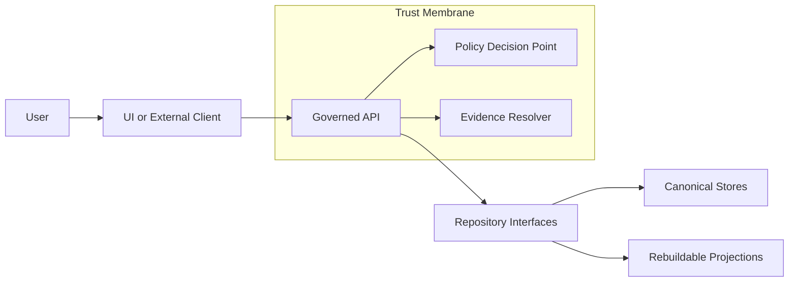

<!-- [KFM_META_BLOCK_V2]
doc_id: kfm://doc/<uuid>
title: "Security Review — <Component or Change>"
type: standard
version: v1
status: draft
owners: <team or names>
created: YYYY-MM-DD
updated: YYYY-MM-DD
policy_label: public|restricted|internal
related: [<paths or kfm:// ids>]
tags: [kfm, security, review]
notes: ["Template: fill all TODOs; remove guidance before publishing"]
[/KFM_META_BLOCK_V2] -->

# Security Review — <Component or Change>
One-line purpose: record the security posture for a specific change (threat model → controls → evidence → sign-off).

---

## Impact

**Status:** draft (template)  \
**Owners:** `<owner>`  \
**Security reviewer:** `<reviewer>`  \
**Last updated:** `<YYYY-MM-DD>`  \
**Change link(s):** `<PR(s)/ticket(s)/release>`

**Quick nav:**
- [Scope](#scope)
- [Change summary](#change-summary)
- [Architecture and trust boundaries](#architecture-and-trust-boundaries)
- [Data classification and privacy](#data-classification-and-privacy)
- [Threat model](#threat-model)
- [Controls and mitigations](#controls-and-mitigations)
- [Security evidence](#security-evidence)
- [Findings and exceptions](#findings-and-exceptions)
- [Sign-off](#sign-off)

---

## Scope

**In scope:**
- TODO

**Out of scope:**
- TODO

**Assumptions (label each as CONFIRMED / PROPOSED / UNKNOWN):**
- TODO

> Guidance: If anything is **UNKNOWN**, list the *smallest verification steps* that would make it **CONFIRMED**.

---

## Where it fits

- **Path:** `docs/templates/standard/TEMPLATE__SECURITY_REVIEW.md`
- **Used by:** security reviews for features, datasets, APIs, pipelines, CI gates, UI capabilities, and any governed AI surfaces.

---

## Acceptable inputs

- A specific change with a stable identifier (PR, ticket, release, dataset_version_id, run_id).
- Architecture context (diagram or references).
- Threat model for the change.
- Evidence artifacts (test outputs, scans, receipts) with **locations + digests**.

## Exclusions

- Do **not** include secrets, credentials, private keys, or unredacted sensitive data.
- Do **not** include restricted coordinates or sensitive-location details unless policy explicitly allows.
- Do **not** paste raw vulnerability exploit code or step-by-step weaponization in this document.

---

## Change summary

### What changed
- TODO (what exactly changed; include components and interfaces)

### Why now
- TODO

### Security-sensitive behaviors introduced or modified
- [ ] Access control (AuthN/AuthZ)
- [ ] Data redaction / generalization
- [ ] Evidence resolution / citations
- [ ] New external integrations (APIs, webhooks)
- [ ] New storage or networking exposure
- [ ] New dependencies
- [ ] CI/CD or policy changes
- [ ] LLM/AI prompt/tooling behavior

### Risk rating
Choose one and justify:
- **Low** / **Medium** / **High** / **Critical**

**Justification:**
- TODO

---

## Architecture and trust boundaries

### System context
Provide a minimal diagram showing trust boundaries and data flows.

### Trust membrane checklist
Mark each item **CONFIRMED / PROPOSED / UNKNOWN** and link to evidence.

- **No direct client access to storage/DB:** UI/external clients access data only via governed APIs.
  - Status: TODO
  - Evidence: TODO

- **Fail-closed policy posture:** if policy/evidence checks cannot be performed, the system denies (or abstains) safely.
  - Status: TODO
  - Evidence: TODO

- **Evidence-first behavior:** user-visible claims link to resolvable evidence; otherwise abstain or reduce scope.
  - Status: TODO
  - Evidence: TODO

---

## Data classification and privacy

### Data inventory affected by this change

| Data element | Example | Sensitivity class | Policy label | Storage location | Notes |
|---|---|---|---|---|---|
| TODO | TODO | TODO | TODO | TODO | TODO |

### Privacy + CARE/consent considerations
- **PII present?** TODO
- **Sensitive locations present?** TODO
- **Tribal/community data sovereignty flags?** TODO
- **Retention policy:** TODO
- **Redaction/generalization obligations:** TODO

### Audit logs are sensitive
- **What is logged (fields):** TODO
- **Redactions applied:** TODO
- **Retention period:** TODO
- **Access control for logs:** TODO

---

## Threat model

### Assets
What are we protecting?
- TODO

### Actors
- Legitimate users: TODO
- Malicious users: TODO
- Internal operators: TODO
- External services: TODO

### Entry points and attack surface
- Endpoints/routes: TODO
- Files/import paths: TODO
- UI surfaces: TODO
- CI/CD or automation triggers: TODO

### Trust boundaries
- Boundary list: TODO

### STRIDE table

| Category | Applicable? | Primary risk | Mitigation(s) | Evidence |
|---|---:|---|---|---|
| Spoofing | TODO | TODO | TODO | TODO |
| Tampering | TODO | TODO | TODO | TODO |
| Repudiation | TODO | TODO | TODO | TODO |
| Information disclosure | TODO | TODO | TODO | TODO |
| Denial of service | TODO | TODO | TODO | TODO |
| Elevation of privilege | TODO | TODO | TODO | TODO |

### Abuse cases
Describe concrete “how it could fail” stories.
- TODO

---

## Controls and mitigations

> Rule: prefer **test-enforced invariants** over “policy by documentation.”

### Identity and access management
- **AuthN mechanism:** TODO
- **AuthZ model (roles/attributes):** TODO
- **Least privilege for service identities:** TODO
- **Session/token handling:** TODO

**Tests/evidence:**
- TODO

### Policy-as-code and enforcement
- **Policy Decision Point (PDP):** TODO (e.g., OPA)
- **Policy Enforcement Points (PEP):** TODO (CI, runtime API, evidence resolver)
- **Default-deny rules present?** TODO
- **Parity between CI and runtime semantics:** TODO

**Tests/evidence:**
- TODO

### Input validation and output safety
- Input validation: TODO
- Output encoding / sanitization: TODO
- Schema validation at boundaries: TODO

### Secrets management
- No secrets in repo: TODO
- Rotation and revocation plan: TODO
- Secret scanning enabled: TODO

### Dependency and supply-chain security
- SBOM generated: TODO (SPDX or CycloneDX)
- Vulnerability scanning: TODO
- Signed builds / provenance: TODO (SLSA/in-toto/cosign)
- Verification gate is fail-closed: TODO

### Infrastructure and network
- TLS everywhere: TODO
- Network segmentation: TODO
- Rate limiting / WAF / quotas: TODO

### LLM / AI surfaces (if applicable)
Fill this section for **Focus Mode**, document QA assistants, summarizers, or any LLM tool use.

- **Tool allowlist:** TODO
- **Prompt injection defense:** TODO
- **Data exfiltration defense:** TODO
- **Citation verification hard gate:** TODO
- **Abstention UX is policy-safe:** TODO

**Evaluation harness:**
- Golden queries: TODO
- Citation resolvability: TODO
- Refusal correctness: TODO
- Leakage regression tests: TODO

---

## Security evidence

Attach or link verifiable artifacts. Prefer immutable storage and record digests.

| Artifact | Required? | Location | Digest | Verified by | Notes |
|---|---:|---|---|---|---|
| Threat model notes | Yes | TODO | TODO | TODO | TODO |
| SAST report | TODO | TODO | TODO | TODO | TODO |
| Dependency scan report | TODO | TODO | TODO | TODO | TODO |
| IaC scan report | TODO | TODO | TODO | TODO | TODO |
| Secret scan report | TODO | TODO | TODO | TODO | TODO |
| DAST or API fuzzing results | TODO | TODO | TODO | TODO | TODO |
| Policy fixtures + results | Yes | TODO | TODO | TODO | TODO |
| Audit log sample (redacted) | TODO | TODO | TODO | TODO | TODO |
| Run receipt or build receipt | If applicable | TODO | TODO | TODO | TODO |
| Attestation verification output | If applicable | TODO | TODO | TODO | TODO |

---

## Findings and exceptions

### Findings

| ID | Severity | Finding | Evidence | Mitigation | Owner | Due date | Status |
|---|---|---|---|---|---|---|---|
| SR-001 | TODO | TODO | TODO | TODO | TODO | TODO | TODO |

### Exceptions / risk acceptance

| Exception | Why needed | Risk | Compensating controls | Expiry | Approver |
|---|---|---|---|---|---|
| TODO | TODO | TODO | TODO | TODO | TODO |

---

## Sign-off

### Decision
- [ ] **Approve** (ship)
- [ ] **Approve with conditions** (ship after TODOs)
- [ ] **Reject** (do not ship)

### Conditions (if any)
- TODO

### Signatures
- **Owner:** `<name>` — `<date>`
- **Security reviewer:** `<name>` — `<date>`
- **Governance/policy steward (if required):** `<name>` — `<date>`

---

## Appendix

### Security review checklist (minimum)

**Before merge**
- [ ] Threat model updated for this change
- [ ] AuthZ tests cover allow/deny cases for key endpoints
- [ ] Default-deny policy behavior confirmed
- [ ] Evidence links (if any) resolve and are policy-allowed
- [ ] Logs reviewed for sensitive leakage (and redaction applied)
- [ ] Dependency scan clean or exceptions recorded
- [ ] Secret scan clean

**Before release**
- [ ] SBOM generated and stored
- [ ] Build/data provenance attested (if applicable)
- [ ] Attestations verified in CI (fail-closed)
- [ ] Rate limiting / quotas validated (if applicable)
- [ ] Incident response owner identified

**After release**
- [ ] Monitoring alerts validated
- [ ] Audit sampling performed (policy-safe)
- [ ] Post-release review scheduled (date)

### Back to top
- [Back to top](#security-review--component-or-change)
