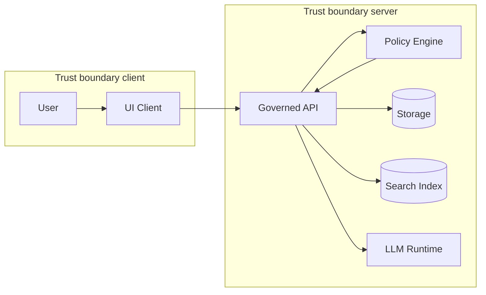

<!-- [KFM_META_BLOCK_V2]
doc_id: kfm://doc/7cf1338b-fb1f-4298-a9ec-003771a1dcef
title: TEMPLATE — Threat Model Checklist
type: standard
version: v1
status: draft
owners: <team-or-names>
created: 2026-03-05
updated: 2026-03-05
policy_label: restricted
related: [
  <paths-or-kfm-ids>
]
tags: [kfm, template, security, threat-model]
notes: ["Template only — copy to a system-specific doc and fill in."]
[/KFM_META_BLOCK_V2] -->

# TEMPLATE — Threat Model Checklist

Purpose: a **copy/paste** template to capture a **threat model** that is actionable, reviewable, and gate-checkable for KFM components.

> **Status:** template (copy before editing)
> **Owners:** `<team-or-names>`
> **Last updated:** 2026-03-05
>
>   
>
> **Quick links:**
> - [Scope](#scope)
> - [System overview](#system-overview)
> - [Assets and data classification](#assets-and-data-classification)
> - [Trust boundaries and data flows](#trust-boundaries-and-data-flows)
> - [Attack surface inventory](#attack-surface-inventory)
> - [Threats and mitigations](#threats-and-mitigations)
> - [Controls and verification](#controls-and-verification)
> - [Residual risk and sign-off](#residual-risk-and-sign-off)
> - [Definition of done](#definition-of-done)

---

## How to use this template

1. Copy this file into a system-specific path (example):
   - `docs/security/threat-models/<system>__THREAT_MODEL.md`
2. Fill in **all sections**. If something is unknown, mark it **UNKNOWN** and add the smallest steps to make it **CONFIRMED**.
3. Attach the completed threat model to the relevant PR/ADR.
4. Treat this as a **living document**: update it when the architecture or dependencies change.

**Rules (fail-closed):**
- Do **not** include secrets (tokens, private keys, internal URLs with credentials).
- Do **not** include exploit instructions; capture **risks + mitigations + verification**.

---

## Scope

### Document metadata

- **System / component name:** `<name>`
- **System ID (if applicable):** `<kfm://...>`
- **Owner:** `<team or @handle>`
- **Contributors:** `<names>`
- **Reviewers:** `<names>`
- **Date:** `<YYYY-MM-DD>`
- **Version:** `<semver or vN>`
- **Related PR(s):** `<link-or-refs>`
- **Related ADR(s):** `<link-or-refs>`

### In-scope

Describe what is included in this threat model.

- **In-scope components:**
  - `<component A>`
  - `<component B>`
- **In-scope environments:** `dev | staging | prod | local`
- **In-scope data zones:** `RAW | WORK | PROCESSED | PUBLISHED`

### Out-of-scope

Be explicit about what is NOT covered.

- `<example: third-party vendor runtime>`
- `<example: mobile client>`

### Security posture targets

Fill these as **targets** and confirm via tests where possible.

- **Primary objective:** `<e.g., prevent unauthorized access to restricted datasets>`
- **Availability target:** `<SLO/SLA if defined>`
- **Integrity target:** `<e.g., prevent undetected catalog or artifact tampering>`
- **Auditability target:** `<e.g., every answer/action traceable to evidence + policy decision>`

---

## Where it fits

- **Repo path:** `docs/templates/standard/TEMPLATE__THREAT_MODEL_CHECKLIST.md`
- **Downstream docs:** `<where the filled threat models live>`
- **Upstream inputs:** `<design docs, ADRs, data contracts>`
- **Used by:** security review, architecture review, CI gates, incident response planning

---

## Acceptable inputs

This template is intended for:

- New service/API endpoint
- New dataset connector/ingestion job
- New storage/index (object store, DB, search index)
- New UI surface that reads data
- New LLM/AI capability (Focus Mode tools, retrieval, agents)
- New authN/authZ or policy changes

---

## Exclusions

This template is **not**:

- A penetration test report
- A vulnerability disclosure
- A full security architecture spec
- A place to store secrets

---

## System overview

### One-paragraph description

`<Describe what this system does, for whom, and why it exists.>`

### Architecture summary

- **Client(s):** `<UI, CLI, scheduled job>`
- **API layer:** `<governed API service name>`
- **Policy enforcement:** `<OPA/authorization layer>`
- **Storage:** `<DB/object store/index>`
- **Compute / orchestration:** `<Dagster/Airflow/etc>`
- **LLM runtime (if any):** `<Ollama/local model/etc>`
- **External dependencies:** `<auth provider, third-party APIs>`

### Data lifecycle touchpoints

For each zone you touch, state what you write/read and why.

- **RAW:** `<read/write?>` — `<what/why>`
- **WORK:** `<read/write?>` — `<what/why>`
- **PROCESSED:** `<read/write?>` — `<what/why>`
- **PUBLISHED:** `<read/write?>` — `<what/why>`

---

## Assets and data classification

### Asset inventory

Fill this table. Add rows as needed.

| Asset | Type | Sensitivity | CIA impact if compromised | Retention | Notes |
|---|---|---|---|---|---|
| `<dataset>` | `data` | `public/restricted/internal` | `<C/I/A>` | `<duration>` | `<notes>` |
| `<catalog>` | `metadata` | `public/restricted/internal` | `<C/I/A>` | `<duration>` | `<notes>` |
| `<api-token>` | `secret` | `restricted` | `<C/I/A>` | `<duration>` | `<never store in repo>` |

### Data classification rules

Document the rules used to label data and the enforcement points.

- **Classification scheme:** `CONFIRMED | PROPOSED | UNKNOWN` — `<describe>`
- **Sensitive fields / columns / attributes:**
  - `CONFIRMED | PROPOSED | UNKNOWN` — `<field>`
- **Redaction strategy:**
  - `CONFIRMED | PROPOSED | UNKNOWN` — `<where/how redaction happens>`

---

## Trust boundaries and data flows

### Trust boundary diagram

> Replace this Mermaid diagram with the real one for your system.

### Trust boundary notes

- **Trust membrane invariant:** `CONFIRMED | PROPOSED | UNKNOWN` — UI/clients do not access storage directly.
- **Primary authorization decision point:** `CONFIRMED | PROPOSED | UNKNOWN` — `<where policy is evaluated>`
- **Evidence boundary:** `CONFIRMED | PROPOSED | UNKNOWN` — `<where catalogs/receipts/attestations are checked>`

### Data flow inventory

| Flow ID | From | To | Protocol | AuthN | AuthZ/Policy | Data classification | Logging | Notes |
|---|---|---|---|---|---|---|---|---|
| F-001 | `<ui>` | `<api>` | `<https>` | `<mTLS/OIDC/etc>` | `<OPA/policy>` | `<public/restricted>` | `<yes/no>` | `<notes>` |

---

## Attack surface inventory

### Entry points

List every externally reachable or privilege-bearing entry point.

| Entry point | Type | AuthN | Rate limit | Input validation | Notes |
|---|---|---|---|---|---|
| `/<path>` | `HTTP API` | `<required?>` | `<yes/no>` | `<schema?>` | `<notes>` |
| `<bucket>` | `Object store` | `<required?>` | `<n/a>` | `<n/a>` | `<notes>` |
| `<job>` | `Scheduler job` | `<service identity>` | `<n/a>` | `<validated?>` | `<notes>` |

### Privileged operations

- `CONFIRMED | PROPOSED | UNKNOWN` — promotion RAW → WORK → PROCESSED → PUBLISHED
- `CONFIRMED | PROPOSED | UNKNOWN` — deletion / retention enforcement
- `CONFIRMED | PROPOSED | UNKNOWN` — policy updates / allowlist changes
- `CONFIRMED | PROPOSED | UNKNOWN` — credential issuance/rotation

---

## Threats and mitigations

### Threat framing

Pick one or more methods and stick to it:

- STRIDE (spoofing, tampering, repudiation, information disclosure, denial of service, elevation of privilege)
- OWASP API Security risks
- Supply-chain threats (artifact substitution, compromised CI)

### Threat register

Use this as the canonical risk ledger.

| Threat ID | Category | Threat statement | Likelihood | Impact | Risk | Mitigations | Verification | Status |
|---|---|---|---|---|---|---|---|---|
| T-001 | `Info disclosure` | `<unauthorized access to restricted dataset via API>` | `<L/M/H>` | `<L/M/H>` | `<score>` | `<controls>` | `<tests/alerts>` | `UNKNOWN` |
| T-002 | `Tampering` | `<catalog or artifact altered without detection>` | `<L/M/H>` | `<L/M/H>` | `<score>` | `<checksums/signatures>` | `<verify in CI>` | `UNKNOWN` |

### KFM-specific “must consider” threats

Mark each as **CONFIRMED / PROPOSED / UNKNOWN** and capture mitigations.

- **Bypass of policy boundary** (direct DB/object access from UI/client)
  - Status: `CONFIRMED | PROPOSED | UNKNOWN`
  - Mitigation: `<network segmentation, no credentials in client, enforced API-only routes>`

- **Unauthorized cross-sensitivity joins** (combining restricted + public to re-identify)
  - Status: `CONFIRMED | PROPOSED | UNKNOWN`
  - Mitigation: `<join allowlists, aggregation thresholds, redaction rules>`

- **Evidence spoofing** (fake catalogs/receipts to pass gates)
  - Status: `CONFIRMED | PROPOSED | UNKNOWN`
  - Mitigation: `<signature verification, immutable digests, fail-closed gates>`

- **Prompt injection / tool abuse** (LLM induced to ignore policy or exfiltrate)
  - Status: `CONFIRMED | PROPOSED | UNKNOWN`
  - Mitigation: `<tool allowlists, policy checks per tool call, cite-or-abstain enforcement>`

- **Supply-chain compromise** (malicious dependency, compromised CI runner)
  - Status: `CONFIRMED | PROPOSED | UNKNOWN`
  - Mitigation: `<pinned deps, SBOM, signed provenance, least-privilege runners>`

- **Denial of service** (expensive queries, large payloads, expensive model calls)
  - Status: `CONFIRMED | PROPOSED | UNKNOWN`
  - Mitigation: `<rate limits, quotas, query budgeting, timeouts, circuit breakers>`

---

## Controls and verification

### Identity and access

- [ ] **AuthN** is required for non-public operations.
- [ ] **AuthZ** is enforced via policy-as-code at the API boundary.
- [ ] Least-privilege roles exist for: `reader`, `writer`, `promoter`, `admin`.
- [ ] Service-to-service identities are non-human and rotate safely.

**Evidence:** `<links to tests, policy files, screenshots>`

### Input handling

- [ ] All APIs validate request bodies against schemas.
- [ ] Size limits enforced (payload, upload, query complexity).
- [ ] All file ingestion validates: type, size, checksum, and expected schema.

**Evidence:** `<tests/fixtures>`

### Storage and secrets

- [ ] Secrets are stored outside repo (vault/secret manager), not in configs.
- [ ] At-rest encryption is enabled where applicable.
- [ ] Backups exist and are protected to the same sensitivity as primary data.

**Evidence:** `<runbook/infra config>`

### Logging, audit, and provenance

- [ ] Security-relevant events are logged (auth decisions, promotions, policy denies).
- [ ] Logs are structured and correlate via request/run IDs.
- [ ] Every promoted dataset has: checksums + catalogs + provenance links.

**Evidence:** `<sample logs, catalog examples>`

### Supply-chain and build integrity

- [ ] Dependencies are pinned (lockfiles) and scanned.
- [ ] SBOM is generated for release artifacts.
- [ ] Provenance / attestations exist for promoted artifacts.
- [ ] CI verifies signatures/attestations before promotion.

**Evidence:** `<SBOM, attestation bundle ref, CI logs>`

### Security testing

- [ ] Unit tests cover policy edge cases (allow/deny).
- [ ] Contract/integration tests cover authZ boundary.
- [ ] Negative tests exist for common bypass attempts.
- [ ] Fuzzing or property tests exist where high-risk parsing occurs.

**Evidence:** `<test plan + results>`

---

## Residual risk and sign-off

### Residual risks

List risks you are accepting (temporarily or permanently). Each needs an owner.

| Risk | Reason accepted | Expiration / review date | Owner | Mitigation roadmap |
|---|---|---|---|---|
| `<risk>` | `<why>` | `<YYYY-MM-DD>` | `<name>` | `<plan>` |

### Approvals

- **Engineering owner:** `<name>` — `APPROVED | CHANGES REQUESTED | PENDING`
- **Security review:** `<name>` — `APPROVED | CHANGES REQUESTED | PENDING`
- **Governance review (if sensitive):** `<name>` — `APPROVED | CHANGES REQUESTED | PENDING`

---

## Definition of done

This checklist is the minimum bar for considering the threat model “complete.”

- [ ] Scope is explicit (in/out) and matches the actual change.
- [ ] Assets + data classification table is complete.
- [ ] Trust boundaries + data flows are diagrammed.
- [ ] Attack surface inventory lists all entry points.
- [ ] Threat register includes top risks with mitigations and verification.
- [ ] Policy boundary is enforced and tested (deny-by-default).
- [ ] Supply-chain integrity is addressed (SBOM/provenance/signatures as applicable).
- [ ] Monitoring and incident hooks exist (logs, alerts, runbooks).
- [ ] Residual risks are recorded with owners and review dates.
- [ ] Approvals captured.

---

## FAQ

### What if we don’t know something yet?

Mark it **UNKNOWN** and add the smallest steps to make it **CONFIRMED** (a test, a config check, an ADR).

### Where do we store completed threat models?

Use a dedicated folder (example): `docs/security/threat-models/`.

### How often do we update this?

Update it whenever you change:
- trust boundaries,
- data sensitivity/fields,
- auth/policy rules,
- storage locations,
- or any dependency that affects security.

---

## Appendix

Suggested references (fill in with real repo paths)

- `docs/governance/ROOT_GOVERNANCE.md` (governance model)
- `docs/governance/ETHICS.md` (FAIR/CARE, sensitivity guidance)
- `docs/architecture/` (system diagrams)
- `policy/` (OPA/Rego policies)
- `.github/workflows/` (CI gates)

---

[Back to top](#template--threat-model-checklist)
