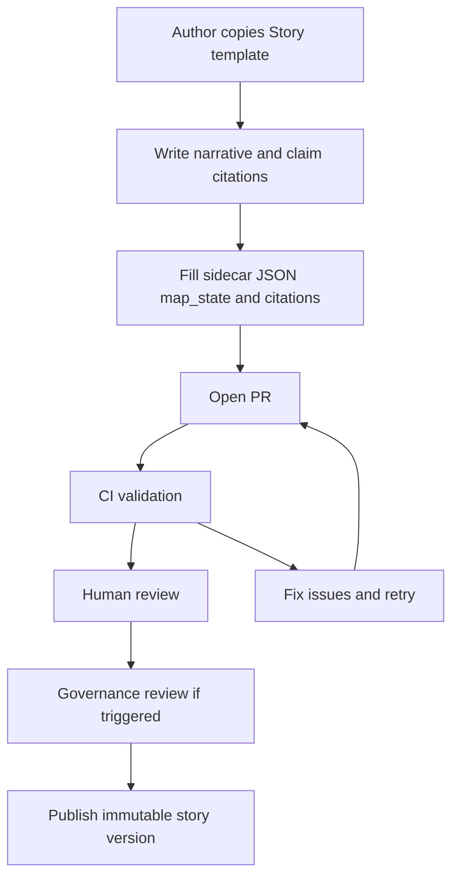

<!-- [KFM_META_BLOCK_V2]
doc_id: kfm://doc/c033bb79-dd5c-4093-9633-a05bf938f6aa
title: Story Templates
type: standard
version: v1
status: draft
owners: kfm-core
created: 2026-03-05
updated: 2026-03-05
policy_label: public
related: [docs/templates/README.md]
tags: [kfm, templates, story]
notes:
  - This README documents the Story Node template contract and review/publish expectations.
  - Update “Owners” to the repo’s authoritative team/alias.
[/KFM_META_BLOCK_V2] -->

# Story Templates
One-line purpose: **Templates and checklists for KFM Story Nodes (governed narrative artifacts bound to map state + citations).**

> **Status:** active (templates)  
> **Owners:** `kfm-core` (update if different)  
> **Path:** `docs/templates/story/`

<p align="center">
  
  
  
  
</p>

**Quick nav:**  
- [Scope](#scope)  
- [Where it fits](#where-it-fits)  
- [Inputs](#inputs)  
- [Exclusions](#exclusions)  
- [Directory tree](#directory-tree)  
- [Template inventory](#template-inventory)  
- [Quickstart](#quickstart)  
- [Story Node v3 contract](#story-node-v3-contract)  
- [Review and publish gate](#review-and-publish-gate)  
- [Quality gates checklist](#quality-gates-checklist)  
- [FAQ](#faq)  
- [Appendix](#appendix)

---

## Scope

- **CONFIRMED (spec):** Story Nodes are publishable artifacts that bind narrative to **map state** and **citations**.  
- **CONFIRMED (spec):** A Story Node has two parts: a **markdown** document (human-readable) and a **sidecar JSON** (machine metadata: map state, citations, policy, review).  
- **PROPOSED:** This directory standardizes “copy/paste starter kits” so Story Nodes ship with consistent structure and governance hooks.  
- **UNKNOWN (repo state):** Whether Story authoring is currently done via a “Studio” UI, CLI scaffolder, or both. If uncertain, treat this as a templates-only directory and keep it tool-agnostic.

[Back to top](#story-templates)

---

## Where it fits

- **CONFIRMED (spec):** Story Nodes are governed publications; publishing is expected to be blocked if citations don’t resolve, rights are unclear, or sensitive locations are included without policy approval.  
- **PROPOSED:** Upstream: `docs/templates/` provides cross-cutting templates (MetaBlocks, checklists, ADRs).  
- **PROPOSED:** Downstream:
  - Story authoring tooling (e.g., “Studio”) uses these templates to scaffold new Story Nodes.
  - CI uses these templates as reference examples for schema + lint validation.
  - Story rendering surfaces citations via an Evidence Drawer (or equivalent UI) and binds story steps to map state.

[Back to top](#story-templates)

---

## Inputs

Acceptable content in this directory:

- **CONFIRMED (spec):** Story Node v3 template skeletons (markdown + sidecar JSON).  
- **PROPOSED:** Checklists and reviewer aids (publish-gate checklists, sensitivity triggers, media attribution reminders).  
- **PROPOSED:** Small example payloads (minimal valid sidecar JSON, minimal valid citations list).  
- **PROPOSED:** Templates for story-program scaffolding (story series index, folder conventions) *only if kept lightweight and schema-first*.

[Back to top](#story-templates)

---

## Exclusions

Do **not** put these in `docs/templates/story/`:

- **CONFIRMED (policy posture):** No raw sensitive locations, protected site coordinates, or restricted datasets.  
- **PROPOSED:** No “real” published stories (those belong in the repo’s story content area, not in templates).  
- **PROPOSED:** No large media assets (images/video/audio) — templates should link to how media is handled and rights-attested elsewhere.

[Back to top](#story-templates)

---

## Directory tree

**PROPOSED** expected layout (update to match actual repo contents):

```text
docs/templates/story/
├── README.md
├── TEMPLATE__STORY_NODE_V3.md
├── TEMPLATE__STORY_NODE_V3.sidecar.json
└── checklists/
    └── STORY_NODE_PUBLISH_GATE_CHECKLIST.md
```

**UNKNOWN → to make CONFIRMED:** run `find docs/templates/story -maxdepth 2 -type f` and update the tree + the table below accordingly.

[Back to top](#story-templates)

---

## Template inventory

| Template / file | Purpose | Output type | Claim status |
|---|---|---|---|
| `TEMPLATE__STORY_NODE_V3.md` | Story Node narrative skeleton: Summary, Claims, Narrative, Evidence | Markdown | **PROPOSED** (template file presence in repo is unverified here) |
| `TEMPLATE__STORY_NODE_V3.sidecar.json` | Map state, citations, policy_label, review_state | JSON | **PROPOSED** |
| `checklists/STORY_NODE_PUBLISH_GATE_CHECKLIST.md` | Reviewer checklist + publish blocking conditions | Markdown | **PROPOSED** |
| (Optional) `examples/` | Minimal valid examples for validators | Mixed | **PROPOSED** |

[Back to top](#story-templates)

---

## Quickstart

### 1) Inspect what’s already here (runnable)

```bash
# from repo root
find docs/templates/story -maxdepth 2 -type f -print
```

```bash
# find placeholders you must fill before copying templates into real stories
grep -RIn -- "TODO\|<uuid>\|YYYY-MM-DD\|<Story title>\|<names/teams>" docs/templates/story || true
```

### 2) Scaffold a new Story Node (pseudocode)

> This is **pseudocode** because the destination “published stories” location varies by repo.

```bash
# PSEUDOCODE — choose your repo’s canonical story content directory
mkdir -p docs/stories/<story-slug>/

cp docs/templates/story/TEMPLATE__STORY_NODE_V3.md \
  docs/stories/<story-slug>/story.md

cp docs/templates/story/TEMPLATE__STORY_NODE_V3.sidecar.json \
  docs/stories/<story-slug>/story.sidecar.json
```

### 3) Minimal local checks (runnable once files exist)

```bash
# validate the sidecar JSON is well-formed JSON
python -m json.tool docs/stories/<story-slug>/story.sidecar.json > /dev/null
```

[Back to top](#story-templates)

---

## Story Node v3 contract

### Overview

- **CONFIRMED (spec):** A Story Node binds narrative to:
  - **Scope** (time window, geography)
  - **Map state** (bbox, zoom, layers, time window)
  - **EvidenceRefs** (citations list and inline citations)
  - **Policy + review metadata** (policy_label, review_state, status)

### Required narrative structure (markdown)

**CONFIRMED (spec):** The v3 template includes these sections:
- `# <Story title>`
- `## Summary`
- `## Claims` (claim-level citations)
- `## Narrative` (inline citations)
- `## Evidence` (catalog + provenance citations)

### Required metadata structure (sidecar JSON)

**CONFIRMED (spec):** v3 sidecar fields include (minimum):
- `kfm_story_node_version`: `"v3"`
- `story_id`: `kfm://story/<uuid>`
- `version_id`: `"v1"` (or similar)
- `status`: `"draft"` or `"published"` (implementation-defined, but present)
- `policy_label`: e.g. `"public"`
- `review_state`: e.g. `"needs_review"`
- `map_state`:
  - `bbox`
  - `zoom`
  - `layers[]` entries that include `layer_id` and `dataset_version_id`
  - `time_window` (`start`, `end`)
- `citations[]` entries with `{ ref, kind }`

### Mermaid diagram: end-to-end flow



[Back to top](#story-templates)

---

## Review and publish gate

### Content standards

**PROPOSED (spec):** A publishable Story Node must:
- declare scope (time window, geography)
- separate observation claims from interpretive claims
- include citations for every factual claim (EvidenceRefs)
- include uncertainty notes where sources conflict or are incomplete
- include licensing and attribution for all embedded media
- include policy label and review state

### Review workflow

**PROPOSED (spec):**
1. **Draft:** contributor creates Story Node; citations must resolve in-editor/tooling.
2. **Review:** steward + historian/editor review claims, citations, sensitivity.
3. **Governance review:** triggered if Story Node touches Indigenous histories, restricted sites, or sensitive locations.
4. **Publish:** Story Node becomes an immutable version; edits create a new version.

### Publishing should be blocked if

**PROPOSED (spec):**
- citations do not resolve
- rights are unclear for included media
- sensitive locations are included without policy approval

[Back to top](#story-templates)

---

## Quality gates checklist

Use this as a pre-merge / pre-publish “Definition of Done”.

### Required (fail-closed)

- [ ] **CONFIRMED (spec):** Story Node has **both** markdown and sidecar JSON.
- [ ] **CONFIRMED (spec):** Sidecar contains `kfm_story_node_version = v3`.
- [ ] **PROPOSED (spec):** `review_state` is set appropriately (e.g., `needs_review`) and is not bypassed.
- [ ] **PROPOSED (spec):** Scope is declared (time window + geography).
- [ ] **PROPOSED (spec):** Observation claims are distinguishable from interpretive claims.
- [ ] **PROPOSED (spec):** Every factual claim has an EvidenceRef citation.
- [ ] **CONFIRMED (spec):** All citations resolve via the evidence resolver route (publish gate).
- [ ] **PROPOSED (spec):** Any embedded media has clear licensing + attribution.
- [ ] **PROPOSED (spec):** Sensitive topics triggers have been evaluated; governance review requested when required.
- [ ] **PROPOSED (spec):** No precise culturally sensitive locations are published; default to generalized representations when public.

### Recommended (strongly)

- [ ] **CONFIRMED (spec):** Evidence remains accessible from the story text via an “Evidence Drawer” (or equivalent UI affordance).
- [ ] **CONFIRMED (spec):** Versioned releases + changelog exist to prevent narrative drift.
- [ ] **PROPOSED:** Claim-level citation checks are automated in CI.

[Back to top](#story-templates)

---

## FAQ

**Q: What makes a Story Node “governed”?**  
- **CONFIRMED (spec):** It binds narrative to map state and citations, includes policy label + review state, and publishing is blocked when evidence/rights/policy requirements are not met.

**Q: How do we prevent “narrative drift”?**  
- **CONFIRMED (spec):** Use claim-level citation checks, keep evidence drawer accessible, publish versioned story releases with changelogs, and trigger review for contested topics.

**Q: What about Indigenous histories and culturally sensitive sites?**  
- **CONFIRMED (spec):** Do not publish precise locations; allow community-controlled policy labels and release criteria; default public representation should be generalized; if permissions are unclear, fail closed and flag for governance review.

[Back to top](#story-templates)

---

## Appendix

<details>
<summary>EvidenceRef examples (illustrative)</summary>

These are **illustrative** examples consistent with the Story Node v3 template patterns:

- `doc://...` for narrative documents
- `stac://...` for STAC Items / Collections
- `dcat://...` for DCAT catalog records
- `prov://...` for provenance runs / bundles

Keep citations machine-resolvable and consistent with the evidence resolver contract.

</details>

<details>
<summary>UNKNOWN → smallest verification steps</summary>

If you need to convert “UNKNOWN” assumptions in this README into “CONFIRMED” facts:

1. Capture the current repo tree:
   - `git rev-parse HEAD`
   - `find docs/templates/story -maxdepth 3 -type f`
2. Identify the authoritative Story Node schema location and validator entrypoint(s):
   - search for `kfm_story_node_version` and `evidence/resolve` across code and CI configs
3. Confirm publish-gate enforcement in CI:
   - inspect `.github/workflows/` for Story Node validation steps
4. Confirm the canonical destination path for published stories:
   - search for story rendering routes and content loaders in the UI/API layers

</details>
