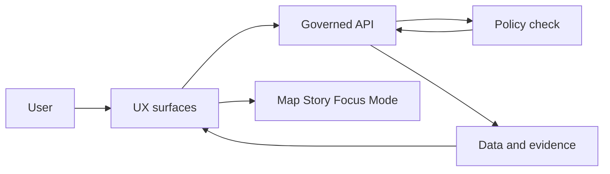

<!-- [KFM_META_BLOCK_V2]
doc_id: kfm://doc/63143f24-4176-473e-bc91-d7b425b1aa9e
title: UX Templates
type: standard
version: v1
status: draft
owners: ["@Kansas-Frontier-Matrix/ux", "@Kansas-Frontier-Matrix/core"]
created: 2026-03-05
updated: 2026-03-05
policy_label: public
related: ["../README.md", "../../governance/ROOT_GOVERNANCE.md", "../../governance/ETHICS.md", "../../governance/SOVEREIGNTY.md"]
tags: ["kfm", "ux", "templates"]
notes: ["Directory README for UX templates used to design KFM Map/Story UI and Focus Mode surfaces."]
[/KFM_META_BLOCK_V2] -->

# UX Templates
Reusable, governance-aware UX doc templates for KFM UI work (Map, Story, Focus Mode) that *don’t* break platform invariants.

---

## Impact
**Status:** active (drafted templates registry)  
**Owners:** **[PROPOSED]** `@Kansas-Frontier-Matrix/ux` · `@Kansas-Frontier-Matrix/core`  
**Policy:** public (verify before publishing anything derived from restricted research)  

 <!-- TODO: wire to repo truth -->
 <!-- TODO -->
 <!-- TODO -->

**Quick links:** [Overview](#overview) · [Where it fits](#where-it-fits) · [Template registry](#template-registry) · [Quickstart](#quickstart) · [Usage](#usage) · [Diagram](#diagram) · [Gates](#gates-and-definition-of-done) · [FAQ](#faq)

---

## Overview

### Evidence labels used in this folder
- **[CONFIRMED]** Backed by an existing KFM doc/pattern (see citations in the PR / review discussion).
- **[PROPOSED]** Recommended pattern; valid if maintainers accept and CI gates pass.
- **[UNKNOWN]** Not verified in this repo yet; includes smallest steps to verify.

### What this folder is for
- **[PROPOSED]** UX briefs, user flows, component specs, accessibility checklists, and “evidence surface” designs.
- **[PROPOSED]** Templates that help reviewers confirm a UI feature:
  - respects policy boundaries,
  - fails closed when evidence is missing/invalid,
  - avoids leaking sensitive info,
  - stays testable and reviewable.

### What this folder is not for
- **[PROPOSED]** Production UI code (keep that under the UI app directory, e.g. `web/`, `apps/`, etc).
- **[PROPOSED]** Raw user research transcripts, recordings, or PII (store in approved systems; link with access controls).
- **[PROPOSED]** “Policy documents” (governance lives under `docs/governance/`).

[Back to top](#ux-templates)

---

## Where it fits

### Relationship to the KFM pipeline
- **[CONFIRMED]** UI work is downstream of governed data + contracts: **ETL → catalogs (STAC/DCAT/PROV) → graph → APIs → UI → story nodes / Focus Mode**.
- **[CONFIRMED]** UI must not read Neo4j directly; all consumable access is via API contracts (trust membrane).

### Practical implication for UX artifacts
Every UX doc that describes “what the UI shows” should also describe:
- **[PROPOSED]** *which governed API endpoint(s)* provide the data,
- **[PROPOSED]** *what evidence/citations* must be displayed to the user,
- **[PROPOSED]** *how the UI behaves when evidence is missing, invalid, or unverified* (fail-closed UX).

[Back to top](#ux-templates)

---

## Acceptable inputs

### In scope
- **[PROPOSED]** Markdown templates (`TEMPLATE__*.md`) for UX work products.
- **[PROPOSED]** Minimal example docs (`_examples/`) demonstrating correct filling of templates.
- **[PROPOSED]** Links to external artifacts (Figma, research repositories) **without** embedding sensitive content.

### Out of scope
- **[PROPOSED]** Secrets/credentials, API keys, private URLs.
- **[PROPOSED]** Raw sensitive location details (especially for vulnerable sites); use generalized geometry or redacted views.
- **[PROPOSED]** “Copy-pasted” copyrighted source PDFs unless licensing permits and governance approves.

---

## Exclusions

- **[CONFIRMED]** No direct UI → database access (no “just query Neo4j/PostGIS from the client” shortcuts).
- **[CONFIRMED]** No unsafe HTML rendering patterns in UI specs:
  - no `dangerouslySetInnerHTML` unless the doc explicitly requires sanitization and provides tests/controls.
- **[PROPOSED]** No UX patterns that imply “green check = true” unless signatures / verification succeeded.

**If unsure**
- **[UNKNOWN]** Ask for governance review, then document the decision in the related ADR/Story Node.

---

## Template registry

> **Note:** These files may not exist yet. Treat this registry as a backlog you can implement incrementally.

| Template | Intended output | File | Status |
|---|---|---|---|
| UX Feature Brief | Small “what/why/how” for a UI feature | `TEMPLATE__UX_FEATURE_BRIEF.md` | **[PROPOSED]** |
| User Flow | Step-by-step flow, entry points, errors, states | `TEMPLATE__UX_FLOW.md` | **[PROPOSED]** |
| Component Spec | Props, states, validation, accessibility | `TEMPLATE__COMPONENT_SPEC.md` | **[PROPOSED]** |
| Evidence Surface | Citation UI, verification UI, fail-closed states | `TEMPLATE__EVIDENCE_SURFACE.md` | **[PROPOSED]** |
| A11y Review | WCAG-ish checklist + keyboard/focus order | `TEMPLATE__A11Y_REVIEW.md` | **[PROPOSED]** |
| Usability Test Plan | Task scripts + success criteria + risks | `TEMPLATE__USABILITY_TEST_PLAN.md` | **[PROPOSED]** |

### How to add a new template
1. **[PROPOSED]** Name it `TEMPLATE__<AREA>__<THING>.md` or `TEMPLATE__<THING>.md` (keep it obvious).
2. **[PROPOSED]** Add it to the table above.
3. **[PROPOSED]** Include a tiny `_examples/` filled version if reviewers will benefit.
4. **[PROPOSED]** Ensure the template asks for: evidence, policy/sensitivity, fail-closed behavior, and test hooks.

---

## Directory tree

**[UNKNOWN]** Current repo tree is not verified in this doc. The structure below is a recommended target.

```text
docs/
  templates/
    ux/
      README.md
      TEMPLATE__UX_FEATURE_BRIEF.md
      TEMPLATE__UX_FLOW.md
      TEMPLATE__COMPONENT_SPEC.md
      TEMPLATE__EVIDENCE_SURFACE.md
      TEMPLATE__A11Y_REVIEW.md
      TEMPLATE__USABILITY_TEST_PLAN.md
      _examples/
        example__ux_feature_brief.md
        example__component_spec.md
```

---

## Quickstart

### 1) Create a new UX brief from a template
```bash
# Create a working directory for your UX docs (adjust to your repo conventions)
mkdir -p docs/ux/features

# Copy a template into place
cp docs/templates/ux/TEMPLATE__UX_FEATURE_BRIEF.md \
  docs/ux/features/2026-03-05__my_feature__brief.md
```

### 2) Fill the “non-negotiables” first
- **[CONFIRMED]** Validate first, then compute derived views (don’t trust unvalidated data).
- **[CONFIRMED]** Verify signatures; if verification fails, fail closed and clearly mark values as untrusted.
- **[CONFIRMED]** Use safe link hygiene: `target="_blank" rel="noopener noreferrer"`.
- **[CONFIRMED]** Telemetry must avoid PII; log structural events only.

### 3) Open a PR with reviewer-friendly evidence
```text
PR checklist (UX templates)
- spec_hash: <short hash if applicable>
- status: valid / verified
- links: figma, issue, endpoint contract, evidence artifacts
```

[Back to top](#ux-templates)

---

## Usage

### Minimum fields every UX doc should capture
- **[PROPOSED]** User goal (what problem are we solving)
- **[PROPOSED]** Data contract touchpoints (endpoint names, payload shape, error semantics)
- **[PROPOSED]** Evidence surface requirements (citations, “no source no answer”, verification)
- **[PROPOSED]** Accessibility (keyboard, focus order, landmarks, contrast, tables semantics)
- **[PROPOSED]** Security (input validation, sanitization, link safety)
- **[PROPOSED]** Sensitivity classification + redaction approach

### “Fail-closed UX” patterns to require in specs
- **[CONFIRMED]** If verification fails → render as **untrusted**, avoid “green” affordances, and prevent downstream propagation.
- **[PROPOSED]** If evidence is missing → show “unknown” state + the smallest action to resolve (e.g., “data not published yet”).
- **[PROPOSED]** If policy denies → show a policy-safe message (no hinting at restricted values).

### Security + UX guardrails
- **[CONFIRMED]** “Validate first (AJV), then compute any derived views.”
- **[CONFIRMED]** “No dangerouslySetInnerHTML” unless there’s explicit sanitization (e.g., DOMPurify) and tests.
- **[CONFIRMED]** “Links: always target=_blank rel=noopener noreferrer.”
- **[CONFIRMED]** Type-aware rendering for amounts/dates/enums to avoid formatting surprises.

---

## Diagram



---

## Gates and definition of done

### Definition of done for a UX template
- [ ] **[PROPOSED]** Template includes evidence + fail-closed states.
- [ ] **[PROPOSED]** Template includes sensitivity/sovereignty reminder (and a place to mark classification).
- [ ] **[PROPOSED]** Template includes accessibility checklist or link to one.
- [ ] **[PROPOSED]** Template includes “test hooks” (what needs unit/integration tests).
- [ ] **[PROPOSED]** Markdown renders cleanly (no broken fences; Mermaid parses).

### Definition of done for a UX doc created from a template
- [ ] **[PROPOSED]** Backed by an issue/ticket with scope.
- [ ] **[PROPOSED]** Identifies governed API contract(s) (or proposes changes via the API contract template).
- [ ] **[PROPOSED]** Explicitly documents fail-closed behavior for missing/invalid/denied evidence.
- [ ] **[PROPOSED]** Explicitly documents any redaction/generalization in UI.
- [ ] **[PROPOSED]** Has an A11y pass (keyboard, focus order, landmarks, aria labels).

---

## FAQ

### Do I need a template for every UI change?
- **[PROPOSED]** For tiny purely-visual changes: no.
- **[PROPOSED]** For any change that affects data, evidence, permissions, or user interpretation: yes (use at least a Feature Brief).

### Where do I put sensitive user research?
- **[CONFIRMED]** Not here. Store it in an approved restricted system and link to it with access controls.

### What if I don’t know the API endpoints yet?
- **[PROPOSED]** Fill the UX doc first, mark API as **[UNKNOWN]**, and add the smallest verification step:
  - “Identify existing endpoint or propose new one via API contract extension template.”

---

<details>
<summary>Appendix: suggested UX artifacts to standardize next</summary>

- **[PROPOSED]** Evidence badges component spec (valid / verified / untrusted)
- **[PROPOSED]** “Receipt Viewer” style verified/unverified rendering patterns
- **[PROPOSED]** Standard empty/error states for:
  - policy denied,
  - dataset not published,
  - signature verification failed,
  - schema validation failed.
- **[PROPOSED]** A small “copy/paste” PR checklist snippet for reviewers

</details>
