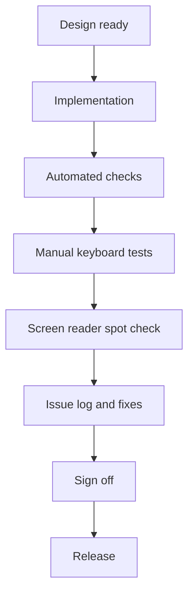

<!-- [KFM_META_BLOCK_V2]
doc_id: kfm://doc/7cfe82e5-2e84-4544-9797-8a4d2320b859
title: TEMPLATE — A11Y Checklist
type: standard
version: v1
status: draft
owners: ["@owner-handle"]
created: 2026-03-05
updated: 2026-03-05
policy_label: public
related:
  - "TODO: add repo-relative links to governance, QA gates, and UX runbooks"
tags: [kfm, ux, a11y, accessibility, template]
notes:
  - "Use this template to record accessibility review evidence and sign-off for a UI feature or change."
[/KFM_META_BLOCK_V2] -->

# TEMPLATE — A11Y Checklist
One-page purpose: a copy/paste checklist + evidence log for accessibility (A11Y) reviews of KFM UI work.

> [!IMPORTANT]
> **This is a template.** Copy it to a review location (example: `docs/reviews/a11y/YYYY-MM-DD__<feature>.md`) and fill it in.

## Impact
- **Status:** experimental | active | stable | deprecated
- **Owners:** @team-or-name
- **Applies to:** UI | API | Docs | Data | Other
- **Last review:** YYYY-MM-DD
- **Next review:** YYYY-MM-DD (recommended cadence: quarterly, or on any major UI shift)

Badges (placeholders; update when wired):
- 
- 
- 

Quick links:
- PR: <link>
- Design: <link>
- Preview build: <link>
- A11Y report artifacts: <link>

---

## Scope
### Feature
- **Name:** <feature name>
- **Surface:** Map Explorer | Timeline | Story | Focus Mode | Settings | Other
- **Routes / URLs:**
  - `/...`

### Supported environments
- **Devices:** desktop | tablet | mobile
- **Input modes:** keyboard | mouse | touch | voice
- **Browsers (minimum):**
  - Chrome: <version>
  - Firefox: <version>
  - Safari: <version>
  - Edge: <version>

### Assistive technology scope
Pick what you actually tested for this change:
- Screen readers:
  - [ ] NVDA (Windows)
  - [ ] JAWS (Windows)
  - [ ] VoiceOver (macOS)
  - [ ] VoiceOver (iOS)
  - [ ] TalkBack (Android)
- Other:
  - [ ] Screen magnifier (ZoomText / OS magnifier)
  - [ ] High contrast mode / forced colors
  - [ ] Speech input (optional)

### Target standard
Select the compliance target for this feature/release lane:
- [ ] WCAG 2.2 AA (default target unless otherwise specified)
- [ ] Section 508 (US federal, if applicable)
- [ ] EN 301 549 (EU public sector, if applicable)
- [ ] Other: <spec>

---

## A11Y Gate Summary
Fill this section first so reviewers can scan status quickly.


| Category | Target | Result | Evidence |
|---|---:|:---:|---|
| Automated scan (axe) | 0 serious/critical | ⬜ PASS / ⬜ FAIL | link or artifact path |
| Lint (eslint a11y) | 0 errors | ⬜ PASS / ⬜ FAIL | link |
| Keyboard-only | no traps, all actions possible | ⬜ PASS / ⬜ FAIL | notes + recording |
| Screen reader spot check | happy path usable | ⬜ PASS / ⬜ FAIL | notes |
| Contrast | meets target | ⬜ PASS / ⬜ FAIL | tool output |
| Zoom / reflow | usable at 200% | ⬜ PASS / ⬜ FAIL | notes |
| Motion | honors reduced motion | ⬜ PASS / ⬜ FAIL | notes |

### Release decision
- **Merge gate:** ⬜ ALLOW MERGE ⬜ BLOCK MERGE
- **If blocked, why:** <one sentence>
- **If allowed with exceptions, link to issues:** <links>

---

## Evidence discipline
For every notable claim in this review, label it:
- **CONFIRMED:** verified by test output, reproducible steps, or artifact.
- **PROPOSED:** intended behavior but not yet verified.
- **UNKNOWN:** cannot verify yet; include the smallest steps to make it CONFIRMED.

Recommended evidence artifacts:
- axe JSON/HTML report (stored as a CI artifact)
- Lighthouse report
- short screen recording (keyboard + screen reader happy path)
- screenshots for contrast/focus states

---

## Issue log
Use this table to record issues found during review.


| ID | Severity | Summary | Status (CONFIRMED/PROPOSED/UNKNOWN) | Steps to reproduce | Expected | Actual | Evidence | Owner | Fix by |
|---:|---|---|---|---|---|---|---|---|---|
| 1 | blocker/high/med/low |  |  |  |  |  |  |  |  |

Severity guidance:
- **Blocker:** prevents task completion for a major user group (keyboard-only, screen reader).
- **High:** significant friction or incorrect meaning; workaround exists.
- **Medium:** minor friction; does not block primary flow.
- **Low:** polish.

---

## Checklist
Organized by POUR (Perceivable, Operable, Understandable, Robust) with KFM-specific additions.

### Perceivable
#### Text alternatives
- [ ] **Images have meaningful alt text** (or `alt=""` when decorative).
- [ ] **Icons used as controls have accessible names** (text label, `aria-label`, or `aria-labelledby`).
- [ ] **Charts/visualizations have a text equivalent** (summary + data table or export).
- [ ] **Map symbology is explained in text** (legend is accessible and not color-only).

#### Adaptable layout
- [ ] **Uses semantic HTML first** (`header`, `nav`, `main`, `aside`, `footer`, headings, lists).
- [ ] **Heading structure is logical** (one `h1`, no skipped heading levels unless justified).
- [ ] **Reading order matches visual order** (especially for responsive layouts).
- [ ] **Content is not conveyed by shape/position alone** (“click the circle on the right”).

#### Contrast and color
- [ ] **Text contrast meets target** (record target ratio for your standard).
- [ ] **UI component contrast meets target** (buttons, focus rings, form borders).
- [ ] **Color is not the only signal** (errors, selections, categories).
- [ ] **Forced-colors mode is usable** (Windows High Contrast / `forced-colors`).

#### Resize and reflow
- [ ] **Usable at 200% zoom** without loss of content or functionality.
- [ ] **Responsive breakpoints keep controls reachable** (no off-screen essential actions).
- [ ] **Text does not truncate critical information** (or provides accessible full text).

#### Media
- [ ] **Video has captions** (and audio description when necessary for meaning).
- [ ] **Audio-only has transcript**.
- [ ] **Auto-playing media is avoided**; if present, provides pause/stop.

#### Motion and flashing
- [ ] **Honors `prefers-reduced-motion`** (reduces non-essential animation).
- [ ] **No flashing above safe thresholds** (avoid seizure triggers).

---

### Operable
#### Keyboard access
- [ ] **All interactive elements reachable by keyboard** (`Tab`, `Shift+Tab`).
- [ ] **No keyboard traps** (including in dialogs, map canvases, custom widgets).
- [ ] **Keyboard operation matches expectation** (`Enter` activates buttons/links; arrows for menus/sliders).
- [ ] **Custom components implement correct keyboard patterns** (menus, comboboxes, tabs, sliders).

#### Focus management
- [ ] **Visible focus indicator** on all focusable elements.
- [ ] **Focus order is logical** and matches reading order.
- [ ] **Focus is managed on route changes** (e.g., move to page heading or main region).
- [ ] **Dialogs trap focus appropriately** and return focus to trigger on close.
- [ ] **No focus steal during async updates** (loading states, streaming chat output).

#### Pointer and touch
- [ ] **Touch targets are large enough** for mobile use.
- [ ] **No essential hover-only interactions**; hover has a keyboard/touch equivalent.
- [ ] **Drag-and-drop has an alternative** (buttons, menus, or keyboard commands).

#### Timing and interruptions
- [ ] **No unexpected timeouts**; if a timeout exists, user can extend.
- [ ] **Notifications are dismissible** and do not block navigation.

#### Navigation
- [ ] **Skip link** (or equivalent) to main content.
- [ ] **Landmark navigation** works (screen readers can jump to `main`, `nav`, etc.).
- [ ] **Link text is descriptive** (“View dataset details” vs “Click here”).

---

### Understandable
#### Labels and instructions
- [ ] **All form controls have labels** (`label` element or equivalent accessible name).
- [ ] **Required fields are indicated** in text (not color alone) and programmatically.
- [ ] **Helper text is associated** (`aria-describedby`).
- [ ] **Input constraints are described** (formats, ranges).

#### Errors and validation
- [ ] **Errors are announced to screen readers** (e.g., `role="alert"` or `aria-live`).
- [ ] **Errors are specific and actionable** (what happened + how to fix).
- [ ] **Focus moves to the first error** (or error summary) after submit.
- [ ] **No silent failure**.

#### Consistency
- [ ] **Controls behave consistently** across surfaces (map, timeline, story, focus mode).
- [ ] **Terminology is consistent** (labels, buttons, dataset terms).
- [ ] **Language is plain** for critical tasks (avoid jargon without definitions).

---

### Robust
#### ARIA correctness
- [ ] **ARIA is used only when needed** (prefer native HTML).
- [ ] **No invalid ARIA attributes** (`aria-*` matches role requirements).
- [ ] **No duplicate IDs** for `aria-labelledby` / `aria-describedby`.
- [ ] **Dynamic content updates are announced appropriately**.

#### Compatibility
- [ ] **Works with screen readers in chosen test matrix**.
- [ ] **No critical reliance on a single browser behavior**.

---

## KFM-specific checklist add-ons
These are accessibility checks that show up repeatedly in KFM UI patterns.

### Map Explorer
- [ ] **Map controls are keyboard accessible** (zoom, layer toggle, basemap, fullscreen).
- [ ] **There is a non-map alternative view** for key information (list/table/summary).
- [ ] **Layer list is accessible** (names, toggles, groups, expansion).
- [ ] **Popups/tooltips are accessible** (focusable, dismissible, readable by screen readers).
- [ ] **Symbols and colors have a text legend** (and do not rely on color-only differences).
- [ ] **Geospatial drawing tools have accessible alternatives** (numeric inputs, presets).

### Timeline
- [ ] **Timeline controls are operable by keyboard** (range selection, next/prev, play/pause).
- [ ] **Time labels are readable and not truncated**.
- [ ] **Animation playback can be paused**.

### Story
- [ ] **Story content uses proper headings and landmarks**.
- [ ] **Inline media has captions/alt**.
- [ ] **Footnotes/citations are accessible links** with descriptive text.

### Focus Mode chat
- [ ] **Chat input has a visible label** and clear instructions.
- [ ] **New assistant messages are announced** without overwhelming users (use `aria-live` with care).
- [ ] **Streaming responses do not cause focus jumps**.
- [ ] **Controls have names** (send, stop generating, copy, cite source, open evidence).
- [ ] **Code blocks are readable** (monospace, scrollable, copy button is accessible).

---

## Tooling and test runs
Record exactly what you ran and attach outputs.

### Automated checks
- [ ] `eslint-plugin-jsx-a11y` (or equivalent)
- [ ] axe (browser extension or CI)
- [ ] Lighthouse accessibility audit

Commands (examples; edit to match repo tooling):

```bash
# Lint
npm run lint

# Unit / component tests
npm test

# Example axe run (Playwright)
# npm run test:a11y

# Lighthouse (if scripted)
# npm run lighthouse:a11y
```

Attach artifacts:
- `artifacts/a11y/axe-report.json`
- `artifacts/a11y/lighthouse.html`

### Manual test checklist
Keyboard-only (no mouse):
- [ ] Navigate to the feature entry point.
- [ ] Complete the primary user task.
- [ ] Open/close any dialogs.
- [ ] Trigger error states and recover.

Screen reader spot check:
- [ ] Navigate by headings.
- [ ] Navigate by landmarks.
- [ ] Read form labels and error messages.
- [ ] Verify dynamic updates are announced appropriately.

Zoom and reflow:
- [ ] 200% browser zoom.
- [ ] Narrow viewport (mobile width).

Forced colors / high contrast:
- [ ] Verify readable text and visible focus.

Record results:


| Test | Environment | Result | Notes / Evidence |
|---|---|:---:|---|
| Keyboard happy path |  | ⬜ PASS / ⬜ FAIL |  |
| Screen reader happy path |  | ⬜ PASS / ⬜ FAIL |  |
| 200% zoom |  | ⬜ PASS / ⬜ FAIL |  |
| Forced colors |  | ⬜ PASS / ⬜ FAIL |  |

---

## A11Y review workflow
Use this to make reviews consistent and auditable.



---

## Sign-off
- **Design:** @name — date: YYYY-MM-DD — decision: ⬜ approve ⬜ approve with issues ⬜ block
- **Engineering:** @name — date: YYYY-MM-DD — decision: ⬜ approve ⬜ approve with issues ⬜ block
- **QA:** @name — date: YYYY-MM-DD — decision: ⬜ approve ⬜ approve with issues ⬜ block
- **Accessibility reviewer (if available):** @name — date: YYYY-MM-DD — decision: ⬜ approve ⬜ approve with issues ⬜ block

---

## Appendix
<details>
<summary>Reference links and definitions</summary>

- WCAG quick reference: https://www.w3.org/WAI/WCAG22/quickref/
- WAI-ARIA Authoring Practices: https://www.w3.org/WAI/ARIA/apg/
- axe-core rules: https://dequeuniversity.com/rules/axe/

</details>

<details>
<summary>Back to top</summary>

- [Back to top](#template--a11y-checklist)

</details>
