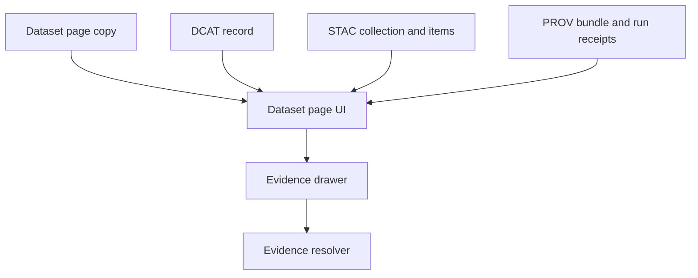

<!-- [KFM_META_BLOCK_V2]
doc_id: kfm://doc/b5def151-137e-4fe3-9d5c-7be5e300f39c
title: TEMPLATE — Dataset Page Copy
type: standard
version: v1
status: draft
owners: KFM UX + Data Governance
created: 2026-03-05
updated: 2026-03-05
policy_label: public
related: [docs/templates/ux/, docs/templates/ux/TEMPLATE__DATASET_PAGE_COPY.md]
tags: [kfm, template, ux, dataset, copy]
notes: [Template for authoring dataset page copy that is evidence-first and policy-aware.]
[/KFM_META_BLOCK_V2] -->

# TEMPLATE — Dataset Page Copy
Standard, evidence-first copy blocks for KFM dataset pages.

> **Status:** experimental · **Owners:** KFM UX + Data Governance · **Last updated:** 2026-03-05  
> **Badges (TODO):**     
> **Quick links:** [Scope](#scope) · [Where it fits](#where-it-fits) · [Quickstart](#quickstart) · [Template](#template) · [Checklist](#definition-of-done) · [FAQ](#faq)

---

## Scope
Use this template to write the **human-facing** content shown on a KFM dataset page (Catalog UI, layer details, and evidence drawer).

### Non-goals
- This is **not** the dataset’s full technical spec (schemas, ETL code, connector configs).
- This is **not** a replacement for STAC/DCAT/PROV catalogs — it should *point to them*.
- This is **not** the place to include restricted raw data, precise sensitive locations, or secrets.

---

## Where it fits
**Path:** `docs/templates/ux/TEMPLATE__DATASET_PAGE_COPY.md`

**Used by (expected):**
- Dataset “Catalog” page in the KFM UI (summary + key facts + how to cite + known limitations).
- Evidence drawer (license/version cues + links to provenance/evidence bundles).
- Story/Focus surfaces (deep links back to dataset definitions).

**Upstream inputs (normative):**
- **DCAT** (dataset-level facts like title, publisher, license, distributions)
- **STAC** (asset-level extents and access paths for spatial/temporal artifacts)
- **PROV / run receipts** (lineage and build metadata)

**Downstream outputs (normative):**
- Human-facing copy that is compatible with “cite-or-abstain” expectations.
- A structured “claims table” that ties important statements to EvidenceRefs.

---

## Acceptable inputs
- Dataset identity: `dataset_id`, `dataset_version_id` (or version range)
- Policy posture: `policy_label`, redaction/generalization notes
- Coverage facts: spatial and temporal extents, resolution, update cadence
- License/attribution: SPDX (if available), attribution string, rights notes
- Evidence references: EvidenceRefs and/or catalog record identifiers

---

## Exclusions
Do **not** put the following in this document:
- Credentials, tokens, internal endpoints.
- Raw restricted records or precise sensitive coordinates.
- Unverifiable “marketing” claims (e.g., “most accurate”, “complete”, “100% coverage”) without evidence.

---

## Directory tree
> **PROPOSED**: recommended co-location for a dataset’s UI copy + trust artifacts.

```text
docs/
  datasets/
    <DATASET_ID>/
      DATASET_PAGE_COPY.md          # ⬅ instantiate this template per dataset
      README.md                     # (optional) steward notes / contributor guide

data/
  catalog/
    dcat/
      <DATASET_ID>/<DATASET_VERSION_ID>/dataset.jsonld
    stac/
      <DATASET_ID>/<DATASET_VERSION_ID>/collection.json
    prov/
      <DATASET_ID>/<DATASET_VERSION_ID>/prov.bundle.jsonld  # or run receipt pointer
```

---

## Quickstart
1) Copy this file to your dataset doc location:

```bash
mkdir -p docs/datasets/<DATASET_ID>
cp docs/templates/ux/TEMPLATE__DATASET_PAGE_COPY.md docs/datasets/<DATASET_ID>/DATASET_PAGE_COPY.md
```

2) Replace **all** placeholders like `<DATASET_ID>` and fill required sections.

3) Run whatever docs lint / governance checks your repo uses (example):

```bash
# Pseudocode — replace with your repo’s actual command(s)
make docs-lint
```

---

## Template
> Write in plain language. Prefer short paragraphs and bullets. Avoid jargon unless it is defined.
>
> **Evidence discipline:** For each important factual statement, either (a) attach an EvidenceRef, or (b) mark as UNKNOWN and list the smallest verification step(s).

### Page header
**Title (H1):** `<DATASET_DISPLAY_NAME>`

**One-line summary (max ~160 chars):**  
`<ONE_LINE_SUMMARY>`

**Why this dataset exists (2–4 bullets):**
- `<WHY_BULLET_1>`
- `<WHY_BULLET_2>`
- `<WHY_BULLET_3>`

**Primary audiences (pick 1–3):**
- [ ] Public explorers
- [ ] Researchers
- [ ] Agency decision support
- [ ] Educators / students
- [ ] Developers / analysts

---

### What’s inside
**What this dataset contains (short paragraph):**  
`<WHAT_IS_IT>`

**Core entities / features (bullets):**
- `<ENTITY_OR_FEATURE_1>`
- `<ENTITY_OR_FEATURE_2>`

**Common questions this dataset can answer (3–6 bullets):**
- `<QUESTION_1>`
- `<QUESTION_2>`
- `<QUESTION_3>`

---

### Coverage and resolution
> If any of these are not confirmed, mark UNKNOWN and link to the validation plan.

**Spatial coverage:** `<STATEWIDE / COUNTIES / POINT LOCATIONS / NON-SPATIAL>`  
- **Extent (bbox or narrative):** `<BBOX_OR_DESCRIPTION>`  
- **Geometry type:** `<POINT/LINE/POLYGON/RASTER/NON-SPATIAL>`  
- **Spatial resolution (if raster):** `<E.G., 10m>`  
- **Positional uncertainty (if known):** `<E.G., ±30m>`  

**Temporal coverage:**  
- **Start:** `<YYYY-MM-DD or YYYY>`  
- **End:** `<YYYY-MM-DD or YYYY or “ongoing”>`  
- **Time resolution:** `<E.G., daily, monthly, annual, event-based>`  
- **Time semantics:** `<observation_time / publication_time / validity_time>`  

**Update cadence:** `<REALTIME / DAILY / WEEKLY / MONTHLY / ANNUAL / AD-HOC>`  
**Last refresh (dataset_version):** `<DATASET_VERSION_ID + DATE>`  

---

### Access, licensing, and attribution
**Policy label:** `<public | restricted | sensitive-location | ...>`  
**Access notes (short):**  
`<ACCESS_NOTES>`

**License (SPDX if possible):** `<SPDX_ID or “UNKNOWN”>`  
**Attribution (required):**  
`<ATTRIBUTION_TEXT>`

**How to cite (copy/paste):**
```text
<KFM Citation: DatasetVersion <DATASET_VERSION_ID>, "<DATASET_DISPLAY_NAME>", accessed <YYYY-MM-DD>, EvidenceRef: <EVIDENCE_REF_OR_BUNDLE_ID>>
```

---

### Provenance and trust surfaces
> The goal is to make trust visible: version, license, and evidence should be easy to find.

**Source-of-truth catalogs (links):**
- DCAT: `<RELATIVE_LINK_TO_DCAT_RECORD>`
- STAC: `<RELATIVE_LINK_TO_STAC_COLLECTION>`
- PROV / run receipt: `<RELATIVE_LINK_TO_PROV_OR_RECEIPT>`

**Processing summary (2–6 bullets):**
- `<INGEST_SUMMARY_1>`
- `<TRANSFORM_SUMMARY_2>`
- `<VALIDATION_SUMMARY_3>`

**Known redactions/generalizations (if any):**
- `<REDACTION_1>`
- `<REDACTION_2>`

---

### Quality, limitations, and known issues
**What this dataset is good for (2–4 bullets):**
- `<GOOD_FOR_1>`
- `<GOOD_FOR_2>`

**Limitations (required; 3–8 bullets):**
- `<LIMITATION_1>`
- `<LIMITATION_2>`
- `<LIMITATION_3>`

**Known issues (optional):**
- `<ISSUE_1>`
- `<ISSUE_2>`

**Recommended validation checks for users (optional):**
- `<CHECK_1>`
- `<CHECK_2>`

---

### Suggested “Focus Mode” prompts
> These should be questions that can be answered with evidence, not speculation.

- “Show the spatial/temporal coverage for `<DATASET_DISPLAY_NAME>` and link the catalogs.”
- “What changed between dataset versions `<OLD_VERSION>` and `<NEW_VERSION>`?”
- “Give me 3 example queries I can run and what fields they return.”

---

## Claims & evidence table
> Keep this table up to date. It is the review surface for “cite-or-abstain”.

| Claim | Status (CONFIRMED/PROPOSED/UNKNOWN) | EvidenceRef(s) | Notes / verification step |
|------|--------------------------------------|----------------|---------------------------|
| `<CLAIM_1>` | `<STATUS>` | `<EVIDENCE_REF_1>` | `<NOTES_OR_STEP>` |
| `<CLAIM_2>` | `<STATUS>` | `<EVIDENCE_REF_2>` | `<NOTES_OR_STEP>` |
| `<CLAIM_3>` | `<STATUS>` | `<EVIDENCE_REF_3>` | `<NOTES_OR_STEP>` |

---

## Diagram


---

## Definition of Done
- [ ] All placeholders replaced (no `<LIKE_THIS>` remains).
- [ ] One-line summary fits UI (≈160 chars max).
- [ ] License + attribution are present and consistent with DCAT.
- [ ] Policy label present; sensitive handling described if applicable.
- [ ] Coverage (spatial/temporal) is provided or marked UNKNOWN with verification steps.
- [ ] Limitations section completed (≥3 bullets).
- [ ] Claims table includes the top 3–10 public-facing claims with EvidenceRefs.
- [ ] Links to DCAT/STAC/PROV are valid (no broken relative links).
- [ ] Copy is accessibility-friendly (no color-only directions; acronyms expanded once).
- [ ] Docs lint / governance checks pass.

---

## FAQ
### Should this page include API examples?
**PROPOSED:** Yes, but only as *stable, public* examples (e.g., “query by bbox/time”) and only if the endpoints are part of the governed API contract.

### Where do I put a full data dictionary?
Put it in a dataset technical doc (or generated schema docs) and link it from “What’s inside”.

### How do I handle disputed or uncertain facts?
Mark them as **UNKNOWN**, provide the smallest verification step, and do not ship them as strong claims.

---

## Appendix
<details>
<summary>Optional structured front matter (PROPOSED)</summary>

If you want this file to be machine-parsable, you can add YAML front matter like:

```yaml
dataset_page_copy_v1:
  dataset_id: "<DATASET_ID>"
  dataset_version_id: "<DATASET_VERSION_ID>"
  title: "<DATASET_DISPLAY_NAME>"
  summary: "<ONE_LINE_SUMMARY>"
  policy_label: "<public|restricted|...>"
  license_spdx: "<SPDX_ID|UNKNOWN>"
  attribution: "<ATTRIBUTION_TEXT>"
  links:
    dcat: "<RELATIVE_LINK>"
    stac: "<RELATIVE_LINK>"
    prov: "<RELATIVE_LINK>"
```

</details>


[Back to top](#template--dataset-page-copy)
