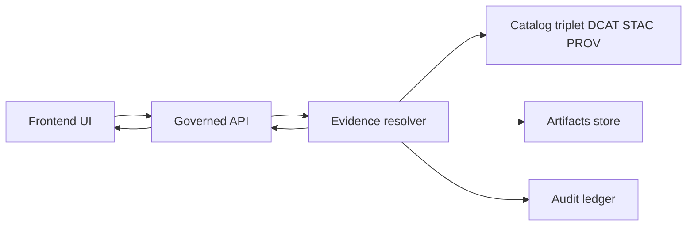

<!-- [KFM_META_BLOCK_V2]
doc_id: kfm://doc/6f0e7e7f-5d3b-4c22-8e45-1a9900a7e8dd
title: TEMPLATE - Evidence Drawer
type: standard
version: v1
status: draft
owners: ["KFM UX", "KFM Frontend"]
created: 2026-03-05
updated: 2026-03-05
policy_label: public
related: [
  "docs/templates/ux/",
  "contracts/schemas/evidence_bundle_v1.schema.json",
  "contracts/schemas/evidence_ref_v1.schema.json",
  "src/ui/components/EvidenceDrawer",
  "src/api/routes/evidence"
]
tags: [kfm, ux, template, evidence, provenance]
notes: ["Template for specifying the EvidenceDrawer trust surface used across Map/Story/Focus."]
[/KFM_META_BLOCK_V2] -->

# TEMPLATE: Evidence Drawer
A reusable UX + delivery template for the **EvidenceDrawer** trust surface (Map Explorer, Story Mode, Focus Mode).

## Impact
- **Status:** active template (edit freely; keep backwards-compatible where possible)
- **Owners:** KFM UX, KFM Frontend
- **Shields (TODO):** build, lint, e2e, a11y

**Quick links:**
- [Scope](#scope)
- [Non-negotiable constraints](#non-negotiable-constraints)
- [Information architecture](#information-architecture)
- [UI requirements matrix](#ui-requirements-matrix)
- [States and behaviors](#states-and-behaviors)
- [API contract touchpoints](#api-contract-touchpoints)
- [Accessibility](#accessibility)
- [Definition of done](#definition-of-done)

---

## Scope
**What this template is for**
- Spec’ing the UX, data contract assumptions, and acceptance criteria for the EvidenceDrawer component.
- Ensuring EvidenceDrawer is consistent across Map Explorer, Story Mode, and Focus Mode.

**What you fill in when using this template**
- Specific copy, field labels, and link destinations for your deployment.
- Which evidence types are supported at launch (dataset, feature, document, run receipt, etc.).

---

## Where it fits
- **Path:** `docs/templates/ux/TEMPLATE__EVIDENCE_DRAWER.md`
- **Used by:**
  - `src/ui/components/EvidenceDrawer/*`
  - Map feature click flows (`FeatureInspectPanel` → `EvidenceDrawer`)
  - Story citation flows (`StoryNodeReader` → `EvidenceDrawer`)
  - Focus citation flows (`ChatPanel` inline citation → `EvidenceDrawer`)

---

## Acceptable inputs
> Treat these as UI contract assumptions. If any assumption is false in code, the UI must degrade safely.

- `EvidenceRef` (a structured reference, **not** a raw URL)
- `EvidenceBundle` (resolved via governed API)
- Policy decision + obligations applied (including redactions)
- License + attribution text
- DatasetVersion identifiers and links to catalogs
- Provenance/run receipt reference(s)

---

## Exclusions
The EvidenceDrawer must **not**:
- Access DB/storage directly (no direct S3/DB calls; only governed API).
- Reveal restricted existence (“ghost metadata”) unless policy explicitly allows.
- Render artifact download links when policy denies access.
- Introduce a second “citation format” (e.g., ad-hoc pasted URLs).

---

## Non-negotiable constraints
These are architecture/UX invariants that keep governance enforceable.

1) **Governed access only**
- EvidenceDrawer calls the governed API to resolve evidence; it does not fetch from storage/DB directly.

2) **Cite-or-abstain alignment**
- EvidenceDrawer is the inspectable surface for citations.
- If evidence can’t be resolved or isn’t policy-allowed, the UI must display a policy-safe denial and/or abstention guidance.

3) **Fail-closed**
- Unknown policy state, missing license, or broken evidence links = no “best effort” display. Show an explicit error/denial state.

---

## Information architecture
### Mental model
- Inline UI (map popup / story inline citation / chat citation) shows a small **EvidenceRef**.
- The drawer expands that into an **EvidenceBundle** (what it is, where it came from, whether you’re allowed to see it, and how to reproduce).

### Flow diagram


### Layout skeleton
**Drawer header** (always visible)
- Title (or fallback)
- Policy badge + decision
- Bundle ID / digest (copy action)
- DatasetVersion ID (link action)

**Drawer body** (scroll)
1) Summary card
2) License + attribution
3) Provenance chain (run receipt)
4) Artifacts (policy-filtered)
5) Redactions / obligations applied
6) Related links (dataset landing page, STAC collection/item, DCAT landing)

**Drawer footer**
- “Copy citation”
- “Open audit receipt”
- “Request access” (when denied)

---

## UI requirements matrix
Label each row **CONFIRMED / PROPOSED / UNKNOWN**.

| Requirement | Status | Notes / verification |
|---|---:|---|
| EvidenceDrawer can open from any feature click and show license + dataset version. | CONFIRMED | Map Explorer acceptance criteria requires this. |
| EvidenceDrawer is shared across Map / Story / Focus and supports citation deep-links. | CONFIRMED | Core component list includes shared EvidenceDrawer. |
| Drawer shows: bundle ID + digest, DatasetVersion, license/rights holder, freshness, validation status, provenance link, artifact links (if allowed), redactions applied. | CONFIRMED | Minimum field set for evidence drawer. |
| Story publishing is blocked if any citation fails to resolve; UI can pre-check by calling evidence resolver during publish. | CONFIRMED | Publish gate + UI enforcement hook. |
| Keyboard navigation works end-to-end (open, focus trap, close, navigate links/buttons). | CONFIRMED | Explicit requirement + CI/a11y smoke expectation. |
| “Never show ghost metadata” for restricted sources unless policy allows. | CONFIRMED | Restriction UX requirement. |
| Drawer supports “What changed?” diff between DatasetVersions. | PROPOSED | Trust surface recommendation; implement when diff API exists. |
| Drawer supports offline export of the EvidenceBundle as JSON. | PROPOSED | Useful for audits; confirm with product/governance. |

---

## States and behaviors
### State table

| State | When it happens | Required UI behavior | Must not |
|---|---|---|---|
| Loading | EvidenceRef provided; bundle fetch in progress | Show skeleton; preserve close button; announce loading to screen readers | Block UI thread |
| Resolved + allowed | EvidenceBundle returned with allow decision | Render full cards, links, copy actions | Hide license/attribution |
| Resolved + denied | Bundle resolves but policy denies | Show policy-safe reason + next steps + audit_ref; hide artifact links | Reveal restricted details |
| Resolved + redacted | Allow decision with obligations applied | Render redaction badge; show what was generalized/removed | Show raw restricted values |
| Unresolvable | Resolver fails (404, linkcheck fail, invalid ref) | Show “cannot verify” state; provide retry; log telemetry | Fill with guesses |
| Network error | Timeout / offline | Show offline messaging; allow retry; don’t cache as success | Spin forever |

### Interaction rules
- **Open:**
  - From map feature click, story citation click, or focus citation click.
- **Close:**
  - ESC closes drawer.
  - Close button is always reachable by keyboard.
- **Focus management:**
  - Focus moves into drawer on open.
  - Focus returns to invoker on close.

### Copy and link behaviors
- “Copy citation” copies a **stable EvidenceRef** (not an ephemeral URL).
- “Copy bundle digest” copies `bundle_id` / digest.
- “Open dataset version” routes to DatasetVersion detail (catalog-backed).
- “Open run receipt” routes to provenance detail (may be restricted).

---

## API contract touchpoints
> This is illustrative. Replace with your repository’s actual OpenAPI + JSON schemas.

### Evidence resolution
**Endpoint**
- `POST /api/v1/evidence/resolve`

**Request (example)**
```json
{
  "evidence_ref": "stac://item/landsat8-2025-179_032#asset=data",
  "context": {
    "view_state": {
      "bbox": [-99.3, 37.1, -94.6, 40.0],
      "time": {"from": "2026-02-01", "to": "2026-03-01"}
    }
  }
}
```

**Response (example)**
```json
{
  "bundle_id": "sha256:bundle...",
  "dataset_version_id": "2026-02.abcd1234",
  "title": "Storm event record: 2026-02-19",
  "policy": {
    "decision": "allow",
    "policy_label": "public",
    "obligations_applied": []
  },
  "license": {
    "spdx": "CC-BY-4.0",
    "attribution": "Source org"
  },
  "freshness": {
    "last_run_at": "2026-02-20T12:00:00Z",
    "validation_status": "pass"
  },
  "provenance": {"run_id": "kfm://run/2026-02-20T12:00:00Z.abcd"},
  "artifacts": [
    {
      "href": "processed/events.parquet",
      "digest": "sha256:2222",
      "media_type": "application/x-parquet"
    }
  ],
  "checks": {"catalog_valid": true, "links_ok": true},
  "audit_ref": "kfm://audit/entry/123"
}
```

### Policy-safe denial payload
Define (or confirm) a shape for denial that supports:
- a stable `audit_ref`
- a policy-safe `reason_code`
- an optional “request access” route

---

## Accessibility
Minimum a11y requirements (treat as merge-blocking for UI changes):
- Keyboard navigable layer controls and evidence drawer; visible focus states.
- Text labels for policy badges and status indicators (no color-only meaning).
- ARIA labels for key controls (open/close, copy, links).
- Drawer should work with screen readers (announce title, state changes).

---

## Definition of done
### Functional gates
- [ ] EvidenceDrawer opens from map feature click.
- [ ] EvidenceDrawer opens from story citation click.
- [ ] EvidenceDrawer opens from focus citation click.
- [ ] Drawer renders license + dataset version for allowed evidence.
- [ ] Denied evidence shows policy-safe reason + next steps + audit_ref.
- [ ] No ghost metadata leakage in denied state.

### Evidence & governance gates
- [ ] Drawer only consumes EvidenceBundles returned by the evidence resolver.
- [ ] “Copy citation” copies an EvidenceRef.
- [ ] Story publish pre-check calls evidence resolver and blocks publish when any citation fails.

### Quality gates
- [ ] E2E test: feature click → drawer opens → shows license + dataset version.
- [ ] Keyboard-only smoke test passes (open, tab within, close, focus restore).
- [ ] Telemetry for resolver latency, errors, and denial counts is emitted.

---

## Appendix
<details>
<summary>Wireframe (ASCII)</summary>

```text
┌───────────────────────────────────────────────┐
│ Evidence                                       │
│ Storm event record: 2026-02-19                 │
│ Policy: PUBLIC  Status: ALLOW                  │
│ Bundle: sha256:bundle…   [Copy]                │
│ DatasetVersion: 2026-02.abcd1234  [Open]       │
├───────────────────────────────────────────────┤
│ Summary                                        │
│ - Type: Point feature                           │
│ - Time: 2026-02-19                              │
│ - Location: generalized (if required)           │
│                                                 │
│ License & attribution                            │
│ - CC-BY-4.0                                     │
│ - Attribution text…                             │
│                                                 │
│ Provenance                                      │
│ - Run receipt: kfm://run/...   [Open]           │
│ - Validation: pass                              │
│ - Freshness: 2026-02-20T12:00:00Z               │
│                                                 │
│ Artifacts (policy-filtered)                     │
│ - processed/events.parquet  sha256:2222 [Open]  │
│                                                 │
│ Redactions / obligations                         │
│ - geometry generalized to 1 km                   │
│ - sensitive fields removed                       │
├───────────────────────────────────────────────┤
│ [Copy citation] [Open audit] [Close]            │
└───────────────────────────────────────────────┘
```

</details>

<details>
<summary>Copy deck placeholders</summary>

- **Denied title:** “Evidence not available”
- **Denied body:** “This evidence is restricted for your role. You can explore public datasets or request access.”
- **Unresolvable title:** “Cannot verify evidence”
- **Unresolvable body:** “This citation could not be resolved. Try again or report the issue.”

</details>

---

## Back to top
- [Back to top](#template-evidence-drawer)
