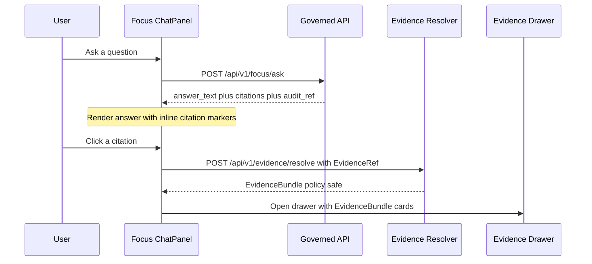

<!-- [KFM_META_BLOCK_V2]
doc_id: kfm://doc/36d5dba1-dbc9-490f-91e5-76cc167efb9f
title: TEMPLATE — Focus Mode Answer Card
type: standard
version: v1
status: draft
owners: [TODO: KFM UX, KFM API]
created: 2026-03-05
updated: 2026-03-05
policy_label: public
related:
  - kfm://doc/KFM-GDG-vNext
  - kfm://doc/KFM-Architecture-Governance-Delivery
tags: [kfm, template, ux, focus-mode]
notes:
  - This is a fill-in template for the Focus Mode Answer Card UI/UX + data contract surfaces.
[/KFM_META_BLOCK_V2] -->

> **Status:** experimental (template) · **Owners:** TODO  
> **Badges:**    
> **Quick links:** [Scope](#scope) · [Card anatomy](#card-anatomy) · [Data contract](#data-contract) · [Abstention UX](#abstention-and-partial-answers) · [DoD checklist](#definition-of-done)

# TEMPLATE — Focus Mode Answer Card
A standard, governed “answer card” pattern for Focus Mode responses: **answer + citations + audit_ref + evidence drawer hooks**.

---

## Scope
**Use this template when** you are designing or implementing the UI surface that renders a *single Focus Mode response* in chat, including:

- Answer text (human-readable)
- Inline citations that resolve via the evidence resolver
- The evidence drawer / provenance inspection hooks
- Policy notices and abstention behavior
- Exportable answer format (report / copy)

**Out of scope**: Map layer rendering, Story Node publishing UI (though the evidence drawer is shared).

**Evidence discipline for this doc**
- **CONFIRMED** = required by KFM design/governance sources.
- **PROPOSED** = recommended UI pattern; not yet enforced by contract/policy.
- **UNKNOWN** = decision needed; list the smallest verification step.

[Back to top](#template--focus-mode-answer-card)

---

## Where this fits in the repo
- **Path:** `docs/templates/ux/TEMPLATE__FOCUS_MODE_ANSWER_CARD.md`

~~~text
docs/
  templates/
    ux/
      TEMPLATE__FOCUS_MODE_ANSWER_CARD.md
~~~

- **Upstream inputs:**
  - `POST /api/v1/focus/ask` response (answer text + citations + audit_ref) (**CONFIRMED**)
  - `POST /api/v1/evidence/resolve` (EvidenceRef → EvidenceBundle) (**CONFIRMED**)
- **Downstream dependencies:**
  - Shared **EvidenceDrawer** component used across Map/Story/Focus (**CONFIRMED**)
  - Export renderer (Markdown/PDF) for “Export Answer” (**CONFIRMED**)

[Back to top](#template--focus-mode-answer-card)

---

## How to use this template (copy/paste)
1. Copy the file into the target design/implementation directory:

```bash
cp docs/templates/ux/TEMPLATE__FOCUS_MODE_ANSWER_CARD.md docs/ux/focus-mode/ANSWER_CARD.md
```

2. Replace all `TODO:` markers.
3. Decide all items marked **UNKNOWN** (or convert them to **PROPOSED** with rationale).
4. If this doc becomes a production spec, bump:
   - `status: draft` → `review` → `published`
   - `version: v1` as needed

---

## Acceptable inputs
- A Focus Mode response payload containing (at minimum):
  - `answer_text` (or `answer_markdown`)
  - `citations[]` with resolvable `EvidenceRef` strings
  - `audit_ref` for follow-up review

> If any of the above is missing, the UI must treat the response as **abstain / incomplete** and surface the missing pieces (policy-safe) rather than pretending the answer is fully supported. (**CONFIRMED**)

---

## Exclusions
Do **not** use this pattern to justify or enable:
- **Uncited** factual claims (no “trust me” answers). (**CONFIRMED**)
- “Citations” as raw URLs pasted into text (citations are EvidenceRefs that resolve to EvidenceBundles). (**CONFIRMED**)
- Direct UI access to databases, object storage, search indexes, or graph stores (all access crosses governed APIs). (**CONFIRMED — project invariant**)
- “Ghost metadata” revealing restricted dataset existence through UI copy, tooltips, or error differences. (**CONFIRMED**)

---

## Requirements registry

| Req ID | Requirement | Status | Notes / how to verify |
|---:|---|:---:|---|
| FM-001 | A Focus Mode request is treated as a governed run with a receipt; outputs include answer text, citations (EvidenceRefs), and audit_ref. | CONFIRMED | Verify with KFM GDG vNext §14.1 and API contract requirements. |
| FM-002 | Hard gate: if citations cannot be verified (resolve + allowed), the response must abstain or reduce scope. | CONFIRMED | Verify with KFM GDG vNext §14.2 (step 6). |
| FM-003 | Evidence drawer is a shared trust surface across Map/Story/Focus. | CONFIRMED | Verify with KFM GDG vNext §12.2. |
| FM-004 | Evidence drawer shows: bundle id + digest, dataset version, license/rights, freshness + validation, provenance chain, artifact links if allowed, redactions applied. | CONFIRMED | Verify with KFM GDG vNext §12.4. |
| FM-005 | Abstention UX: show why (policy-safe), suggest safe alternatives, provide audit_ref; never show ghost metadata. | CONFIRMED | Verify with KFM GDG vNext §12.6 / §14.5. |
| FM-006 | EvidenceRef schemes: dcat, stac, prov, doc (page+span), graph; EvidenceRefs parseable w/o network calls. | CONFIRMED | Verify with KFM GDG vNext §23.1–23.3. |
| FM-007 | Evidence resolver returns EvidenceBundle (human card + machine metadata + digests + audit refs) and should be usable in ≤2 calls. | CONFIRMED | Verify with blueprint D7. |
| FM-008 | Accessibility: evidence drawer keyboard navigable, visible focus states, no color-only meaning, ARIA labels, safe markdown rendering, exports include citations + audit_ref. | CONFIRMED | Verify with KFM GDG vNext §12.5. |
| FM-009 | Include dataset DOI + provider keys; include DCAT + STAC links; surface CARE/sensitivity if generalized; missing citations treated as policy-deny. | CONFIRMED (integration kit) | Verify with “Focus Mode citation handshake” module. |
| FM-010 | Exact answer-card layout (header, chips, controls) matches current design system. | UNKNOWN | TODO: identify design system + link. |

[Back to top](#template--focus-mode-answer-card)

---

## Card anatomy

### Visual structure (PROPOSED)

~~~text
┌───────────────────────────────────────────────────────────────┐
│ Focus Mode Answer                                              │
│ [policy badges] [dataset badges]                 [audit_ref ⧉] │
├───────────────────────────────────────────────────────────────┤
│ Answer (markdown)                                              │
│ - ... claim ... [C1]                                           │
│ - ... claim ... [C2]                                           │
│                                                               │
│ Policy notice (only if needed): “Some details withheld…”       │
├───────────────────────────────────────────────────────────────┤
│ Citations                                                      │
│ [C1] <citation label>  [Open evidence]                         │
│ [C2] <citation label>  [Open evidence]                         │
├───────────────────────────────────────────────────────────────┤
│ Actions:  [Export] [Copy] [Share link] [Report issue]          │
└───────────────────────────────────────────────────────────────┘
~~~

### Anatomy-to-data mapping (PROPOSED)

| UI region | Data source | Must show? | Notes |
|---|---|:---:|---|
| Card header title (“Focus Mode Answer”) | UI constant | ✅ | Localized string. |
| Policy badge(s) | `response.policy.policy_label` (or derived) | ✅ | Must be text-labeled (no color-only). |
| Audit reference | `response.audit_ref` | ✅ | Provide copy-to-clipboard. |
| Answer body | `response.answer_markdown` | ✅ | Render sanitized Markdown. |
| Inline citation markers | `response.citations[]` + anchors in markdown | ✅ | Every marker must map to a resolvable EvidenceRef. |
| Policy notice | `response.policy.notice?` or inferred from obligations | ⚠️ | Shown only if redactions/denials/partial. |
| Citation list | `response.citations[]` | ✅ | Each row opens evidence drawer. |
| Export action | `ExportAnswer` | ✅ | Export includes citations + audit_ref. |

[Back to top](#template--focus-mode-answer-card)

---

## Interaction model

### Sequence (CONFIRMED + PROPOSED)



### Key rules (CONFIRMED)
- A “citation” is an **EvidenceRef** that resolves (via evidence resolver) to an **EvidenceBundle** (not a pasted URL).
- **Hard gate:** if a citation cannot be verified (resolve + allowed), the system must revise answer or abstain.
- The UI must avoid sensitive existence leakage (error copy and error shape; no ghost metadata).

[Back to top](#template--focus-mode-answer-card)

---

## Data contract

### EvidenceRef formats (CONFIRMED)
Use these EvidenceRef schemes:

- `dcat://<dataset_slug>@<dataset_version_id>`
- `stac://<collection_or_item_id>#asset=<asset_key>`
- `prov://<run_or_receipt_id>`
- `doc://<artifact_digest>#page=<n>&span=<start>:<end>`
- `graph://<node_or_edge_id>`

**Rules (CONFIRMED)**
- EvidenceRefs must be parseable without network calls.
- The evidence resolver validates syntax and returns policy-safe errors.

### Answer card payload (PROPOSED)
> Align this with `contracts/schemas/focus_response_v1.schema.json` once it exists. Until then, treat this as a UI-model proposal.

```json
{
  "kind": "focus_answer_card_v1",
  "audit_ref": "kfm://run/2026-02-20T12:00:00Z.abcd",
  "policy": {
    "decision": "allow",
    "policy_label": "public",
    "obligations_applied": ["geometry_generalized"]
  },
  "question": {
    "text": "…",
    "view_state": {
      "bbox": [-102.0, 36.9, -94.6, 40.0],
      "time_window": {"start": "YYYY-MM-DD", "end": "YYYY-MM-DD"},
      "active_layers": ["layer_id_a", "layer_id_b"]
    }
  },
  "answer_markdown": "…with inline markers like [C1]…",
  "citations": [
    {
      "id": "C1",
      "label": "Dataset title or doc title",
      "evidence_ref": "dcat://dataset_slug@2026-02.abcd1234",
      "dataset_identifiers": {
        "doi": "10.xxxx/xxxxx",
        "provider_keys": ["provider:datasetKey:…"]
      },
      "links": {
        "dcat_landing": "kfm://dataset/dataset_slug@2026-02.abcd1234",
        "stac_collection": "kfm://stac/collections/collection_id"
      }
    }
  ],
  "abstain": {
    "status": "no",
    "reason": null,
    "safe_alternatives": []
  }
}
```

**UNKNOWN (verification steps)**
- Confirm exact Focus Mode response schema fields once `focus_response_v1` is merged.
- Confirm whether the backend returns `policy.notice` as a first-class string or only obligations.

[Back to top](#template--focus-mode-answer-card)

---

## Evidence drawer integration

### Minimum evidence drawer fields (CONFIRMED)

When opening evidence for a citation, show:

- Evidence bundle ID + digest
- DatasetVersion ID + dataset name
- License and rights holder (with attribution text)
- Freshness (last run timestamp) and validation status
- Provenance chain (run receipt link)
- Artifact links (only if policy allows)
- Redactions applied (obligations)

### EvidenceBundle shape (CONFIRMED template)

```json
{
  "bundle_id": "sha256:bundle...",
  "dataset_version_id": "2026-02.abcd1234",
  "title": "…",
  "policy": {
    "decision": "allow",
    "policy_label": "public",
    "obligations_applied": []
  },
  "license": {
    "spdx": "CC-BY-4.0",
    "attribution": "Source org"
  },
  "provenance": { "run_id": "kfm://run/..." },
  "artifacts": [
    { "href": "processed/file.parquet", "digest": "sha256:…", "media_type": "application/x-parquet" }
  ],
  "checks": { "catalog_valid": true, "links_ok": true },
  "audit_ref": "kfm://audit/entry/123"
}
```

**PROPOSED UI behavior**
- Display “Policy obligations applied” as a compact list (chips), with a “What this means” tooltip.
- If artifacts are not allowed, show a policy-safe message (do not show hidden filenames).

[Back to top](#template--focus-mode-answer-card)

---

## Abstention and partial answers

### Abstention principles (CONFIRMED)
Abstention must be understandable without leaking restricted info:

- Show **why** in policy-safe terms (example: “restricted evidence not available to your role”)
- Suggest safe alternatives (broaden time range, use public datasets, request steward review)
- Provide `audit_ref` so stewards can review
- Never show “ghost metadata” revealing restricted existence unless policy allows

### UI pattern (PROPOSED)

~~~text
We can’t answer that fully with the evidence available to your role.

What’s missing (policy-safe):
- <missing evidence type or permission>

What we can do instead:
- <public-safe alternative 1>
- <public-safe alternative 2>

Audit reference:
- <audit_ref>
~~~

### Partial answer pattern (CONFIRMED)
Partial answers are acceptable when only part of the question is supported by evidence.

**PROPOSED rendering**
- Provide a “Supported findings” section with citations.
- Provide an “Unsupported” section that explicitly says what was not supported and why (policy-safe).

[Back to top](#template--focus-mode-answer-card)

---

## Accessibility and inclusive design

### Minimum requirements (CONFIRMED)
- Keyboard navigable layer controls and evidence drawer; visible focus states.
- Text labels for policy badges and status indicators (no color-only meaning).
- ARIA labels for map controls.
- Safe markdown rendering for narratives (CSP + sanitization).
- Export outputs include citations and audit_ref in a readable format.

### Suggested checks (PROPOSED)
- Tab order reaches: card header → answer → citation list → actions.
- Citation links have accessible names: “Open evidence for citation C1”.
- Screen-reader announces policy notice region when present.

[Back to top](#template--focus-mode-answer-card)

---

## Export Answer

### Required export contents (CONFIRMED)
An exported answer (PDF/Markdown) must include:
- Answer text
- Citations (with resolvable EvidenceRefs)
- audit_ref

### Export structure (PROPOSED)
- Title: “Focus Mode Answer”
- Timestamp + audit_ref
- Question (optionally redacted per policy)
- Answer body
- Citations list (with DOI/provider keys and DCAT/STAC links when available)
- Policy obligations summary (if any)

---

## Definition of Done

### UX / engineering gate checklist
- [ ] Every factual claim in the answer has at least one inline citation marker.
- [ ] Every citation marker maps to a citation object containing a valid EvidenceRef.
- [ ] Every EvidenceRef resolves via `POST /api/v1/evidence/resolve` for allowed users.
- [ ] If a citation cannot be verified, the UI renders abstention/partial answer (no silent failure).
- [ ] Evidence drawer renders the minimum required fields (bundle id, dataset version, license, freshness, provenance, artifacts if allowed, redactions).
- [ ] Evidence drawer + citations are fully keyboard navigable and screen-reader friendly.
- [ ] Abstention copy is policy-safe and does not reveal restricted existence (no ghost metadata).
- [ ] Export includes citations + audit_ref and renders as readable, sanitized output.

---

<details>
<summary>Appendix — Copy/paste snippets</summary>

### Example inline citation style (PROPOSED)
```markdown
The analysis indicates X is associated with Y. [C1]

[C1]: dcat://dataset_slug@2026-02.abcd1234
```

### Example “unsupported” clause (PROPOSED)
```markdown
Unsupported: We cannot provide <specific detail> because the supporting evidence is restricted for your current role.
Audit reference: kfm://run/…
```

</details>

[Back to top](#template--focus-mode-answer-card)
