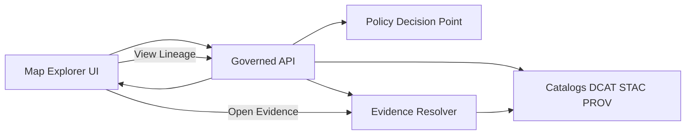

<!-- [KFM_META_BLOCK_V2]
doc_id: kfm://doc/0d4c8a6d-3f6f-4ec7-9c7b-7d54c9f6a2d2
title: TEMPLATE - Layer Metadata Panel
type: standard
version: v1
status: draft
owners: ["TODO: KFM UX Working Group"]
created: 2026-03-05
updated: 2026-03-05
policy_label: public
related: [
  "TODO: link to Map Explorer UX spec",
  "TODO: link to governed API contracts",
  "TODO: link to EvidenceDrawer template"
]
tags: [kfm, ux, template, map, provenance, metadata, trust-surface]
notes: ["Template used to specify a Layer Metadata Panel that makes governance + provenance visible."]
[/KFM_META_BLOCK_V2] -->

# TEMPLATE - Layer Metadata Panel
One panel spec you can copy/paste for each map layer so users can see **version, license/rights, policy status, and provenance** without leaving the map.

---

## Impact
**Status:** template (fill in per layer)  
**Owners:** TODO  
**Last updated:** 2026-03-05  

**Badges (placeholders)**

- 
- 
- 
- 

**Quick links:**

- [Scope](#scope)
- [Field matrix](#field-matrix)
- [States and behavior](#states-and-behavior)
- [Data contracts](#data-contracts)
- [Acceptance criteria](#acceptance-criteria)

---

## Scope
**What this is:** The Layer Metadata Panel is a **trust surface** for Map Explorer. It lists **active map layers** and provides per-layer **source info, license, and description**, plus **dataset version** and **policy signals**, with one-click drill-down into evidence/provenance.

**What this is not:**
- Not a full catalog browser.
- Not a place to display restricted details (fail-closed).
- Not a policy decision point.

---

## Where it fits
**Primary surface:** Map Explorer → LayerPanel → “ⓘ / Details” action per layer → Layer Metadata Panel

**Adjacent surfaces (shared components):**
- **Evidence Drawer** (feature-click → citations/evidence bundle)
- **Provenance / Lineage view** (run receipts + lineage links)
- **What changed?** diff between dataset versions

---

## Inputs
Fill these in for each layer.

### Layer identity
- **Layer display name:** `TODO`
- **layer_id (stable):** `TODO`
- **dataset_id:** `TODO`
- **dataset_version_id:** `TODO` (must be shown to users)

### Data class
- **Geometry type:** `point | line | polygon | raster | tile`
- **Time support:** `none | instant | interval | time-series`
- **Primary theme:** `TODO (controlled vocabulary)`

### Governance
- **policy_label:** `public | restricted | internal | ...`
- **Obligations to surface (if any):** `TODO` (e.g., generalized geometry, field redactions)

---

## Exclusions
- Do **not** embed privileged credentials in the client.
- Do **not** query databases directly from the UI (all reads cross governed APIs).
- Do **not** “guess” missing provenance or license. If missing, show an explicit **UNKNOWN** state and route to remediation.

---

## Design requirements
> Use the **CONFIRMED / PROPOSED / UNKNOWN** tags below to keep the spec honest.

### Trust-surface requirements
- **CONFIRMED:** Panel must expose per-layer **dataset version** and **policy notices** (including “geometry generalized due to policy” style messaging where applicable).
- **CONFIRMED:** Panel must offer one-click access to **evidence/provenance** surfaces.
- **CONFIRMED:** Panel should support **automation status badges** (healthy/degraded/failing) without exposing secrets.
- **PROPOSED:** Panel should include a compact **“freshness”** line (last run timestamp) and **validation status** chip.

### Layout
- **PROPOSED placement:** Right-side drawer OR modal sheet (desktop); bottom sheet (mobile).
- **PROPOSED width:** 360–480px.
- **PROPOSED sections (ordered):**
  1) Header
  2) Summary
  3) Source + license/rights
  4) Coverage (time + space)
  5) Freshness + QA
  6) Policy + redactions
  7) Actions

---

## Panel anatomy
### Header
Required elements:
- **Layer name**
- **Badges** (all must have text labels; no color-only meaning)
  - Policy badge (e.g., `PUBLIC`, `RESTRICTED`)
  - Data version label (e.g., `2026-02.abcd1234`)
  - Automation status badge (e.g., `HEALTHY`, `DEGRADED`, `FAILING`)

Optional:
- Layer icon (theme)
- “Pin” or “keep open” toggle

### Summary
- Short description (1–3 lines)
- Publisher / source organization
- Primary domain/theme tags

### Source + license/rights
Must be explicit and copyable:
- License identifier (SPDX if possible)
- Rights holder / attribution string
- External access URL (if “metadata-only reference mode”)

### Coverage
- Spatial coverage: `Kansas statewide` / bbox summary / jurisdiction note
- Temporal coverage: `YYYY–YYYY` OR timestamp
- Resolution or scale (if known)

### Freshness + QA
- “Last updated / last run” timestamp (policy-safe)
- Validation status (pass/warn/fail/unknown)
- Optional: top-line QA metrics (counts, drift)

### Policy + redactions
Required:
- policy_label (public-safe)
- If obligations exist, show:
  - What was changed (e.g., generalized geometry)
  - Why (policy-safe)
  - Where to request access (if applicable)

### Actions
Minimum actions:
- **Open Evidence Drawer** (for feature-level inspection)
- **View Dataset Catalog** (DCAT/STAC/PROV summary)
- **View Lineage / Run Receipt**
- **What changed?** (diff view between dataset versions)

Optional actions:
- Export layer (policy-gated)
- Copy citation (EvidenceRef)

---

## Field matrix
> Use this table to lock **what the UI shows** to **what the governed API can provide**.

| UI field | Required | Source of truth | Endpoint (target) | Policy notes |
|---|---:|---|---|---|
| layer_id | ✅ | UI config / layer registry | (local) + `GET /api/v1/datasets` | Safe |
| Layer display name | ✅ | UI config + DCAT title | `GET /api/v1/datasets` | Safe |
| dataset_id | ✅ | Catalog (DCAT) | `GET /api/v1/datasets` | Safe |
| dataset_version_id | ✅ | Catalog + release manifest | `GET /api/v1/datasets` | Must be shown |
| policy_label | ✅ | Catalog policy label | `GET /api/v1/datasets` | Text label required |
| Automation status | ✅ (recommended) | Lineage/status feed | `GET /api/v1/lineage/status` | Do not expose secrets |
| Description | ✅ | DCAT description | `GET /api/v1/datasets` | Redact if required |
| Publisher | ✅ | DCAT publisher | `GET /api/v1/datasets` | Safe |
| License | ✅ | DCAT license/rights | `GET /api/v1/datasets` | Never “guess” |
| Attribution | ✅ | DCAT rights holder / derived string | `GET /api/v1/datasets` | Copyable |
| Temporal coverage | ✅ | DCAT temporal | `GET /api/v1/datasets` | Safe |
| Spatial coverage | ✅ | DCAT spatial | `GET /api/v1/datasets` | May be generalized |
| Freshness timestamp | ✅ (recommended) | PROV run receipt | `GET /api/v1/lineage/{dataset_id}` | Must be policy-safe |
| Validation status | ✅ (recommended) | QA report + catalog checks | `GET /api/v1/lineage/{dataset_id}` | No restricted leakage |
| Obligations applied | ✅ (when present) | Policy decision output | `POST /api/v1/evidence/resolve` | Explain in safe terms |
| Evidence link | ✅ | EvidenceRef → EvidenceBundle | `POST /api/v1/evidence/resolve` | Fail-closed |

---

## States and behavior
### Loading
- Show skeleton rows.
- Do not flash restricted metadata.

### Success
- Render full panel.
- All links/actions that trigger governed operations should be visibly policy-badged.

### Restricted / denied
- Show a neutral blocked state:
  - Title: `Layer details unavailable`
  - Body: `You do not have access to view details for this layer.`
  - Optional: `Try a public layer, broader time range, or contact a steward.`
- **Never** reveal restricted existence via different-looking 403 vs 404 responses.

### Partial metadata
- If license/rights missing: show `UNKNOWN` with remediation:
  - “This layer cannot be exported until rights are populated.”
  - Link to “report an issue” or internal steward workflow.

---

## Accessibility requirements
- Keyboard navigable:
  - Layer toggles
  - “Details” button
  - Panel content scroll
  - Evidence drawer open/close
- Visible focus states.
- All badges must have **text labels** (no color-only meaning).
- ARIA labels for map controls and panel buttons.
- Any markdown rendering must be sanitized (XSS-safe).

---

## Data contracts
### Endpoints used
> These are **documented targets**. Verify exact routes and schemas in the repo.

- `GET /api/v1/datasets` (dataset discovery, policy-filtered)
- `GET /api/v1/lineage/{dataset_id}` (lineage + run receipts)
- `GET /api/v1/lineage/status` (automation status badge feed)
- `POST /api/v1/evidence/resolve` (EvidenceRef → EvidenceBundle)

### Proposed UI model
```json
{
  "layer_id": "kfm.layer.example",
  "title": "Example Layer",
  "dataset_id": "kfm.dataset.example",
  "dataset_version_id": "2026-02.abcd1234",
  "policy": {
    "policy_label": "public",
    "decision": "allow",
    "obligations": [
      {
        "kind": "generalize_geometry",
        "summary": "Geometry generalized due to policy"
      }
    ]
  },
  "source": {
    "publisher": "Example Agency",
    "license_spdx": "CC-BY-4.0",
    "attribution": "Example Agency (CC-BY-4.0)"
  },
  "coverage": {
    "spatial": "Kansas, USA",
    "temporal": "1900-01-01/2025-12-31"
  },
  "freshness": {
    "last_run_at": "2026-02-20T12:00:00Z",
    "validation_status": "pass"
  },
  "links": {
    "catalog": "/catalog/datasets/2026-02.abcd1234",
    "lineage": "/lineage/kfm.dataset.example",
    "what_changed": "/diff/kfm.dataset.example?from=2026-01...&to=2026-02..."
  }
}
```

---

## Diagram


---

## Acceptance criteria
### Functional
- [ ] Panel lists all **active layers** and supports opening per-layer details.
- [ ] Panel shows: dataset_version_id, policy_label, license, attribution, description.
- [ ] “Open Evidence Drawer” works from a feature click and shows license + version.
- [ ] “View Lineage” surfaces a run receipt link and freshness timestamp (policy-safe).
- [ ] “What changed?” compares two dataset versions.

### Governance / safety
- [ ] UI never makes policy decisions; it renders policy outputs from the API.
- [ ] Restricted layers fail closed and do not leak existence.
- [ ] Obligations/redactions are explained in policy-safe terms.

### Accessibility
- [ ] Fully keyboard navigable with visible focus.
- [ ] Badges have text labels.
- [ ] ARIA labels on all controls.

### Tests
- [ ] E2E: open panel → open evidence drawer → verify license + dataset version visible.
- [ ] E2E: unauthorized response → blocked state, no ghost metadata.
- [ ] Snapshot/UI test: badge rendering with labels.

---

## Panel artifact metadata (optional)
If you capture a screenshot/asset for this panel, store a sidecar record.

```json
{
  "id": "layer_metadata_panel_v1_TODO",
  "domain": "map_explorer",
  "type": "layer_metadata_panel",
  "fairstatus": "draft",
  "care_status": "needs_review",
  "asset_file": "TODO.png",
  "checksum_sha256": "sha256-<hash>",
  "generated_by": "manual",
  "created": "YYYY-MM-DDTHH:MM:SSZ"
}
```

---

## Appendix
<details>
<summary>Example filled-in panel (copy/paste starter)</summary>

**Layer display name:** `NOAA Storm Events`  
**layer_id:** `kfm.layer.noaa_storm_events`  
**dataset_id:** `kfm.dataset.noaa_storm_events`  
**dataset_version_id:** `2026-02.abcd1234`  
**policy_label:** `public`  

**Description:** Storm event records with time, location, and type.  
**Publisher:** NOAA (example)  
**License:** `CC-BY-4.0`  
**Attribution:** `NOAA (CC-BY-4.0)`  

**Freshness:** last run `2026-02-20T12:00:00Z`  
**Validation:** `pass`  

**Obligations:** none

**Actions:**
- Open Evidence Drawer
- View Catalog
- View Lineage
- What changed?

</details>

---

[Back to top](#template---layer-metadata-panel)
