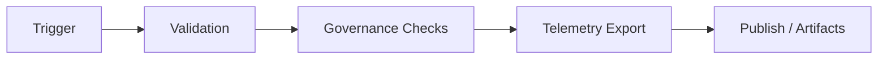

<div align="center">

# 🧩 **Workflow Documentation Template — Kansas Frontier Matrix**  
`docs/templates/workflow_template.md`

**Purpose:**  
Provide a **standardized, governance-aligned, machine-validatable template** for documenting all GitHub Actions workflows used across the Kansas Frontier Matrix (KFM).  
This enables **FAIR+CARE-compliant**, **MCP-DL v6.3-certified**, and **Diamond⁹ Ω / Crown∞Ω** automation practices throughout all CI/CD, telemetry, governance, and AI pipelines.

[](../README.md)
[](../../LICENSE)
[](../standards/faircare.md)
[]()

</div>

---

## 📘 Overview

Use this template to document **any workflow `.yml` file**, whether located under:

```
.github/workflows/
docs/workflows/
```

Every workflow documentation file **must**:

1. Contain complete **YAML front-matter** (version, SBOM, manifest, telemetry schema, governance refs).  
2. Describe workflow **purpose**, **trigger conditions**, **permissions**, **jobs**, and **outputs**.  
3. Declare how the workflow enforces **FAIR+CARE** and **MCP-DL v6.3** governance.  
4. Include a **Mermaid diagram** illustrating workflow logic (≤ 12 nodes, no custom classDefs).  
5. Provide a **version history table** aligned with KFM release policy.  

This ensures documentation meets *Platinum README v7.1*, passes `docs-lint.yml`, and integrates with KFM’s unified telemetry ledger.

---

## 🗂️ Directory Context

```plaintext
docs/
 ├── workflows/
 │   ├── README.md
 │   ├── stac-validate.yml.md
 │   ├── faircare-validate.yml.md
 │   ├── telemetry-export.yml.md
 │   ├── docs-lint.yml.md
 │   └── [YOUR-WORKFLOW].yml.md   ← Use this template
 └── templates/
     └── workflow_template.md
```

---

## 🧱 Required YAML Front-Matter

```yaml
---
title: "⚙️ Example Workflow — `example-workflow.yml`"
path: "docs/workflows/example-workflow.yml.md"
version: "v10.2.2"
last_updated: "2025-11-12"
review_cycle: "Continuous / Autonomous"
commit_sha: "<latest-commit-hash>"
sbom_ref: "../../releases/v10.2.0/sbom.spdx.json"
manifest_ref: "../../releases/v10.2.0/manifest.zip"
telemetry_ref: "../../releases/v10.2.0/focus-telemetry.json"
telemetry_schema: "../../schemas/telemetry/workflows/example-v2.json"
governance_ref: "../standards/governance/ROOT-GOVERNANCE.md"
license: "CC-BY 4.0"
mcp_version: "MCP-DL v6.3"
---
```

> **Important:**  
> - `telemetry_ref` **must** point to the active release ledger.  
> - `telemetry_schema` ensures CI can merge metrics safely.  
> - CI rejects undocumented or malformed front-matter.

---

## 📘 Overview (For Your Workflow)

Provide a **clear purpose statement**. Include governance context:

- What this workflow validates/automates  
- Why it is required in KFM’s CI/CD  
- Which certification layers apply (FAIR+CARE, ISO, SLSA, MCP-DL)  

---

## 🗂️ Trigger & Scope

Document triggers and affected paths.

| Trigger | Paths | Notes |
|--------:|-------|-------|
| `push` | `src/**`, `data/**` | restricted to main / release branches |
| `pull_request` | `docs/**`, `schemas/**` | blocks merges on failure |
| `workflow_dispatch` | — | manual execution |
| `schedule` | cron | for periodic governance or telemetry runs |

---

## 🧩 Workflow Definition (YAML Excerpt)

```yaml
name: "Example Workflow"

on:
  push:
    paths: ["src/**", "data/**"]
permissions:
  contents: read
  id-token: write

jobs:
  example:
    runs-on: ubuntu-latest
    steps:
      - uses: actions/checkout@v4
      - run: echo "Hello Kansas Frontier Matrix!"
```

---

## ⚙️ Jobs Summary

| Job | Purpose | Output |
|---|---|---|
| `build` | Compile or validate project components | binaries, reports |
| `validate` | Run linting, schema checks, audits | `reports/*.json` |
| `deploy` | Publish artifacts to release bundles | `manifest.zip` |

---

## 📊 Inputs & Outputs

| Type | Field | Description |
|------|--------|-------------|
| **Input** | `dataset_ref` | STAC/DCAT dataset or contract ID |
| **Input** | `config_path` | Relative path to workflow config |
| **Output** | `reports/validation.json` | Contract or metadata validation |
| **Output** | `focus-telemetry.json` | Workflow event appended to global ledger |

---

## 🔐 Permissions (Least Privilege)

List every permission your workflow uses:

| Permission | Reason |
|-----------|--------|
| `contents: read` | Required to inspect repository files |
| `id-token: write` | Enables OIDC-based artifact signing |
| `packages: write` | Only if workflow uploads packages |

> CI **fails** workflows that grant excessive privileges.

---

## ♻️ Caching & Performance

Document caching strategy:

- `actions/cache@v4` for Python/Node dependencies  
- Hash keys must include lockfiles (`requirements.lock`, `package-lock.json`)  
- Expected speedup: 40–70%  

---

## 🧯 Failure Modes & Rollback

List common failure cases and how maintainers must respond.

Examples:

- Missing contract fields → block merge  
- STAC link rot → move to abandonment registry  
- Telemetry merge conflict → workflow must rerun  

---

## ⚖️ FAIR+CARE Governance Matrix

| Principle | Implementation | Evidence |
|---|---|---|
| **Findable** | Workflow documented with stable ID & metadata | front-matter |
| **Accessible** | Artifacts uploaded & public | GitHub Actions artifacts |
| **Interoperable** | JSON Schema, STAC/DCAT compatible outputs | schema validation |
| **Reusable** | CC-BY license + versioned configs | LICENSE, commits |
| **CARE** | Sensitive flags respected; ethics guardrails | FAIR+CARE reports |

---

## 🧭 Mermaid Diagram (Workflow Logic)



---

## 🧾 Internal Citation

```text
Kansas Frontier Matrix (2025). Example Workflow — `example-workflow.yml` (v10.2.2).
Governance-aligned CI automation documented under FAIR+CARE and MCP-DL v6.3.
```

---

## 🕰️ Version History

| Version | Date | Author | Summary |
|---|---|---|---|
| v10.2.2 | 2025-11-12 | KFM Docs Team | Upgraded to v10.2; telemetry refs updated; strengthened MCP/FAIR+CARE rules. |
| v10.0.0 | 2025-11-10 | KFM Docs Team | Added caching, failure modes, governance matrix, and required fields. |
| v9.9.0 | 2025-11-08 | KFM Docs Team | Initial template for workflow documentation. |

---

<div align="center">

**Kansas Frontier Matrix**  
*Governed Automation × FAIR+CARE Documentation × Sustainable CI/CD*  
© 2025 Kansas Frontier Matrix — CC-BY 4.0 — Master Coder Protocol v6.3 — **Diamond⁹ Ω / Crown∞Ω**  
[Back to Workflows Index](../workflows/README.md) · [Governance Charter](../standards/governance/ROOT-GOVERNANCE.md)

</div>