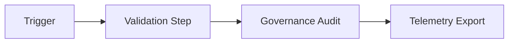

<div align="center">

# 🧩 **Workflow Documentation Template — Kansas Frontier Matrix**
`docs/templates/workflow_template.md`

**Purpose:**  
Provide a **standardized documentation scaffold** for all GitHub Actions workflows in the Kansas Frontier Matrix (KFM) repository.  
This template enforces **Platinum README v7.1**, **MCP-DL v6.3**, and **FAIR+CARE** alignment for reproducible, auditable automation across the entire CI/CD and governance pipeline.

[](../README.md)
[](../../LICENSE)
[](../standards/faircare.md)
[](#)

</div>

---

## 📘 Overview

This template serves as the **base documentation format** for all workflow `.yml` automation files located in:

```
docs/workflows/
.github/workflows/
```

Each corresponding `.md` document must:
1. Include **YAML front-matter** for provenance and telemetry linking.  
2. Describe **workflow purpose, triggers, jobs, permissions**, and outputs.  
3. Reference **FAIR+CARE compliance** and governance schema alignment.  
4. Contain a **Mermaid diagram** illustrating workflow logic.  
5. Provide a **version history** with changelog and authorship.  

---

## 🗂️ Directory Context

Example placement within documentation tree:

```plaintext
docs/
 ├── workflows/
 │   ├── README.md
 │   ├── stac-validate.yml.md
 │   ├── telemetry-export.yml.md
 │   ├── faircare-validate.yml.md
 │   ├── docs-lint.yml.md
 │   └── [your-workflow].yml.md   ← use this template
 └── templates/
     └── workflow_template.md
```

---

## 🧩 YAML Header Example

Each workflow documentation file must include the following **front-matter keys**:

```yaml
---
title: "⚙️ Example Workflow — `example-workflow.yml`"
path: "docs/workflows/example-workflow.yml.md"
version: "v9.9.0"
last_updated: "2025-11-08"
review_cycle: "Continuous / Autonomous"
commit_sha: "<latest-commit-hash>"
sbom_ref: "../../releases/v9.9.0/sbom.spdx.json"
manifest_ref: "../../releases/v9.9.0/manifest.zip"
telemetry_ref: "../../releases/v9.9.0/focus-telemetry.json"
telemetry_schema: "../../schemas/telemetry/workflows/example-v1.json"
governance_ref: "../standards/governance/ROOT-GOVERNANCE.md"
license: "CC-BY 4.0"
mcp_version: "MCP-DL v6.3"
---
```

> ⚠ **Required:** Do not omit `telemetry_ref` or `telemetry_schema`.  
> These fields ensure your workflow’s metrics are merged into `focus-telemetry.json`.

---

## ⚙️ Suggested Markdown Structure

### 📘 Overview
Provide a concise, high-level explanation of what this workflow does, what systems it affects, and why it exists.  
Mention which certification or governance objectives it fulfills (FAIR+CARE, ISO, SLSA, etc.).

### 🗂️ Trigger & Scope
List all trigger types (e.g., `push`, `pull_request`, `workflow_dispatch`, `schedule`) and what paths or resources are monitored.

### 🧩 Workflow (YAML)
Embed a **fenced code block** containing the full `.yml` definition or an excerpt, using syntax highlighting:
```yaml
name: "Your Workflow Name"
on:
  push:
    paths: ["src/**", "data/**"]
jobs:
  example:
    runs-on: ubuntu-latest
    steps:
      - uses: actions/checkout@v4
      - run: echo "Hello Kansas Frontier Matrix!"
```

### ⚙️ Jobs Summary
| Job | Purpose | Output |
|------|----------|---------|
| `build` | Compiles or validates project components | binary or report |
| `lint` | Checks for syntax, schema, or compliance issues | report.json |
| `deploy` | Publishes artifacts | release bundle |

### 📊 Inputs & Outputs
| Type | Field | Description |
|------|--------|-------------|
| Input | `dataset_ref` | Data contract or STAC ID |
| Input | `config` | Path to configuration file |
| Output | `reports/validation.json` | Validation results |
| Output | `focus-telemetry.json` | Consolidated metrics |

### ⚖️ FAIR+CARE & Governance Matrix
| Principle | Implementation | Evidence |
|------------|----------------|-----------|
| **Findable** | Logs & telemetry indexed in focus ledger | reports |
| **Accessible** | CI reports attached as artifacts | workflow run |
| **Interoperable** | JSON Schema alignment & telemetry validation | schema.json |
| **Reusable** | CC-BY license, modular config | LICENSE |
| **CARE** | Role-gated ethics review if sensitive data found | council audit |

### 🧭 Mermaid Diagram
Show high-level logic:



### 🧾 Internal Citation
```text
Kansas Frontier Matrix (2025). Example Workflow — `example-workflow.yml` (v9.9.0).
Automated pipeline for governance-aligned CI/CD under FAIR+CARE and MCP-DL v6.3.
```

### 🕰️ Version History
| Version | Date | Author | Summary |
|---------:|------|--------|----------|
| v9.9.0 | 2025-11-08 | `@kfm-docs` | Initial version using workflow template structure. |

---

## ✅ Validation Rules for Workflow Docs

1. **Front-matter** present and valid (see `docs-lint.yml` rules).  
2. **One** Mermaid diagram, labeled nodes, ≤12 nodes.  
3. **Tables:** at least three columns; `—` for N/A values.  
4. **All code fences:** language specified.  
5. **Footer:** required certification footer (see below).  

---

<div align="center">

**Kansas Frontier Matrix**  
*Governed Automation × FAIR+CARE Documentation × Sustainable CI/CD*  
© 2025 Kansas Frontier Matrix · CC-BY 4.0 · Master Coder Protocol v6.3 · Diamond⁹ Ω / Crown∞Ω Ultimate Certified  
[Back to Workflows Index](../workflows/README.md) · [Governance Charter](../standards/governance/ROOT-GOVERNANCE.md)

</div>

