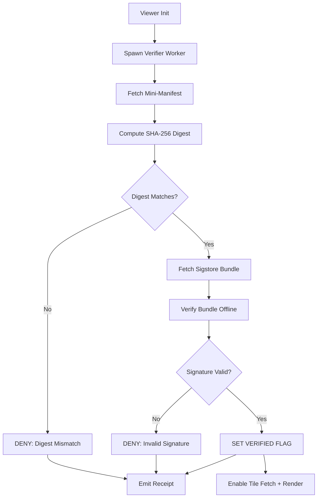

<!-- [KFM_META_BLOCK_V2]
doc_id: kfm://doc/tools/attest/tile_verification_gate
title: Workerized Tile Verification Gate (Mini-Manifest + Sigstore Bundle)
type: standard
version: v1
status: draft
owners: @bartytime4life
created: 2026-04-14
updated: 2026-04-14
policy_label: public
related: [
  ../../tools/attest/README.md,
  ../../contracts/runtime_verification/README.md,
  ../../schemas/runtime_verification/,
  ../../data/receipts/README.md,
  ../../data/proofs/README.md,
  ../../policy/README.md,
  ../../tests/e2e/runtime_proof/README.md
]
tags: [kfm, attest, runtime, tiles, verification, sigstore, manifest, fail-closed]
notes: [Browser-side verification gate for map tiles. Workerized hashing + offline bundle verification. Execution wiring and library selection remain NEEDS VERIFICATION.]
[/KFM_META_BLOCK_V2] -->

# Workerized Tile Verification Gate

Deterministic, **fail-closed runtime verification pattern** for map tiles using:

- **Mini-manifest digest verification (fast path)**
- **Sigstore / Cosign bundle verification (strong path)**
- **Worker-isolated cryptographic execution**
- **Explicit runtime gating of tile fetch + render**

> Core doctrine:  
> The viewer does not *trust tiles* — it trusts a **verified manifest + proof bundle**.

---

## 🔎 Purpose

This pattern enforces that **no high-resolution or authoritative tiles render unless:**

1. A **manifest digest matches declared expectations**
2. A **signed bundle validates provenance and integrity**
3. The runtime can emit a **finite, inspectable outcome**

---

## 🧭 Repo Fit

| Lane | Role |
|-----|------|
| `tools/attest/` | Verification helpers (digest + bundle validation) |
| `contracts/runtime_verification/` | Outcome grammar + envelope contracts |
| `data/proofs/` | Release manifests + Sigstore bundles |
| `data/receipts/` | Runtime verification receipts |
| `policy/` | Deny-by-default gating rules |
| `tests/e2e/runtime_proof/` | Runtime verification behavior |

---

## 📥 Inputs

| Input | Description |
|------|------------|
| `mini_manifest.json` | Compact tile manifest (tile URLs + root hash) |
| `expected_root_hash` | Declared SHA-256 digest |
| `sigstore_bundle.json` | Cosign bundle (offline verifiable) |
| `policy_label` | Governs allow/deny behavior |

---

## 🚫 Exclusions

- No implicit trust of CDN or tile servers  
- No background verification without surfaced outcome  
- No best-effort rendering — must **fail closed**  

---

## 🧱 Architecture



---

## ⚙️ Runtime Components

### 1. Verifier Worker

- Isolated execution context
- Performs:
  - SHA-256 digest computation
  - Sigstore bundle verification
- Emits:
  - `verified`
  - `failed`
  - structured verification payload

---

### 2. Verification Gate

Shared runtime flag:

```ts
let verified = false;
```

**Rules:**

| Condition | Behavior |
|----------|---------|
| `verified === false` | Block or downgrade tiles |
| `verified === true` | Allow full resolution |
| `verification failed` | DENY (no render) |

---

### 3. Tile Loader Wrapper

Applies gating to:

- Cesium `Resource.fetch*`
- MapLibre layer render hooks

---

## 🧪 Minimal Worker Sketch

```js
let verified = false;

async function sha256(buffer) {
  const digest = await crypto.subtle.digest('SHA-256', buffer);
  return new Uint8Array(digest);
}

self.onmessage = async ({ data }) => {
  const { manifestUrl, expectedHash, bundleUrl } = data;

  try {
    // Step 1: Fetch manifest
    const manifestResp = await fetch(manifestUrl);
    const manifestBuf  = await manifestResp.arrayBuffer();

    // Step 2: Digest verification
    const digest = await sha256(manifestBuf);

    if (!compareDigest(digest, expectedHash)) {
      return fail("DIGEST_MISMATCH");
    }

    // Step 3: Bundle verification (offline)
    const bundle = await (await fetch(bundleUrl)).json();

    const ok = await verifyBundle(bundle, manifestBuf);

    if (!ok) {
      return fail("SIGNATURE_INVALID");
    }

    verified = true;
    postMessage({ type: "verified" });

  } catch (err) {
    fail("ERROR", err);
  }
};

function fail(reason, err = null) {
  postMessage({ type: "failed", reason, err });
}
```

---

## 📦 Proof vs Receipt Separation

| Artifact | Role |
|---------|------|
| **Mini-manifest** | Declares tile set + root hash |
| **Sigstore bundle** | Cryptographic proof of integrity + provenance |
| **Receipt** | Runtime execution evidence |

---

### 🧾 Runtime Receipt (Example)

```json
{
  "type": "TileVerificationReceipt",
  "outcome": "ANSWER",
  "verified": true,
  "manifest_digest": "sha256:abc...",
  "bundle_verified": true,
  "policy_label": "public",
  "timestamp": "2026-04-14T00:00:00Z"
}
```

---

## ⚖️ Finite Outcomes

Aligned with runtime contract doctrine:

| Outcome | Meaning |
|--------|--------|
| `ANSWER` | Verified — tiles allowed |
| `DENY` | Verification failed |
| `ABSTAIN` | Missing proof or incomplete state |
| `ERROR` | Runtime failure |

---

## 🧠 Policy Hooks

Policy layer determines:

- Whether low-res fallback is allowed
- Whether stale cached manifests are acceptable
- Sensitivity rules (restricted datasets)

---

## 🚀 Performance Strategy

| Stage | Goal |
|------|------|
| Digest check | Fast (<10ms typical) |
| Signature verify | Slower, but deferred |
| Rendering | Progressive unlock |

---

### Recommended Behavior

1. Show placeholder / low LOD
2. Pass digest → unlock intermediate
3. Pass signature → unlock full resolution

---

## 🔐 Security Posture

- **Offline verification** (no trust in network at runtime)
- **Bundle contains Rekor inclusion proof**
- **No unsigned tiles rendered**
- **Fail-closed default**

---

## 🧩 Integration Targets

| Engine | Hook |
|-------|------|
| Cesium | `Resource.fetch*` override |
| MapLibre | Custom layer + repaint trigger |
| Deck.gl (future) | Loader middleware |

---

## 🧪 Test Coverage (Expected)

Located in:

```
tests/e2e/runtime_proof/tile_verification/
```

### Scenarios

- Valid manifest + valid bundle → `ANSWER`
- Digest mismatch → `DENY`
- Invalid signature → `DENY`
- Missing bundle → `ABSTAIN`
- Worker error → `ERROR`

---

## 📌 Next Steps (Recommended)

- Add schema:
  - `schemas/runtime_verification/tile_verification_receipt.schema.json`
- Implement:
  - `tools/attest/verify_bundle.ts`
- Wire into:
  - `tools/ci/` for reviewer summaries
- Add fixtures:
  - Valid + tampered manifests
- Add promotion gate linkage:
  - Ensure only verified tiles reach `published/`

---

## ❓ FAQ

### Why a mini-manifest?

- Reduces hashing cost  
- Enables fast gating before heavy verification  

---

### Why Worker isolation?

- Prevents UI blocking  
- Keeps crypto deterministic and inspectable  

---

### Why offline bundle verification?

- Removes runtime dependency on trust services  
- Makes verification reproducible and auditable  

---

## 📎 Appendix

### Digest Comparison

```js
function compareDigest(a, b) {
  if (a.length !== b.length) return false;
  for (let i = 0; i < a.length; i++) {
    if (a[i] !== b[i]) return false;
  }
  return true;
}
```

---

### Terminology

| Term | Meaning |
|-----|--------|
| Manifest | Declared tile structure |
| Bundle | Signed proof package |
| Receipt | Runtime execution record |
| Gate | Enforcement point |

---

**End of Document**