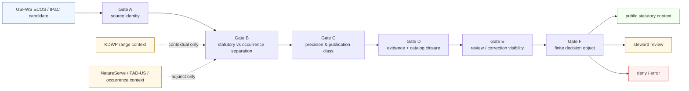

<!-- [KFM_META_BLOCK_V2]
doc_id: kfm://doc/NEEDS-VERIFICATION
title: USFWS Critical Habitat Gate
type: standard
version: v1
status: draft
owners: TODO-NEEDS-VERIFICATION
created: YYYY-MM-DD
updated: YYYY-MM-DD
policy_label: TODO-NEEDS-VERIFICATION
related: [../../../tools/validators/promotion_gate/README.md, ../../../tools/docs/README.md, ../../../tools/ci/README.md, ../../../tools/attest/README.md, ../../../contracts/README.md, ../../../schemas/README.md, ../../../policy/README.md, ../../../tests/README.md]
tags: [kfm, validators, ecology, biodiversity, usfws, critical-habitat, fail-closed]
notes: [Target path was supplied by the request. Current mounted repo evidence in this session surfaced adjacent validator and documentation lanes under tools/ and tests/, but did not directly surface a checked-out docs/tools/validators subtree. Exact owner, dates, policy label, and mounted executable companion remain NEEDS VERIFICATION.]
[/KFM_META_BLOCK_V2] -->

# USFWS Critical Habitat Gate

Review-facing, fail-closed contract for admitting U.S. Fish and Wildlife Service critical-habitat material into KFM without collapsing statutory habitat context into precise occurrence truth.


> [!IMPORTANT]
> **Status:** draft  
> **Owners:** `TODO-NEEDS-VERIFICATION`  
> **Path:** `docs/tools/validators/usfws-critical-habitat-gate.md`  
> **Repo fit:** requested `docs/`-side standard doc for a biodiversity validator surface; implementation-facing gate logic is currently documented most clearly in `tools/validators/`; canonical law remains upstream in `contracts/`, `schemas/`, `policy/`, and KFM’s ecology/source doctrine  
> **Quick jumps:** [Scope](#scope) · [Repo fit](#repo-fit) · [Current evidence snapshot](#current-evidence-snapshot) · [Source-role boundaries](#source-role-boundaries) · [Gate matrix](#gate-matrix) · [Accepted inputs](#accepted-inputs) · [Exclusions](#exclusions) · [Decision object](#decision-object) · [Publication classes](#publication-classes) · [Diagram](#diagram) · [Definition of done](#definition-of-done) · [Appendix](#appendix)

> [!WARNING]
> This file does **not** prove a mounted executable validator already exists at this exact path. It defines the review membrane a USFWS critical-habitat gate should satisfy and keeps branch-level implementation claims visibly bounded.

> [!NOTE]
> In KFM, ecology and biodiversity are not decorative overlays. They are governed lanes with explicit publication burden, geoprivacy pressure, and source-role separation requirements.

---

## Scope

KFM should admit **USFWS critical-habitat material** as one distinct source role inside the ecology lane: **federal statutory habitat context**.

This gate exists to make that role operationally inspectable.

It should ensure that:

- federal critical-habitat context keeps its **USFWS service identity**
- statutory habitat is not silently merged with **precise occurrence** or heritage-style records
- public-safe and steward-only outputs are separated **before** publication
- downstream STAC/DCAT/PROV-style closure stays aligned with the same promoted subject
- review, correction, and negative outcomes remain visible instead of implied away

This gate is **not** the ecology lane as a whole. It is one narrow membrane for one high-consequence source family.

[Back to top](#usfws-critical-habitat-gate)

---

## Repo fit

**Path:** `docs/tools/validators/usfws-critical-habitat-gate.md`  
**Role:** standard design-and-governance doc for a source-specific validator membrane.

| Direction | Surface | Why it matters |
| --- | --- | --- |
| Requested doc path | `docs/tools/validators/` | This file is written as a documentation-side contract because that is the user-specified target. |
| Implementation neighbor | [`../../../tools/validators/promotion_gate/README.md`](../../../tools/validators/promotion_gate/README.md) | Freshest surfaced validator README pattern for fail-closed gate wording, quick-jump structure, and bounded implementation claims. |
| Documentation neighbor | [`../../../tools/docs/README.md`](../../../tools/docs/README.md) | The nearest surfaced lane for documentation-tooling posture, metadata discipline, and “docs are part of the working system.” |
| Reviewer-output neighbor | [`../../../tools/ci/README.md`](../../../tools/ci/README.md) | Reviewer-facing summaries may render this gate’s outputs later, but should not own its policy meaning. |
| Attestation neighbor | [`../../../tools/attest/README.md`](../../../tools/attest/README.md) | Verification state may be displayed downstream, but signing and verification remain separate concerns. |
| Upstream authority | [`../../../contracts/README.md`](../../../contracts/README.md), [`../../../schemas/README.md`](../../../schemas/README.md), [`../../../policy/README.md`](../../../policy/README.md) | Canonical machine law should stay there, not inside this document. |
| Proof neighbor | [`../../../tests/README.md`](../../../tests/README.md) | Any mounted validator should eventually gain deterministic pass/fail proof without this doc pretending those tests already exist. |

### What belongs here

- source-role law for USFWS critical habitat inside KFM
- publication-class rules for public-safe vs steward-only ecology outputs
- fail-closed gate responsibilities
- minimum decision/evidence expectations for this source family
- reviewer-facing cautions that prevent statutory habitat from being confused with occurrence truth

### What does **not** belong here

- direct publication logic
- free-standing policy authority
- occurrence harvesting for every biodiversity source
- hard claims about mounted validators, workflow wiring, or active merge rules not surfaced in this session

[Back to top](#usfws-critical-habitat-gate)

---

## Current evidence snapshot

| Evidence item | Status | How this document uses it |
| --- | --- | --- |
| USFWS ECOS critical habitat is the federal statutory and critical-habitat anchor in the ecology lane | **CONFIRMED** | Grounds the gate’s core subject and source identity requirement. |
| KDWP range maps are Kansas statutory/range context and should not be treated as precise occurrence records | **CONFIRMED** | Grounds semantic separation and contextual-adjunct rules. |
| Rare-species and exact-location biodiversity work may require geoprivacy, generalization, withholding, and explicit publication classes | **CONFIRMED** | Grounds the publication-class and sensitivity sections. |
| KFM validator docs use fail-closed, evidence-first, bounded-implementation language | **CONFIRMED via adjacent docs** | Grounds presentation style and boundary discipline. |
| Mounted executable validator for this exact gate | **UNKNOWN / NEEDS VERIFICATION** | Prevents invented path, command, and workflow claims. |
| Checked-out `docs/tools/validators/` subtree on the active branch | **UNKNOWN / NEEDS VERIFICATION** | Keeps path-fit language cautious rather than theatrical. |

[Back to top](#usfws-critical-habitat-gate)

---

## Source-role boundaries

A useful gate here is less about “is the geometry valid?” and more about **what kind of thing the geometry is allowed to mean**.

| Source family | Role in KFM | Must **not** be mistaken for |
| --- | --- | --- |
| **USFWS ECOS / IPaC critical habitat** | Federal statutory and critical-habitat anchor | Precise occurrence, field observation, or a generic “biodiversity layer” with no service identity |
| **KDWP range maps and T&E/SINC context** | Kansas statutory/range context | Federal critical-habitat determination or precise point-level occurrence |
| **NatureServe contextual data** | Review-sensitive contextual layer | Default public-safe release layer with hidden licensing or precision assumptions |
| **GBIF / iNaturalist / other occurrence feeds** | Corroborative or exploratory occurrence context | Statutory habitat, regulatory designation, or default public-safe precise release |
| **PAD-US / stewardship polygons** | Protected-area and stewardship context | Species evidence or habitat designation by itself |

### Boundary rule

A candidate should fail if it silently merges these roles into one geometry class, one trust label, or one publication class.

[Back to top](#usfws-critical-habitat-gate)

---

## Gate matrix

This document uses a compact gate sequence on purpose. The goal is legibility, not ceremonial complexity.

| Gate | Protects | Fails when | Expected consequence |
| --- | --- | --- | --- |
| **A — Federal source identity** | The candidate is actually carrying USFWS critical-habitat context, not anonymous biodiversity geometry | source identity, service identity, or statutory role is missing or flattened | fail closed to review or denial |
| **B — Statutory vs occurrence separation** | Habitat context stays distinct from occurrence or heritage precision | critical habitat, occurrence, range map, and stewardship context are blended into one semantic layer | fail closed |
| **C — Precision and sensitivity class** | Public outputs stay policy-safe | candidate exposes precise or review-sensitive location detail without explicit public-safe treatment | hold, deny, or quarantine-like outcome |
| **D — Closure and evidence** | The outward object can be reconstructed and traced | source/evidence/catalog references do not resolve to the same promoted subject and scope | fail closed |
| **E — Review and correction visibility** | Supersession and steward obligations remain visible | a changed or replaced habitat package lacks comparison, correction, or stewardship context where required | hold or deny |
| **F — Decision emission** | The gate ends in a finite machine-readable result | output is free-form, ambiguous, or reviewer-only prose | error |

> [!TIP]
> **CONFIRMED:** KFM requires fail-closed behavior, typed trust objects, and visible negative paths.  
> **NEEDS VERIFICATION:** the exact mounted enum tokens for this gate’s result grammar.

### Minimum decision posture

The gate should end in one finite decision object, not a log scrape and not a Markdown-only summary.

A safe starter reading is:

```text
allow to next review stage
hold for steward review
deny
error
```

Treat those as **descriptive outcomes**, not as a claim that the checked-out branch already uses those exact literal tokens.

[Back to top](#usfws-critical-habitat-gate)

---

## Accepted inputs

| Input class | Minimum expectation | Why it belongs here |
| --- | --- | --- |
| Source contract / descriptor | identity, access mode, semantics, rights/sensitivity, validation, lineage | KFM source onboarding is contract-first, not download-first |
| Candidate habitat package | raw fetch, normalized vector, dataset candidate, or release candidate | the gate must inspect the actual subject under review |
| Catalog closure refs | STAC / DCAT / PROV refs or equivalent outward closure objects | statutory habitat context should not drift across outward carriers |
| Evidence support | evidence bundle or equivalent support object, including scope and negative-path trace | reviewers need reconstructable support, not geometry alone |
| Sensitivity/publication context | explicit public-safe vs steward-only intent | biodiversity lanes are burdened by precision and geoprivacy |
| Prior release or correction refs | optional but strongly preferred on superseding changes | prevents silent replacement of ecology context layers |
| Adjunct context inputs | KDWP, NatureServe, PAD-US, or occurrence-derived context | these may enrich review, but they must not replace the federal anchor |

### Accepted payload shape, conceptually

The gate should be able to answer:

1. **What is this source?**
2. **What does it mean?**
3. **What can be shown publicly?**
4. **What stays review-bound?**
5. **Can the outward artifact be reconstructed and corrected later?**

[Back to top](#usfws-critical-habitat-gate)

---

## Exclusions

| Does **not** belong in this gate | Put it here instead | Why |
| --- | --- | --- |
| General biodiversity ingest orchestration | broader ecology/source pipelines | this file is a narrow source-family membrane |
| Precise occurrence publication | steward-only biodiversity lanes | precise occurrence and statutory habitat are different trust objects |
| Direct publication or release promotion | governed publication / release lanes | this gate decides readiness, not publication |
| Canonical schema authorship | `contracts/` and `schemas/` | this doc can point at machine law, not replace it |
| Policy source ownership | `policy/` | deny/hold law belongs in policy surfaces |
| Reviewer summary rendering | `tools/ci/` | renderer outputs stay downstream and secondary |
| Attestation creation/verification | `tools/attest/` | trust display is not cryptographic authority |
| Treating KDWP range maps as federal critical habitat | nowhere | that is a semantic error, not a valid shortcut |

[Back to top](#usfws-critical-habitat-gate)

---

## Decision object

This doc does **not** invent the final mounted schema. It does name the minimum shape the decision should preserve.

| Field family | Minimum content |
| --- | --- |
| Subject identity | subject ref, source ref, source role, release or candidate ref |
| Semantic class | `federal statutory habitat context` vs other contextual classes |
| Publication class | public-safe, generalized, steward-only, or non-public reference |
| Decision result | one finite machine outcome |
| Reason / obligation codes | explicit negative-path or review obligations |
| Evidence linkage | evidence bundle ref plus any scoped supporting refs |
| Catalog linkage | outward carrier refs that resolve to the same subject |
| Audit / review linkage | audit ref, review ref, or steward queue reference where applicable |
| Correction linkage | optional supersession, replacement, rollback, or withdrawal refs |

### Illustrative shape

```json
{
  "object_type": "DecisionEnvelope",
  "subject_ref": "kfm://dataset/NEEDS-VERIFICATION",
  "source_role": "federal-statutory-critical-habitat",
  "publication_class": "public_statutory_context",
  "result": "NEEDS-VERIFICATION",
  "reason_codes": [],
  "obligations": [
    "preserve_usfws_service_identity",
    "keep_statutory_habitat_separate_from_precise_occurrence"
  ],
  "audit_ref": "kfm://audit/NEEDS-VERIFICATION"
}
```

> [!NOTE]
> The example above is **illustrative only**. It is useful as a review aid, not as proof of a mounted schema or final field vocabulary.

[Back to top](#usfws-critical-habitat-gate)

---

## Publication classes

KFM’s ecology lane needs explicit publication classes because not every biodiversity-related geometry belongs on the same public surface.

| Publication class | Public visibility | Typical content |
| --- | --- | --- |
| **Public statutory habitat context** | Yes | Federal critical-habitat polygons and accompanying listing/service identity that are safe for ordinary public surfaces |
| **Public generalized context** | Yes, with visible generalization | Coarsened or intentionally generalized supporting context where precision would otherwise be unsafe |
| **Steward-only precise** | No public default | Review-bearing exact-location or sensitive context needing steward access |
| **Non-public reference** | No public default | Licensed, proprietary, or otherwise non-public support material |

### Default rule

When uncertainty exists, choose the **narrower** public class or route the candidate into a steward-only path rather than smoothing ambiguity away.

[Back to top](#usfws-critical-habitat-gate)

---

## Diagram



No direct publish shortcut belongs between source intake and the decision object.

[Back to top](#usfws-critical-habitat-gate)

---

## Definition of done

Use this list when turning this doc into a mounted validator contract or revising it later.

- [ ] the gate is explicitly named and scoped to **USFWS critical habitat**
- [ ] source-role separation from KDWP range context, occurrence feeds, NatureServe context, and PAD-US is explicit
- [ ] the nearest authoritative schema / contract surfaces are linked
- [ ] public-safe vs steward-only classes are explicit
- [ ] at least one representative success path exists
- [ ] at least one representative precise-location or sensitivity failure path exists
- [ ] at least one malformed-source or malformed-closure path exists
- [ ] the decision object is machine-readable
- [ ] negative outcomes are visible and finite
- [ ] reviewer artifacts stay secondary to the underlying machine objects
- [ ] any local command shown in this doc is real for the checked-out branch
- [ ] this doc is updated when the lane shape or authority surfaces change materially

[Back to top](#usfws-critical-habitat-gate)

---

## FAQ

### Why is this not just part of the general promotion gate?

Because this gate carries ecology-specific burden that the generic promotion surface should not have to guess: statutory-vs-occurrence separation, biodiversity geoprivacy, and public-safe class assignment.

### Why not just publish the federal polygons as-is?

Because KFM still requires source identity, closure, review visibility, and correction posture. “Official source” is necessary, not sufficient.

### Why does this document talk so much about non-USFWS sources?

Because source-role confusion is the main failure mode here. KDWP range maps, NatureServe context, PAD-US stewardship context, and occurrence feeds are valuable, but they are not the same thing as federal critical habitat.

### Does a passing gate publish anything?

No. A pass here proves readiness for the next governed step. Publication remains downstream.

### Why is this file under `docs/` instead of `tools/validators/`?

Because the request targeted a documentation path. This file is therefore written as a documentation-side contract and review guide, not as proof that the implementation lane also lives under `docs/`.

[Back to top](#usfws-critical-habitat-gate)

---

## Appendix

<details>
<summary><strong>Illustrative review sequence</strong></summary>

```text
1. Confirm the candidate is sourced and labeled as USFWS critical habitat.
2. Confirm the candidate is not silently carrying precise occurrence semantics.
3. Assign the narrowest truthful publication class.
4. Confirm evidence and outward catalog closure resolve to the same subject.
5. Surface any steward obligations or correction links.
6. Emit one finite machine-readable decision.
```

</details>

<details>
<summary><strong>First local verification pass before merge</strong></summary>

1. confirm whether `docs/tools/validators/` already exists on the checked-out branch
2. confirm whether a mounted implementation gate already exists under `tools/validators/`
3. verify owners, policy label, and document record metadata
4. verify the nearest actual schema / contract paths before final link cleanup
5. verify whether reviewer outputs for this lane belong in `tools/ci/`, `tests/ci/`, or both
6. verify whether ecology-specific fixtures already live under a shared test surface
7. keep any unresolved path or workflow uncertainty visible instead of harmonizing it away
8. update adjacent docs if this gate becomes executable

</details>

<details>
<summary><strong>One-line posture statement</strong></summary>

USFWS critical-habitat material is admitted into KFM only as explicitly labeled federal statutory habitat context, with public-safe classing, source-role separation, and fail-closed review visibility.
</details>
