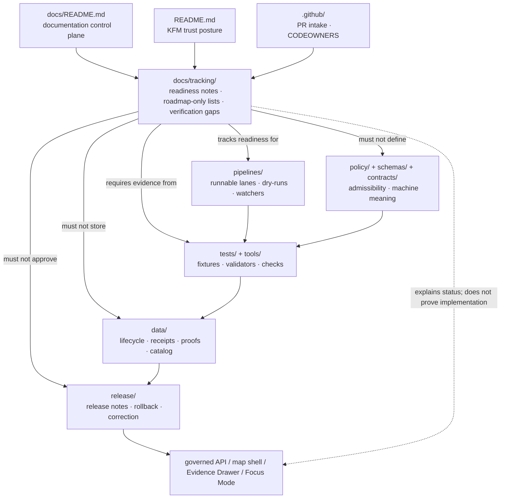

<!-- [KFM_META_BLOCK_V2]
doc_id: kfm://doc/NEEDS_VERIFICATION-docs-tracking-readme
title: Tracking Docs README
type: standard
version: v1
status: draft
owners: @bartytime4life
created: NEEDS_VERIFICATION
updated: 2026-04-30
policy_label: NEEDS_VERIFICATION
related: [../README.md, ../../README.md, ../../data/README.md, ../../pipelines/README.md, ../../release/README.md, pipeline-roadmap-only-lanes.md]
tags: [kfm, docs, tracking, roadmap, verification, governance]
notes: [doc_id created date and internal policy label require registry verification; owner is broad CODEOWNERS fallback until specialized ownership is confirmed]
[/KFM_META_BLOCK_V2] -->

<a id="top"></a>

# Tracking Docs README

Roadmap, verification, and status-tracking notes for KFM work that is not yet safe to describe as implemented.


> [!IMPORTANT]
> **Impact block**
>
> | Field | Value |
> |---|---|
> | **Status** | `experimental` tracking surface; `draft` README |
> | **Path** | `docs/tracking/README.md` |
> | **Owners** | `@bartytime4life` as broad CODEOWNERS fallback; specialized tracking ownership is `NEEDS_VERIFICATION` |
> | **Authority class** | Documentation-control tracking surface |
> | **Evidence mode** | `PUBLIC_MAIN_INSPECTED` + `LOCAL_WORKSPACE_PDF_CORPUS_ONLY` |
> | **Public posture** | This directory may track unresolved work, but it must not publish, prove, approve, or release it |
> | **Quick jumps** | [Scope](#scope) · [Repo fit](#repo-fit) · [Inputs](#inputs) · [Exclusions](#exclusions) · [Directory tree](#directory-tree) · [How to work here](#how-to-work-here) · [Diagram](#diagram) · [Tracking tables](#tracking-tables) · [Definition of done](#definition-of-done) · [FAQ](#faq) · [Appendix](#appendix) |

> [!WARNING]
> A tracking note is not implementation evidence. Do not upgrade a pipeline, source, schema, policy, UI surface, API route, proof object, or release path from `ROADMAP_ONLY`, `PROPOSED`, or `NEEDS_VERIFICATION` to `CONFIRMED` unless current repository evidence, tests, generated artifacts, logs, receipts, proofs, or release records support the claim.

---

## Scope

`docs/tracking/` is a small documentation-control lane for **visible unresolved work**.

It exists to keep roadmap-only lanes, verification gaps, placeholder exits, and status transitions inspectable without letting them masquerade as implementation. In KFM terms, this directory helps maintainers see where an idea, lane, or pipeline is waiting for the evidence needed to move into a stronger state.

This directory is especially useful for tracking:

- pipeline lanes that are named but not yet runnable;
- documentation placeholders that need verified commands or paths;
- exit criteria for roadmap-only work;
- status changes that need downstream updates in `pipelines/`, `tests/`, `tools/`, `data/`, `policy/`, `schemas/`, or `release/`;
- small reviewer-facing matrices that prevent “future work” from becoming accidental canon.

### One-screen rule

`docs/tracking/` may track readiness. It must not create readiness.

| Allowed posture | Blocked posture |
|---|---|
| Record that a lane is roadmap-only until entrypoints and tests exist. | Claim a lane is active because it appears in a tracker. |
| List exit criteria and owning surfaces. | Store receipts, proofs, release manifests, raw outputs, or validator results here as proof substitutes. |
| Point to the directory that owns implementation evidence. | Replace `pipelines/`, `tests/`, `tools/`, `data/`, `policy/`, `schemas/`, or `release/`. |
| Keep unresolved items visible. | Smooth uncertainty into confident implementation language. |

[Back to top](#top)

---

## Repo fit

`docs/tracking/` sits under the documentation control plane. It is downstream of doctrine and adjacent to implementation-owning surfaces, but it should remain lightweight.

| Relationship | Target | Status | Role |
|---|---|---:|---|
| Parent documentation hub | [`../README.md`](../README.md) | `CONFIRMED_PUBLIC_MAIN` / active checkout `NEEDS_VERIFICATION` | Defines documentation posture, truth labels, inputs, exclusions, and review discipline. |
| Root project landing | [`../../README.md`](../../README.md) | `CONFIRMED_PUBLIC_MAIN` / active checkout `NEEDS_VERIFICATION` | Defines KFM identity, trust path, inspectable claims, and map/AI boundaries. |
| This directory | [`./README.md`](./README.md) | `PROPOSED_REVISION` | Orients tracking notes and prevents roadmap-only records from being overread. |
| Roadmap-only tracker | [`./pipeline-roadmap-only-lanes.md`](./pipeline-roadmap-only-lanes.md) | `CONFIRMED_PUBLIC_MAIN` / content quality `NEEDS_REVIEW` | Lists pipeline lanes intentionally held as roadmap-only until entrypoints, fixtures/tests, and verified README paths exist. |
| Pipeline owners | [`../../pipelines/README.md`](../../pipelines/README.md) | `CONFIRMED_PUBLIC_MAIN` / active checkout `NEEDS_VERIFICATION` | Owns pipeline lifecycle rules, minimum pipeline contract, dry-runs, gates, and runner expectations. |
| Data lifecycle | [`../../data/README.md`](../../data/README.md) | `CONFIRMED_PUBLIC_MAIN` / active checkout `NEEDS_VERIFICATION` | Owns lifecycle stages, source registry, raw/work/quarantine/processed/catalog/triplet/published surfaces, receipts, and proofs. |
| Tests and fixtures | [`../../tests/README.md`](../../tests/README.md) | `CONFIRMED_PUBLIC_MAIN` / active checkout `NEEDS_VERIFICATION` | Owns executable verification and fixture evidence. |
| Tools and validators | [`../../tools/README.md`](../../tools/README.md) | `CONFIRMED_PUBLIC_MAIN` / active checkout `NEEDS_VERIFICATION` | Owns reusable validation and CI helper commands. |
| Release surface | [`../../release/README.md`](../../release/README.md) | `CONFIRMED_PUBLIC_MAIN` / active checkout `NEEDS_VERIFICATION` | Owns release-adjacent evidence, manifests, correction, withdrawal, and rollback conventions where adopted. |
| Review routing | [`../../.github/CODEOWNERS`](../../.github/CODEOWNERS) | `CONFIRMED_PUBLIC_MAIN` fallback owner | Routes broad documentation ownership until narrower teams are confirmed. |
| PR intake | [`../../.github/PULL_REQUEST_TEMPLATE.md`](../../.github/PULL_REQUEST_TEMPLATE.md) | `CONFIRMED_PUBLIC_MAIN` | Requires truth labels, affected surfaces, validation, risk, rollback, and evidence references. |

> [!CAUTION]
> `CONFIRMED_PUBLIC_MAIN` means the public GitHub `main` branch was inspectable during drafting. It does **not** prove local branch parity, platform enforcement, branch protection, required checks, runtime behavior, or generated artifact state.

[Back to top](#top)

---

## Inputs

Tracking records belong here when they make unresolved work safer to review.

| Accepted input | Belongs here when… | Required posture |
|---|---|---|
| Roadmap-only lane list | A named pipeline, watcher, domain slice, or validator path exists as an intention but lacks runnable entrypoints or tests. | Mark `ROADMAP_ONLY` and include exit criteria. |
| Verification backlog note | A concrete check is required before a claim can become stronger. | Mark `NEEDS_VERIFICATION`; name the owning surface. |
| Placeholder exit tracker | A README or lane has placeholder commands, owners, badges, or paths that must be replaced. | Link to the owning file and the required proof. |
| Status transition note | A roadmap item moves toward active implementation. | Link to tests, fixtures, validator output, receipts, or PR evidence. |
| Lightweight readiness matrix | A reviewer needs to compare multiple lanes without reading every domain doc. | Keep columns compact and evidence-oriented. |
| Follow-up checklist | A PR needs visible completion conditions before the tracker can be closed. | Include rollback/correction effects. |

### Good tracking entries answer

1. What is being tracked?
2. Why is it not yet `CONFIRMED`?
3. Which file or surface owns the real implementation?
4. Which evidence would close or upgrade the item?
5. What should be updated when the item changes state?

[Back to top](#top)

---

## Exclusions

Do not store trust-bearing artifacts in `docs/tracking/`.

| Do not put here | Use instead | Why |
|---|---|---|
| RAW, WORK, QUARANTINE, PROCESSED, CATALOG, TRIPLET, or PUBLISHED data | `../../data/` lifecycle homes after path verification | Tracking notes are not lifecycle storage. |
| Receipts, proof packs, attestations, release manifests, rollback records, or correction notices | `../../data/receipts/`, `../../data/proofs/`, `../../release/`, or repo-confirmed homes | These are evidence-bearing objects, not roadmap prose. |
| Validator implementation or complex scripts | `../../tools/` and `../../tests/` | Keeps tracking docs reviewable and non-executable. |
| Policy semantics, rights rules, or sensitivity logic | `../../policy/` plus policy tests | Policy must be enforceable and testable. |
| Machine schemas or canonical contracts | `../../schemas/` and/or `../../contracts/` after schema-home ADR | Prevents prose from becoming hidden machine authority. |
| Secrets, credentials, private endpoints, tokens, or model keys | Never commit; use approved secret management | Prevents exposure. |
| Exact sensitive locations, living-person data, DNA/genomics, private landowner exposure, or steward-controlled details | Restricted steward/review path | KFM fails closed on high-risk exposure. |
| Free-form model output as status proof | Governed AI receipts and citation validation path | AI is interpretive and subordinate to EvidenceBundle, policy, review, and release state. |
| CI logs or platform-state screenshots without retention policy | Workflow artifacts, proof packs, or platform-state docs where verified | Tracking docs may link to evidence; they should not become the evidence vault. |

[Back to top](#top)

---

## Directory tree

Current expected shape:

```text
docs/tracking/
├── README.md
└── pipeline-roadmap-only-lanes.md
```

### Companion tracker

`pipeline-roadmap-only-lanes.md` currently identifies these pipeline lanes as roadmap-only until runnable entrypoints and tests are added:

| Lane | Tracked state | Minimum exit signal |
|---|---:|---|
| `pipelines/habitat_layer_build/` | `ROADMAP_ONLY` | Runnable entrypoint + lane-local fixtures/tests or validator wiring. |
| `pipelines/kansas_biodiversity_etl/dedupe/` | `ROADMAP_ONLY` | Runnable entrypoint + lane-local fixtures/tests or validator wiring. |
| `pipelines/kansas_biodiversity_etl/normalize/` | `ROADMAP_ONLY` | Runnable entrypoint + lane-local fixtures/tests or validator wiring. |
| `pipelines/usgs-gage-watch/` | `ROADMAP_ONLY` | Runnable entrypoint + lane-local fixtures/tests or validator wiring. |
| `pipelines/watchers/kansas_flora_watch/` | `ROADMAP_ONLY` | Runnable entrypoint + lane-local fixtures/tests or validator wiring. |
| `pipelines/watchers/usda_plants_flora_no_network_slice/` | `ROADMAP_ONLY` | Runnable entrypoint + lane-local fixtures/tests or validator wiring. |
| `pipelines/watchers/soil_air_quality/` | `ROADMAP_ONLY` | Runnable entrypoint + lane-local fixtures/tests or validator wiring. |

The shared exit criteria are:

1. Add minimal runnable entrypoint(s).
2. Add lane-local fixtures/tests or validator wiring.
3. Replace README placeholders with verified commands and paths.

> [!NOTE]
> This README does not upgrade those lanes. It only makes their tracking surface readable and harder to overclaim.

[Back to top](#top)

---

## How to work here

Use this directory for short, explicit tracking records.

### 1. Inspect before editing

Run read-only checks from the repository root:

```bash
git status --short
git branch --show-current
git rev-parse --show-toplevel

find docs/tracking -maxdepth 2 -type f | sort
sed -n '1,220p' docs/tracking/pipeline-roadmap-only-lanes.md
```

### 2. Check owning surfaces

A tracker should point to the surface that owns the real work.

```bash
find pipelines tests tools data policy schemas contracts release -maxdepth 3 -type f 2>/dev/null | sort | sed -n '1,260p'
```

### 3. Search for overclaims

Use this before changing a tracker from `ROADMAP_ONLY` or `NEEDS_VERIFICATION`:

```bash
grep -RInE 'CONFIRMED|active|implemented|runnable|published|released|production|enforced' docs/tracking
grep -RInE 'ROADMAP_ONLY|NEEDS_VERIFICATION|UNKNOWN|PROPOSED|BLOCKED' docs/tracking
```

### 4. Close or upgrade only with evidence

A tracking item may move to a stronger state only when the owning surface has supporting evidence, such as:

- a runnable entrypoint;
- lane-local fixtures or tests;
- validator wiring;
- a source descriptor or fixture record;
- a receipt, validation report, proof pack, release manifest, or rollback reference;
- a PR with truth labels, affected surfaces, validation commands, risk, and rollback notes.

[Back to top](#top)

---

## Diagram



[Back to top](#top)

---

## Tracking tables

### Status vocabulary

| Label | Use in `docs/tracking/` | Upgrade requires |
|---|---|---|
| `ROADMAP_ONLY` | Named work is intentional but not runnable or verified. | Entrypoint, fixtures/tests or validator wiring, and README paths/commands verified. |
| `PROPOSED` | A recommended tracker, file, lane, or status convention not verified as present. | Active checkout evidence or approved PR. |
| `NEEDS_VERIFICATION` | A specific check is required before relying on the claim. | The named check is run and linked or summarized with evidence. |
| `UNKNOWN` | Current evidence is too weak to classify. | Repository inspection or source/artifact evidence. |
| `BLOCKED` | Work cannot proceed safely because rights, sensitivity, source role, policy, schema, or test evidence is missing. | Blocking reason resolved or documented as deferred/denied. |
| `ACTIVE_TRACKING` | Tracker is current and intentionally maintained. | Owner, cadence, and owning surfaces confirmed. |
| `SUPERSEDED` | A newer tracker or owning surface replaced this record. | Link to replacement and state whether old content is retained for lineage. |
| `CLOSED` | Tracking entry is resolved. | Link to PR, tests, generated artifact, receipt/proof, release/correction record, or deletion rationale. |

### Tracker quality checklist

| A good tracker includes | Why |
|---|---|
| Owning surface | Prevents `docs/tracking/` from becoming implementation authority. |
| Truth label | Keeps uncertainty visible. |
| Exit criteria | Makes closure reviewable. |
| Evidence needed | Prevents vague “todo” drift. |
| Sensitivity / rights note when relevant | Keeps fail-closed posture visible. |
| Rollback or correction effect | Preserves reversibility. |

[Back to top](#top)

---

## Definition of done

A change to `docs/tracking/` is ready for review when:

- [ ] The file has a clear role: tracker, backlog note, status matrix, or exit-criteria note.
- [ ] The owner is identified or explicitly marked `NEEDS_VERIFICATION`.
- [ ] Every tracked item points to its owning implementation or evidence surface.
- [ ] `ROADMAP_ONLY`, `PROPOSED`, `UNKNOWN`, and `NEEDS_VERIFICATION` are not softened into implementation claims.
- [ ] No raw data, receipts, proof packs, manifests, release records, secrets, logs, or sensitive exact locations were added here.
- [ ] Relative links work from `docs/tracking/`.
- [ ] If a tracker closes, the closing evidence is linked or described.
- [ ] Affected surfaces are listed in the PR.
- [ ] Rollback is obvious: restore the previous tracker entry or revert the status transition.
- [ ] Adjacent docs are updated when the tracked state changes.

[Back to top](#top)

---

## FAQ

### Is `docs/tracking/` a backlog?

Only in the narrow documentation-control sense. It may hold tracking notes and exit criteria, but durable issue management, implementation evidence, tests, artifacts, and release state belong to their owning surfaces.

### Can a roadmap-only lane be listed here before it exists in `pipelines/`?

Yes, when it is explicitly marked `ROADMAP_ONLY` and has exit criteria. The tracker must not imply the lane is runnable, tested, or release-ready.

### Does a closed tracker prove a release happened?

No. A closed tracker should link to release evidence when release happened. The tracker itself is not a release manifest, proof pack, or correction record.

### Where should generated receipts or proofs go?

Use the verified `data/receipts/`, `data/proofs/`, `release/`, or repo-native evidence homes. `docs/tracking/` may link to them after confirming paths and retention rules.

### What should happen when a tracker mentions sensitive material?

Keep the public tracking note generalized. Do not include exact sensitive locations, private identifiers, restricted source details, credentials, private endpoints, or steward-controlled evidence.

[Back to top](#top)

---

## Appendix

<details>
<summary>Tracking record template</summary>

```markdown
# <Tracked item>

One-line purpose.

> [!IMPORTANT]
> **Status:** `ROADMAP_ONLY | PROPOSED | NEEDS_VERIFICATION | BLOCKED | ACTIVE_TRACKING | CLOSED`
> **Owner:** `<owner or NEEDS_VERIFICATION>`
> **Owning surface:** `<relative path>`
> **Evidence needed:** `<specific proof required>`
> **Last reviewed:** `YYYY-MM-DD or NEEDS_VERIFICATION`

## Why this is tracked

## Current state

## Exit criteria

- [ ] Runnable entrypoint or equivalent owning-surface evidence.
- [ ] Lane-local fixture/test or validator wiring.
- [ ] README commands and paths verified.
- [ ] No public raw/work/quarantine path.
- [ ] Rollback or correction effect documented.

## Evidence links

## Open verification gaps

## Status history
```

</details>

<details>
<summary>Review prompts</summary>

Use these questions during review:

1. Is this tracking note making a status claim or proving a status claim?
2. Which owning surface would provide the evidence?
3. What would make the status stronger?
4. What would require quarantine, denial, redaction, generalization, or abstention?
5. What adjacent docs or trackers must change if this item moves state?
6. Could a reader mistake the tracker for a release, proof object, test result, or policy decision?

</details>

[Back to top](#top)