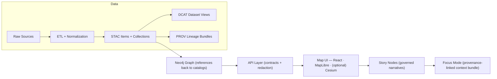

# 🧭🗺️ KFM UI — `docs/ui/` (Web Client Guide)


> KFM’s UI is a **modular React/TypeScript web app** that renders maps, timelines, stories, and an evidence-backed AI assistant — while making provenance *visible and clickable* (“the map behind the map”).  [oai_citation:0‡📚 Kansas Frontier Matrix (KFM) – Expanded Technical & Design Guide.pdf](file-service://file-Tjmzn5F3sT5VNvVFhqj1Vo)  [oai_citation:1‡Kansas Frontier Matrix (KFM) – Comprehensive Architecture, Features, and Design.pdf](file-service://file-Qj23Z329hf1Q1WD86hXYfL)

---

## ✨ What lives in this folder?

This folder documents the **front-end UI architecture, patterns, and contribution workflow**:
- 🧩 component + feature modularity
- 🗺️ map + timeline + layer controls
- 📚 Story Nodes (Markdown + JSON)
- 🤖 Focus Mode (AI assistant) UI integration
- 🧾 provenance UX (citations, metadata panels, lineage)
- ♿ accessibility + ethical design expectations

The UI is designed to be **decoupled from backend internals** and communicates **only via governed APIs** (REST/GraphQL).  [oai_citation:2‡Kansas Frontier Matrix (KFM) – Comprehensive UI System Overview (Technical Architecture Guide).pdf](file-service://file-MbEYbsLWBmpXVYXVF79c38)  [oai_citation:3‡📚 Kansas Frontier Matrix (KFM) – Expanded Technical & Design Guide.pdf](file-service://file-Tjmzn5F3sT5VNvVFhqj1Vo)

---

## 🧠 UI in one minute (mental model)

- The UI is **the last mile**: it sits at the end of the pipeline and assumes that by the time data reaches the browser it already carries **metadata + governance**.  [oai_citation:4‡Kansas Frontier Matrix (KFM) – Comprehensive UI System Overview (Technical Architecture Guide).pdf](file-service://file-MbEYbsLWBmpXVYXVF79c38)
- UI state is **shareable**: routing + **bookmarkable URLs** represent map/timeline/story state so a view can be reproduced.  [oai_citation:5‡Kansas Frontier Matrix (KFM) – Comprehensive UI System Overview (Technical Architecture Guide).pdf](file-service://file-MbEYbsLWBmpXVYXVF79c38)
- A **global state store** (Redux or Context) keeps map, timeline, story panel, charts, etc. in sync.  [oai_citation:6‡Kansas Frontier Matrix (KFM) – Comprehensive UI System Overview (Technical Architecture Guide).pdf](file-service://file-MbEYbsLWBmpXVYXVF79c38)
- Focus Mode is **opt-in**, **advisory-only**, and always returns **citations** you can click.  [oai_citation:7‡Kansas Frontier Matrix (KFM) – Comprehensive Architecture, Features, and Design.pdf](file-service://file-Qj23Z329hf1Q1WD86hXYfL)  [oai_citation:8‡Kansas Frontier Matrix (KFM) – Comprehensive UI System Overview (Technical Architecture Guide).pdf](file-service://file-MbEYbsLWBmpXVYXVF79c38)

---

## 🧱 Architecture at a glance (pipeline → UI)



*(This mirrors the project’s “boundary artifacts” philosophy: each stage produces artifacts that downstream layers consume.)*  [oai_citation:9‡MARKDOWN_GUIDE_v13.md.gdoc](file-service://file-UYVruFXfueR8veHMUKeugU)

---

## 🗺️ Key UI surfaces (what users touch)

### 1) Map Viewer (2D + 3D)
- **2D**: MapLibre GL JS for high-performance vector/raster rendering.  [oai_citation:10‡📚 Kansas Frontier Matrix (KFM) – Expanded Technical & Design Guide.pdf](file-service://file-Tjmzn5F3sT5VNvVFhqj1Vo)  [oai_citation:11‡Kansas Frontier Matrix (KFM) – Comprehensive Platform Overview and Roadmap.pdf](file-service://file-J9i6fUc35zPWB2U62zUnEN)  
- **3D**: CesiumJS for optional globe/terrain and story tours (experimental transitions between 2D/3D).  [oai_citation:12‡Kansas Frontier Matrix (KFM) – Comprehensive Technical Documentation.pdf](file-service://file-VgLA7nv34M5muqZ5MQxBLG)  [oai_citation:13‡📚 Kansas Frontier Matrix (KFM) – Expanded Technical & Design Guide.pdf](file-service://file-Tjmzn5F3sT5VNvVFhqj1Vo)

### 2) Timeline (time as a first-class control)
- A timeline slider filters/animates temporal layers (3D space + time “4D mapping”).  [oai_citation:14‡Kansas Frontier Matrix (KFM) – Comprehensive Technical Documentation.pdf](file-service://file-VgLA7nv34M5muqZ5MQxBLG)  
- Timeline + map state stay synced; time filters flow into API requests.  [oai_citation:15‡Kansas Frontier Matrix (KFM) – Comprehensive Architecture, Features, and Design.pdf](file-service://file-Qj23Z329hf1Q1WD86hXYfL)  
- Implementation often uses D3 for custom controls/visualizations.  [oai_citation:16‡Kansas Frontier Matrix (KFM) – Comprehensive UI System Overview (Technical Architecture Guide).pdf](file-service://file-MbEYbsLWBmpXVYXVF79c38)

### 3) Layer Controls + Legends + “What am I looking at?” panels
- Layers grouped by theme; toggle visibility, opacity; legends.  [oai_citation:17‡Kansas Frontier Matrix (KFM) – Comprehensive Architecture, Features, and Design.pdf](file-service://file-Qj23Z329hf1Q1WD86hXYfL)  
- Each layer has an **info/details** affordance that reveals metadata + citations (source, updated date, etc.).  [oai_citation:18‡Kansas Frontier Matrix (KFM) – Comprehensive Architecture, Features, and Design.pdf](file-service://file-Qj23Z329hf1Q1WD86hXYfL)  
- UI can show STAC/DCAT and PROV lineage for credibility and auditability.  [oai_citation:19‡📚 Kansas Frontier Matrix (KFM) – Expanded Technical & Design Guide.pdf](file-service://file-Tjmzn5F3sT5VNvVFhqj1Vo)

### 4) Story Nodes (interactive narratives)
- A Story Node is authored as **two files**:
  - `story.md` (narrative, images, citations)
  - `story.json` (map/timeline “storyboard” actions per section)
- The UI reads JSON and executes transitions (pan/zoom/layers/time) while showing Markdown content.  [oai_citation:20‡Kansas Frontier Matrix (KFM) – Comprehensive UI System Overview (Technical Architecture Guide).pdf](file-service://file-MbEYbsLWBmpXVYXVF79c38)  [oai_citation:21‡Kansas Frontier Matrix (KFM) – Comprehensive Technical Documentation.pdf](file-service://file-VgLA7nv34M5muqZ5MQxBLG)

### 5) Focus Mode (AI Assistant panel)
- UI opens a chat-like panel; sends a user question plus **context** (map view, active layers, timeline, etc.).  [oai_citation:22‡Kansas Frontier Matrix (KFM) – Comprehensive UI System Overview (Technical Architecture Guide).pdf](file-service://file-MbEYbsLWBmpXVYXVF79c38)  [oai_citation:23‡📚 Kansas Frontier Matrix (KFM) – Expanded Technical & Design Guide.pdf](file-service://file-Tjmzn5F3sT5VNvVFhqj1Vo)
- UI renders answers + citations as footnotes/clickable references.  [oai_citation:24‡Kansas Frontier Matrix (KFM) – Comprehensive UI System Overview (Technical Architecture Guide).pdf](file-service://file-MbEYbsLWBmpXVYXVF79c38)

---

## 🧾 Non‑negotiables (UI rules of the road)

### ✅ 1) API-only data access
The UI **never** connects directly to databases or reads raw files; all data comes through REST/GraphQL endpoints.  [oai_citation:25‡Kansas Frontier Matrix (KFM) – Comprehensive UI System Overview (Technical Architecture Guide).pdf](file-service://file-MbEYbsLWBmpXVYXVF79c38)  [oai_citation:26‡📚 Kansas Frontier Matrix (KFM) – Expanded Technical & Design Guide.pdf](file-service://file-Tjmzn5F3sT5VNvVFhqj1Vo)

### ✅ 2) Provenance must remain visible
- “No uncited assertions” is enforced for AI outputs; citations are a requirement, not a nice-to-have.  [oai_citation:27‡Kansas Frontier Matrix (KFM) – AI System Overview 🧭🤖.pdf](file-service://file-P4zHoJicw1HG6bXmqFygG8)
- UI should expose **Layer Provenance** and/or metadata panels that let users inspect sources and processing.  [oai_citation:28‡Kansas Frontier Matrix (KFM) – AI System Overview 🧭🤖.pdf](file-service://file-P4zHoJicw1HG6bXmqFygG8)  [oai_citation:29‡📚 Kansas Frontier Matrix (KFM) – Expanded Technical & Design Guide.pdf](file-service://file-Tjmzn5F3sT5VNvVFhqj1Vo)

### ✅ 3) Accessibility + ethical design are foundational
Accessibility and inclusive design are treated as requirements for the UI (responsive, ARIA, etc.).  [oai_citation:30‡Kansas Frontier Matrix (KFM) – Comprehensive UI System Overview (Technical Architecture Guide).pdf](file-service://file-MbEYbsLWBmpXVYXVF79c38)  [oai_citation:31‡Kansas Frontier Matrix (KFM) – Comprehensive Platform Overview and Roadmap.pdf](file-service://file-J9i6fUc35zPWB2U62zUnEN)

### ✅ 4) Modularity over monoliths
New UI work should land as cohesive modules (features/components) rather than scattered cross-cutting changes.  [oai_citation:32‡Kansas Frontier Matrix (KFM) – Comprehensive UI System Overview (Technical Architecture Guide).pdf](file-service://file-MbEYbsLWBmpXVYXVF79c38)

---

## 🗂️ Where the UI code usually lives (repo map)

A common top-level layout includes:  [oai_citation:33‡Kansas Frontier Matrix (KFM) – Comprehensive Architecture, Features, and Design.pdf](file-service://file-Qj23Z329hf1Q1WD86hXYfL)

```text
📦 Kansas-Frontier-Matrix/
├─ 🐍 api/                  # FastAPI backend
├─ 🌐 web/                  # React/TypeScript front-end
├─ 🧪 pipelines/             # ETL & analysis scripts
├─ 🗃️ data/
│  ├─ raw/                  # immutable inputs
│  ├─ processed/             # published outputs
│  ├─ catalog/               # STAC/DCAT records
│  └─ provenance/            # PROV lineage
└─ 📚 docs/
   └─ stories/              # Story Node markdown + JSON scripts
```

Inside the **UI project** (commonly `web/`), expect a feature-oriented structure like:  [oai_citation:34‡Kansas Frontier Matrix (KFM) – Comprehensive UI System Overview (Technical Architecture Guide).pdf](file-service://file-MbEYbsLWBmpXVYXVF79c38)

```text
web/
├─ src/
│  ├─ components/           # reusable UI building blocks
│  ├─ features/             # map/, timeline/, story/, search/, focusMode/, ...
│  ├─ services/ or api/     # REST/GraphQL clients + adapters
│  ├─ state/                # global state store (Redux/Context)
│  └─ styles/               # theme + global styling
└─ ...
```

---

## 🚀 Local development (Docker-first, Node-friendly)

> [!TIP]
> The project supports both **Docker Compose** and **local Node** workflows. New contributors can typically run either `npm install && npm start` or `docker-compose up` depending on environment needs.  [oai_citation:35‡Kansas Frontier Matrix (KFM) – Comprehensive UI System Overview (Technical Architecture Guide).pdf](file-service://file-MbEYbsLWBmpXVYXVF79c38)

### Option A — Docker Compose (recommended)
- Compose brings up API backend + databases + UI dev server together.  [oai_citation:36‡Kansas Frontier Matrix (KFM) – Comprehensive UI System Overview (Technical Architecture Guide).pdf](file-service://file-MbEYbsLWBmpXVYXVF79c38)  
- Typical workflow:  [oai_citation:37‡Kansas Frontier Matrix (KFM) – Comprehensive UI System Overview (Technical Architecture Guide).pdf](file-service://file-MbEYbsLWBmpXVYXVF79c38)

```bash
# 1) clone repo
# 2) copy env file
cp .env.example .env

# 3) start the stack
docker-compose up --build

# 4) open the UI (often)
# http://localhost:3000
```

Hot reload is expected (volume-mounted code).  [oai_citation:38‡Kansas Frontier Matrix (KFM) – Comprehensive UI System Overview (Technical Architecture Guide).pdf](file-service://file-MbEYbsLWBmpXVYXVF79c38)

### Option B — Run UI with Node (when backend is elsewhere)
```bash
cd web
npm install
npm start
```

Point the UI at the API with environment variables (example):  [oai_citation:39‡Kansas Frontier Matrix (KFM) – Comprehensive UI System Overview (Technical Architecture Guide).pdf](file-service://file-MbEYbsLWBmpXVYXVF79c38)
```bash
export REACT_APP_API_URL="http://localhost:8000"
```

---

## 🔌 Focus Mode (AI) – UI integration notes

### What the UI sends
The UI is a **thin client** for Focus Mode: it sends the question and includes context like map location, active layers, and timeline state.  [oai_citation:40‡Kansas Frontier Matrix (KFM) – Comprehensive UI System Overview (Technical Architecture Guide).pdf](file-service://file-MbEYbsLWBmpXVYXVF79c38)

### What the UI expects back
The server returns an answer plus a citation list; UI renders citations as footnotes/links.  [oai_citation:41‡Kansas Frontier Matrix (KFM) – Comprehensive UI System Overview (Technical Architecture Guide).pdf](file-service://file-MbEYbsLWBmpXVYXVF79c38)

> [!IMPORTANT]
> Focus Mode is **advisory-only** (never takes autonomous actions) and must remain evidence-backed.  [oai_citation:42‡Kansas Frontier Matrix (KFM) – Comprehensive Architecture, Features, and Design.pdf](file-service://file-Qj23Z329hf1Q1WD86hXYfL)  [oai_citation:43‡Kansas Frontier Matrix (KFM) – Comprehensive Architecture, Features, and Design.pdf](file-service://file-Qj23Z329hf1Q1WD86hXYfL)

### Provenance enforcement (AI)
- “No uncited assertions” is enforced by policy; if it can’t cite, it shouldn’t claim it.  [oai_citation:44‡Kansas Frontier Matrix (KFM) – AI System Overview 🧭🤖.pdf](file-service://file-P4zHoJicw1HG6bXmqFygG8)  
- KFM can also store PROV records + an append-only ledger for AI interactions (audit trail).  [oai_citation:45‡Kansas Frontier Matrix (KFM) – AI System Overview 🧭🤖.pdf](file-service://file-P4zHoJicw1HG6bXmqFygG8)

### Local dev: Ollama (common pattern)
If running Focus Mode locally with Ollama as the LLM backend, Docker Compose may add an `ollama` service and wire `OLLAMA_API_URL`.  [oai_citation:46‡KFM AI Infrastructure – Ollama Integration Overview.pdf](file-service://file-HCn72HddNvaaXqpJL4svTv)

```yaml
# (illustrative)
services:
  api:
    environment:
      - OLLAMA_API_URL=http://ollama:11434
    depends_on: [ollama]
  ollama:
    image: ollama/ollama:latest
    ports: ["11434:11434"]
```

---

## 📚 Story Nodes (authoring + UI playback)

### Authoring format (pair of files)
Story Nodes are designed so non-developers can author narratives in Markdown while UI behaviors remain declarative in JSON.  [oai_citation:47‡Kansas Frontier Matrix (KFM) – Comprehensive UI System Overview (Technical Architecture Guide).pdf](file-service://file-MbEYbsLWBmpXVYXVF79c38)

**Suggested convention**
```text
docs/stories/<slug>/
├─ story.md
└─ story.json
```

### Minimal storyboard example
```json
{
  "title": "Dust Bowl Story",
  "slides": [
    {
      "section": "Black Sunday (April 14, 1935)",
      "mapState": {
        "center": [-100.0, 38.5],
        "zoom": 6,
        "layers": ["dust_storms_1935", "Kansas_towns_1930s"],
        "time": "1935-04-14"
      }
    }
  ]
}
```

This “storyboard” drives UI transitions; authors don’t write code — they specify state.  [oai_citation:48‡Kansas Frontier Matrix (KFM) – Comprehensive UI System Overview (Technical Architecture Guide).pdf](file-service://file-MbEYbsLWBmpXVYXVF79c38)

---

## 🧩 Adding or extending UI features (golden path)

> [!NOTE]
> The docs recommend a modular pattern, using API contracts, reusing components, and enforcing a11y + i18n.  [oai_citation:49‡Kansas Frontier Matrix (KFM) – Comprehensive UI System Overview (Technical Architecture Guide).pdf](file-service://file-MbEYbsLWBmpXVYXVF79c38)

### ✅ Checklist for any new UI feature
1. **Pick the right home**
   - Add to an existing `features/<area>/` module or create a new one (avoid “sprinkling” logic).  [oai_citation:50‡Kansas Frontier Matrix (KFM) – Comprehensive UI System Overview (Technical Architecture Guide).pdf](file-service://file-MbEYbsLWBmpXVYXVF79c38)  
2. **Use the API contract**
   - Add/extend a backend endpoint if needed, then access via the established `services/api` layer.  [oai_citation:51‡Kansas Frontier Matrix (KFM) – Comprehensive UI System Overview (Technical Architecture Guide).pdf](file-service://file-MbEYbsLWBmpXVYXVF79c38)  
3. **Reuse component library**
   - Prefer existing buttons/modals/panels/widgets; if new, make it reusable.  [oai_citation:52‡Kansas Frontier Matrix (KFM) – Comprehensive UI System Overview (Technical Architecture Guide).pdf](file-service://file-MbEYbsLWBmpXVYXVF79c38)  
4. **Provenance + metadata**
   - If you display data, provide “inspect source” affordances (layer info / provenance panel).  [oai_citation:53‡Kansas Frontier Matrix (KFM) – Comprehensive Architecture, Features, and Design.pdf](file-service://file-Qj23Z329hf1Q1WD86hXYfL)  [oai_citation:54‡Kansas Frontier Matrix (KFM) – AI System Overview 🧭🤖.pdf](file-service://file-P4zHoJicw1HG6bXmqFygG8)  
5. **Accessibility + i18n**
   - Keyboard/focus, ARIA labels, and localizable UI strings.  [oai_citation:55‡Kansas Frontier Matrix (KFM) – Comprehensive UI System Overview (Technical Architecture Guide).pdf](file-service://file-MbEYbsLWBmpXVYXVF79c38)  [oai_citation:56‡Kansas Frontier Matrix (KFM) – Comprehensive UI System Overview (Technical Architecture Guide).pdf](file-service://file-MbEYbsLWBmpXVYXVF79c38)  

---

## 🧪 Testing + quality gates

KFM UI uses automated tests to prevent regressions (timeline logic, story parser, component behavior).  [oai_citation:57‡Kansas Frontier Matrix (KFM) – Comprehensive UI System Overview (Technical Architecture Guide).pdf](file-service://file-MbEYbsLWBmpXVYXVF79c38)  
Content changes (new Story Nodes, data updates) may also trigger preview builds so reviewers can see stories in action before merge.  [oai_citation:58‡Kansas Frontier Matrix (KFM) – Comprehensive UI System Overview (Technical Architecture Guide).pdf](file-service://file-MbEYbsLWBmpXVYXVF79c38)

---

## ⚡ Performance notes (keep Kansas fast)

- Use modern bundling + hot reload; linting + formatting are standard expectations (Webpack/Babel + ESLint/Prettier are referenced).  [oai_citation:59‡Kansas Frontier Matrix (KFM) – Comprehensive UI System Overview (Technical Architecture Guide).pdf](file-service://file-MbEYbsLWBmpXVYXVF79c38)  
- Heavy modules (3D globe, some chart libs) should be **code-split** and loaded on demand.  [oai_citation:60‡Kansas Frontier Matrix (KFM) – Comprehensive UI System Overview (Technical Architecture Guide).pdf](file-service://file-MbEYbsLWBmpXVYXVF79c38)  

---

## ♿ Accessibility & ethical UX (quick checklist)

- ✅ keyboard navigation (timeline, layer list, story playback)
- ✅ ARIA labels for interactive controls
- ✅ responsive layout (desktop/tablet/mobile)
- ✅ high-contrast-friendly design
- ✅ cultural sensitivity + CARE-aware gating/warnings where needed  [oai_citation:61‡Kansas Frontier Matrix (KFM) – AI System Overview 🧭🤖.pdf](file-service://file-P4zHoJicw1HG6bXmqFygG8)

Accessibility and ethical design are explicitly foundational, not optional.  [oai_citation:62‡Kansas Frontier Matrix (KFM) – Comprehensive UI System Overview (Technical Architecture Guide).pdf](file-service://file-MbEYbsLWBmpXVYXVF79c38)  [oai_citation:63‡Kansas Frontier Matrix (KFM) – Comprehensive Technical Documentation.pdf](file-service://file-VgLA7nv34M5muqZ5MQxBLG)

---

## 🧾 Metadata & provenance standards (what the UI should expect)

KFM treats metadata as first-class:
- “Catalog triplet” artifacts (STAC + DCAT + PROV) are required for published data.  [oai_citation:64‡Kansas Frontier Matrix (KFM) – Comprehensive Architecture, Features, and Design.pdf](file-service://file-Qj23Z329hf1Q1WD86hXYfL)  
- UI should display STAC/DCAT fields and support PROV lineage inspection in layer info panels.  [oai_citation:65‡📚 Kansas Frontier Matrix (KFM) – Expanded Technical & Design Guide.pdf](file-service://file-Tjmzn5F3sT5VNvVFhqj1Vo)  

The project’s Markdown guide spells out the alignment + cross-layer linkage expectations (STAC/DCAT/PROV ↔ graph ↔ UI).  [oai_citation:66‡MARKDOWN_GUIDE_v13.md.gdoc](file-service://file-UYVruFXfueR8veHMUKeugU)  [oai_citation:67‡MARKDOWN_GUIDE_v13.md.gdoc](file-service://file-UYVruFXfueR8veHMUKeugU)

---

## 🧭 Roadmap hooks that affect UI

- 📱 Mobile optimization + offline packs are explicitly on the roadmap.  [oai_citation:68‡Kansas Frontier Matrix (KFM) – Comprehensive Platform Overview and Roadmap.pdf](file-service://file-J9i6fUc35zPWB2U62zUnEN)  
- 📊 “Analysis Mode” dashboards + visualizations are anticipated.  [oai_citation:69‡Kansas Frontier Matrix (KFM) – Comprehensive Platform Overview and Roadmap.pdf](file-service://file-J9i6fUc35zPWB2U62zUnEN)  

---

## 📚 Reference shelf (project files used)

### Primary KFM design docs (most UI-relevant)
- **Expanded Technical & Design Guide** (vision, provenance-first philosophy, UI patterns, onboarding)  [oai_citation:70‡📚 Kansas Frontier Matrix (KFM) – Expanded Technical & Design Guide.pdf](file-service://file-Tjmzn5F3sT5VNvVFhqj1Vo)  
- **Comprehensive UI System Overview (Technical Architecture Guide)** (UI structure, dev workflow, tests, CI)  [oai_citation:71‡Kansas Frontier Matrix (KFM) – Comprehensive UI System Overview (Technical Architecture Guide).pdf](file-service://file-MbEYbsLWBmpXVYXVF79c38)  [oai_citation:72‡Kansas Frontier Matrix (KFM) – Comprehensive UI System Overview (Technical Architecture Guide).pdf](file-service://file-MbEYbsLWBmpXVYXVF79c38)  
- **Comprehensive Architecture, Features, and Design** (repo map, layer controls, mission, Focus Mode constraints)  [oai_citation:73‡Kansas Frontier Matrix (KFM) – Comprehensive Architecture, Features, and Design.pdf](file-service://file-Qj23Z329hf1Q1WD86hXYfL)  [oai_citation:74‡Kansas Frontier Matrix (KFM) – Comprehensive Architecture, Features, and Design.pdf](file-service://file-Qj23Z329hf1Q1WD86hXYfL)  
- **Comprehensive Platform Overview and Roadmap** (mobile/offline + analytics direction)  [oai_citation:75‡Kansas Frontier Matrix (KFM) – Comprehensive Platform Overview and Roadmap.pdf](file-service://file-J9i6fUc35zPWB2U62zUnEN)  
- **AI System Overview** (provenance enforcement + UI provenance tools)  [oai_citation:76‡Kansas Frontier Matrix (KFM) – AI System Overview 🧭🤖.pdf](file-service://file-P4zHoJicw1HG6bXmqFygG8)  
- **Ollama Integration Overview** (local/dev deployment wiring patterns + citation markers)  [oai_citation:77‡KFM AI Infrastructure – Ollama Integration Overview.pdf](file-service://file-HCn72HddNvaaXqpJL4svTv)  [oai_citation:78‡KFM AI Infrastructure – Ollama Integration Overview.pdf](file-service://file-HCn72HddNvaaXqpJL4svTv)  
- **KFM Technical Documentation** (UI a11y + cultural sensitivity expectations)  [oai_citation:79‡Kansas Frontier Matrix (KFM) – Comprehensive Technical Documentation.pdf](file-service://file-VgLA7nv34M5muqZ5MQxBLG)  

### Documentation standards & authoring
- **MARKDOWN_GUIDE_v13** (pipeline diagram + STAC/DCAT/PROV alignment policy)  [oai_citation:80‡MARKDOWN_GUIDE_v13.md.gdoc](file-service://file-UYVruFXfueR8veHMUKeugU)  [oai_citation:81‡MARKDOWN_GUIDE_v13.md.gdoc](file-service://file-UYVruFXfueR8veHMUKeugU)  
- **Scientific Method / Master Coder Protocol** (documentation discipline + model cards mindset)  [oai_citation:82‡Scientific Method _ Research _ Master Coder Protocol Documentation.pdf](file-service://file-HTpax4QbDgguDwxwwyiS32)  

### Geospatial + data engineering references (supporting context)
- **Open-Source Geospatial Historical Mapping Hub Design** (MapLibre/Leaflet/Cesium rationale; geo-referenced document UX)  [oai_citation:83‡Kansas-Frontier-Matrix_ Open-Source Geospatial Historical Mapping Hub Design.pdf](file-service://file-ShqHKgjxCS9UT9vbcxDNzA)  [oai_citation:84‡Kansas-Frontier-Matrix_ Open-Source Geospatial Historical Mapping Hub Design.pdf](file-service://file-64djFYQUCmxN1h6L6X7KUw)  
- **Python Geospatial Analysis Cookbook** (PostGIS patterns; useful for backend/data workflows that UI depends on)  [oai_citation:85‡KFM- python-geospatial-analysis-cookbook-over-60-recipes-to-work-with-topology-overlays-indoor-routing-and-web-application-analysis-with-python.pdf](file-service://file-2gpiGDZS8iw6EdxGswEdHp)  

### Resource portfolio bundles (open in Adobe Reader to view contents)
These PDFs are **portfolios**; the text extraction only shows the “open in Acrobat/Reader” wrapper:
- `Geographic Information-Security-Git-R coding-SciPy-MATLAB-ArcGIS-Apache Spark-Type Script-Web Applications.pdf`  [oai_citation:86‡Geographic Information-Security-Git-R coding-SciPy-MATLAB-ArcGIS-Apache Spark-Type Script-Web Applications.pdf](file-service://file-TH7HttQXn8Bh1hVhcj858V)  
- `Mapping-Modeling-Python-Git-HTTP-CSS-Docker-GraphQL-Data Compression-Linux-Security.pdf`  [oai_citation:87‡Mapping-Modeling-Python-Git-HTTP-CSS-Docker-GraphQL-Data Compression-Linux-Security.pdf](file-service://file-2QvRgQbts8ENJQSRC6oGme)  
- `Maps-GoogleMaps-VirtualWorlds-Archaeological-Computer Graphics-Geospatial-webgl.pdf`  [oai_citation:88‡Maps-GoogleMaps-VirtualWorlds-Archaeological-Computer Graphics-Geospatial-webgl.pdf](file-service://file-RshcX5sNY2wpiNjRfoP6z6)  
- `Various programming langurages & resources 1.pdf`  [oai_citation:89‡Various programming langurages & resources 1.pdf](file-service://file-4wp3wSSZs7gk5qHWaJVudi)  
- `AI Concepts & more.pdf`  [oai_citation:90‡AI Concepts & more.pdf](file-service://file-K6BctJjeUwvyCahLf9qdwr)  
- `Data Managment-Theories-Architures-Data Science-Baysian Methods-Some Programming Ideas.pdf`  [oai_citation:91‡Data Managment-Theories-Architures-Data Science-Baysian Methods-Some Programming Ideas.pdf](file-service://file-RrXMFY7cP925exsQYermf2)  

### Direct “file anchors” requested by the project
- Expanded Technical & Design Guide:  [oai_citation:92‡📚 Kansas Frontier Matrix (KFM) – Expanded Technical & Design Guide.pdf](file-service://file-Tjmzn5F3sT5VNvVFhqj1Vo)  
- Comprehensive Technical Documentation:  [oai_citation:93‡Kansas Frontier Matrix (KFM) – Comprehensive Technical Documentation.pdf](file-service://file-VgLA7nv34M5muqZ5MQxBLG)  
- Ollama Integration Overview:  [oai_citation:94‡KFM AI Infrastructure – Ollama Integration Overview.pdf](file-service://file-HCn72HddNvaaXqpJL4svTv)  

---

## ✅ Next doc to write (suggestion)
- `docs/ui/story-nodes.md` → authoring conventions, schemas, and preview workflow
- `docs/ui/focus-mode.md` → request/response contract + citation rendering rules + UX states
- `docs/ui/provenance-ux.md` → layer info/provenance panel requirements + badge system (“Provenance chain: complete”)  [oai_citation:95‡Kansas Frontier Matrix (KFM) – AI System Overview 🧭🤖.pdf](file-service://file-P4zHoJicw1HG6bXmqFygG8)