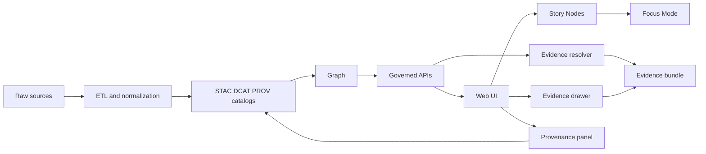

<!-- [KFM_META_BLOCK_V2]
doc_id: kfm://doc/0ba4cc49-245b-4a83-a367-bd40402d0b4a
title: UI Documentation (docs/ui)
type: standard
version: v1
status: draft
owners: TBD (UI/Frontend)
created: 2026-02-24
updated: 2026-02-24
policy_label: public
related:
  - docs/MASTER_GUIDE_v13.md
  - docs/architecture/
  - docs/reports/story_nodes/
  - web/
  - schemas/ui/
  - schemas/telemetry/
tags: [kfm, ui, docs]
notes:
  - Documentation-only directory for UI trust surfaces (Map/Story/Catalog/Focus).
  - UI code does not live here; it belongs in web/.
[/KFM_META_BLOCK_V2] -->

<a id="top"></a>

# docs/ui — UI documentation

**Purpose:** Governed documentation for the KFM user interface (Map + Story + Catalog + Focus Mode), with emphasis on **trust surfaces** (evidence, provenance, policy) and **non-bypassable boundaries**.


---

## Quick navigation

- [What lives here](#what-lives-here)
- [Where this fits in KFM](#where-this-fits-in-kfm)
- [UI invariants](#ui-invariants)
- [Interfaces this UI depends on](#interfaces-this-ui-depends-on)
- [Suggested directory layout](#suggested-directory-layout)
- [UI doc registry](#ui-doc-registry)
- [How to document a UI change](#how-to-document-a-ui-change)
- [Governance and safety](#governance-and-safety)
- [Related docs and schemas](#related-docs-and-schemas)

---

## What lives here

**This folder is for documentation only.**

Examples of good content:

- UI information architecture (screens, navigation, roles)
- Trust surface specs:
  - Evidence drawer behavior
  - Provenance/lineage panel behavior
  - Dataset version + license + policy badge display rules
  - “What changed?” diff UX between dataset versions
- UX patterns for:
  - map interaction
  - feature inspection
  - timeline controls
  - filtering/query affordances
- Accessibility (a11y) decisions + checklists
- Telemetry expectations (events emitted and why)
- Runbooks for UI maintainers (**docs**, not scripts)

### What must NOT live here

- ❌ React/TypeScript source code (belongs in `web/`)
- ❌ API handlers, DB access, or contracts (belongs in `src/server/…`)
- ❌ Story Node content (belongs in `docs/reports/story_nodes/…`)
- ❌ Datasets or “hidden” data blobs embedded for UI convenience

> WARNING: If a UI feature requires data, it must arrive through the governed API boundary (policy + redaction), not via bundled files in the UI repo.

---

## Where this fits in KFM

KFM’s UI is downstream of the governed pipeline. The UI should be treated as a **trust membrane surface**—it must show users *why they can trust what they’re seeing*.



---

## UI invariants

These invariants are **non-negotiable**. If a UI change weakens them, it must be treated as a governance regression.

### Trust must be visible

For any dataset/layer/story claim the UI shows, the UI must be able to surface:

- dataset version and freshness
- license and attribution
- policy badge / redaction state
- one-click access to supporting evidence + provenance

### Evidence access is contract-first

- Resolve evidence references through an **evidence resolver** and display an **evidence bundle** (human-facing card + machine metadata + digests + audit refs).
- Prefer “≤ 2 calls” to retrieve what’s needed for a card/drawer view.

### No policy bypass

- UI must not embed “convenient” data that bypasses policy decisions.
- UI data access must go through governed API contracts capable of enforcing redaction/classification rules.

### Target IA and core components

> NOTE: These are the *recommended* UI surfaces/components to document here. Whether they already exist in `web/` is a repository reality check.

**Information architecture (recommended):**
- Map Explorer (primary)
- Stories (Story Mode)
- Catalog (dataset discovery)
- Focus Mode (evidence-led Q&A)
- Admin/Steward (restricted governance tools)

**Core components (buildable):**
- Map canvas + layer panel (policy badge + dataset version per layer)
- Timeline control (time window + histogram where possible)
- Feature inspect (attributes + evidence refs)
- Evidence drawer (shared across Map/Story/Focus)
- Provenance panel (run receipts + lineage links)
- “What changed?” diff viewer between dataset versions

---

## Interfaces this UI depends on

> NOTE: The endpoints below are **illustrative**. Treat them as a contract to confirm/implement (not a guarantee they exist in your current codebase).

| Endpoint | Purpose | Policy posture (intent) |
|---|---|---|
| `GET /api/v1/catalog/datasets` | Dataset discovery | Hide restricted by default; filter by role |
| `GET /api/v1/datasets/{dataset_version_id}/query` | Query slices by bbox/time/filters | Enforce policy; generalize outputs if required |
| `GET /api/v1/tiles/{layer_id}/{z}/{x}/{y}` | Tile delivery | Only policy-safe tiles; cache varies by policy/auth |
| `POST /api/v1/evidence/resolve` | Resolve EvidenceRef → EvidenceBundle | Fail closed if unresolvable/unauthorized |
| `GET /api/v1/lineage/{dataset_id}` | Lineage graph + run receipts | May redact; include commit SHAs where available |
| `POST /api/v1/focus/ask` | Focus Mode Q&A (with citations) | Must cite or abstain; log retrieval context |

---

## Suggested directory layout

> NOTE: This is a *proposed* layout. Keep it minimal—add subfolders only when there’s at least one real doc to put in them.

```text
docs/ui/
├─ README.md                # This file
├─ ia/                      # Information architecture, nav maps, screen registry
├─ trust/                   # Evidence/provenance/policy surfaces
├─ patterns/                # Reusable UI/UX patterns (map, tables, timelines)
├─ a11y/                    # Accessibility decisions + test checklists
├─ telemetry/               # UI event catalog + rationale (links to schemas/telemetry)
├─ runbooks/                # How-to docs for UI maintainers (not scripts)
└─ assets/                  # Diagrams/images used by docs in this folder
```

---

## UI doc registry

> TIP: Keep this table current so reviewers can find “the one doc” for each UI surface.

| Surface / component | What it covers | Doc location (suggested) |
|---|---|---|
| Map Explorer | Map browsing, layers, inspect | `docs/ui/ia/map-explorer.md` |
| Stories | Story reading, map state embedding | `docs/ui/ia/stories.md` |
| Catalog | Dataset discovery UI | `docs/ui/ia/catalog.md` |
| Focus Mode | Evidence-led Q&A surface | `docs/ui/ia/focus-mode.md` |
| Admin/Steward | Restricted governance tools | `docs/ui/ia/admin-steward.md` |
| Evidence drawer | EvidenceBundle rendering, obligations | `docs/ui/trust/evidence-drawer.md` |
| Provenance panel | Lineage/run receipts UX | `docs/ui/trust/provenance-panel.md` |
| Policy badges | Labels, redaction status, hover text | `docs/ui/trust/policy-badges.md` |
| Timeline control | Time window + histogram patterns | `docs/ui/patterns/timeline-control.md` |
| Diff viewer | Dataset version comparisons | `docs/ui/trust/diff-viewer.md` |

---

## How to document a UI change

Use this checklist when you modify the UI (or add a new UI feature).

### 1) Update trust surface documentation

- If you add a new screen/route, update IA docs in `docs/ui/ia/`
- If you add a new way to display evidence/provenance/policy, document it in `docs/ui/trust/`

### 2) Link the change to governed interfaces

For each UI change, capture:

- which API endpoints/contracts it uses
- which schema(s) it depends on (e.g., UI schema, telemetry schema)
- what policy labels and obligations may apply (and how UI communicates them)

### 3) Add or update telemetry expectations

Document the event(s) the UI emits for the feature:

- event name
- when it fires
- required fields
- privacy/sensitivity notes
- “why we log this” (auditability)

### 4) Definition of Done (DoD) for UI docs

- [ ] Docs updated for any new route/screen/panel
- [ ] Evidence + provenance affordances documented (screenshots/diagrams optional)
- [ ] API contract references included (path + version)
- [ ] Accessibility implications noted (keyboard nav, focus order, contrast)
- [ ] Telemetry events documented + linked to `schemas/telemetry/` (if applicable)
- [ ] Any policy/redaction behavior documented (default-deny when uncertain)

---

## Governance and safety

KFM UI is expected to support governance—not merely comply with it.

- **Default-deny:** if sensitivity is unclear, the UI should show a clear “withheld/generalized” state and guide the user toward the reason (policy).
- **Auditability:** emit telemetry signals when redaction notices are shown so the system can answer “who saw what and why”.

---

## Related docs and schemas

> NOTE: Paths below are based on the v13 structure guide. If any are missing in your working tree, treat them as “expected” and reconcile with the repo maintainer.

- `docs/MASTER_GUIDE_v13.md` — canonical pipeline + structure
- `docs/architecture/` — system architecture, blueprints, ADRs
- `docs/reports/story_nodes/` — governed narratives (draft vs published)
- `schemas/ui/` — UI-related JSON Schemas (contracts for UI artifacts)
- `schemas/telemetry/` — telemetry event schemas
- `web/` — UI application code (React + map stack)
- `src/server/` — governed API boundary + contracts

---

<p align="right"><a href="#top">Back to top ⬆️</a></p>
