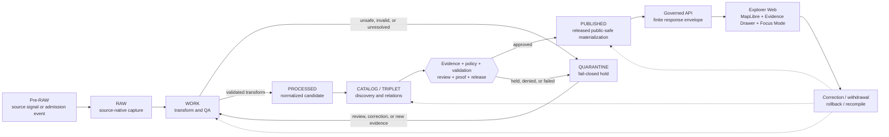
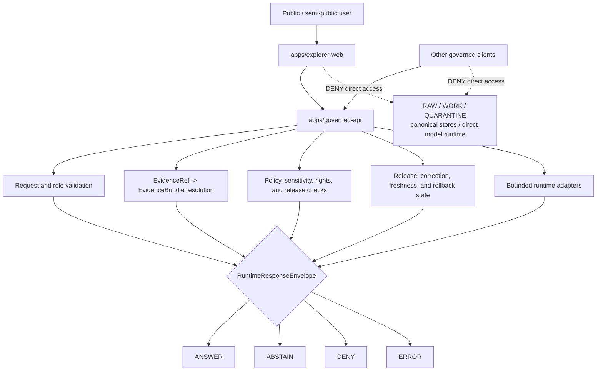

<!--
KFM_WIKI_SOURCE
page_id: Architecture
title: Architecture
version: v0.2.0
status: PROPOSED wiki source; review required
created: 2026-08-07
updated: 2026-08-14
authority: orientation-only; canonical repository evidence, adopted KFM doctrine, accepted ADRs, and owning responsibility roots outrank this page
source_path: docs/wiki/Architecture.md
owning_root: docs/
responsibility: public orientation to the KFM system architecture, trust membrane, responsibility handoffs, and bounded current implementation posture
evidence_snapshot: main@695c4e67063481236e627f8652faf17619260a5a
prior_blob: 44b30be37f609d0e2f1ccb69380b37b053cde554
publication_effect: none until separately synchronized to the native GitHub Wiki
-->

<a id="top"></a>

<p align="center">
  
</p>

# Architecture

<p align="center"><strong>How KFM turns sources into inspectable, policy-aware, correctable spatial claims.</strong></p>

KFM is best understood as a **governed spatial evidence and publication system**. The map is the primary operating surface, but the architecture is centered on a controlled path from source admission to evidence-backed release—and on keeping every downstream carrier subordinate to that path.

> [!IMPORTANT]
> This wiki page is an orientation projection. It explains architecture; it does not create doctrine, accept an ADR, define a contract or schema, approve policy, prove deployment, promote data, or publish KFM truth.

> [!NOTE]
> **Evidence checkpoint:** reviewed against [`main@695c4e67063481236e627f8652faf17619260a5a`](https://github.com/bartytime4life/Kansas-Frontier-Matrix/tree/695c4e67063481236e627f8652faf17619260a5a). A commit proves repository bytes at that revision. It does not by itself prove runtime behavior, operational availability, rights clearance, release readiness, or native-wiki synchronization.

## At a glance

| Question | KFM answer |
|---|---|
| What is the system? | A Kansas-first, map-first, time-aware, evidence-first spatial knowledge and publication system |
| What is the public unit of value? | The **inspectable claim**, not a tile, popup, graph edge, dashboard, or AI answer by itself |
| How does material move? | `Pre-RAW -> RAW -> WORK / QUARANTINE -> PROCESSED -> CATALOG / TRIPLET -> PUBLISHED` |
| Where is the public trust boundary? | `apps/governed-api/`, with clients downstream of governed finite envelopes |
| What is the main public shell? | `apps/explorer-web/`, consuming governed responses and released public-safe carriers |
| What happens when support is insufficient or unsafe? | `ABSTAIN`, `DENY`, or `ERROR`—not invented certainty |
| What makes change durable? | Deterministic identity where practical, receipts, proofs, review, correction lineage, and rollback targets |
| Where is current implementation maturity tracked? | [Project Status](Project-Status.md), exact repository files, tests, workflows, and emitted artifacts |

**Quick navigation:** [Operating model](#connected-operating-model) · [Inspectable claim](#the-inspectable-claim) · [Principles](#architecture-principles) · [Planes](#responsibility-planes) · [Trust membrane](#trust-membrane) · [Runtime path](#runtime-request-path) · [Objects](#shared-object-families) · [State separation](#state-separation) · [Current baseline](#current-bounded-implementation) · [Anti-patterns](#architecture-anti-patterns) · [References](#architecture-references)

---

## Connected operating model

The architecture is a sequence of governed transformations. Each arrow is a responsibility boundary; no downstream surface may silently promote itself to a stronger authority class.



### What the flow guarantees

- **Admission is explicit.** Watchers, uploads, connectors, and source events produce candidates and receipts; they do not publish.
- **Quarantine is a valid result.** Unresolved rights, sensitivity, identity, quality, or source role blocks stronger state.
- **Derived stays derived.** Catalogs, graph projections, tiles, indexes, summaries, and scenes never replace their evidence.
- **Publication is a decision.** A file path, successful build, green check, merge, or wiki page is not a release.
- **Correction is part of architecture.** Public carriers must be traceable to a state that can be corrected, withdrawn, superseded, rebuilt, or rolled back.

Read the stage-by-stage version in [Data Lifecycle](Data-Lifecycle.md).

[Back to top](#top)

---

## The inspectable claim

A KFM-grade claim lets a reader or reviewer reconstruct:

| Dimension | Inspection question |
|---|---|
| Assertion | What exactly is being claimed? |
| Source role | Is the support an observation, interpretation, regulatory record, model, forecast, aggregate, historical source, or context? |
| Evidence | Which `EvidenceRef` records resolve to which `EvidenceBundle` support? |
| Place | What geometry, geography version, scale, CRS, and generalization apply? |
| Time | What valid, observed, source, retrieval, release, and correction times matter? |
| Uncertainty | What limitations, confidence, disagreement, or missing support remain? |
| Policy | What rights, sensitivity, access, redaction, embargo, consent, or review obligations apply? |
| Release | Which reviewed release state made the claim available? |
| Correction | How can the claim be corrected, withdrawn, superseded, replayed, or rolled back? |

A map pixel, tile, popup, graph edge, search result, model score, dashboard, story, 3D scene, or generated explanation may **carry** a claim. It does not establish the claim by itself.

> [!TIP]
> Ask **“What claim does this surface carry, what evidence supports it, what policy applies, and what release state made it visible?”** before asking whether a layer or answer can be shown.

[Back to top](#top)

---

## Architecture principles

| Principle | Architectural consequence |
|---|---|
| Evidence first | Consequential output resolves support or abstains |
| Map first | Place is the primary operating surface, with time and trust state visible at the point of use |
| Time aware | Observation, validity, source, retrieval, release, and correction time remain distinct where material |
| Policy aware | Rights, sensitivity, role, review, and release state gate exposure |
| Cite or abstain | Missing or invalid evidence never becomes confident prose |
| Fail closed | Unsafe, ambiguous, stale, or broken paths return finite negative outcomes |
| Responsibility rooted | Paths are selected by the responsibility that owns them, not by topic convenience |
| Derived stays derived | Tiles, catalogs, graphs, indexes, models, and AI language remain downstream carriers |
| Reversible by default | Material changes preserve correction, withdrawal, replay, and rollback paths |
| AI is interpretive | Evidence and policy outrank generated language |

[Back to top](#top)

---

## Responsibility planes

The planes cooperate, but each owns a different kind of authority.

| Plane | Owns | Must not own |
|---|---|---|
| Source edge | Source identity, authority role, terms, cadence, retrieval metadata, admission state | Publication decisions |
| Evidence | `EvidenceRef`, `EvidenceBundle`, citations, provenance, support scope, limitations | UI styling or generated prose |
| Domain | Observations, entities, assertions, temporal identity, geography, domain semantics | Public exposure without policy and release |
| Policy | Rights, sensitivity, audience, access, obligations, allow/deny/hold/restrict decisions | Canonical factual truth |
| Validation | Contract, schema, topology, policy, citation, boundary, and regression checks | Human review or release authority |
| Publication | Proof closure, promotion decisions, release manifests, correction, withdrawal, and rollback | Source intake or raw transformation |
| Delivery | Governed API, released catalogs, public-safe tiles and artifacts, caches, bounded exports | Canonical or unreleased stores |
| UI and AI | Exploration, evidence display, map interaction, bounded interpretation, finite outcomes | Source, evidence, policy, review, or release authority |

### Responsibility-root expression

| Responsibility | Repository home |
|---|---|
| Explain the architecture | `docs/` |
| Define object meaning | `contracts/` |
| Define machine-checkable shape | `schemas/` |
| Decide admissibility | `policy/` |
| Prove enforceability | `tests/` and `fixtures/` |
| Implement deployables and shared behavior | `apps/`, `packages/`, `connectors/`, `pipelines/`, `runtime/`, and `tools/` |
| Store lifecycle and accountability instances | the correct governed `data/` lane |
| Record release, correction, withdrawal, and rollback decisions | `release/` |

For placement details, use [Repository Map](Repository-Map.md) and the adopted [Directory Rules](https://github.com/bartytime4life/Kansas-Frontier-Matrix/blob/main/docs/doctrine/directory-rules.md).

[Back to top](#top)

---

## Trust membrane

Ordinary public and semi-public clients cross one governed boundary. They do not read canonical or unreleased stores directly.



The API is not the truth store. It is the enforcement and projection boundary that assembles a safe response from the authorities behind it.

### Finite outward outcomes

| Outcome | Meaning | Required behavior |
|---|---|---|
| `ANSWER` | Sufficient released, policy-safe, evidence-supported information exists | Return bounded support, citations, limits, release, and correction state where material |
| `ABSTAIN` | Evidence is missing, stale, conflicting, too weak, or outside supported scope | Explain the limitation without fabricating an answer |
| `DENY` | Rights, sensitivity, caller role, source terms, release state, or exposure risk blocks the request | Refuse safely without leaking protected payload or harmful precision |
| `ERROR` | A resolver, validator, policy service, adapter, or runtime failed | Return an audit-safe failure reference; never fall back to unsafe allow |

Read the reader-facing trust rules in [Governance and Evidence](Governance-and-Evidence.md), and the map/runtime boundary in [Map, UI, and AI](Map-UI-and-AI.md).

[Back to top](#top)

---

## Runtime request path

A normal claim-bearing interaction should be explainable as this sequence:

| Step | Handoff | Architectural obligation |
|---:|---|---|
| 1 | User selects a map feature, layer, place, time, or question | The interaction produces candidate context, not truth |
| 2 | Explorer Web sends a bounded request to the Governed API | No direct lifecycle-store or model call |
| 3 | The API validates route, shape, caller context, and allowed scope | Invalid or unsupported input fails safely |
| 4 | Evidence support is resolved | Claim-bearing output requires `EvidenceRef -> EvidenceBundle` closure |
| 5 | Policy and release state are applied | Rights, sensitivity, freshness, correction, and audience obligations remain visible |
| 6 | Optional adapters interpret only the admitted evidence | AI or analysis cannot enlarge source authority |
| 7 | A finite `RuntimeResponseEnvelope` is validated | Exactly one outward outcome is emitted |
| 8 | The client renders the outcome and trust state | The UI does not hide denial, abstention, stale state, correction, or limitations |

This is the architectural target. Current implementation depth must be verified from the exact app files, tests, workflow runs, and deployed behavior.

[Back to top](#top)

---

## Shared object families

KFM uses recurring trust-bearing families so handoffs can be inspected consistently.

| Object family | Architectural role |
|---|---|
| `SourceDescriptor` and activation/admission decisions | Establish source identity, role, terms, cadence, scope, and permitted use |
| `EvidenceRef` and `EvidenceBundle` | Identify and resolve support for consequential claims |
| Domain records and temporal/geographic identities | Preserve domain meaning, place, time, observation, and assertion context |
| `PolicyDecision` | Record allow, deny, restrict, hold, redact, generalize, delay, or review obligations |
| `ValidationReport`, `RunReceipt`, `TransformReceipt`, and `AIReceipt` | Record what ran, against which inputs and rules, with what bounded result |
| `RuntimeResponseEnvelope` or compatible finite decision envelope | Carry one safe outward runtime outcome |
| `LayerManifest`, tile/artifact manifests, catalog records, proof objects, and promotion records | Connect derived carriers to evidence, validation, integrity, and candidate release state |
| `ReleaseManifest` | Identify a reviewed release and its included public-safe artifacts |
| `CorrectionNotice`, `WithdrawalNotice`, supersession links, and rollback records | Preserve repair, retirement, propagation, and reversibility |

> [!CAUTION]
> Similar names do not justify collapsing responsibilities. A receipt is not a proof. A proof is not a policy decision. A catalog record is not a release. A release is not publication merely because a file exists under a published-looking path.

[Back to top](#top)

---

## State separation

Architecture reviews should keep these states independent:

| State | What it proves | What it does not prove |
|---|---|---|
| Path presence | Bytes exist at a repository path and revision | Correctness, adoption, deployment, or release |
| Contract/schema presence | Meaning or shape has been documented | Runtime enforcement or admissibility |
| Passing validation | A declared assertion passed for a revision and fixture set | Complete architecture, policy approval, or publication |
| Review state | An authorized review occurred for a named scope | Release or deployment unless the review explicitly owns it |
| Release state | A governed release decision and manifest exist | The artifact is currently reachable through a public service |
| Publication state | A public-safe carrier is exposed through governed delivery | The underlying claim is permanently true or immune from correction |
| Wiki synchronization | Reviewed orientation bytes were copied to the native wiki | Canonical authority, implementation maturity, or KFM data publication |

This separation is why [Project Status](Project-Status.md) reports paths, tests, workflows, releases, and deployment independently.

[Back to top](#top)

---

## Dependency direction

The architectural dependency order is:

1. **Doctrine and accepted decisions** constrain the system.
2. **Contracts** define meaning and stable vocabulary.
3. **Schemas** define machine-checkable shape.
4. **Policy** decides admissibility and obligations.
5. **Fixtures and tests** demonstrate enforceability and negative behavior.
6. **Applications, packages, connectors, pipelines, runtime adapters, and tools** implement bounded roles.
7. **Lifecycle, evidence, receipt, proof, catalog, and release records** preserve state and accountability.
8. **Governed delivery** projects released public-safe results.
9. **Maps, UI, exports, search, stories, dashboards, and AI** remain downstream interpretation and presentation.

A convenient import path, renderer capability, green workflow, or polished document must not reverse that direction.

[Back to top](#top)

---

## Current bounded implementation

The architecture is broader than the currently verified runtime slice. At the evidence checkpoint:

| Surface | CONFIRMED repository evidence | What remains unproven by that evidence |
|---|---|---|
| Directory governance | Accepted [`ADR-0029`](https://github.com/bartytime4life/Kansas-Frontier-Matrix/blob/695c4e67063481236e627f8652faf17619260a5a/docs/adr/ADR-0029-adopt-directory-governance-standard-v2.md) adopts the pinned Directory Rules bytes | Exhaustive conformance of every current path |
| Governed API | A standard-library WSGI scaffold registers `/bootstrap`, `/layers`, and `/evidence`; the baseline emits `ABSTAIN / NOT_IMPLEMENTED` and safe `ERROR` envelopes | Live evidence resolution, policy execution, `ANSWER`, release binding, production deployment, or public availability |
| Explorer Web | A Vite/TypeScript package and bounded fail-closed Evidence Drawer baseline are present with app-local unit and browser test commands | Live map rendering, live governed API integration, complete accessibility, release-backed claims, or deployment |
| Wiki architecture source | This reviewed source path and the source-set maintenance/synchronization contract exist in the main repository | Native-wiki synchronization or publication of this revision |

The safest current-state entry point is [Project Status](Project-Status.md). Re-check current `main`, open pull requests, exact-head workflows, and emitted artifacts before relying on any runtime claim.

[Back to top](#top)

---

## Architecture anti-patterns

| Anti-pattern | Why it fails |
|---|---|
| Public client reads RAW, WORK, QUARANTINE, canonical, or direct model stores | Bypasses the trust membrane |
| A map, tile, graph, score, or AI answer is treated as source truth | Collapses a downstream carrier into authority |
| Contract, schema, policy, and tests are merged into one file or folder | Hides the difference between meaning, shape, admissibility, and proof |
| Watcher or CI success writes directly to public state | Converts observation or automation into publication authority |
| Sensitive geometry is hidden only with client styling | Payload remains exposed; transforms must occur before delivery |
| Receipt, proof, catalog, promotion, and release are used interchangeably | Destroys auditability and makes correction ambiguous |
| Documentation claims implementation without code/test/runtime evidence | Turns prose into persuasive overclaiming |
| Unknown rights, sensitivity, source role, or release state defaults to allow | Reverses KFM's fail-closed posture |
| Correction overwrites history silently | Breaks lineage, accountability, and rollback |

[Back to top](#top)

---

## Explore the architecture

| Reader need | Wiki path | Canonical repository depth |
|---|---|---|
| How material moves | [Data Lifecycle](Data-Lifecycle.md) | [`docs/doctrine/lifecycle-law.md`](https://github.com/bartytime4life/Kansas-Frontier-Matrix/blob/main/docs/doctrine/lifecycle-law.md) |
| How evidence and policy work | [Governance and Evidence](Governance-and-Evidence.md) | [`docs/doctrine/`](https://github.com/bartytime4life/Kansas-Frontier-Matrix/tree/main/docs/doctrine) |
| Where files and authority belong | [Repository Map](Repository-Map.md) | [Directory Rules](https://github.com/bartytime4life/Kansas-Frontier-Matrix/blob/main/docs/doctrine/directory-rules.md) |
| How domains fit the shared spine | [Domains](Domains.md) | [`docs/domains/`](https://github.com/bartytime4life/Kansas-Frontier-Matrix/tree/main/docs/domains) |
| How map, UI, Evidence Drawer, and AI fit | [Map, UI, and AI](Map-UI-and-AI.md) | [`apps/explorer-web/`](https://github.com/bartytime4life/Kansas-Frontier-Matrix/tree/main/apps/explorer-web) and [`apps/governed-api/`](https://github.com/bartytime4life/Kansas-Frontier-Matrix/tree/main/apps/governed-api) |
| What is verified now | [Project Status](Project-Status.md) | Current repository tree, pull requests, workflows, and artifacts |
| How architecture changes are reviewed | [Contributing](Contributing.md) | [`CONTRIBUTING.md`](https://github.com/bartytime4life/Kansas-Frontier-Matrix/blob/main/CONTRIBUTING.md) |

[Back to top](#top)

---

## Architecture references

### Canonical and repository-facing references

- [Repository entry point](https://github.com/bartytime4life/Kansas-Frontier-Matrix/blob/main/README.md)
- [Architecture index](https://github.com/bartytime4life/Kansas-Frontier-Matrix/blob/main/docs/architecture/README.md)
- [System Context](https://github.com/bartytime4life/Kansas-Frontier-Matrix/blob/main/docs/architecture/system-context.md)
- [Governed API architecture](https://github.com/bartytime4life/Kansas-Frontier-Matrix/blob/main/docs/architecture/governed-api/README.md)
- [Contract / Schema / Policy / Test split](https://github.com/bartytime4life/Kansas-Frontier-Matrix/blob/main/docs/architecture/contract-schema-policy-split.md)
- [MapLibre architecture](https://github.com/bartytime4life/Kansas-Frontier-Matrix/blob/main/docs/architecture/maplibre.md)
- [Lifecycle Law](https://github.com/bartytime4life/Kansas-Frontier-Matrix/blob/main/docs/doctrine/lifecycle-law.md)
- [Trust Membrane](https://github.com/bartytime4life/Kansas-Frontier-Matrix/blob/main/docs/doctrine/trust-membrane.md)
- [Derived Stays Derived](https://github.com/bartytime4life/Kansas-Frontier-Matrix/blob/main/docs/doctrine/derived-stays-derived.md)
- [Directory Rules](https://github.com/bartytime4life/Kansas-Frontier-Matrix/blob/main/docs/doctrine/directory-rules.md)
- [Accepted ADR-0029](https://github.com/bartytime4life/Kansas-Frontier-Matrix/blob/main/docs/adr/ADR-0029-adopt-directory-governance-standard-v2.md)
- [Governed API app boundary](https://github.com/bartytime4life/Kansas-Frontier-Matrix/blob/main/apps/governed-api/README.md)
- [Explorer Web app boundary](https://github.com/bartytime4life/Kansas-Frontier-Matrix/blob/main/apps/explorer-web/README.md)

### Evidence and maintenance

**CONFIRMED for this source revision:** same-path architecture-page update; existing page identity retained; current target and referenced repository paths inspected at the evidence checkpoint.

**PROPOSED:** this source revision remains review-required until merged. Native-wiki synchronization is a separate, explicit operation governed by [Wiki Maintenance](Wiki-Maintenance.md).

**NEEDS VERIFICATION:** current hosted checks, human review, native-wiki state, deployed services, and any implementation claim not tied to the evidence checkpoint.

Re-review this page when lifecycle vocabulary, the trust membrane, accepted ADRs, public-client boundaries, finite runtime outcomes, the canonical Explorer/Governed API relationship, or native-wiki synchronization state changes materially.

### Rollback

Before merge, close the pull request or update the feature branch. After merge, revert the architecture-page commit or restore prior blob:

```text
44b30be37f609d0e2f1ccb69380b37b053cde554
```

Correct the source page first, then perform any separately authorized native-wiki synchronization. Do not rewrite shared history merely to make the wiki appear clean.

[Back to top](#top)
