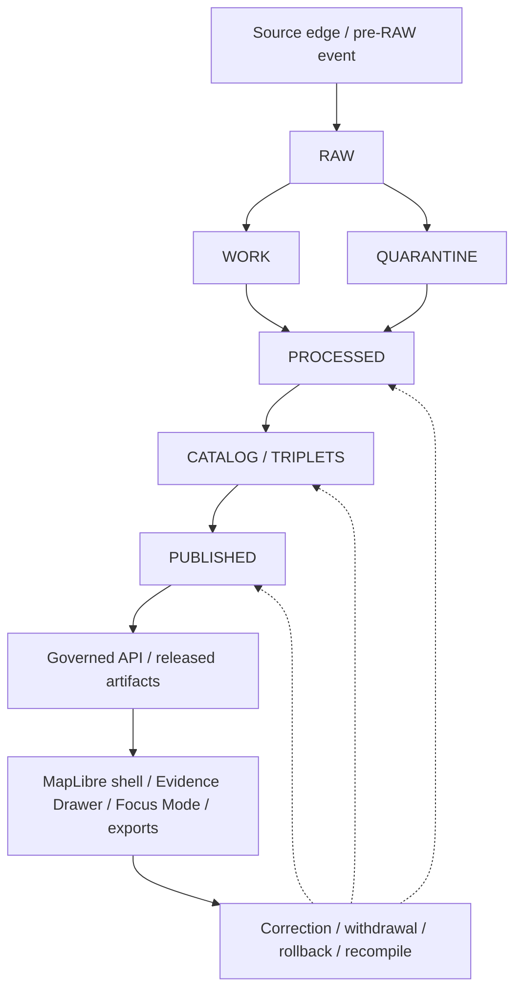

<!--
KFM_WIKI_SOURCE
page_id: Architecture
title: Architecture
status: PROPOSED wiki source; review required
updated: 2026-08-07
authority: orientation-only; canonical repository evidence and adopted KFM authority outrank this page
source_path: docs/wiki/Architecture.md
publication_effect: none until separately synchronized to the native GitHub Wiki
-->
# Architecture

KFM is best understood as a **governed spatial evidence and publication system**. The map is the primary operating surface, but the system's center is the controlled path from sources to inspectable, correctable claims.

## Connected operating model



Every arrow is a responsibility boundary. No downstream surface may silently promote itself to a stronger authority class.

## The inspectable claim

A KFM-grade claim should let a reviewer determine:

- what is being asserted;
- which source role and evidence support it;
- its spatial and temporal scope;
- what uncertainty, transformation, or generalization applies;
- which rights, sensitivity, policy, and review conditions apply;
- which release state made it available;
- how it can be corrected, withdrawn, superseded, or rolled back.

A map pixel, tile, popup, graph edge, dashboard, model score, or generated explanation may carry a claim. It does not establish the claim by itself.

## Responsibility planes

| Plane | Owns | Must not own |
|---|---|---|
| Source | Source identity, role, terms, retrieval metadata, update behavior | Publication decisions |
| Evidence | `EvidenceRef`, `EvidenceBundle`, citation and support scope | UI styling or AI prose |
| Domain | Observations, entities, assertions, time, geography, domain semantics | Public exposure without policy and release |
| Policy | Rights, sensitivity, access, obligations, deny/hold/restrict decisions | Canonical factual truth |
| Validation | Schema, contract, topology, policy, citation, and boundary checks | Human review or release authority |
| Publication | Proof closure, promotion decisions, release manifests, correction and rollback | Source intake |
| Delivery | Governed API, public-safe tiles, catalogs, artifacts, caches | Canonical stores |
| UI and AI | Exploration, evidence display, bounded interpretation, finite outcomes | Source, policy, evidence, or release authority |

## Trust membrane

Ordinary public and semi-public clients should cross one governed boundary:

```text
released public-safe artifacts + EvidenceBundle resolution + policy
    -> apps/governed-api/
    -> finite RuntimeResponseEnvelope
    -> apps/explorer-web/ and other governed clients
```

Direct browser reads from RAW, WORK, QUARANTINE, candidate, canonical-internal, or model-runtime stores are denied. Read more in [Map, UI, and AI](Map-UI-and-AI.md).

## Shared object families

Recurring trust-bearing families include:

- `SourceDescriptor` and source activation decisions;
- `EvidenceRef` and `EvidenceBundle`;
- domain observations, assertions, and time-aware identities;
- `PolicyDecision`;
- validation reports and run/transform/AI receipts;
- finite `RuntimeResponseEnvelope` or `DecisionEnvelope`;
- layer, tile, catalog, proof, promotion, and release manifests;
- correction, withdrawal, supersession, and rollback records.

Similar names do not justify collapsing distinct responsibilities. A receipt is not a proof; a proof is not a release; a catalog entry is not publication.

## Dependency direction

- Doctrine and accepted decisions constrain implementation.
- Contracts define meaning.
- Schemas define machine shape.
- Policy decides admissibility.
- Fixtures and tests demonstrate enforceable behavior.
- Applications, packages, connectors, pipelines, and tools implement bounded roles.
- Lifecycle and release records preserve state and accountability.
- Public clients remain downstream of governed delivery.

## Architecture references

- [Repository entry point](https://github.com/bartytime4life/Kansas-Frontier-Matrix/blob/main/README.md)
- [Architecture index](https://github.com/bartytime4life/Kansas-Frontier-Matrix/blob/main/docs/architecture/README.md)
- [Lifecycle Law](https://github.com/bartytime4life/Kansas-Frontier-Matrix/blob/main/docs/doctrine/lifecycle-law.md)
- [Trust Membrane](https://github.com/bartytime4life/Kansas-Frontier-Matrix/blob/main/docs/doctrine/trust-membrane.md)
- [Derived Stays Derived](https://github.com/bartytime4life/Kansas-Frontier-Matrix/blob/main/docs/doctrine/derived-stays-derived.md)
- [Directory Rules](https://github.com/bartytime4life/Kansas-Frontier-Matrix/blob/main/docs/doctrine/directory-rules.md)
- [Governed API architecture](https://github.com/bartytime4life/Kansas-Frontier-Matrix/blob/main/docs/architecture/governed-api.md)
- [MapLibre architecture](https://github.com/bartytime4life/Kansas-Frontier-Matrix/blob/main/docs/architecture/maplibre.md)
