<!--
KFM_WIKI_SOURCE
page_id: Contributing
title: Contributing
version: v0.2
status: PROPOSED wiki source; review required
updated: 2026-08-14
authority: orientation-only; canonical repository evidence and adopted KFM authority outrank this page
source_path: docs/wiki/Contributing.md
publication_effect: none until separately synchronized to the native GitHub Wiki
evidence_checkpoint: main@13f1a8e9bfbad807ab9131bd7c2972ed61a95918
upstream_contribution_guide: CONTRIBUTING.md@13f1a8e9bfbad807ab9131bd7c2972ed61a95918
prior_blob: 39d70fff404db832caaefa0349c8a70338e68830
-->

<a id="top"></a>

# Contributing

> **Help build Kansas Frontier Matrix through focused, evidence-backed, testable, reviewable, and reversible changes.**

[Home](Home.md) · [Getting Started](Getting-Started.md) · [Repository Map](Repository-Map.md) · [Development and Validation](Development-and-Validation.md) · [Security and Sensitivity](Security-and-Sensitivity.md)

> [!IMPORTANT]
> This page is a public orientation guide, not the contribution authority. The current repository
> [`CONTRIBUTING.md`](https://github.com/bartytime4life/Kansas-Frontier-Matrix/blob/main/CONTRIBUTING.md),
> [Directory Rules](https://github.com/bartytime4life/Kansas-Frontier-Matrix/blob/main/docs/doctrine/directory-rules.md),
> accepted ADRs, path-local READMEs, current contracts and schemas, applicable policy, and current repository evidence control the work.

> [!NOTE]
> Editing this source page does not update the separate native GitHub Wiki. Native-wiki synchronization remains a later, explicit, reviewed action governed by [Wiki Maintenance](Wiki-Maintenance.md).

## Current profile

| Field | Evidence-backed value |
|---|---|
| Source path | `docs/wiki/Contributing.md` — **CONFIRMED** at `main@13f1a8e9bfbad807ab9131bd7c2972ed61a95918` |
| Primary role | Reader-facing orientation to the repository contribution process |
| Upstream authority | Root `CONTRIBUTING.md`, adopted Directory Rules, accepted ADRs, path-local contracts, and current implementation evidence |
| Placement | Existing same-path documentation under the `docs/` responsibility root |
| Review route | `@bartytime4life` through the default `CODEOWNERS` rule; routing is not approval or separation-of-duties proof |
| Default delivery posture | Focused feature branch and draft pull request for substantial, AI-authored, governance-significant, sensitive, or incompletely validated work |
| Native-wiki state | Not changed or published by this source-only page update |
| Last evidence review | 2026-08-14 |
| Authority limit | No source admission, policy approval, lifecycle promotion, merge, release, deployment, or publication authority |

## Quick navigation

- [Ways to contribute](#ways-to-contribute)
- [KFM contribution law](#kfm-contribution-law)
- [Contribution flow](#contribution-flow)
- [Before editing](#before-editing)
- [Choose the correct repository home](#choose-the-correct-repository-home)
- [Keep trust layers separate](#keep-trust-layers-separate)
- [Scope and dependency closure](#scope-and-dependency-closure)
- [Contribution profiles](#contribution-profiles)
- [Branches and commits](#branches-and-commits)
- [Pull requests](#pull-requests)
- [Evidence and truth labels](#evidence-and-truth-labels)
- [Validation](#validation)
- [AI-assisted contributions](#ai-assisted-contributions)
- [Review](#review)
- [Security and sensitive reports](#security-and-sensitive-reports)
- [Merge, release, and publication boundaries](#merge-release-and-publication-boundaries)
- [Rollback and correction](#rollback-and-correction)
- [Contributor checklist](#contributor-checklist)
- [Key references](#key-references)

## Fast path

A normal contribution should be understandable as one bounded sequence:

1. **Define the outcome.** State what observable repository condition should become true and what remains out of scope.
2. **Pin the base.** Record the branch and immutable starting commit.
3. **Inspect authority and overlap.** Read the target, parent README, Directory Rules, relevant ADRs, direct dependencies, open pull requests, and recent merges.
4. **Choose the owner.** Place each changed artifact under the responsibility root that owns it.
5. **Implement the smallest complete slice.** Include direct dependencies needed to make the result true; exclude unrelated cleanup.
6. **Validate the claim.** Run repository-native positive and negative checks and record the exact head they exercised.
7. **Open a reviewable pull request.** Use the complete template, keep uncertainty visible, and preserve rollback.
8. **Stop at the delivery boundary.** Review, merge, release, deployment, source activation, promotion, publication, and native-wiki synchronization are separate decisions.

## Ways to contribute

KFM welcomes contributions across the system.

| Area | Examples |
|---|---|
| Documentation | Correct stale claims, improve navigation, add runbooks, clarify contracts, document rollback, repair links, or reconcile source and generated pages. |
| Domain knowledge | Refine hydrology, soil, habitat, fauna, flora, agriculture, geology, atmosphere, hazards, transport, settlements, archaeology, or people/land vocabulary and boundaries. |
| Sources and data | Research source authority, rights, cadence, identity, sensitivity, fixtures, connectors, deterministic intake behavior, and correction signals. |
| Contracts and validation | Improve semantic contracts, schemas, policy bindings, fixtures, validators, tests, compatibility rules, and finite outcomes. |
| Applications and APIs | Build governed API, Explorer Web, Evidence Drawer, review, export, accessibility, and bounded AI behavior. |
| Operations and release support | Improve CI, observability, receipts, proofs, catalogs, release manifests, corrections, withdrawals, cache invalidation, and rollback drills. |
| Governance | Draft or revise ADRs, registers, migration records, reviewer guidance, and authority mappings without treating proposals as accepted decisions. |

A good first contribution is small enough to review completely, useful enough to produce an observable improvement, and reversible without creating a second authority surface.

## KFM contribution law

Every consequential contribution should preserve the following boundaries.

```text
RAW -> WORK / QUARANTINE -> PROCESSED -> CATALOG / TRIPLET -> PUBLISHED
```

- **Promotion is a governed state transition.** A file move, commit, pull request, merge, green check, wiki update, or GitHub release is not KFM data publication.
- **Public clients use governed interfaces.** Do not create a normal public path to RAW, WORK, QUARANTINE, candidate, canonical/internal, or direct model-runtime stores.
- **Cite or abstain.** Evidence-dependent claims resolve through admissible support or return a bounded negative outcome.
- **Evidence outranks presentation.** Maps, tiles, graphs, dashboards, summaries, scenes, screenshots, and AI responses are downstream carriers, not sovereign truth.
- **Source roles remain distinct.** Observation, forecast, model, regulation, aggregate statistic, community report, reconstruction, and generated narrative must not silently collapse.
- **Sensitive material fails closed.** Unknown rights, sovereignty, consent, living-person data, DNA/genomics, rare-species locations, archaeology, infrastructure, private land/title, or harmful precision requires restriction, generalization, quarantine, staged access, delay, abstention, or denial.
- **Watchers are not publishers.** Automation may detect change and propose work; it may not silently promote or publish.
- **Receipts are process memory.** A receipt does not become evidence, proof, review, policy, release, or publication authority.
- **Corrections and rollback are part of the feature.** Material changes need a realistic path back and a visible way to supersede or repair released state.
- **Unknowns remain visible.** A polished file, passing test, or plausible design must not upgrade `UNKNOWN` into fact.

Read [Governance and Evidence](Governance-and-Evidence.md) and [Data Lifecycle](Data-Lifecycle.md) for the larger trust model.

## Contribution flow

```mermaid
flowchart LR
    A["Inspect current evidence and open work"] --> B["Define task contract and non-goals"]
    B --> C["Choose owning responsibility root"]
    C --> D["Create focused feature branch"]
    D --> E["Implement dependency-closed change"]
    E --> F["Run positive and negative validation"]
    F --> G["Open draft pull request"]
    G --> H["Review actual diff and exact-head checks"]
    H --> I["Separate merge decision"]
    I --> J["Separate release, activation, or publication decision when applicable"]
```



The normal repository contribution ends with reviewable repository state. A branch or pull request may be complete even while hosted checks are pending, but pending is not passing and delivery is not publication.

## Before editing

### 1. Define the task contract

Record the work boundary before changing files.

| Field | Question |
|---|---|
| Goal | What observable repository outcome should this contribution produce? |
| Base | Which branch and immutable commit are you starting from? |
| Target paths | Which exact files or bounded path families may change? |
| In scope | Which behavior, documentation, object family, or governance surface may change? |
| Non-goals | What deliberately remains unchanged? |
| Current overlap | Which issues, branches, pull requests, recent merges, or generated outputs may overlap? |
| Evidence basis | Which files, tests, workflows, artifacts, logs, or authoritative sources support the change? |
| Direct dependencies | Which adjacent docs, contracts, schemas, policy, fixtures, tests, validators, config, workflows, or generated outputs are required for truth? |
| Acceptance criteria | What must be true for the contribution to be complete? |
| Validation | Which positive and negative checks will run, and against which exact head? |
| Stop conditions | What missing authority, conflict, failed gate, unsafe condition, or base drift stops the work? |
| Change budget | How many files, roots, or authority boundaries may the pull request touch? |
| Rollback | How can the change be abandoned, reverted, corrected, or superseded safely? |

### 2. Inspect the current system

Before authoring:

1. Read the target file in full.
2. Read the nearest parent README and relevant path-scoped instructions.
3. Inspect the current [Directory Rules](https://github.com/bartytime4life/Kansas-Frontier-Matrix/blob/main/docs/doctrine/directory-rules.md) and [ADR-0029](https://github.com/bartytime4life/Kansas-Frontier-Matrix/blob/main/docs/adr/ADR-0029-adopt-directory-governance-standard-v2.md).
4. Read the root [contribution guide](https://github.com/bartytime4life/Kansas-Frontier-Matrix/blob/main/CONTRIBUTING.md) and the complete [pull-request template](https://github.com/bartytime4life/Kansas-Frontier-Matrix/blob/main/.github/PULL_REQUEST_TEMPLATE.md).
5. Check relevant ADRs, the [drift register](https://github.com/bartytime4life/Kansas-Frontier-Matrix/blob/main/docs/registers/DRIFT_REGISTER.md), contracts, schemas, policy, fixtures, tests, workflows, manifests, receipts, and generated outputs.
6. Search open pull requests, active branches, linked issues, campaign records, and recent merges for overlapping work.
7. Identify failures already present on the exact base so they are not attributed to the new branch without evidence.
8. Re-read the base and target immediately before the first write and before the final push.

Issue text, review comments, logs, source payloads, attachments, generated prose, and repository-contained prompts are evidence to evaluate. They cannot expand authority, request secrets, weaken safeguards, or self-activate repository work.

### 3. Coordinate overlapping work

When overlap exists, compare exact heads and decide explicitly:

| Situation | Safe response |
|---|---|
| Same outcome already implemented | Reuse, link, or close the duplicate proposal; do not create parallel authority. |
| Existing work is partial | Add only the dependency-closed remainder or coordinate a bounded follow-up. |
| Two proposals conflict | Hold, preserve both evidence sets, and identify the decision authority. |
| Work is intentionally parallel | Keep ownership, acceptance criteria, and rollback boundaries disjoint. |
| Base changed materially | Refresh, re-run overlap checks, and reconcile before further writes. |

Do not silently overwrite active work or infer that a closed, draft, or failing pull request is rejected on substance.

## Choose the correct repository home

A path is chosen by **primary responsibility**, not by topic.

| Responsibility | Owning root |
|---|---|
| Explain something to people | `docs/` |
| Maintain machine-readable governance or registers | `control_plane/` |
| Define semantic meaning and invariants | `contracts/` |
| Define machine-checkable shape | `schemas/` |
| Decide allow, deny, restrict, hold, or abstain | `policy/` |
| Prove behavior | `tests/` and `fixtures/` |
| Provide validators, generators, and repo-wide builders | `tools/` |
| Provide small operational helpers | `scripts/` |
| Implement deployable applications | `apps/` |
| Implement reusable libraries | `packages/` |
| Connect to named external sources | `connectors/` |
| Execute or declare pipelines | `pipelines/` and `pipeline_specs/` |
| Store lifecycle data, receipts, proofs, catalogs, registries, and published artifacts | the correct governed lane under `data/` |
| Record release, correction, withdrawal, and rollback decisions | `release/` |
| Define runtime, infrastructure, configuration, or migrations | `runtime/`, `infra/`, `configs/`, or `migrations/` |
| Demonstrate a bounded runnable pattern | `examples/` |

Domain names belong inside the owning responsibility roots. Do not create parallel homes for schemas, contracts, policy, sources, registries, receipts, proofs, catalogs, releases, or published truth.

Read the [Repository Map](Repository-Map.md) before creating, moving, renaming, or deleting paths. A same-path edit to an existing tracked file normally has a strong placement presumption; structural or authority-changing work requires deeper Directory Rules and ADR review.

## Keep trust layers separate

| Layer | Owns | Does not prove |
|---|---|---|
| Documentation | Human-readable explanation, decisions, runbooks, orientation, and lineage | Runtime behavior, machine conformance, policy approval, release, or publication |
| Contract | Meaning, intent, invariants, and compatibility semantics | Machine conformance or release permission |
| Schema | Machine-checkable shape and version identity | Truth, rights, source authority, or admissibility |
| Policy | Rights, sensitivity, access, obligations, and release decisions | Data quality or semantic meaning |
| Source registry | Source identity, role, rights, cadence, and activation posture | Record-level truth or public release |
| Tests and fixtures | Deterministic evidence that declared behavior can pass or fail | Human review, policy authority, production correctness, or deployment |
| Receipt | Process memory and provenance for a run or generated change | Proof, approval, release, or publication |
| Proof, catalog, or release record | Bounded closure for its declared object family and decision | Unrelated domain truth or broad system readiness |

Do not add every layer mechanically. Change the layers whose behavior, promise, or compatibility actually changes, and explain why adjacent layers remain unaffected.

## Scope and dependency closure

The smallest safe change is not always the smallest file count. A contribution is **dependency-closed** when every artifact directly required to make its observable result true is included or explicitly shown not to be affected.

Include a dependency when omitting it would leave:

- documentation claiming behavior that code does not implement;
- a contract without the machine shape or compatibility handling required by the change;
- a schema without valid and invalid fixtures or a validator path;
- policy-significant behavior without fail-closed tests;
- generated output stale against its source;
- a migration without consumer, correction, or rollback support;
- a public-facing feature without evidence, negative states, accessibility, or public-safety behavior.

Split work when separate changes have different primary owners, independent acceptance decisions, distinct rollback boundaries, or can be reviewed safely in dependency order. Do not use “dependency closure” to justify unrelated cleanup or a repository-wide rewrite.

## Contribution profiles

Choose the narrowest profile that can make the requested outcome true.

| Profile | Use when | Typical closure |
|---|---|---|
| Documentation only | Wording, navigation, metadata, or evidence-bounded explanation changes without behavior change | Target Markdown, links, indexes, generated documentation companions, and receipt when required |
| Documentation plus dependencies | A document promise depends on navigation, metadata, generator output, examples, or documentation tests | Source doc plus direct documentation-system companions |
| Repository slice | Code, contracts, schemas, policy, fixtures, tests, tools, configuration, and docs share one acceptance boundary | Smallest complete implementation slice |
| Governance change | Directory Rules, accepted authority, normative policy, or responsibility ownership changes | Isolated decision record, evidence, migration/rollback analysis; no dependent structural implementation before adoption |
| Campaign | Two or three dependency-ordered slices need separate review and rollback boundaries | Ordered draft pull requests with explicit dependency graph |

For AI or coding-agent work, the repository's [v6 implementation prompt](https://github.com/bartytime4life/Kansas-Frontier-Matrix/blob/main/docs/prompts/kfm-repository-build-markdown-modernization-agent.md) is an optional operating reference. Repository presence does not activate it; the current user request and applicable repository controls determine scope.

## Branches and commits

- Start from a freshly read base commit and record it.
- Use one bounded purpose per feature branch.
- Agent-created branches use `agent/<short-description>` unless continuing an existing authorized branch.
- Do not push directly to `main` merely because permissions exist.
- Do not force-push, rewrite shared history, bypass protections, or hide unrelated cleanup.
- Reconcile meaningful base drift before final delivery.
- Keep canonical source and generated or mirrored outputs synchronized when the repository establishes that relationship.
- Use descriptive commits that make the review boundary obvious.
- Never commit credentials, private keys, access tokens, restricted source payloads, exact protected locations, or private review material.

A commit proves that specific bytes exist in history. It does not prove runtime behavior, security, policy approval, release fitness, deployment, or publication.

## Pull requests

Use the complete [pull-request template](https://github.com/bartytime4life/Kansas-Frontier-Matrix/blob/main/.github/PULL_REQUEST_TEMPLATE.md). Mark a section `Not applicable` with a reason instead of deleting it.

A reviewable pull request should identify:

- goal, task identity, base SHA, exact target paths, in-scope work, and non-goals;
- current overlap search and coordination result;
- evidence inspected and truth labels used;
- Directory Rules basis and affected responsibility roots;
- actual changes and directly necessary dependencies;
- contracts, schemas, policy, fixtures, tests, workflows, and generated outputs affected or intentionally unaffected;
- validation performed, expected negative cases, limitations, and exact-head state;
- rights, sensitivity, security, and public-surface impact;
- compatibility, migration, reprocessing, correction, and rollback;
- generated-work receipt and authority limit when required;
- remaining `UNKNOWN` and `NEEDS VERIFICATION` items.

Use a **draft pull request** for substantial, AI-authored, governance-significant, sensitive, migration-bearing, or incompletely validated work. Do not self-approve, mark ready, merge, dismiss review, or enable auto-merge without separate authority.

A pull request may be successfully delivered while hosted checks remain pending. Report delivery state and validation state separately.

## Evidence and truth labels

Use the core four labels for material claims.

| Label | Meaning |
|---|---|
| `CONFIRMED` | Verified from current repository evidence, tests, logs, generated artifacts, accepted decisions, or another admissible source |
| `PROPOSED` | A design, recommendation, path, placement, or future state not verified as current implementation |
| `UNKNOWN` | Evidence is insufficient to determine the answer |
| `NEEDS VERIFICATION` | A concrete check remains before the claim can be relied upon |

Qualifiers such as `INFERRED`, `CONFLICTED`, `SUPERSEDED`, `RETAINED`, `PARTIAL`, or `STALE` may refine a claim, but they do not replace the core evidence label.

Use the evidence appropriate to the question:

| Question | Strong evidence |
|---|---|
| What exists? | Pinned tree and file bytes |
| What works? | Implementation plus representative test, run, log, or emitted artifact tied to a revision |
| Where does it belong? | Core invariants, accepted ADRs, adopted Directory Rules, and non-conflicting root contracts |
| What does an object mean? | Semantic contract, machine schema, applicable policy, and verified implementation |
| May it be public? | Source role, rights, sensitivity, evidence, review, policy, release, correction, and rollback state |
| Did the change cause a failure? | Exact-head reproduction compared with the exact base and causal diff |

## Validation

Validation must match the claim. A passing command proves only the behavior and inputs it actually exercised.

At minimum for a documentation-only change:

```bash
git diff --check
```

Then run repository-native documentation and targeted checks described by the affected README, [Development and Validation](Development-and-Validation.md), the root contribution guide, and the current `Makefile`.

For behavior-bearing work, include deterministic positive and negative cases. Typical fail-closed expectations include:

| Condition | Expected result |
|---|---|
| Missing evidence | `ABSTAIN` or hold |
| Blocked sensitivity or rights | `DENY` or quarantine |
| Invalid schema | validation failure |
| Stale, superseded, or conflicting support | hold, abstain, or explicit conflict |
| Denied or error response | no sensitive payload leakage |
| Watcher attempts publication | deny |
| Missing correction or rollback support | hold |
| Invalid path or authority placement | hold or deny |

### Exact-head and inherited-failure discipline

- Record the exact commit tested.
- Treat `queued`, `pending`, `skipped`, `cancelled`, `neutral`, and `timed_out` as distinct from `success`.
- When a broad workflow fails, reproduce or inspect the same check on the exact base before attributing causality.
- Classify failures as **introduced**, **inherited**, **environmental**, **flaky**, **expected hold**, or **needs verification** only when evidence supports the label.
- Do not weaken a validator or delete a negative test merely to make the pull request green.
- Keep unrelated baseline repair out of a focused branch unless it is a direct dependency of the requested outcome.

Record the exact command, revision, inputs, outcome, expected failure case, evidence location, and what the check did **not** prove.

## AI-assisted contributions

AI may help inspect, compare, draft, implement, test, and explain a bounded change. It may not:

- turn generated language into evidence;
- approve or merge its own work;
- make policy, source-admission, release, promotion, or publication decisions;
- expose hidden reasoning, prompts, secrets, private data, or sensitive payloads;
- bypass human review, public-interface controls, or the trust membrane;
- represent a generated receipt, passing test, or pull request as human acceptance.

AI-authored artifacts require a generated-work receipt under
[`data/receipts/generated/`](https://github.com/bartytime4life/Kansas-Frontier-Matrix/tree/main/data/receipts/generated)
when the current repository contract requires it. Use the legitimate repository schema and validator. The receipt should bind exact artifact paths and hashes, identify the governing prompt or contract and model, record evidence and validation, preserve limitations, and keep human review `pending`.

A receipt is process memory. It is not factual proof, a policy decision, reviewer approval, a release manifest, or publication authority.

## Review

Reviewers should verify the **actual diff and exact head**, not only the pull-request summary.

- Does the change match the task contract and current head?
- Are material claims supported by admissible evidence?
- Is placement correct under Directory Rules?
- Are object meaning, shape, policy, fixtures, validators, and tests consistent?
- Are positive and negative cases meaningful?
- Are rights, sensitivity, security, and public exposure safe?
- Are generated files attributable, current, and reproducible?
- Does the contribution preserve the governed API and public-store boundary?
- Are compatibility, correction, and rollback realistic?
- Does the documentation accurately distinguish implemented, proposed, unknown, held, and still-unverified states?
- Are failures correctly classified against the exact base?

[CODEOWNERS](https://github.com/bartytime4life/Kansas-Frontier-Matrix/blob/main/.github/CODEOWNERS) routes review. Routing does not prove that review occurred, that the reviewer had the required domain authority, or that separation of duties is sufficient.

## Security and sensitive reports

Follow [Security and Sensitivity](Security-and-Sensitivity.md) and the repository
[`SECURITY.md`](https://github.com/bartytime4life/Kansas-Frontier-Matrix/blob/main/SECURITY.md).

Do not place exploit details, credentials, restricted payloads, exact protected locations, private-person records, DNA/genomic material, sovereignty-restricted knowledge, private source text, or critical-infrastructure detail in a public issue, pull request, wiki page, log, fixture, screenshot, or generated receipt.

Use the fastest safe private reporting path for an active exposure. Public documentation can describe the boundary without reproducing the sensitive material.

## Merge, release, and publication boundaries

A pull request may be correct and still not be ready to merge. A merge may be correct and still not authorize release. A release may be valid and still require separate publication or source-activation decisions.

```text
reviewable branch
  -> pull request
  -> human review and required checks
  -> merge decision
  -> optional release candidate
  -> policy, evidence, proof, correction, and rollback closure
  -> release, source activation, or publication decision
```

Keep these transitions explicit. Native-wiki synchronization is also a separate public documentation mutation; follow [Wiki Maintenance](Wiki-Maintenance.md).

## Rollback and correction

- **Before merge:** close the pull request and remove the branch only with appropriate authority.
- **After merge:** use a focused revert or forward-fix pull request; do not rewrite shared history.
- **After generated-output drift:** correct the canonical source and regenerate through the legitimate producer.
- **After native-wiki synchronization:** revert the wiki commit or synchronize corrected reviewed source.
- **After release or public exposure:** use the owning correction, withdrawal, cache-invalidation, and rollback process rather than a documentation-only edit.
- **After sensitive exposure:** contain the exposure quickly, preserve private incident evidence, rotate affected credentials, and issue the required correction.

Rollback should restore a known prior identity or produce a forward correction with visible lineage. It should not hide why the original change was made.

## Contributor checklist

Before requesting review:

- [ ] The contribution has one bounded purpose and an observable outcome.
- [ ] The base branch and exact starting SHA are recorded.
- [ ] Open work was searched for overlap and rechecked before the final push.
- [ ] Every changed path has an owning responsibility root and a Directory Rules basis.
- [ ] No parallel authority, public bypass, or source-role collapse was introduced.
- [ ] Material claims use admissible evidence and accurate truth labels.
- [ ] Direct dependencies are closed without unrelated cleanup.
- [ ] Contracts, schemas, policy, fixtures, tests, docs, and generated outputs are consistent where affected.
- [ ] Positive and negative validation is recorded against the exact head.
- [ ] Broad failures are classified against the exact base before causality is claimed.
- [ ] Rights, sensitivity, secrets, privacy, sovereignty, and harmful precision are handled safely.
- [ ] AI-authored artifacts have the required generated receipt with human review still pending.
- [ ] Documentation matches behavior and does not overclaim implementation, security, release, or publication.
- [ ] Compatibility, migration, correction, and rollback are explicit.
- [ ] The complete pull-request template is filled out.
- [ ] The work remains draft until the applicable review and checks are complete.

## Key references

- [Root contribution guide](https://github.com/bartytime4life/Kansas-Frontier-Matrix/blob/main/CONTRIBUTING.md)
- [Repository README](https://github.com/bartytime4life/Kansas-Frontier-Matrix/blob/main/README.md)
- [Pull-request template](https://github.com/bartytime4life/Kansas-Frontier-Matrix/blob/main/.github/PULL_REQUEST_TEMPLATE.md)
- [Directory Rules](https://github.com/bartytime4life/Kansas-Frontier-Matrix/blob/main/docs/doctrine/directory-rules.md)
- [ADR-0029](https://github.com/bartytime4life/Kansas-Frontier-Matrix/blob/main/docs/adr/ADR-0029-adopt-directory-governance-standard-v2.md)
- [Workflow governance](https://github.com/bartytime4life/Kansas-Frontier-Matrix/blob/main/.github/workflows/README.md)
- [Generated-work receipts](https://github.com/bartytime4life/Kansas-Frontier-Matrix/tree/main/data/receipts/generated)
- [KFM Repository Build-Out prompt v6](https://github.com/bartytime4life/Kansas-Frontier-Matrix/blob/main/docs/prompts/kfm-repository-build-markdown-modernization-agent.md)
- [Wiki maintenance](Wiki-Maintenance.md)
- [Glossary](Glossary.md)

---

[Back to top](#top)
