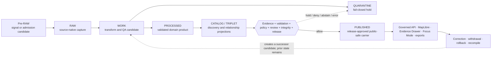

<!--
KFM_WIKI_SOURCE
page_id: Data-Lifecycle
title: Data Lifecycle
status: PROPOSED wiki source; review required
updated: 2026-08-14
authority: orientation-only; canonical repository evidence and adopted KFM authority outrank this page
source_path: docs/wiki/Data-Lifecycle.md
publication_effect: none until separately synchronized to the native GitHub Wiki
evidence_checkpoint: main@13f1a8e9bfbad807ab9131bd7c2972ed61a95918
-->
<a id="top"></a>

# Data Lifecycle

<p align="center">
  <strong>Governed admission · Traceable transformation · Fail-closed review · Reversible publication</strong>
</p>

<p align="center">
  <a href="Home.md">Home</a> ·
  <a href="Architecture.md">Architecture</a> ·
  <a href="Governance-and-Evidence.md">Evidence</a> ·
  <a href="Security-and-Sensitivity.md">Safety</a> ·
  <a href="Project-Status.md">Project status</a>
</p>

KFM's lifecycle answers three questions for every consequential artifact:

1. **What state is this artifact in?**
2. **What evidence, policy, validation, and review support that state?**
3. **Which finite transition—if any—is allowed next?**

It is a governance state machine, not a folder conveyor belt.

```text
(Pre-RAW) -> RAW -> WORK / QUARANTINE -> PROCESSED -> CATALOG / TRIPLET -> PUBLISHED
```

> [!IMPORTANT]
> A path is not a promotion decision. A file, digest, receipt, proof, catalog record, workflow result, pull request, merge, or placement under `data/published/` does not become factual truth, policy permission, release authority, or KFM publication by location alone.

## At a glance

| Question | Lifecycle answer |
|---|---|
| What enters the system? | A governed source event or candidate passes through **Pre-RAW** admission before source-native material reaches `RAW`. |
| Where does transformation happen? | `WORK` holds candidate transformation and QA; unresolved or unsafe material moves to `QUARANTINE`. |
| When is a record reusable? | `PROCESSED` means validated for its declared contract and scope—not automatically public. |
| What are catalogs and graphs? | `CATALOG / TRIPLET` are derived discovery and relationship projections; they do not outrank evidence. |
| What makes something public? | A separate, governed release decision authorizes a public-safe carrier in `PUBLISHED`. |
| How is public state corrected? | Correction, withdrawal, supersession, rollback, cache invalidation, and recompile preserve prior lineage rather than erase it. |
| What do public clients read? | Governed APIs and release-resolved public-safe artifacts—not internal lifecycle stores. |
| Does this wiki page publish anything? | **No.** It explains the model and creates no data, release, deployment, or native-wiki publication state. |

## Lifecycle map



The dotted correction path creates a **new successor candidate**. It does not rewrite `RAW`, erase the prior release, or relabel an old artifact in place.

## Stages

| Stage | What it means | Typical governing companions | Exposure posture |
|---|---|---|---|
| **Pre-RAW** | A source-change event, watcher signal, upload notice, briefing candidate, or other admission-edge record exists before material enters `RAW`. | Source identity and role, activation state, rights/sensitivity precheck, event or intake receipt, finite admission outcome | Internal only |
| **RAW** | Source-native bytes or an immutable governed reference are preserved as received. | `SourceDescriptor`, retrieval metadata, source head, content digest, intake receipt, temporal identity | Never an ordinary public path |
| **WORK** | A candidate is normalized, georeferenced, joined, deduplicated, classified, analyzed, or otherwise transformed. | Pinned inputs, transform identity and parameters, candidate delta, validation reports, transform receipt | Internal only |
| **QUARANTINE** | Material is held because identity, quality, rights, sensitivity, evidence, policy, integrity, or review is unresolved. | Stable reason codes, obligations, reviewer task, denied/held policy outcome, remediation or supersession link | Denied by default |
| **PROCESSED** | A domain product has passed its declared contract, schema, identity, spatial, temporal, and quality checks. | Deterministic version, content/spec hashes, source and evidence references, QA receipts, limitations | Internal by default |
| **CATALOG / TRIPLET** | Governed records are made discoverable or related through STAC/DCAT/PROV-style metadata and optional graph projections. | Catalog integrity, provenance links, relationship assertions, source/evidence references, release linkage | Derived; released subsets only |
| **PUBLISHED** | A reviewed release decision authorizes a public-safe materialization for a declared audience, scope, precision, and time. | Promotion/release decision, `ReleaseManifest`, proof closure, policy/review state, correction and rollback targets | Governed delivery only |

### Stage is not directory

A directory may materialize a lifecycle stage, but it cannot confer that state by itself.

| Repository event | What it proves | What it does **not** prove |
|---|---|---|
| Bytes appear under `data/processed/` | A path and bytes exist at a revision | The product passed every required check |
| A catalog item validates | Its declared catalog shape/checks passed | Its evidence is true, rights-cleared, or released |
| A generated receipt validates | The process-memory record is structurally and hash-consistent within the validator's scope | Human approval, factual proof, policy permission, or publication |
| A workflow is green | The named check passed on the tested revision and event | Complete system correctness or release authority |
| A pull request merges | Repository history changed | Lifecycle promotion, deployment, release, or publication |
| A carrier exists under `data/published/` | A candidate public-carrier path exists | A governing release decision actually authorizes public use |

## Accountability lanes

The `data/` responsibility root also contains object families that support the lifecycle without being lifecycle stages.

| Lane or plane | Owns | Must not be confused with |
|---|---|---|
| `data/registry/` | Source, dataset, layer, identity, rights, sensitivity, and other governed registry instances | Source admission or release approval by existence alone |
| `data/receipts/` | Process memory: what ran, when, with which inputs, tools, versions, outcomes, and digests | Proof, policy, review, or release authority |
| `data/proofs/` | Independently checkable support for a declared validation or release condition | A release decision |
| `data/catalog/` | Discovery, distribution, provenance, and closure projections | Canonical truth or public permission |
| `data/triplets/` | Optional rebuildable relationship and graph projections | Evidence authority |
| `data/published/` | Release-approved public-safe carriers and projections | The decision that approved them |
| `data/rollback/` and related support | Data-side prior-state, replay, and rollback support where the adopted placement permits it | Release-governance decisions |
| `release/` | Append-only release, promotion, correction, withdrawal, rollback, and signature **decisions** | Published payload storage |

One producer may emit a receipt, proof, catalog record, graph projection, and public carrier in one governed run. Each output still belongs to its own object family and authority boundary.

## Transition rule

A transition should be explicit, finite, reviewable, replayable, and bounded to one candidate identity.

```text
current state
  + stable candidate identity
  + source role and pinned inputs
  + contract and schema versions
  + transform / code / spec identity
  + evidence references and limitations
  + validation results
  + rights, sensitivity, and policy outcome
  + review state
  + provenance and integrity
  + release or transition decision
  + correction and rollback support
  -> finite transition outcome
```

### Transition packet

| Question | Minimum information expected where material |
|---|---|
| **What is moving?** | Stable candidate, dataset, artifact, or release identity |
| **From what support?** | Source role, source snapshot, `EvidenceRef`, resolved `EvidenceBundle`, citations, and limitations |
| **What changed?** | Transform identity, code/spec version, parameters, joins, generalization, redaction, modeling, or aggregation |
| **What was checked?** | Contract, schema, topology, temporal, citation, policy, integrity, and domain validation outcomes |
| **What may be exposed?** | Rights, sensitivity, access class, public-safe transform, obligations, and denied fields |
| **Who reviewed it?** | Review record and role appropriate to consequence; generation is not approval |
| **What state results?** | Explicit finite outcome and target stage |
| **How is it reversed or corrected?** | Prior state, correction/withdrawal path, rollback target, invalidation plan, and replay evidence |

### Finite outcomes

| Outcome | Lifecycle meaning |
|---|---|
| `PASS` / `ALLOW` | The named gate closed for its declared scope; this is not automatic approval of every later gate. |
| `HOLD` | A dependency, reviewer, source, rights, evidence, integrity, or operational prerequisite remains unresolved. |
| `ABSTAIN` | Available support is insufficient to make or promote the requested claim. |
| `DENY` | Policy, rights, sensitivity, release state, or exposure risk blocks the transition. |
| `ERROR` | A validator, resolver, policy service, adapter, or operator failed; the system does not fall back to unsafe success. |

## Public-client rule

Public and semi-public clients cross one trust membrane:

```text
release-approved public-safe carrier
  + EvidenceBundle resolution
  + current policy / correction state
  -> governed API or approved static delivery
  -> MapLibre / Evidence Drawer / Focus Mode / export
```

They may consume:

- released public-safe artifacts and manifests;
- governed API projections;
- catalog records that resolve to released material;
- tiles, COGs, PMTiles, GeoParquet-style carriers, and layer manifests bound to release state;
- `EvidenceBundle`-derived details and citations;
- finite response envelopes carrying trust and correction state.

They do **not** use RAW, WORK, QUARANTINE, unpublished candidates, canonical/internal databases, proof internals, private registries, or direct model output as normal public truth paths.

> [!CAUTION]
> Sensitive material must be transformed **before** delivery. Client-side hiding, styling, filtering, or an AI instruction is not an acceptable substitute for redaction, generalization, staged access, delayed release, or denial.

## Watchers and connectors

Watchers, briefings, connectors, validators, and AI occupy different lifecycle roles:

| Actor | Allowed role | Forbidden promotion shortcut |
|---|---|---|
| Watcher or drift detector | Detect change and emit a candidate signal or receipt | Writing directly to `PUBLISHED` or treating change detection as truth |
| Briefing process | Discover, cluster, prioritize, and route potential work | Turning generated narrative or a priority score into evidence |
| Connector | Retrieve source material under a governed source identity and activation decision | Choosing source authority, policy, or release state |
| Pipeline | Transform inputs and emit candidates, receipts, and validation artifacts | Declaring its own outputs released |
| Validator | Prove a bounded check over declared inputs | Converting a passing check into review or publication authority |
| AI adapter | Interpret released evidence and propose bounded candidate work | Rewriting canonical truth or bypassing evidence, policy, review, or release |

Live network activation requires current source identity, terms, rights, sensitivity, cadence, failure behavior, fixtures, and review. Fixture-first and no-network validation remain the safe default for new lifecycle behavior.

## Correction, withdrawal, rollback, and recompile

Corrections are part of the lifecycle, not cleanup after it.

| Trigger | Governed response | History that remains visible |
|---|---|---|
| Source publishes a correction | Capture a new source revision, relate it to the prior capture, and create a successor candidate | Prior source digest, retrieval time, and affected claims |
| Candidate fails validation | Route it to `QUARANTINE` with reason codes and remediation links | Failed inputs, validator outcome, and candidate identity |
| Released claim is wrong or stale | Issue a correction or withdrawal record, assemble a successor release where appropriate, and propagate state to public carriers | Prior release, effective time, reason, affected artifacts, and supersession chain |
| Public artifact must be reversed | Apply the governed rollback target and invalidate or redirect affected delivery surfaces | Rollback decision, prior and restored identities, execution receipt, and replay evidence |
| Derived products need rebuilding | Recompile catalogs, indexes, tiles, graphs, summaries, or AI retrieval surfaces from promoted inputs | Recompile manifest, compiler/spec identity, input/output digests, and rollback target |

A governed query-save-recompile loop may save questions, evidence-resolution outcomes, candidate deltas, validation reports, and recompile manifests. It may improve derived products after review; it cannot approve itself, rewrite source evidence, or publish itself.

## Example: safe update

```text
Source change detected
  -> Pre-RAW event / watcher receipt
  -> source identity, rights, and admission review
  -> immutable source capture in RAW
  -> normalized successor candidate in WORK
  -> conflict, quality, or sensitivity issue? QUARANTINE
  -> validated product in PROCESSED
  -> evidence and catalog / triplet closure
  -> policy, review, integrity, and release decision
  -> release-approved public-safe carrier in PUBLISHED
  -> governed API and map delivery
  -> correction and rollback monitoring
```

### Example: safe negative path

```text
Candidate has unresolved rights or harmful precision
  -> DENY or HOLD
  -> QUARANTINE with stable reason code
  -> no public route, tile, export, log leak, or model fallback
  -> steward review or public-safe transformation
  -> new successor candidate if the issue is resolved
```

### Example: correction and recompile

```text
Released source is corrected
  -> capture new RAW revision
  -> identify affected EvidenceRefs and claims
  -> build and validate successor products
  -> issue correction / withdrawal decision
  -> publish successor release or roll back
  -> invalidate caches and recompile maps, search, graphs, exports, and AI retrieval
  -> retain prior lineage and receipts
```

## Review checklist

Before treating a lifecycle slice as complete, verify:

- [ ] Every source and candidate has deterministic or otherwise stable identity appropriate to its scope.
- [ ] Source role, rights, sensitivity, geography, time, and correction behavior are explicit.
- [ ] No stage is inferred solely from a path, filename, workflow, badge, or merge.
- [ ] Negative cases route to `QUARANTINE`, `HOLD`, `ABSTAIN`, `DENY`, or `ERROR` without leaking blocked content.
- [ ] `EvidenceRef` resolves to an admissible `EvidenceBundle` for consequential claims.
- [ ] Catalog and triplet projections remain rebuildable and subordinate to evidence.
- [ ] Receipts, proofs, catalogs, reviews, release decisions, and published carriers remain distinct.
- [ ] Public clients have no normal path to internal lifecycle or direct model stores.
- [ ] Correction, withdrawal, rollback, invalidation, and recompile behavior is realistic and testable.
- [ ] Validation evidence is tied to the exact candidate, inputs, revision, and declared scope.

## Evidence boundary

This page was revised from repository evidence inspected at `main@13f1a8e9bfbad807ab9131bd7c2972ed61a95918`.

**CONFIRMED at that checkpoint:**

- the reviewable wiki source packet exists under `docs/wiki/`;
- accepted ADR-0029 and the adopted Directory Rules govern placement;
- the repository contains the canonical lifecycle and accountability lanes under `data/`, alongside documented compatibility and migration candidates;
- `release/` is the separate release-decision plane;
- current lifecycle and release documentation explicitly reject path-only promotion and direct public access to internal stores.

**NEEDS VERIFICATION or UNKNOWN from this page alone:**

- complete runtime enforcement, active source rights, payload-level sensitivity, authenticated reviewer authority, exact required-check coupling, production promotion, deployment, public hosting, correction propagation, rollback execution, and native-wiki synchronization.

File presence, a fixture, a passing validator, a generated receipt, or a polished wiki page proves only its declared scope.

## Canonical references

| Area | Repository source |
|---|---|
| Lifecycle doctrine | [Lifecycle Law](https://github.com/bartytime4life/Kansas-Frontier-Matrix/blob/main/docs/doctrine/lifecycle-law.md) |
| Placement and responsibility roots | [Directory Rules](https://github.com/bartytime4life/Kansas-Frontier-Matrix/blob/main/docs/doctrine/directory-rules.md) and [accepted ADR-0029](https://github.com/bartytime4life/Kansas-Frontier-Matrix/blob/main/docs/adr/ADR-0029-adopt-directory-governance-standard-v2.md) |
| Data instances and accountability | [`data/README.md`](https://github.com/bartytime4life/Kansas-Frontier-Matrix/blob/main/data/README.md) |
| Release decisions | [`release/README.md`](https://github.com/bartytime4life/Kansas-Frontier-Matrix/blob/main/release/README.md) |
| Pipelines and source edges | [`pipelines/README.md`](https://github.com/bartytime4life/Kansas-Frontier-Matrix/blob/main/pipelines/README.md) and [`connectors/README.md`](https://github.com/bartytime4life/Kansas-Frontier-Matrix/blob/main/connectors/README.md) |
| Generated process memory | [`data/receipts/generated/README.md`](https://github.com/bartytime4life/Kansas-Frontier-Matrix/blob/main/data/receipts/generated/README.md) |
| Public experience | [Map, UI, and AI](Map-UI-and-AI.md) and [Governance and Evidence](Governance-and-Evidence.md) |
| Safety | [Security and Sensitivity](Security-and-Sensitivity.md) and [`SECURITY.md`](https://github.com/bartytime4life/Kansas-Frontier-Matrix/blob/main/SECURITY.md) |
| Wiki source contract | [`docs/wiki/README.md`](https://github.com/bartytime4life/Kansas-Frontier-Matrix/blob/main/docs/wiki/README.md) |

---

[Home](Home.md) · [Architecture](Architecture.md) · [Governance and Evidence](Governance-and-Evidence.md) · [Security and Sensitivity](Security-and-Sensitivity.md) · [Back to top](#top)
