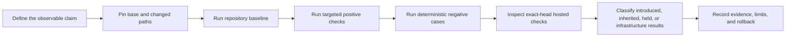

<!--
KFM_WIKI_SOURCE
page_id: Development-and-Validation
title: Development and Validation
status: PROPOSED wiki source; review required
updated: 2026-08-14
authority: orientation-only; canonical repository evidence and adopted KFM authority outrank this page
source_path: docs/wiki/Development-and-Validation.md
publication_effect: none until separately synchronized to the native GitHub Wiki
evidence_checkpoint: main@0abdce42ea0a41f88e86b7d97df0ebd79961e37b
-->
<a id="top"></a>

# Development and Validation

> **Run the smallest validation set that can prove the changed boundary, include its negative cases, and report exactly what the result does—and does not—establish.**

[Home](Home.md) · [Getting Started](Getting-Started.md) · [Repository Map](Repository-Map.md) · [Contributing](Contributing.md) · [Wiki Maintenance](Wiki-Maintenance.md)

> [!IMPORTANT]
> This page is an orientation guide. The current [`Makefile`](https://github.com/bartytime4life/Kansas-Frontier-Matrix/blob/main/Makefile), package metadata, target README, accepted ADRs, tests, workflows, and emitted artifacts control the work. A command, green check, receipt, pull request, merge, or wiki update does not by itself prove factual truth, rights clearance, security, deployment, release, promotion, or publication.

## At a glance

| Need | Current repository entry point | Bounded meaning |
|---|---|---|
| Python environment | Python `>=3.11`; `python -m pip install -e ".[test]"` | Installs the root scaffold and test extras declared in `pyproject.toml` |
| JavaScript environment | Node `>=22.13 <23`; `pnpm@11.17.0` | Uses the root workspace contract and lockfile |
| Schema/contract baseline | `make validate` | Aggregate schema validators plus configured schema and contract tests |
| Complete registered profile | `make validator-full` | Every entry in the current validator registry exactly once—not every checker in the repository |
| Focused trust-spine profile | `make validator-focused` | Smaller registry-declared evidence, decision, and receipt subset |
| Changed-area selection | `make validator-changed-area CHANGED_PATH_FILE=<file>` | Selects registered validators whose globs match newline-delimited changed paths |
| Repository guardrails | `make repository-guardrails` | Registry, workflow-security, and directory-topology guardrails |
| Explorer Web | `make ui-build` or package-scoped scripts | TypeScript/Vite build; browser and unit tests remain separate commands |
| Wiki source | Markdown, link, anchor, receipt, and hash checks | Validates reviewed `docs/wiki/` source; does not synchronize the native wiki |
| Hosted CI | Exact-head workflow jobs | Reviewer evidence for the steps that actually ran; not policy or release authority |

## Evidence checkpoint and authority

This page was reconciled against `main@0abdce42ea0a41f88e86b7d97df0ebd79961e37b`.

**CONFIRMED at that revision:**

- the root Python distribution requires Python 3.11 or newer and defines a `test` extra;
- the JavaScript workspace pins `pnpm@11.17.0` and Node `>=22.13 <23`;
- `make validate` remains the schema/contract compatibility baseline;
- the registry-driven validator orchestrator is available through `tools/validate_all.py`;
- `release-dry-run` and `publish-check` are substantive Make targets;
- `policy`, `fixtures`, `proof-slice`, and `catalog` remain non-enforcing readiness markers;
- root JavaScript `lint`, `test`, and `build` scripts intentionally fail with `WORKFLOW_HOLD`;
- wiki synchronization is dry-run-first and requires an explicit, separate `-Publish` action.

**NEEDS VERIFICATION for every new change:** installed toolchain, local command results, hosted exact-head results, branch/ruleset coupling, environment-specific behavior, and any release or deployment claim.

When prose and executable repository state disagree about current command behavior, inspect the current command source and report the documentation drift rather than flattening the conflict.

## Choose validation by claim

Validation depth follows the claim and changed boundary—not file count alone.



| Change class | Minimum useful evidence |
|---|---|
| Documentation | Structure, anchors, links, repository-target existence, rendering review, sensitive-content scan, receipt/hash parity when required |
| Contract or schema | Semantic review, schema validation, valid and invalid fixtures, compatibility tests, migration impact |
| Policy or sensitivity | Allow/deny/hold cases, obligation behavior, leakage checks, reviewer authority, public-safe transforms |
| Source, connector, or watcher | Source identity and role, rights/cadence review, no-network fixtures, malformed-input handling, non-publisher proof |
| API, UI, map, export, or AI | Governed-interface boundary, finite negative outcomes, evidence resolution, stale/correction behavior, accessibility and leakage checks |
| Workflow or CI | Trigger, path scope, permissions, untrusted-input model, action pins, failure semantics, check-name coupling, rollback |
| Release-adjacent | Evidence/policy/review closure, candidate manifest integrity, correction and rollback references, explicit non-publication boundary |

A documentation-only change does not need every repository workflow locally. A trust-bearing behavior change needs more than formatting and a broad aggregate command.

## Root Python baseline

Create an isolated environment from the repository root:

```bash
python -m venv .venv
. .venv/bin/activate
python -m pip install -e ".[test]"

make validate
git diff --check
```

On Windows PowerShell:

```powershell
python -m venv .venv
.\.venv\Scripts\Activate.ps1
python -m pip install -e ".[test]"
```

When GNU Make is unavailable, run the current underlying baseline directly:

```powershell
python tools/validators/_common/run_all.py
python -m pytest tests/schemas tests/contracts -q
git diff --check
```

`make validate` currently expands to:

```text
make schemas
  -> python tools/validators/_common/run_all.py

make test
  -> python -m pytest tests/schemas tests/contracts -q
```

The compatibility wrapper delegates to the registry-driven full profile. Read the current `Makefile`, `pyproject.toml`, target README, and validator runbook before relying on this expansion.

## JavaScript workspace baseline

The root workspace currently declares Node `>=22.13 <23`, `pnpm@11.17.0`, and a tracked `pnpm-lock.yaml`.

Use an approved toolchain that supplies the pinned pnpm version, then install from the lockfile:

```bash
pnpm --version
pnpm install --frozen-lockfile
```

Run package-scoped commands instead of the held root scripts:

```bash
pnpm --filter explorer-web build
pnpm --filter explorer-web test:unit
pnpm --filter explorer-web test:browser
```

The Explorer Web package also exposes:

```bash
pnpm --filter explorer-web test
```

That combined command runs its unit and browser suites. Browser tests may require the Playwright browser/runtime prerequisites documented by the package and CI environment.

> [!WARNING]
> Root `pnpm run lint`, `pnpm run test`, and `pnpm run build` intentionally exit nonzero with `WORKFLOW_HOLD`. Do not report those expected holds as regressions, and do not bypass them merely to obtain a green result.

## Registry-driven validator profiles

The canonical thin entry point is `tools/validate_all.py`. Its registry and implementation live under `tools/validators/`.

| Command | Selection | Important boundary |
|---|---|---|
| `make validator-registry-check` | Validates registry structure only | Runs no child validators |
| `make validator-list` | Lists profiles and validator IDs | Inventory, not conformance |
| `make validator-focused` | Registry-declared trust-spine subset | Narrower than the full profile |
| `make validator-full` | Every registered validator once, in registry order | Does not claim every repository checker is registered |
| `make validator-release-profile` | Release-adjacent fixture validators | No release, promotion, or publication effect |
| `make validator-changed-area CHANGED_PATH_FILE=<file>` | Glob matches against newline-delimited changed paths | Uses `--require-match`; an empty normalized path set returns `FAIL`, exit `1` rather than a vacuous pass |

Direct CLI examples:

```bash
python tools/validate_all.py --validate-registry
python tools/validate_all.py --list
python tools/validate_all.py --profile focused
python tools/validate_all.py --profile full
python tools/validate_all.py --profile release-dry-run
```

For an explicit changed path:

```bash
python tools/validate_all.py \
  --profile changed-area \
  --changed-path docs/wiki/Development-and-Validation.md
```

For a deterministic report:

```bash
python tools/validate_all.py \
  --profile full \
  --output artifacts/qa/validator-orchestrator.json \
  --quiet
```

The orchestrator's aggregate outcomes are finite:

| Outcome | Exit | Meaning |
|---|---:|---|
| `PASS` | `0` | Every selected child exited `0` |
| `ABSTAIN` | `0` | Changed-area selection matched no registered validator; no pass claim is made |
| `FAIL` | `1` | A child reported a governed validation failure, or a required changed-area selection matched nothing |
| `ERROR` | `2` | Registry, path, I/O, timeout, or child-system error |

Preserve the distinction between `FAIL` and `ERROR`. An arbitrary nonzero exit is not automatically a reviewed rejection.

## Targeted commands documented by the repository

Run a target only when the change affects the named surface, and inspect its implementation first.

| Command | Bounded purpose |
|---|---|
| `make validate` | Aggregate schema validators plus schema/contract tests |
| `make schemas` | Current compatibility wrapper for the registered full validator profile |
| `make test` | Configured schema and contract pytest suites |
| `make workflow-security` | Focused tests plus the 20-rule workflow-source ratchet |
| `make repository-topology` | Focused tests plus the directory-topology ratchet |
| `make repository-guardrails` | Validator-registry, workflow-security, and topology guardrails |
| `make hazards-validate` | Synthetic USDM materiality tests and fixture validation |
| `make governed-api-smoke` | Governed API test suite |
| `make governed-api-verify` | Governed API tests plus renderer/model import-boundary check |
| `make boundary-guards` | Policy, Explorer adapter, connector/pipeline, and API boundary tests |
| `make boundary-guards-ci` | Boundary tests with JUnit output under `artifacts/qa/` |
| `make deny-test` | Public-route, store, and runtime-import guards |
| `make ui-build` | Explorer Web production build |
| `make maplibre-perf` | MapLibre performance smoke plus candidate artifacts |
| `make maplibre-govern` | MapLibre performance-governance validation |
| `make maplibre-proof` | Candidate ProofPack build and validation; no release effect |
| `make evidence-resolver` | Internal evidence-candidate profile and tests |
| `make evidence-resolver-deny` | Evidence-resolver negative fixtures and tests |
| `make publish-check` | Fixture-only review-record and promotion-gate checks |
| `make release-dry-run` | Synthetic publication-denial dry run and tests |

Generated files under `artifacts/` remain build or reviewer aids unless a separate governed process admits them into an owning data or release lane.

## Holds, TODOs, and skips

At this page's evidence checkpoint, these Make targets print readiness markers and do not enforce their named capability:

| Target | Current output class |
|---|---|
| `make policy` | `TODO` marker for a future policy-engine lane |
| `make fixtures` | `TODO` marker for fixture regeneration |
| `make proof-slice` | `TODO` marker for a hydrology proof slice |
| `make catalog` | `TODO` marker for catalog building |

A zero exit from one of those targets is **not** substantive validation.

Older documentation may still group `release-dry-run` or `publish-check` with readiness markers. That classification is stale at the evidence checkpoint above: the current Makefile gives both targets executable fixture-backed behavior. Re-read current source rather than copying an older status table.

Interpret all outcomes precisely:

| Outcome | Meaning |
|---|---|
| `PASS` | The declared check passed for the declared revision and inputs |
| `FAIL` | The check found a governed violation |
| `ERROR` | The check could not complete reliably |
| `ABSTAIN` | The checker intentionally makes no pass/fail claim for this scope |
| `HOLD` | A prerequisite, authority, or implementation boundary remains unresolved |
| `SKIPPED` | Substantive behavior did not execute |
| `PARTIAL` | Only part of the acceptance boundary was exercised |
| `NOOP` | The requested transport or update would make no byte change |
| `PLANNED` | A dry-run diff or action plan was produced; no remote mutation occurred |
| `NOT RUN` | The check was not attempted |
| `NOT APPLICABLE` | The check does not bear on the changed boundary |

Do not rename a hold as readiness, an abstention as pass, a planned action as applied, or a skipped job as success.

## Changed-area workflow

A disciplined changed-area pass is usually:

```bash
git diff --name-only <base>...HEAD > /tmp/kfm-changed-paths.txt

make validator-changed-area \
  CHANGED_PATH_FILE=/tmp/kfm-changed-paths.txt
```

Then:

1. inspect the selected validator IDs;
2. add direct package, subsystem, documentation, policy, or workflow checks that the registry does not cover;
3. run deterministic negative cases;
4. preserve direct-CLI no-match `ABSTAIN` results; the Make target uses `--require-match` and returns `FAIL`/exit `1`;
5. compare the exact final head—not an earlier local commit—to the intended base;
6. inspect hosted checks after the draft pull request is created.

Changed-area selection is a routing aid. It cannot know every semantic dependency, public consequence, or reviewer obligation.

## Documentation and wiki validation

For `docs/wiki/` source changes:

1. Preserve `page_id`, `source_path`, page title, and established anchors unless a reviewed migration says otherwise.
2. Require one H1 per ordinary page.
3. Check heading hierarchy and balanced fences, tables, alerts, and HTML.
4. Validate every relative wiki-page link against the current `docs/wiki/` inventory.
5. Verify linked repository targets at the pinned base or final head.
6. Check `_Sidebar.md` coverage and duplicate page slugs.
7. Scan for secrets, restricted evidence, private records, and harmful precision.
8. Validate the generated receipt against its schema when required.
9. Recompute every declared artifact hash from the final bytes.
10. Review source rendering in the pull request.
11. Report native-wiki synchronization as a separate state.

The wiki helper can exercise the allowlist and staged-diff controls without publishing:

```powershell
pwsh -File tools/docs/wiki/sync_kfm_github_wiki.ps1 `
  -SourceCommit <reviewed-40-character-commit-sha>
```

A dry run may return `NOOP` or `PLANNED`. It does not initialize, commit, push, or prove synchronization of the native wiki. The explicit `-Publish` path is a separate reviewed public-documentation mutation and must not be inferred from a source-page update.

## Workflows and hosted checks

GitHub Actions orchestrate repository-owned commands. Workflow YAML does not become validator, policy, evidence, review, release, or publication authority.

Before changing or relying on CI, inspect:

- event trigger and changed-path filters;
- exact workflow and job names;
- fork and untrusted-code behavior;
- top-level and job permissions;
- secrets, OIDC, runner trust, caches, artifacts, and network access;
- immutable third-party action pins;
- timeout, concurrency, and cancellation behavior;
- `continue-on-error`, `if: always()`, shell fallbacks, and other failure masking;
- branch/ruleset coupling and check-name stability;
- disable, correction, and rollback path.

When a hosted check fails:

1. confirm the run's exact head SHA;
2. identify the first governing job and step failure;
3. reproduce on the pull-request head and current base when feasible;
4. classify the result as `INTRODUCED`, `INHERITED`, `FLAKY`, `INFRASTRUCTURE`, `HELD`, or `UNKNOWN`;
5. trace the smallest owning change before attributing cause;
6. repair only the dependency-closed defect owned by the task;
7. re-run or observe a new exact-head check.

Do not call a workflow required without current ruleset evidence. Do not use an earlier green run as proof for a later commit.

## Negative tests matter

KFM's trust boundaries require deterministic negative cases.

| Condition | Expected behavior |
|---|---|
| Missing or unresolved evidence | `ABSTAIN` or `HOLD` |
| Blocked rights or sensitivity | `DENY`, quarantine, or approved public-safe transform |
| Invalid schema or contract fixture | Validation failure |
| Stale, superseded, or conflicting support | Explicit conflict, `HOLD`, or `ABSTAIN` |
| Denied or error response | No sensitive payload, reason, coordinate, or internal-store leakage |
| Watcher or connector attempts publication | `DENY` |
| Missing release, correction, or rollback support | `HOLD` |
| Invalid path or parallel authority home | `HOLD` or `DENY` |
| Direct changed-area CLI matches nothing | `ABSTAIN` by default; a gated invocation using `--require-match` returns `FAIL`/exit `1` |
| Root JavaScript hold scripts run | Intentional nonzero `WORKFLOW_HOLD` |

A positive fixture without its meaningful negative counterpart is usually incomplete evidence for a fail-closed boundary.

## Reporting validation

Record enough information for another reviewer to reproduce and interpret the result.

| Field | Record |
|---|---|
| Command | Exact command, including flags and environment |
| Revision | Repository, branch, exact base SHA, and exact head SHA |
| Inputs | Fixtures, changed-path list, package, data class, and environment |
| Expected behavior | Positive result and negative case being exercised |
| Outcome | `PASS`, `FAIL`, `ERROR`, `ABSTAIN`, `HOLD`, `SKIPPED`, `PARTIAL`, `NOT RUN`, or `NOT APPLICABLE` |
| Classification | Introduced, inherited, flaky, infrastructure, held, or unknown |
| Evidence | Log, workflow run, JUnit, JSON report, screenshot, or artifact digest |
| Limitations | What the check did not prove |
| Follow-up | Owner, next check, correction, or rollback action |

Use a compact report when appropriate:

```text
Command:
Revision:
Scope and inputs:
Expected positive/negative behavior:
Outcome:
Evidence:
Classification:
Does not prove:
Follow-up or rollback:
```

A credible report can say that a check failed, was not run, or abstained. It must not convert missing evidence into persuasive certainty.

## Validation anti-patterns

Avoid:

- running only the broadest command and assuming every changed boundary was covered;
- reporting a command name without the revision or inputs;
- treating TODO output, a skipped job, a zero-match profile, or a dry run as pass;
- changing a validator, workflow, fixture, or policy merely to silence a legitimate failure;
- attributing an inherited baseline failure to the current pull request without comparison evidence;
- using network access in default tests when deterministic fixtures can prove the behavior;
- treating a generated receipt as proof, approval, or release authority;
- using client-side hiding as a substitute for upstream redaction or policy;
- declaring success from a green workflow whose governing step did not execute;
- omitting rollback because the change is “only documentation.”

## Validation references

- [Root README validation section](https://github.com/bartytime4life/Kansas-Frontier-Matrix/blob/main/README.md#build-and-validation)
- [Root contribution guide](https://github.com/bartytime4life/Kansas-Frontier-Matrix/blob/main/CONTRIBUTING.md#validation)
- [Makefile command surface](https://github.com/bartytime4life/Kansas-Frontier-Matrix/blob/main/Makefile)
- [Python project metadata](https://github.com/bartytime4life/Kansas-Frontier-Matrix/blob/main/pyproject.toml)
- [JavaScript workspace metadata](https://github.com/bartytime4life/Kansas-Frontier-Matrix/blob/main/package.json)
- [Validator orchestrator runbook](https://github.com/bartytime4life/Kansas-Frontier-Matrix/blob/main/docs/runbooks/VALIDATOR_ORCHESTRATOR.md)
- [Workflow governance](https://github.com/bartytime4life/Kansas-Frontier-Matrix/blob/main/.github/workflows/README.md)
- [Validators](https://github.com/bartytime4life/Kansas-Frontier-Matrix/tree/main/tools/validators)
- [Tests](https://github.com/bartytime4life/Kansas-Frontier-Matrix/tree/main/tests)
- [Fixtures](https://github.com/bartytime4life/Kansas-Frontier-Matrix/tree/main/fixtures)
- [Wiki source contract](https://github.com/bartytime4life/Kansas-Frontier-Matrix/blob/main/docs/wiki/README.md)
- [Wiki synchronization helper](https://github.com/bartytime4life/Kansas-Frontier-Matrix/blob/main/tools/docs/wiki/README.md)

---

[Contributing](Contributing.md) · [Wiki Maintenance](Wiki-Maintenance.md) · [Back to top](#top)
