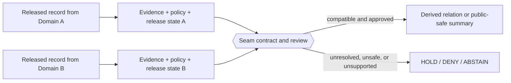

<!--
KFM_WIKI_SOURCE
page_id: Domains
title: Domains
version: v0.2.0
status: PROPOSED wiki source; review required
created: 2026-08-07
updated: 2026-08-14
authority: orientation-only; canonical repository evidence, adopted KFM doctrine, accepted ADRs, contracts, schemas, policy, lifecycle records, and release decisions outrank this page
source_path: docs/wiki/Domains.md
owning_root: docs/
responsibility: public orientation to KFM domain-lane identity, bounded-context scope, source-role boundaries, cross-domain seams, sensitivity posture, maturity, and governed delivery
evidence_snapshot: main@0abdce42ea0a41f88e86b7d97df0ebd79961e37b
prior_blob: 97f7edaba466934ec957d309c2cbf2ee6a296667
domain_lane_register_blob: 1bfc6f91cfa713a5e3d51ece011b63b46310734f
cross_domain_seam_register_blob: dc87ea9c2ab11cc10e51cf4e8284c030e7c9ab29
publication_effect: none until separately synchronized to the native GitHub Wiki
-->

  

# Domains

<strong>Thirteen bounded knowledge lanes · One trust spine · Explicit seams · Fail-closed sensitivity</strong>

  <a href="Home.md">Home</a> ·
  <a href="Architecture.md">Architecture</a> ·
  <a href="Governance-and-Evidence.md">Evidence</a> ·
  <a href="Data-Lifecycle.md">Lifecycle</a> ·
  <a href="Security-and-Sensitivity.md">Safety</a>

KFM domains are **bounded knowledge contexts** that own domain meaning, vocabulary, identity, and interpretation rules while sharing one evidence, policy, lifecycle, release, and public-delivery spine.

A domain is not a repository root, not a public-data permission, and not a license to absorb adjacent knowledge. It appears as a lane inside the responsibility roots that actually own documentation, contracts, schemas, policy, fixtures, tests, pipelines, lifecycle instances, and release decisions.

> [!IMPORTANT]
> This page is a public orientation projection. It does not create a domain, assign a steward, activate a source, adopt a sensitivity policy, authorize a cross-domain join, prove implementation maturity, release data, or publish KFM truth.

> [!NOTE]
> **Evidence checkpoint:** reviewed against [`main@0abdce42ea0a41f88e86b7d97df0ebd79961e37b`](https://github.com/bartytime4life/Kansas-Frontier-Matrix/tree/0abdce42ea0a41f88e86b7d97df0ebd79961e37b). The current machine register is a `PROPOSED` projection only. Repository bytes and documentation do not by themselves prove source rights, runtime enforcement, deployment, release, or native-wiki synchronization.

## At a glance

| Question | Current bounded answer |
|---|---|
| How many registered lanes are projected? | **13** ordered entries in [`control_plane/domain_lane_register.yaml`](https://github.com/bartytime4life/Kansas-Frontier-Matrix/blob/main/control_plane/domain_lane_register.yaml) |
| What authority does that register have? | `machine_projection_only`; it does not create domains or policy |
| How mature is the documentation set? | The current [`docs/domains/` index](https://github.com/bartytime4life/Kansas-Frontier-Matrix/blob/main/docs/domains/README.md) records 13 substantive lane READMEs; runtime maturity remains separate |
| Which names are canonical for new references? | The registered `lane_id` values shown below |
| Which aliases remain unresolved? | `air -> atmosphere`, `settlement -> settlements-infrastructure`, `transport -> roads-rail-trade` |
| What is not a registered domain lane? | `matrix`, `scene`, and `spatial` are recorded as cross-cutting exclusions |
| How are cross-domain joins governed? | Cite-only by default, evidence from every participant, most-restrictive policy/sensitivity, and separate release state |
| How complete is the seam register? | Partial: five high-risk initial seams, all currently `HOLD_UNRESOLVED` |
| What is the public rule? | Public clients consume governed APIs and released public-safe artifacts, never internal domain stores as the normal path |

**Quick navigation:** [Bounded contexts](#domains-as-bounded-contexts) · [Trust spine](#one-trust-spine) · [Lane inventory](#domain-lane-index) · [Shared packet](#shared-domain-packet) · [Source roles](#source-role-anti-collapse) · [Seams](#cross-domain-seams) · [Sensitivity](#sensitivity-and-public-safety) · [Maturity](#domain-maturity) · [Changes](#adding-or-changing-a-domain) · [Evidence](#evidence-boundary) · [References](#canonical-references)

---

## Domains as bounded contexts

Within a lane, terms should have stable meaning and ownership. Across lanes, the same word may carry different semantics and must be translated through an explicit seam rather than silently merged.

| A domain lane owns | A domain lane does not own by itself |
|---|---|
| Domain vocabulary and ubiquitous language | Repository-root authority |
| Stable domain identities and native relationships | Shared evidence, policy, or release object meaning |
| Domain observations, assertions, classifications, and interpretations | Source admission merely because a source is relevant |
| Domain-specific spatial and temporal semantics | Permission to expose exact or sensitive records |
| Source-role distinctions and fitness-for-use limits | Public API, map, or AI authority |
| Domain correction and supersession meaning | Approval, promotion, deployment, or publication |

KFM uses bounded-context thinking operationally:

1. **Define the context.** State what the lane owns and what it explicitly does not own.
2. **Use one language inside it.** Documentation, contracts, schemas, fixtures, validators, and code should use the same domain terms.
3. **Preserve source roles.** An observation, interpretation, model, forecast, regulatory record, aggregate, historical source, and synthetic fixture are not interchangeable.
4. **Map relationships explicitly.** Cross-lane relations preserve ownership on both sides.
5. **Do not build a domain root.** Domain depth is expressed inside responsibility roots.

Read the current [Domain Placement Law](https://github.com/bartytime4life/Kansas-Frontier-Matrix/blob/main/docs/architecture/domain-placement-law.md) for the reviewer-facing placement model.

[Back to top](#top)

---

## One trust spine

Every domain uses the same governed path from source material to public-safe use.

```mermaid
flowchart LR
    SRC["Source identity and role"] --> EVD["EvidenceRef -> EvidenceBundle"]
    EVD --> DOM["Bounded domain record or assertion"]
    DOM --> POL["Rights · sensitivity · policy"]
    POL --> VAL["Contract · schema · domain validation"]
    VAL --> LIFE["RAW -> WORK / QUARANTINE -> PROCESSED -> CATALOG / TRIPLET"]
    LIFE --> REL["Review · proof · release · rollback"]
    REL --> API["Governed API / released artifact"]
    API --> UI["MapLibre · Evidence Drawer · Focus Mode · export"]

    DOM -. "cross-domain candidate" .-> SEAM{{"Explicit seam review"}}
    SEAM -. "evidence from each lane" .-> POL
```

The trust spine means:

- a domain README cannot replace a contract or schema;
- a valid domain object may still be unsafe to release;
- a cross-domain relation cannot transfer authority from one lane to another;
- a tile, graph edge, summary, or AI answer remains a downstream carrier;
- correction, withdrawal, supersession, and rollback remain visible across public derivatives.

[Back to top](#top)

---

## Domain lane index

The order below follows the current machine projection. Lane links point to the human documentation home. The **anti-collapse boundary** is the minimum distinction the lane must preserve; it is not an exhaustive contract.

| Lane | Owns and explains | Anti-collapse and public-safety boundary |
|---|---|---|
| [**Agriculture**](https://github.com/bartytime4life/Kansas-Frontier-Matrix/tree/main/docs/domains/agriculture) `agriculture` | Crops, livestock, irrigation, land use, yields, farm-system observations, aggregates, and agricultural context | Aggregate statistics, field candidates, remote-sensing derivatives, private parcels, operators, and observed yields remain distinct |
| [**Archaeology**](https://github.com/bartytime4life/Kansas-Frontier-Matrix/tree/main/docs/domains/archaeology) `archaeology` | Sites, surveys, collections, cultural-temporal interpretation, provenience, and heritage documentation | Exact location, sovereignty, sacred knowledge, cultural sensitivity, and site vulnerability default to restriction |
| [**Atmosphere**](https://github.com/bartytime4life/Kansas-Frontier-Matrix/tree/main/docs/domains/atmosphere) `atmosphere` | Weather, climate, air quality, smoke, observations, forecasts, advisories, and modeled conditions | Observation, forecast, model, advisory, regulatory context, issue time, and freshness must remain visible |
| [**Fauna**](https://github.com/bartytime4life/Kansas-Frontier-Matrix/tree/main/docs/domains/fauna) `fauna` | Taxonomy, occurrence evidence, range, movement, status, invasive records, and stewardship context | An occurrence is not an established population or authoritative range; vulnerable precision is generalized or denied |
| [**Flora**](https://github.com/bartytime4life/Kansas-Frontier-Matrix/tree/main/docs/domains/flora) `flora` | Plant taxonomy, specimens, occurrences, phenology, invasive species, restoration, and ethnobotanical context | Rare-plant locations and culturally sensitive knowledge require role, consent, and precision review |
| [**Geology**](https://github.com/bartytime4life/Kansas-Frontier-Matrix/tree/main/docs/domains/geology) `geology` | Bedrock and surficial geology, stratigraphy, structures, subsurface references, minerals, resources, and reclamation context | Observation, interpretation, model, occurrence, deposit, estimate, extraction, production, and regulation must not collapse |
| [**Habitat**](https://github.com/bartytime4life/Kansas-Frontier-Matrix/tree/main/docs/domains/habitat) `habitat` | Land cover, habitat patches, condition, suitability, connectivity, restoration, and ecological context | Suitability, connectivity, classification, and restoration priorities remain derived and uncertainty-bearing |
| [**Hazards**](https://github.com/bartytime4life/Kansas-Frontier-Matrix/tree/main/docs/domains/hazards) `hazards` | Hazard events, exposure, vulnerability, resilience, official advisories as context, and recovery | KFM does not become an official warning, forecast, or emergency-action authority |
| [**Hydrology**](https://github.com/bartytime4life/Kansas-Frontier-Matrix/tree/main/docs/domains/hydrology) `hydrology` | Watersheds, reaches, hydrography, surface water, groundwater, observations, and water context | Measurements, modeled conditions, regulatory context, advisories, and hydrologic identity remain distinct and time-aware |
| [**People, DNA & Land**](https://github.com/bartytime4life/Kansas-Frontier-Matrix/tree/main/docs/domains/people-dna-land) `people-dna-land` | Person assertions, genealogy, relationships, life and residence events, genomic references, land, and title context | Living-person, DNA/genomic, private-land, person-parcel, disputed-title, and identity-resolution data default to deny or staged access |
| [**Roads, Rail & Trade**](https://github.com/bartytime4life/Kansas-Frontier-Matrix/tree/main/docs/domains/roads-rail-trade) `roads-rail-trade` | Modern and historical networks, corridors, crossings, depots, facilities, route membership, and trade context | Historic uncertainty, private access, operational detail, and infrastructure sensitivity require bounded exposure |
| [**Settlements & Infrastructure**](https://github.com/bartytime4life/Kansas-Frontier-Matrix/tree/main/docs/domains/settlements-infrastructure) `settlements-infrastructure` | Settlements, municipalities, townsites, services, facilities, networks, dependencies, and change over time | Settlement identity does not authorize precise critical-asset or private-facility exposure |
| [**Soil**](https://github.com/bartytime4life/Kansas-Frontier-Matrix/tree/main/docs/domains/soil) `soil` | Soil surveys, map units, components, horizons, properties, interpretations, moisture, and soil-climate support | Static survey, station observation, gridded derivative, interpretation, and satellite support must remain distinct |

### Cross-cutting systems are not domain lanes

The current register deliberately excludes:

| Cross-cutting concern | Why it is not a registered domain |
|---|---|
| `spatial` | Shared geography, CRS, scale, geometry, and representation infrastructure used by every lane |
| `matrix` | Cross-domain analytical and publication product assembled from governed lane outputs |
| `scene` | 2D/3D/synthetic presentation carrier that remains downstream of evidence and release |

A Focus Mode, county slice, dashboard, story, map scene, or analytical matrix is compositional work over domains. It does not become a new domain merely because it is important.

### Current aliases

Use registered lane IDs in new work. These aliases remain unresolved compatibility terms:

| Alias | Registered lane |
|---|---|
| `air` | `atmosphere` |
| `settlement` | `settlements-infrastructure` |
| `transport` | `roads-rail-trade` |

Do not create parallel folders, contracts, schemas, policies, or public routes under both names without an accepted migration or compatibility decision.

[Back to top](#top)

---

## Shared domain packet

The packet is shared; the evidence burden and risk are domain-specific.

| Concern | Minimum lane obligation | Owning responsibility |
|---|---|---|
| Scope and non-scope | Define what the lane owns, adjacent contexts, prohibited inferences, and ubiquitous language | `docs/` plus reviewed decisions |
| Domain identity | Stable IDs, aliases, versioning, correction, and supersession semantics | Domain contract and governing registers |
| Source posture | Source identity, role, authority, terms, cadence, geography, time, rights, and sensitivity | SourceDescriptor and source-registry authorities |
| Semantic meaning | Define entities, value objects, observations, assertions, events, and relationships | `contracts/` |
| Machine shape | Required fields, constraints, references, versions, and compatibility behavior | `schemas/` |
| Admissibility | Allow, deny, hold, restrict, redact, generalize, delay, review, and abstain rules | `policy/` |
| Enforceability | Positive, invalid, stale, denied, sensitivity, correction, and rollback fixtures plus validators | `fixtures/`, `tests/`, and validator tools |
| Transformation | Pinned inputs, method, uncertainty, identity, geometry, time, and receipts | `connectors/`, `pipelines/`, `packages/`, and `tools/` |
| Lifecycle | Correct RAW, WORK, QUARANTINE, PROCESSED, CATALOG/TRIPLET, receipt, proof, registry, and public-safe carrier placement | governed `data/` lanes |
| Release and repair | Review, promotion, manifest, correction, withdrawal, supersession, and rollback decisions | `release/` |
| Public use | Governed finite envelopes, released artifacts, evidence display, and trust-visible negative states | `apps/governed-api/` and governed clients |

A mature packet is dependency-closed for its declared slice. It does not need every possible object, but every consequential claim must have enough source, evidence, policy, validation, release, correction, and rollback support for its significance.

[Back to top](#top)

---

## Source-role anti-collapse

Every lane should preserve the role of support before combining it with other evidence.

| Source or support role | Safe use | Unsafe collapse |
|---|---|---|
| Observation or measurement | Supports what was observed under a method, place, and time | Treating it as a forecast, causal explanation, or complete condition |
| Authoritative interpretation | Supports an issuing expert or agency interpretation | Recasting interpretation as direct observation |
| Model or derived surface | Supports a declared method, assumptions, resolution, and uncertainty | Presenting modeled output as measured truth |
| Forecast or advisory | Supports an issued outlook or official action context | Treating the advisory as the underlying measurement or future fact |
| Regulatory or administrative record | Supports legal, permit, reporting, or program state | Treating a permit, lease, title, or filing as proof of physical conditions |
| Aggregate or index | Supports a declared population, method, suppression rule, and geography | Inferring individual, parcel, site, or exact-location facts |
| Historical source | Supports what the record states in its context and provenance | Silently applying modern identity, geography, or certainty |
| Community report | Supports a report with declared verification status | Promoting unverified report content to authoritative observation |
| Synthetic fixture | Proves software behavior only | Treating fixture values as Kansas evidence |

Cross-source agreement can strengthen confidence, but repetition does not erase role, scale, time, uncertainty, rights, or source limitations.

[Back to top](#top)

---

## Cross-domain seams

A seam is an explicit context map between lanes. It is not a merge of models and not permission to duplicate or mutate another lane's records.

The current machine seam register applies these default rules:

- **interaction:** `CITE_ONLY`;
- **evidence:** every participant requires its own `EvidenceBundle`;
- **source roles:** preserve them;
- **sensitivity and policy:** apply the most restrictive participant posture;
- **release:** every participant requires compatible release state;
- **authority:** no mutation or publication authority is created.

The register is intentionally partial. Its five initial high-risk seams are all `HOLD_UNRESOLVED`, have no accepted seam-contract path, and do not authorize public joins.

| Seam | Context that may be related | Prohibited inference |
|---|---|---|
| Agriculture × Soil | Soil map-unit and property context may inform agricultural suitability | Private farm/operator/parcel/yield join; soil property presented as observed crop yield |
| Archaeology × Roads/Rail/Trade | Historic corridor identity may provide archaeological context | Corridor inflection presented as site location; route presented as archaeological evidence |
| Atmosphere × Hazards | Atmospheric observations and models may be cited by hazard products | Advisory presented as measurement; modeled forecast presented as observed condition |
| Fauna × Hydrology | Hydrologic-unit or reach identity may contextualize aquatic occurrence evidence | Occurrence presented as established population; public HUC used as precise sensitive occurrence |
| Hazards × Settlements/Infrastructure | Settlement and infrastructure context may support exposure summaries | Exposure summary presented as exact asset location; hazard geometry presented as infrastructure identity |

A derived seam output must point back to both participants and remain correctable when either source record, evidence bundle, policy decision, or release changes.

[Back to top](#top)

---

## Sensitivity and public safety

Sensitivity follows the material, not the folder name. A nominally low-risk lane may contain a high-risk record, and a high-risk lane may produce a carefully generalized public-safe derivative.

The machine domain register currently carries proposed baseline labels, but its sensitivity authority remains pending. Those values do **not** constitute adopted policy or release permission.

Domains and seams normally requiring heightened review include:

- exact rare-species and rare-plant occurrences;
- archaeological sites, provenience, sacred places, and culturally restricted knowledge;
- living-person identities, family/private records, DNA/genomic material, and person-parcel joins;
- critical infrastructure, private facilities, private wells, and harmful operational precision;
- disputed land/title assertions and private ownership context;
- source material with unresolved rights, consent, sovereignty, redistribution, or attribution obligations.

Public-safe handling may require aggregation, coordinate generalization, field removal, delayed release, role-gated access, minimum-count thresholds, redacted evidence summaries, or denial.

> [!CAUTION]
> Transform sensitive material before delivery. Client-side filters, hidden map layers, CSS, or AI instructions are not security boundaries when restricted values are already present in the payload, DOM, logs, cache, or browser state.

Read [Security and Sensitivity](Security-and-Sensitivity.md) for the public-facing handling rules.

[Back to top](#top)

---

## Domain maturity

Documentation presence is not completion. Assess each lane claim by claim and at a known revision.

| Maturity question | Evidence that can support it | What that evidence does not prove alone |
|---|---|---|
| Is the lane documented? | Substantive README, scope, vocabulary, source roles, risks, and verification backlog | Implemented contracts, sources, or runtime |
| Is the lane registered? | Machine projection, stable lane ID, aliases, path identity, validator, and tests | Adopted domain authority or steward assignment |
| Is the model enforceable? | Contract, schema, valid/invalid fixtures, semantic validator, and compatibility tests | Source rights, evidence truth, or public release |
| Can sources be admitted? | Current SourceDescriptor, rights/terms review, activation decision, deterministic probe, and negative cases | Successful end-to-end processing or publication |
| Is lifecycle closure demonstrated? | Pinned RAW capture, transform receipts, processed output, catalog/proof closure, and correction lineage | Release or deployment |
| Is a public product governed? | Public-safe transform, policy/review records, release manifest, rollback target, governed API/UI tests | Current operational availability |
| Is it operational? | Exact-release deployment, runtime logs, health evidence, correction propagation, rollback drill, and public readback | Permanent truth or exemption from future correction |

Useful status language remains narrow:

- `CONFIRMED` for the exact evidence inspected;
- `PROPOSED` for designs and not-yet-adopted projections;
- `NEEDS VERIFICATION` for concrete checks still open;
- `UNKNOWN` when support is insufficient;
- `HOLD`, `ABSTAIN`, `DENY`, or `ERROR` for bounded system and review outcomes.

[Back to top](#top)

---

## Adding or changing a domain

A new or materially redefined domain is an authority-changing decision, not a convenience-folder change.

Before changing the inventory:

1. **Inspect current authority.** Check accepted ADRs, Directory Rules, the domain register, aliases, open work, and the owning documentation.
2. **Prove a distinct bounded context.** Define vocabulary, responsibility, non-scope, users, native identities, and why an existing lane cannot own the model safely.
3. **Choose one stable lane ID.** Record aliases and migration rules; do not create parallel names.
4. **Map responsibility roots.** Explain where documentation, meaning, shape, policy, tests, lifecycle material, implementation, and release decisions belong—without creating a domain root.
5. **Define source roles and sensitivity.** Include rights, consent, sovereignty, harmful precision, public-safe transforms, and review burden.
6. **Define seams.** Record which domains may be cited, who owns each assertion, prohibited inferences, and the most-restrictive policy rule.
7. **Provide enforceable evidence.** Add fixtures, validators, negative cases, compatibility behavior, and rollback/correction handling appropriate to the change.
8. **Use a reviewed decision.** The machine register projects an adopted inventory; it does not create or ratify one itself.
9. **Preserve reversibility.** Include alias windows, link repair, consumer migration, rollback, and supersession records.

A Focus Mode, county packet, map scene, dataset, source, application, or one-off analysis is not automatically a new domain.

[Back to top](#top)

---

## Evidence boundary

This page was revised from repository evidence inspected at `main@0abdce42ea0a41f88e86b7d97df0ebd79961e37b`.

**CONFIRMED at that checkpoint:**

- `docs/wiki/Domains.md` existed at the stable source path;
- accepted ADR-0029 governs placement through the adopted Directory Rules;
- `control_plane/domain_lane_register.yaml` projects 13 ordered lanes, three unresolved aliases, and three cross-cutting exclusions;
- the current `docs/domains/README.md` records 13 substantive lane READMEs and a populated machine projection;
- `control_plane/cross_domain_seam_register.yaml` records five partial high-risk seams, all held and non-public;
- domain documentation, machine projections, and wiki orientation have explicit non-effects.

**PROPOSED, UNKNOWN, or NEEDS VERIFICATION from this page alone:**

- domain steward identities and independent review;
- adopted sensitivity baselines and seam contracts;
- complete recursive contract/schema/policy/source/test coverage;
- current source rights, activation, and payload-level sensitivity;
- end-to-end evidence, catalog, proof, release, correction, and rollback closure;
- governed API/UI runtime parity, deployment, public availability, and native-wiki synchronization.

A detailed lane page, machine register, green workflow, generated receipt, or polished map does not upgrade those unknowns by itself.

[Back to top](#top)

---

## Canonical references

| Area | Source |
|---|---|
| Human domain index | [`docs/domains/README.md`](https://github.com/bartytime4life/Kansas-Frontier-Matrix/blob/main/docs/domains/README.md) |
| Machine lane projection | [`control_plane/domain_lane_register.yaml`](https://github.com/bartytime4life/Kansas-Frontier-Matrix/blob/main/control_plane/domain_lane_register.yaml) |
| Cross-domain seam projection | [`control_plane/cross_domain_seam_register.yaml`](https://github.com/bartytime4life/Kansas-Frontier-Matrix/blob/main/control_plane/cross_domain_seam_register.yaml) |
| Placement model | [Domain Placement Law](https://github.com/bartytime4life/Kansas-Frontier-Matrix/blob/main/docs/architecture/domain-placement-law.md) |
| Adopted placement authority | [Directory Rules](https://github.com/bartytime4life/Kansas-Frontier-Matrix/blob/main/docs/doctrine/directory-rules.md) and [ADR-0029](https://github.com/bartytime4life/Kansas-Frontier-Matrix/blob/main/docs/adr/ADR-0029-adopt-directory-governance-standard-v2.md) |
| Evidence and policy orientation | [Governance and Evidence](Governance-and-Evidence.md) |
| Lifecycle orientation | [Data Lifecycle](Data-Lifecycle.md) |
| Public safety orientation | [Security and Sensitivity](Security-and-Sensitivity.md) |
| Map and AI boundary | [Map, UI, and AI](Map-UI-and-AI.md) |
| Current implementation posture | [Project Status](Project-Status.md) |

---

[Home](Home.md) · [Architecture](Architecture.md) · [Governance and Evidence](Governance-and-Evidence.md) · [Data Lifecycle](Data-Lifecycle.md) · [Project Status](Project-Status.md) · [Back to top](#top)
