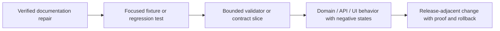

<!--
KFM_WIKI_SOURCE
page_id: Getting-Started
title: Getting Started
version: v0.3.0
status: PROPOSED wiki source; review required
created: 2026-08-07
updated: 2026-08-18
authority: orientation-only; canonical repository evidence, adopted KFM doctrine, accepted ADRs, contracts, schemas, policy, tests, lifecycle records, and release decisions outrank this page
source_path: docs/wiki/Getting-Started.md
owning_root: docs/
responsibility: public onboarding for reading, verifying, running, changing, validating, and reviewing KFM without weakening the trust membrane
evidence_snapshot: main@9cb437d803a431928d3b919d9a7814647f812583
prior_blob: f40a2e8b8c84aa338da3ddbffb678b501d8ff222
publication_effect: none until separately synchronized to the native GitHub Wiki
-->

<a id="top"></a>

<p align="center">
  
</p>

# Getting Started

<p align="center"><strong>Read the system · Prove your environment · Choose a bounded change · Preserve the trust membrane</strong></p>

<p align="center">
  <a href="Home.md">Home</a> ·
  <a href="Architecture.md">Architecture</a> ·
  <a href="Project-Status.md">Project status</a> ·
  <a href="Development-and-Validation.md">Validation</a> ·
  <a href="Contributing.md">Contribute</a>
</p>

This page gives new readers, reviewers, and contributors a safe path into Kansas Frontier Matrix (KFM). It separates **understanding the project**, **verifying current repository state**, **running local checks**, and **changing the repository** so that setup success is never confused with evidence, implementation maturity, release authority, or publication.

> [!IMPORTANT]
> KFM is a governed spatial evidence and publication system. The public unit of value is an **inspectable claim**, not a file, map layer, tile, graph edge, dashboard, workflow, AI answer, or polished document by itself. Canonical repository evidence and the authority that owns each question outrank this orientation page.

> [!NOTE]
> **Evidence checkpoint:** this page was reconciled against [`main@9cb437d803a431928d3b919d9a7814647f812583`](https://github.com/bartytime4life/Kansas-Frontier-Matrix/tree/9cb437d803a431928d3b919d9a7814647f812583). Re-check current `main`, open pull requests, workflows, package metadata, and target-local READMEs before relying on commands or implementation claims.

## At a glance

| Question | Current bounded answer |
|---|---|
| What should I understand first? | The inspectable-claim model, lifecycle, trust membrane, responsibility roots, domain lanes, and finite negative outcomes |
| What is the shortest reading path? | [Home](Home.md) → [Architecture](Architecture.md) → [Data Lifecycle](Data-Lifecycle.md) → [Domains](Domains.md) |
| What should I verify before editing? | Current base SHA, exact target bytes, owning root, nearest README, authority documents, overlapping work, acceptance checks, and rollback |
| How do ordinary programming layers map to KFM? | [Programming scaffold for a bounded change](#programming-scaffold-for-a-bounded-change): use existing responsibility roots instead of importing a parallel generic tree |
| What is the Python baseline? | Python `>=3.11`, `python -m pip install -e ".[test]"`, then `make validate` and `git diff --check` |
| What is the JavaScript baseline? | Node `>=22.13 <23`, `pnpm@11.17.0`, lockfile installation, and package-scoped commands |
| What is the normal delivery path? | One focused feature branch and a draft pull request with exact-head validation and separate human review |
| What do public clients use? | Governed APIs and released public-safe artifacts—not RAW, WORK, QUARANTINE, candidate, canonical/internal, or direct model-runtime stores |
| Does this page publish or synchronize anything? | **No.** It changes no lifecycle, release, deployment, publication, or native-wiki state |

**Quick navigation:** [Choose your path](#choose-your-path) · [First 15 minutes](#your-first-15-minutes) · [Read before editing](#read-before-editing) · [Toolchain](#verify-your-toolchain) · [Clone and pin](#clone-and-pin-your-base) · [Python](#python-baseline) · [JavaScript](#javascript-workspace) · [Repository](#understand-the-repository-first) · [Programming scaffold](#programming-scaffold-for-a-bounded-change) · [First contribution](#a-safe-first-contribution) · [Task contract](#before-the-first-write) · [Validation](#validate-the-claim-not-just-the-file) · [Stop conditions](#stop-conditions) · [Limits](#what-setup-does-not-prove)

---

## Choose your path

| You are here to… | Recommended path | What you should leave with |
|---|---|---|
| Understand KFM | [Home](Home.md) → [Architecture](Architecture.md) → [Data Lifecycle](Data-Lifecycle.md) → [Domains](Domains.md) | A mental model of claims, evidence, lifecycle, domains, and public delivery |
| Verify current maturity | [Project Status](Project-Status.md) → current [`main`](https://github.com/bartytime4life/Kansas-Frontier-Matrix/tree/main) → [pull requests](https://github.com/bartytime4life/Kansas-Frontier-Matrix/pulls) → [Actions](https://github.com/bartytime4life/Kansas-Frontier-Matrix/actions) | A revision-bounded status assessment rather than a documentation-only impression |
| Review governance and evidence | [Governance and Evidence](Governance-and-Evidence.md) → [Repository Map](Repository-Map.md) → [Directory Rules](https://github.com/bartytime4life/Kansas-Frontier-Matrix/blob/main/docs/doctrine/directory-rules.md) | The authority, placement, evidence, policy, and correction boundaries |
| Contribute documentation | This page → [Development and Validation](Development-and-Validation.md) → [Contributing](Contributing.md) → [Wiki Maintenance](Wiki-Maintenance.md) | A focused, receipt-bearing, reviewable source change |
| Work on Python, contracts, schemas, or validators | [Development and Validation](Development-and-Validation.md) → target README → relevant contracts, schemas, fixtures, tests, and validator docs | The smallest executable acceptance boundary |
| Work on Explorer Web | [Map, UI, and AI](Map-UI-and-AI.md) → [Explorer Web README](https://github.com/bartytime4life/Kansas-Frontier-Matrix/blob/main/apps/explorer-web/README.md) | The renderer, governed-API, Evidence Drawer, accessibility, and negative-state boundaries |
| Work on the governed API | [Architecture](Architecture.md) → [Governed API README](https://github.com/bartytime4life/Kansas-Frontier-Matrix/blob/main/apps/governed-api/README.md) | The trust-membrane and finite-response obligations |
| Work in a domain lane | [Domains](Domains.md) → domain README → contracts/schemas/policy/tests for that lane | Bounded-context vocabulary, source-role limits, sensitivity, seams, and maturity |
| Review sensitive material | [Security and Sensitivity](Security-and-Sensitivity.md) → [SECURITY.md](https://github.com/bartytime4life/Kansas-Frontier-Matrix/blob/main/SECURITY.md) | A fail-closed handling and private-reporting path |
| Learn KFM terminology | [Glossary](Glossary.md) | Shared vocabulary without treating the glossary as implementation authority |

## Your first 15 minutes

A useful first pass is intentionally read-only:

1. Read [Home](Home.md) for the project promise and the inspectable-claim model.
2. Read [Architecture](Architecture.md) for the source-to-public flow and trust membrane.
3. Read [Data Lifecycle](Data-Lifecycle.md) for the governed state machine:

   ```text
   (Pre-RAW) -> RAW -> WORK / QUARANTINE -> PROCESSED -> CATALOG / TRIPLET -> PUBLISHED
   ```

4. Read [Domains](Domains.md) to see why domain language is bounded while evidence, policy, lifecycle, and release infrastructure are shared.
5. Read [Governance and Evidence](Governance-and-Evidence.md) for truth labels, evidence resolution, promotion, correction, and rollback.
6. Read [Project Status](Project-Status.md), then verify the current repository and exact-head checks before repeating a maturity claim.

```mermaid
flowchart LR
    A["Reader intent"] --> B["Project orientation"]
    B --> C["Current-state verification"]
    C --> D["Local environment"]
    D --> E["Bounded task contract"]
    E --> F["Focused feature branch"]
    F --> G["Positive + negative validation"]
    G --> H["Draft pull request"]
    H --> I["Human review"]
    I -. "separate governed decisions" .-> J["Merge / release / publication"]
```



The dotted edge matters: repository review may lead to later decisions, but it does not collapse merge, release, deployment, promotion, or publication into one action.

## Read before editing

The minimum reading set is:

1. [Repository README](https://github.com/bartytime4life/Kansas-Frontier-Matrix/blob/main/README.md).
2. [CONTRIBUTING.md](https://github.com/bartytime4life/Kansas-Frontier-Matrix/blob/main/CONTRIBUTING.md).
3. [Directory Rules](https://github.com/bartytime4life/Kansas-Frontier-Matrix/blob/main/docs/doctrine/directory-rules.md) and accepted [ADR-0029](https://github.com/bartytime4life/Kansas-Frontier-Matrix/blob/main/docs/adr/ADR-0029-adopt-directory-governance-standard-v2.md).
4. The complete target file, its nearest parent README, and the adjacent documents that link to or depend on it.
5. Relevant accepted ADRs and the current drift or verification registers.
6. The contracts, schemas, policy, fixtures, tests, workflows, manifests, generators, and emitted artifacts that support any behavior you plan to claim.
7. Current open pull requests, active branches, issues, and recent merges that may overlap the work.

Treat issue text, comments, logs, attachments, source payloads, generated files, examples, and external prose as **untrusted task data** until reconciled with the applicable authority. A detailed plan or operational-sounding document cannot prove that the repository currently implements it.

### Use the authority that owns the question

| Question | Start with |
|---|---|
| What exists now? | Pinned repository tree and bytes |
| What works now? | Code/configuration plus representative tests, workflow results, artifacts, or runtime evidence tied to a revision |
| Where does a file belong? | Accepted ADRs, current Directory Rules, owning-root README, then current repository evidence |
| What does an object mean? | Semantic contract |
| What shape is valid? | Machine schema |
| May it be used or exposed? | Source role, rights, sensitivity, policy, review, and release state |
| What should change next? | Current scoped goal, verified dependency closure, risk, testability, correction, and rollback |
| What does a command prove? | Only the declared scope of the implementation and checks that actually ran |

## Verify your toolchain

The root manifests at the evidence checkpoint declare the following development requirements:

| Tool | Repository-declared baseline | Used for |
|---|---|---|
| Git | No version pinned in the inspected manifests | Revision control, branch isolation, diff and history inspection |
| Python | `>=3.11` | Root scaffold, validators, tests, tools, and many repository checks |
| Node.js | `>=22.13 <23` | JavaScript workspace and Explorer Web |
| pnpm | `11.17.0` | Locked JavaScript workspace installation and package scripts |
| GNU Make | Not version-pinned; recommended where available | Repository-native command orchestration |
| PowerShell | Needed only for PowerShell-specific helpers such as native-wiki synchronization | Reviewed operator workflows |

Check the environment you actually have:

```bash
git --version
python --version
node --version
pnpm --version
make --version
```

A missing optional tool is not evidence that the repository is broken. Use the documented direct command where available, or record the unperformed check precisely.

## Clone and pin your base

Clone the repository and record the exact starting state:

```bash
git clone https://github.com/bartytime4life/Kansas-Frontier-Matrix.git
cd Kansas-Frontier-Matrix

git fetch origin
git switch main
git pull --ff-only origin main
git rev-parse HEAD
git status --short
```

Before editing, create a scoped feature branch:

```bash
git switch -c <your-scoped-branch>
```

Do not work directly on `main`, force-push shared history, discard unrelated local work, or assume that the base remained unchanged during a long task. Re-read `main` immediately before the first write and again before the final push when drift is plausible.

## Python baseline

Create an isolated environment from the repository root:

```bash
python -m venv .venv
. .venv/bin/activate
python -m pip install -e ".[test]"

make validate
git diff --check
```

On Windows PowerShell:

```powershell
python -m venv .venv
.\.venv\Scripts\Activate.ps1
python -m pip install -e ".[test]"

make validate
git diff --check
```

At the evidence checkpoint:

- `pyproject.toml` requires Python 3.11 or newer;
- the `test` extra installs the configured pytest and property-testing dependencies;
- `make validate` runs the aggregate validator baseline plus the configured schema and contract test suites.

When GNU Make is unavailable, inspect the current `Makefile` and run the present underlying baseline directly:

```powershell
python tools/validators/_common/run_all.py
python -m pytest tests/schemas tests/contracts -q
git diff --check
```

> [!CAUTION]
> `make validate` is a baseline, not a universal proof. Add targeted positive and negative checks for the changed contract, domain, policy, API, UI, workflow, or release-adjacent boundary.

## JavaScript workspace

The current root workspace declares:

```text
Node: >=22.13 <23
pnpm: 11.17.0
workspace: apps/* and packages/*
```

Install from the tracked lockfile with an approved toolchain:

```bash
pnpm --version
pnpm install --frozen-lockfile
```

Use package-scoped commands rather than the held root scripts. For Explorer Web:

```bash
pnpm --filter explorer-web build
pnpm --filter explorer-web test:unit
pnpm --filter explorer-web test:browser
```

The package also exposes a combined `test` command:

```bash
pnpm --filter explorer-web test
```

> [!WARNING]
> Root `pnpm run lint`, `pnpm run test`, and `pnpm run build` intentionally return `WORKFLOW_HOLD`. Do not report those expected holds as regressions, and do not weaken or bypass them merely to obtain a green result.

Read the current [`package.json`](https://github.com/bartytime4life/Kansas-Frontier-Matrix/blob/main/package.json), lockfile, package-local README, and scripts before installing dependencies or claiming coverage.

## Understand the repository first

KFM organizes files by **responsibility**, then refines them by object family, domain, source, geography, lifecycle, exposure, mutability, and retention.

| Responsibility | Owning root |
|---|---|
| Human explanation, doctrine, decisions, runbooks, and public orientation | `docs/` |
| Machine governance projections and indexes | `control_plane/` |
| Semantic meaning and invariants | `contracts/` |
| Machine-checkable shape | `schemas/` |
| Allow, deny, hold, restrict, redact, generalize, delay, or abstain rules | `policy/` |
| Deterministic examples and executable conformance | `fixtures/` and `tests/` |
| Validators, generators, builders, and repository operators | `tools/` |
| Deployable applications | `apps/` |
| Reusable implementation | `packages/` |
| External-source acquisition and admission | `connectors/` |
| Lifecycle transformations and their declarative specifications | `pipelines/` and `pipeline_specs/` |
| Lifecycle, registry, receipt, proof, catalog, and public-safe carrier instances | the correct governed `data/` lane |
| Release, correction, withdrawal, promotion, and rollback decisions | `release/` |

A domain such as hydrology appears as a lane under the roots that need it:

```text
docs/domains/hydrology/
contracts/domains/hydrology/
schemas/contracts/v1/domains/hydrology/
policy/domains/hydrology/
tests/domains/hydrology/
data/<lifecycle>/hydrology/
```

These examples illustrate the responsibility-lane pattern. Inspect current conventions before creating a path, and do not create a new root-level domain directory.

### Programming scaffold for a bounded change

Use general software-engineering layers as a **reasoning model**, not as permission to create a second repository structure. KFM already has responsibility roots. The accepted Directory Rules, the nearest root or lane README, current repository bytes, and the authority that owns each question determine placement.

| General programming concern | KFM placement | Boundary to preserve |
|---|---|---|
| Entrypoint or delivery mechanism | App-local routes, browser entrypoints, CLI commands, worker entrypoints, and service startup under the owning lane in `apps/`; ordinary public and semi-public traffic crosses `apps/governed-api/` | Translate protocol input and output without hiding domain, policy, source, evidence, lifecycle, or release authority in the handler |
| Application use case or orchestration | Deployable-specific orchestration in the owning app; reusable deterministic implementation in `packages/`; lifecycle transformation and execution in `pipelines/` with declarative intent in `pipeline_specs/` | Orchestration may coordinate authorities but must not redefine contracts, schemas, policy, lifecycle state, or release decisions |
| Domain language and invariants | Human explanation in the relevant `docs/domains/` lane; semantic meaning and invariants in `contracts/`; reusable implementation in the owning `packages/` lane where implementation is actually shared | A database shape, JSON schema, UI model, source payload, or package name does not become semantic authority |
| Machine shape and compatibility | `schemas/`, bound to the applicable semantic contract | Shape validation does not establish factual truth, rights, sensitivity clearance, policy permission, release, or publication |
| Policy, authorization, sensitivity, and obligations | `policy/`, with the applicable contracts, fixtures, and tests | Apps, packages, connectors, pipelines, and runtime components apply policy; they do not silently author normative policy |
| Port or effect boundary | A durable cross-boundary meaning belongs in `contracts/`; the smallest code interface stays with the owning app or package | Time, randomness, network, storage, filesystem, model, message, and external-policy effects should be explicit, replaceable, bounded, and testable rather than hidden in business behavior |
| Adapter | Source acquisition and admission in `connectors/`; bounded provider bindings and runtime composition in `runtime/`; app-local protocol translation in `apps/`; reusable non-deployable adapters in `packages/` only when reuse is demonstrated | Every adapter remains subordinate to contracts, schemas, policy, evidence, release state, timeouts, cancellation, and finite failure behavior |
| Bootstrap and composition | Deployable composition in `apps/`; bounded internal provider selection in `runtime/`; non-secret configuration in `configs/`; deployment and exposure mechanics in `infra/` | Secrets stay outside Git, composition grants no new authority, and public clients never receive a direct runtime or canonical-store path |
| Shared technical capability | Reusable non-deployable code in `packages/`; repository validators, generators, builders, and operators in `tools/`; thin operator wrappers in `scripts/` | Do not create an unowned `shared`, `common`, or utility authority that accumulates domain rules or hidden effects |
| Verification data and executable evidence | Reusable deterministic inputs in `fixtures/`; repository-wide conformance in `tests/`; app- or package-local tests beside the owning implementation where current conventions require them | Cover supported behavior and important invalid, unavailable, stale, deny, abstain, and error paths; prefer deterministic no-network proof where practical |
| Operations, migration, and release | Human procedures in the appropriate `docs/` runbook or guide; deployment mechanics in `infra/`; versioned migrations in `migrations/`; promotion, correction, withdrawal, and rollback decisions in `release/` | A merge, build, deployment, generated artifact, receipt, or green test is not by itself a release or publication decision |

#### Default vertical slice

Start with one observable, dependency-closed path through the existing monorepo:

```text
external input
  -> owning app entrypoint
  -> application or use-case orchestration
  -> contract-defined domain behavior
  -> explicit effect boundary
  -> bounded adapter
  -> finite result
     (ANSWER / ABSTAIN / DENY / ERROR where governed-response contracts apply)
```

Add only the direct dependencies required to make that path true: applicable contracts, schemas, policy, fixtures, tests, documentation, generated receipt, migration, and rollback evidence. Not every slice needs every root, and an empty layer created only to complete a diagram is not progress.

#### When to split or introduce a new surface

The default is a bounded vertical slice inside the current repository. Do not add a new root, deployable, service, datastore, event bus, generic base class, or parallel contract/schema/policy/receipt/release home merely because a generic scaffold names one. A larger split needs current evidence of an independent deployability, scaling, reliability, security-isolation, ownership, technology, or release-cadence requirement, followed by the placement authority, accepted decision, compatibility analysis, migration, validation, correction, and rollback required by that consequence.

#### Minimum review packet

A coherent programming change normally includes the owning README and implementation plus only its direct contract, schema, policy, fixture, test, documentation, receipt, generated-output, migration, and rollback dependencies. The pull request should make the observable goal, changed paths, non-goals, positive and negative validation, unresolved uncertainty, and exact recovery path inspectable.

### Keep trust-bearing object families separate

| Surface | What it owns | What it cannot prove by itself |
|---|---|---|
| Contract | Meaning and invariants | Valid machine shape or policy permission |
| Schema | Machine-checkable shape | Factual truth, rights, or release |
| Policy | Admissibility and obligations | Evidence or implementation correctness |
| Fixture/test/validator | Bounded enforceability evidence | Human approval, production parity, or publication |
| Receipt | Process memory | Proof, policy, review, or release authority |
| Proof | Checkable support for a declared condition | The decision to release |
| Catalog/triplet | Discovery and relationship projection | Canonical truth or public permission |
| Published carrier | Public-safe released bytes | The release decision that authorized them |
| Release record | Promotion, correction, withdrawal, or rollback decision | Source truth or payload storage |

## Truth labels for newcomers

Use the core four labels when describing repository or system state:

| Label | Meaning |
|---|---|
| `CONFIRMED` | Verified from current repository evidence, an accepted decision, a test/run, or another admissible source tied to the claim |
| `PROPOSED` | A design, requested change, future path, or recommendation not verified as current implementation |
| `UNKNOWN` | Available evidence is insufficient |
| `NEEDS VERIFICATION` | A concrete check can settle the question |

Useful refinements include `CONFLICTED`, `STALE`, `SUPERSEDED`, `PARTIAL`, `HOLD`, or `LINEAGE`, but they do not replace the core label.

## A safe first contribution

Good first contributions are small enough to review completely and meaningful enough to produce observable evidence:

| Contribution | Why it is a good first slice | Minimum evidence |
|---|---|---|
| Correct a verified broken link or stale orientation claim | Narrow, reversible, and easy to inspect | Target verification, link/anchor checks, diff check |
| Improve one existing README or wiki page | Builds navigation and authority clarity without inventing a new home | Full target read, neighboring-doc review, stable identity, sensitive-content scan |
| Add a deterministic invalid or deny fixture to an existing family | Improves fail-closed coverage without live data | Existing schema/contract, negative expectation, focused test |
| Add a regression test for documented behavior | Connects prose to executable evidence | Reproduction, target implementation, positive/negative result |
| Resolve one `NEEDS VERIFICATION` item | Converts uncertainty into a bounded repository fact or preserves the hold honestly | Pinned evidence, exact scope, correction to affected docs/registers |

Avoid beginning with broad cleanup, root reorganization, source activation, live-network tests, sensitive-data handling, public API expansion, release logic, or publication. Those tasks need stronger authority, dependency closure, negative tests, review, and rollback evidence.

### The first-contribution ladder



Move right only when the supporting contracts, schemas, policy, fixtures, reviewers, and operational evidence justify the larger consequence.

## Before the first write

Record a small task contract before editing:

| Field | Required answer |
|---|---|
| Goal | What observable repository result should exist? |
| Evidence checkpoint | Which branch and immutable commit support the starting claims? |
| Target paths | Which exact files or bounded path set may change? |
| Owning roots | Which responsibility roots are affected and why? |
| In scope | Which behavior, documentation, object family, or control surface may change? |
| Non-goals | What remains deliberately unchanged? |
| Acceptance criteria | What must be true for the work to be complete? |
| Validation | Which positive, negative, documentation, and hosted checks will run? |
| Stop conditions | What missing authority, overlap, sensitivity, failed gate, or base drift stops the work? |
| Rollback | How is the branch abandoned, the change reverted, or a forward correction applied? |

Search current open pull requests, branches, issues, and recent merges immediately before writing and again before the final push. Reconcile overlapping work instead of duplicating or silently superseding it.

## Validate the claim, not just the file

Validation should follow the changed boundary:

| Change | Minimum useful validation |
|---|---|
| Documentation | One H1, heading hierarchy, balanced fences/tables/HTML, links, anchors, referenced-path existence, sensitive-content scan, receipt/hash parity where required |
| Contract/schema | Semantic review, schema validation, valid and invalid fixtures, compatibility and migration impact |
| Policy/sensitivity | Allow/deny/hold cases, obligation behavior, leakage checks, public-safe transform, reviewer authority |
| Connector/watcher | Source identity and rights, no-network fixtures, malformed-input behavior, quarantine, proof that automation cannot publish |
| API/UI/map/AI | Governed-interface boundary, finite negative states, evidence resolution, stale/correction behavior, accessibility, no data leakage |
| Workflow/CI | Trigger and path scope, permissions, action pins, failure semantics, untrusted inputs, required-check coupling, rollback |
| Release-adjacent | Evidence/policy/review closure, manifest integrity, correction and rollback references, explicit non-publication boundary |

For a changed-area validator profile and the current command matrix, use [Development and Validation](Development-and-Validation.md). Tie every hosted conclusion to the exact final head SHA.

## Stop conditions

Stop and narrow the task when any of these conditions appears:

- the owning root or authority is unresolved;
- the task would create a new root, parallel contract/schema/policy/source/receipt/proof/release home, or undocumented compatibility surface;
- an accepted ADR, current Directory Rules, or target-local README conflicts with the proposed path or behavior;
- open work materially overlaps the same target or acceptance boundary;
- source rights, role, terms, cadence, sensitivity, consent, sovereignty, or harmful precision are unknown;
- living-person, genomic, rare-species, archaeology, infrastructure, private-land/title, or protected cultural material lacks qualified review;
- the change would expose RAW, WORK, QUARANTINE, candidate, internal, proof, registry, or direct model-runtime stores to ordinary public clients;
- required evidence cannot resolve and the system would need to guess;
- a validator or policy service errors and the proposed fallback would allow unsafe behavior;
- the base changes materially enough that prior evidence or receipt hashes no longer bind the final work;
- release, deployment, native-wiki publication, source activation, repository settings, or administrative bypass would be inferred rather than separately authorized.

A correct `HOLD`, `ABSTAIN`, `DENY`, or `ERROR` is better than persuasive overclaiming.

## Your first pull request

A safe first pull request normally follows this sequence:

1. Implement the smallest dependency-closed change on a focused branch.
2. Run the repository baseline and the targeted positive and negative checks.
3. Preserve or update connected documentation, indexes, generated outputs, and compatibility surfaces only when they are direct dependencies.
4. Add a generated authoring receipt when AI substantively modifies an artifact.
5. Compare the final branch to the intended base and confirm the changed-path set.
6. Open a draft pull request with exact evidence, Directory Rules basis, non-goals, validation, unknowns, and rollback.
7. Inspect hosted checks on the exact head.
8. Leave human review, readiness, merge, release, deployment, promotion, publication, and native-wiki synchronization as explicit separate states.

Read [Contributing](Contributing.md) for the full pull-request contract.

## What setup does not prove

A successful clone, dependency installation, baseline validation, package build, workflow, receipt, commit, pull request, merge, or wiki-source update does **not** by itself prove:

- factual truth or complete `EvidenceRef -> EvidenceBundle` closure;
- source authority, rights, consent, sovereignty, or sensitivity clearance;
- policy approval or qualified review;
- complete test coverage, production parity, security, or operational readiness;
- deployment or public availability;
- promotion, release, publication, or native-wiki synchronization;
- correction propagation, cache invalidation, withdrawal, or rollback readiness beyond the exercised scope.

File presence is evidence of repository state. It is not a shortcut around the authority, validation, review, and release boundaries that make KFM trustworthy.

## Current evidence boundary

**CONFIRMED at `main@9cb437d803a431928d3b919d9a7814647f812583`:**

- the wiki source packet exists under `docs/wiki/`;
- ordinary programming layers are mapped to existing KFM responsibility roots rather than a parallel generic scaffold;
- accepted ADR-0029 adopts the current Directory Rules authority;
- `pyproject.toml` requires Python 3.11 or newer and defines a test extra;
- `package.json` pins Node `>=22.13 <23` and `pnpm@11.17.0`;
- `make validate`, registry-driven validation profiles, and package-scoped Explorer Web commands are documented by current repository sources;
- root JavaScript `lint`, `test`, and `build` remain intentional `WORKFLOW_HOLD` surfaces;
- generated authoring receipts use the repository receipt schema and remain pending until human review;
- native-wiki synchronization is a separate explicit operation.

**NEEDS VERIFICATION for each contributor and change:** installed tools, command outcomes, exact-head hosted checks, current ruleset coupling, local environment behavior, source rights, production/runtime state, deployment, release, publication, and native-wiki parity.

## Continue from here

| Next goal | Continue with |
|---|---|
| Plan a bounded programming change | [Programming scaffold](#programming-scaffold-for-a-bounded-change) |
| Run and interpret checks | [Development and Validation](Development-and-Validation.md) |
| Prepare a contribution | [Contributing](Contributing.md) |
| Decide where a file belongs | [Repository Map](Repository-Map.md) |
| Understand truth, policy, and promotion | [Governance and Evidence](Governance-and-Evidence.md) |
| Work on data movement | [Data Lifecycle](Data-Lifecycle.md) |
| Work on domains and seams | [Domains](Domains.md) |
| Work on MapLibre, Evidence Drawer, or Focus Mode | [Map, UI, and AI](Map-UI-and-AI.md) |
| Check current maturity | [Project Status](Project-Status.md) |
| Maintain the wiki source packet | [Wiki Maintenance](Wiki-Maintenance.md) |
| Look up a term | [Glossary](Glossary.md) |

---

[Home](Home.md) · [Architecture](Architecture.md) · [Development and Validation](Development-and-Validation.md) · [Contributing](Contributing.md) · [Back to top](#top)
