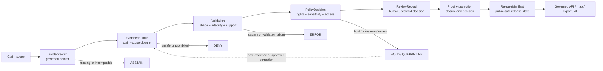
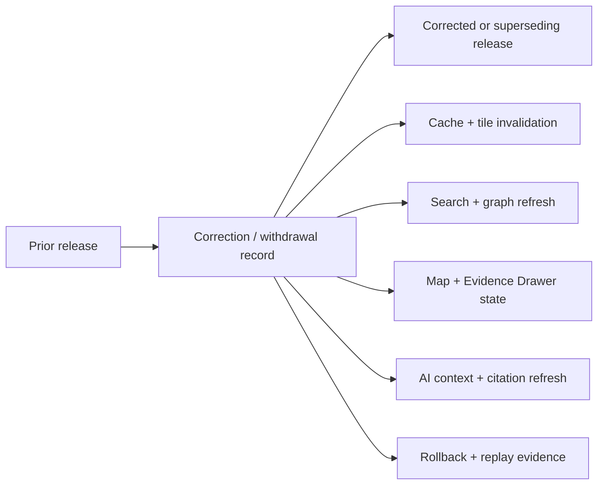

<!--
KFM_WIKI_SOURCE
page_id: Governance-and-Evidence
title: Governance and Evidence
version: v0.2.0
status: PROPOSED wiki source; review required
created: 2026-08-07
updated: 2026-08-15
authority: orientation-only; canonical repository evidence, adopted KFM doctrine, accepted ADRs, semantic contracts, machine schemas, policy, review, and release records outrank this page
source_path: docs/wiki/Governance-and-Evidence.md
owning_root: docs/
responsibility: public orientation to KFM truth posture, evidence closure, source-role discipline, policy and review boundaries, release separation, and correction
evidence_snapshot: main@85fa02e81d0e8ca0b746d5b659aa987b910aecd2
prior_blob: fb5bb7944c0d54c9a7ed93af73d8049cbf404939
publication_effect: none until separately synchronized to the native GitHub Wiki
-->

<a id="top"></a>

<p align="center">
  
</p>

# Governance and Evidence

<p align="center"><strong>How KFM decides what a claim may say, show, cite, release, correct, or refuse.</strong></p>

KFM governance is not a substitute for truth. It is the inspectable system of boundaries and decisions that keeps source identity, evidence support, rights, sensitivity, validation, review, release, correction, and rollback from being collapsed into one persuasive-looking output.

> [!IMPORTANT]
> **A consequential claim cites resolvable, admissible, released evidence—or the system does not present it as an answer.** Missing support produces `ABSTAIN`; policy or exposure barriers produce `DENY`; operational failure produces `ERROR`.

> [!NOTE]
> **Evidence checkpoint:** reviewed against [`main@85fa02e81d0e8ca0b746d5b659aa987b910aecd2`](https://github.com/bartytime4life/Kansas-Frontier-Matrix/tree/85fa02e81d0e8ca0b746d5b659aa987b910aecd2). A commit proves repository bytes at that revision. It does not by itself prove active policy, deployed runtime behavior, source rights, human approval, release readiness, public availability, or native-wiki synchronization.

> [!CAUTION]
> This page is an orientation projection. It cannot define evidence semantics, change a schema, approve policy, clear rights, accept a review, promote data, or create a release. Follow the linked responsibility roots for authority.

## At a glance

| Question | KFM answer |
|---|---|
| What is the truth posture? | **Cite or abstain.** Evidence outranks fluent prose, visual polish, model confidence, and file placement |
| What is an `EvidenceRef`? | A governed pointer to support; it is traceability, not closure or release |
| What is an `EvidenceBundle`? | A claim-scope closure package containing the support needed for downstream policy, review, and release decisions |
| Does a valid bundle prove a claim is public? | No. Evidence closure is separate from policy, review, proof, promotion, and release |
| What can policy do? | Allow, deny, restrict, hold, redact, generalize, delay, or require review |
| What happens when source roles differ? | They remain explicit; a model, permit, forecast, observation, aggregate, and historical source are not interchangeable |
| What makes publication governable? | Identity, evidence, validation, policy, review, provenance, integrity, proof, release, correction, and rollback remain inspectable |
| What can AI or a map decide? | Neither decides truth, rights, sensitivity, review, or release; both remain downstream carriers |
| Where is implementation maturity tracked? | [Project Status](Project-Status.md), exact repository files, tests, workflows, emitted artifacts, and release records |

**Quick navigation:** [Core model](#governance-model) · [Decision axes](#do-not-collapse-decision-axes) · [Evidence chain](#evidence-chain) · [Closure](#what-evidence-closure-requires) · [Source roles](#source-role-anti-collapse) · [Authority split](#responsibility-and-authority-split) · [Policy](#policy-admissibility-and-review) · [Promotion](#promotion-proof-and-release) · [Corrections](#correction-withdrawal-and-rollback) · [Runtime](#public-runtime-and-ai-boundary) · [Current baseline](#current-bounded-implementation) · [Anti-patterns](#governance-anti-patterns) · [References](#canonical-reading)

---

## Governance model

The governed path is a chain of separate decisions. No successful downstream step may silently repair or replace a missing upstream authority.



### What the model protects

- **Evidence cannot grant itself permission.** A bundle can support a policy decision; it is not the policy decision.
- **Validation cannot approve release.** A schema-valid object can still be misleading, stale, restricted, or unreleased.
- **Review cannot rewrite source history.** A reviewer decides disposition; prior evidence and decisions remain traceable.
- **A receipt cannot become proof.** Process memory, verifiable condition, catalog discovery, promotion decision, and release state remain different families.
- **A merge cannot become publication.** Repository review is valuable but does not by itself create KFM release state.
- **A carrier cannot become truth.** Maps, tiles, graphs, indexes, dashboards, stories, screenshots, and generated language remain downstream.

Read the full system sequence in [Architecture](Architecture.md) and the stage-by-stage lifecycle in [Data Lifecycle](Data-Lifecycle.md).

[Back to top](#top)

---

## Do not collapse decision axes

KFM uses several vocabularies that answer different questions. Similar words do not make them interchangeable.

| Axis | Question answered | Examples | What it does not prove |
|---|---|---|---|
| Truth label | How strongly is this statement supported in the current investigation? | `CONFIRMED`, `PROPOSED`, `UNKNOWN`, `NEEDS VERIFICATION` | Runtime outcome, policy permission, release |
| Evidence-resolution state | Did the supplied pointer and bundle candidate satisfy a bounded resolver profile? | package-local `RESOLVED`, `UNRESOLVED`, `DENIED`, `ERROR` | Claim truth, public `ANSWER`, review, release |
| Runtime outcome | What may the governed interface return now? | `ANSWER`, `ABSTAIN`, `DENY`, `ERROR` | Repository status or lifecycle promotion |
| Policy disposition | What use or exposure is permitted? | allow, deny, restrict, hold, redact, generalize, delay, require review | Factual truth or release |
| Review state | Has an authorized reviewer accepted, rejected, held, or requested correction? | pending, approved, rejected, held, changes requested | Evidence content or deployment |
| Lifecycle state | Where is the governed material in its data journey? | `RAW`, `WORK`, `QUARANTINE`, `PROCESSED`, `CATALOG / TRIPLET`, `PUBLISHED` | That every gate was valid merely because a path exists |
| Release state | Which reviewed public-safe package is in force? | candidate, held, released, corrected, withdrawn, superseded | Source authority or claim accuracy by itself |
| Placement outcome | Where may a repository artifact live? | `PLACE`, `SPLIT`, `MIGRATE`, `MIRROR`, `HOLD`, `DENY` | Truth, rights, or publication |

> [!TIP]
> When a status looks ambiguous, ask **“Status of what, decided by which authority, against which evidence, at what time?”**

### Core truth labels

| Label | Reader meaning |
|---|---|
| `CONFIRMED` | Verified from current repository evidence, an accepted decision, a test or workflow result, an emitted artifact, or another admissible source inspected for the claim |
| `PROPOSED` | A design, requested change, recommendation, or future state not verified as current implementation |
| `UNKNOWN` | Available evidence is insufficient |
| `NEEDS VERIFICATION` | A concrete check can resolve the question |

Qualifiers such as `CONFLICTED`, `LINEAGE`, `STALE`, `SUPERSEDED`, or `PARTIAL` may refine a core label. They should not hide the underlying evidence status.

[Back to top](#top)

---

## Evidence chain

A normal claim-bearing path begins with a source, not with a popup, model answer, or documentation sentence.

```text
SourceDescriptor
  -> immutable source capture, record, or stable locator
  -> EvidenceRef
  -> EvidenceBundle
  -> validation and citation checks
  -> policy and sensitivity decision
  -> review and promotion evidence
  -> ReleaseManifest
  -> governed public claim
```

### `EvidenceRef` versus `EvidenceBundle`

| Concern | `EvidenceRef` | `EvidenceBundle` |
|---|---|---|
| Primary role | Point to supporting material | Close support for a defined claim scope |
| Minimum guarantee | Traceability | Reconstructable claim-support package |
| Sufficiency for public `ANSWER` | No | Conditional; policy, review, release, and runtime gates must also close |
| Source information | May point to it | Must bind reconstructable source records |
| Citations | May participate in citation assembly | Carries publication-ready citations for the scope |
| Rights and sensitivity | May carry or point to context | Must make effective rights and sensitivity posture visible |
| Transforms and integrity | May identify an input | Must record material transforms and checksums |
| Policy | Not a policy decision | Supports evaluation but is not a `PolicyDecision` |
| Release | Not release | Not release; a `ReleaseManifest` remains separate |
| Failure posture | Unresolved pointer cannot support `ANSWER` | Incomplete, stale, denied, or incompatible closure produces a bounded negative result |

`EvidenceRef` is deliberately small. `EvidenceBundle` is deliberately demanding. This separation lets KFM retain references during intake and work without pretending they already satisfy public claim closure.

### Evidence compatibility

Evidence is not sufficient merely because it exists. It must be compatible with the requested claim:

- **subject:** the evidence is about the entity, place, event, or object being claimed;
- **claim scope:** it supports the specific assertion rather than an adjacent topic;
- **source role:** observation, interpretation, regulation, model, forecast, aggregate, context, or fixture is used honestly;
- **place:** geometry, geography version, scale, CRS, and generalization are appropriate;
- **time:** observed, valid, source, retrieval, release, and correction time support the request;
- **rights and sensitivity:** permitted use and exposure are known;
- **freshness:** the evidence remains valid for the requested operation;
- **lineage:** transforms and derived carriers remain reconstructable;
- **integrity:** critical inputs and outputs have verifiable content identity;
- **citation:** the support can be presented and checked without overstating what it proves.

[Back to top](#top)

---

## What evidence closure requires

The current repository contract and schema for `EvidenceBundle` describe a compact closure package. At the reviewed snapshot, the paired schema requires these top-level fields:

| Field | Purpose |
|---|---|
| `bundle_id` | Stable identity for the closure package |
| `claim_scope` | The precise class of claims the bundle may support |
| `evidence_refs` | The governed pointers included in closure |
| `source_records` | Reconstructable source-level records or handles |
| `citations` | Publication-ready support for the claim scope |
| `rights` | Effective license or rights summary |
| `sensitivity` | Exposure and handling posture |
| `transforms` | Ordered material transformations from source to derivative |
| `checksums` | Content identities for critical inputs or outputs |
| `spec_hash` | Deterministic link to the applicable contract/schema baseline |

The schema also rejects undeclared top-level properties. That is useful machine-shape evidence, but it is not the whole trust decision.

### Claim-support gate

Before a consequential public claim can return `ANSWER`, the governing flow should be able to answer all of these:

| Gate question | Failure posture |
|---|---|
| Is the claim scope explicit and bounded? | `ABSTAIN` or narrow the request |
| Does every required `EvidenceRef` resolve to the intended support? | `ABSTAIN` |
| Are source roles compatible with the claim? | `ABSTAIN` or correct the claim |
| Do place, scale, time, and freshness align? | `ABSTAIN`; mark stale or out of scope |
| Are rights, consent, access, and sensitivity obligations satisfied? | `DENY`, restrict, redact, generalize, delay, or hold |
| Are transforms, checksums, and provenance reconstructable? | `ERROR` or hold |
| Are citations complete and support the language actually used? | `ABSTAIN` |
| Did validation and policy checks use the intended versions? | `ERROR` or hold |
| Is the required human or steward review complete? | hold |
| Is a reviewed release, correction path, and rollback target in force? | `ABSTAIN`, `DENY`, or hold depending on the request |

> [!IMPORTANT]
> **Shape-valid evidence is not automatically admissible evidence. Admissible evidence is not automatically released evidence. Released evidence does not license a claim broader than its scope.**

[Back to top](#top)

---

## Source-role anti-collapse

Different sources can be relevant to the same topic while supporting different kinds of statements.

| Source role | May support | Must not silently become |
|---|---|---|
| Observation or measurement | What an instrument, survey, specimen, record, or observer reported under stated conditions | Forecast, causal explanation, or universal truth |
| Authoritative interpretation | A reviewed agency, scientific, archival, or domain interpretation at a stated scale and date | Direct observation |
| Regulatory or administrative record | Permit, designation, filing, boundary, decision, or official administrative status | Proof that the physical condition exists exactly as filed |
| Forecast or advisory | A bounded expectation or official advisory for a stated issue and valid period | Observation or permanent condition |
| Model or derived surface | An estimate, classification, interpolation, score, scenario, or transformation | Measured fact |
| Aggregate or index | A summarized pattern at a declared geography, method, and period | Individual event or precise local condition |
| Historical or archival source | A past assertion, map, document, testimony, or record in historical context | Present condition or automatically verified fact |
| Community or contextual report | Local knowledge, lead, corroboration, or contextual understanding | Sole authority when stronger evidence is required |
| Synthetic fixture | Test behavior, validation polarity, or documentation examples | Real-world evidence or a publishable Kansas claim |
| Map, graph, index, or AI summary | Discovery, explanation, comparison, or delivery | Source authority or evidence closure |

Examples of prohibited collapse:

- a model is not relabeled as an observation;
- a permit is not treated as proof of a resource or physical condition;
- a legal boundary does not become a scientific boundary without evidence;
- an aggregate does not become a precise local event;
- a historical claim is not silently presented as current;
- a fixture is never presented as real Kansas evidence;
- a rendered feature is not treated as the source it depicts.

[Back to top](#top)

---

## Responsibility and authority split

KFM keeps meaning, shape, admissibility, enforcement, accountability, and release in separate homes.

| Responsibility | Repository home | Governing role |
|---|---|---|
| Evidence semantics | [`contracts/evidence/`](https://github.com/bartytime4life/Kansas-Frontier-Matrix/tree/main/contracts/evidence) | Defines what `EvidenceRef`, `EvidenceBundle`, citation reports, and evidence-facing payloads mean |
| Machine shape | [`schemas/contracts/v1/evidence/`](https://github.com/bartytime4life/Kansas-Frontier-Matrix/tree/main/schemas/contracts/v1/evidence) | Defines fields, constraints, references, and versioned JSON shapes |
| Examples and polarity | [`fixtures/`](https://github.com/bartytime4life/Kansas-Frontier-Matrix/tree/main/fixtures) | Supplies valid, invalid, negative, and golden cases |
| Executable validation | [`tools/validators/`](https://github.com/bartytime4life/Kansas-Frontier-Matrix/tree/main/tools/validators) and [`tests/`](https://github.com/bartytime4life/Kansas-Frontier-Matrix/tree/main/tests) | Checks shape, integrity, deterministic behavior, and failure polarity |
| Evidence admissibility | [`policy/evidence/`](https://github.com/bartytime4life/Kansas-Frontier-Matrix/tree/main/policy/evidence) | Defines whether support may be used for a requested operation; current maturity is bounded below |
| Materialized proof | [`data/proofs/`](https://github.com/bartytime4life/Kansas-Frontier-Matrix/tree/main/data/proofs) | Stores governed proof records rather than semantic definitions |
| Process memory | [`data/receipts/`](https://github.com/bartytime4life/Kansas-Frontier-Matrix/tree/main/data/receipts) | Records validation, transformation, redaction, review, AI, and pipeline activity |
| Discovery and provenance indexes | [`data/catalog/`](https://github.com/bartytime4life/Kansas-Frontier-Matrix/tree/main/data/catalog) | Makes governed material discoverable without replacing proof or release |
| Runtime implementation | [`packages/evidence-resolver/`](https://github.com/bartytime4life/Kansas-Frontier-Matrix/tree/main/packages/evidence-resolver) and governed application roots | Implements bounded behavior; implementation never becomes semantic authority by itself |
| Release, correction, withdrawal, rollback | [`release/`](https://github.com/bartytime4life/Kansas-Frontier-Matrix/tree/main/release) | Records reviewed release decisions and reversible public state |
| Public orientation | `docs/wiki/Governance-and-Evidence.md` | Explains the model; creates no authority |

> [!WARNING]
> A file under a plausible path does not inherit truth, rights, review, or release merely from location. A path is an authority claim, not a magic promotion mechanism.

For the full placement model, read [Repository Map](Repository-Map.md) and the adopted [Directory Rules](https://github.com/bartytime4life/Kansas-Frontier-Matrix/blob/main/docs/doctrine/directory-rules.md).

[Back to top](#top)

---

## Policy, admissibility, and review

Policy answers **what may be done with otherwise identified and validated material**. It does not determine whether the source statement is factually true.

### Policy may decide

- caller or audience access;
- source-term and license obligations;
- sensitivity handling;
- embargo or delayed availability;
- redaction, aggregation, masking, or coordinate generalization;
- whether a claim must be narrowed;
- whether additional evidence is required;
- whether a domain, legal, cultural, privacy, security, or release steward must review;
- whether an operation must return `DENY`, `ABSTAIN`, or a restricted result;
- which obligations must accompany an allowed result.

### Policy must remain separate from

- JSON Schema validity;
- evidence resolution;
- source authority;
- human-generated or AI-generated prose;
- UI styling or client-only hiding;
- a green workflow;
- a pull request's mergeability;
- a receipt, proof, catalog record, or published-looking path.

### Fail-closed sensitivity posture

When rights, sovereignty, cultural sensitivity, living-person data, DNA or genomics, rare-species locations, archaeology, infrastructure, private-land or title data, precise wells, or harmful location precision are unclear, the safe result is not a guessed allow. KFM prefers quarantine, redaction, generalization, staged access, delay, abstention, or denial until qualified authority supports a less restrictive outcome.

### Review and separation of duties

Higher-consequence release may require more than one role:

| Role | Example responsibility |
|---|---|
| Evidence or source steward | Source identity, authority role, support scope, provenance, and freshness |
| Domain steward | Scientific, historical, legal, or domain-semantic fitness |
| Rights, privacy, cultural, or sensitivity reviewer | Permission, sovereignty, consent, protected context, and public-safe transformation |
| Policy reviewer | Effective rule version, obligations, audience, and finite disposition |
| Release reviewer | Proof closure, manifest contents, correction, and rollback readiness |
| Independent reviewer | Separation from the producer when significance or policy requires it |

Separation of duties should scale with consequence. It should not be claimed when the repository only proves owner routing or a pending review field.

[Back to top](#top)

---

## Promotion, proof, and release

Promotion is a governed state transition. It is not a copy command, merge, workflow badge, or filename.

```text
candidate
  + identity and source role
  + EvidenceBundle closure
  + validation and citation checks
  + policy and sensitivity decision
  + required review
  + provenance and integrity
  + proof and catalog closure
  + correction path
  + rollback target
  -> promotion decision
  -> ReleaseManifest
  -> governed public-safe carriers
```

### Keep accountability families distinct

| Family | What it records | What it cannot replace |
|---|---|---|
| Receipt | What process ran, against which inputs, tools, rules, and outputs | Proof, policy approval, review, or release |
| Proof | A verifiable condition or closure claim | Source truth, policy permission, or release by itself |
| Catalog record | Discovery, distribution, provenance, and relation metadata | Proof or release |
| Validation report | Bounded conformance result | Factual accuracy, rights, review, or publication |
| Policy decision | Allow, deny, restrict, hold, or obligations under a rule version | Evidence content or release |
| Review record | Human or steward disposition | Automated proof or source identity |
| Promotion record | Decision to move a candidate between governed states | Public delivery unless release assembly also closes |
| Release manifest | The reviewed release, included artifacts, scope, and rollback target | Underlying evidence or correction history |
| Correction or withdrawal record | Why and how an earlier public state changes | Silent deletion or rewritten history |

A claim may need all of these. Repetition is not duplication when each family answers a different audit question.

[Back to top](#top)

---

## Correction, withdrawal, and rollback

Corrections are part of the truth model. KFM should preserve enough state to explain not only what is currently shown, but what changed and why.

A correction should identify:

- the affected claim, evidence bundle, release, and public carriers;
- prior and replacement content identities;
- the reason, effective time, reviewer, and decision;
- whether the earlier state is corrected, superseded, withdrawn, or revoked;
- affected maps, caches, search indexes, exports, stories, graphs, and AI contexts;
- propagation and invalidation status;
- rollback target and replay evidence;
- any public notice or limitation that must remain visible.



Silent replacement is an anti-pattern because it erases the knowledge history a reviewer needs to reconstruct.

Read the governing doctrine in [Corrections First Class](https://github.com/bartytime4life/Kansas-Frontier-Matrix/blob/main/docs/doctrine/corrections-first-class.md).

[Back to top](#top)

---

## Public runtime and AI boundary

A public client should never infer that a visible feature is trustworthy merely because it rendered.

### Governed runtime sequence

1. The client sends a bounded place, time, feature, layer, or question context.
2. The Governed API validates the route, request shape, caller, and supported scope.
3. Evidence support is resolved to the intended claim scope.
4. Policy, sensitivity, rights, review, freshness, correction, and release state are applied.
5. Optional analysis or AI operates only on the admitted evidence.
6. Citation and response-envelope validation runs.
7. The client receives exactly one finite outcome.
8. The UI renders evidence, limitations, negative state, and correction information without leaking protected payloads.

### Finite outward outcomes

| Outcome | Use it when | Reader-facing behavior |
|---|---|---|
| `ANSWER` | Sufficient released, policy-safe, citation-valid support exists for the bounded request | Present the answer with citations, limitations, release, and correction state where material |
| `ABSTAIN` | Evidence is missing, stale, conflicting, unresolved, incompatible, or outside supported scope | Explain what is missing or unsupported without filling the gap |
| `DENY` | Rights, sensitivity, source terms, audience, caller role, or exposure risk blocks the operation | Refuse safely and do not leak protected content or sensitive reason details |
| `ERROR` | A resolver, validator, policy evaluator, adapter, or runtime dependency failed | Return an audit-safe failure reference; never fall back to unsafe allow |

### Governed AI rule

AI may retrieve, compare, summarize, classify, draft, and propose bounded actions. It must not:

- invent missing evidence or citations;
- enlarge a source's authority;
- infer rights or sensitivity clearance;
- convert local resolver success into public `ANSWER`;
- hide disagreement, staleness, or correction state;
- approve policy, review, promotion, or release;
- expose canonical stores or direct model output as the normal public path;
- treat an `AIReceipt` as proof that the answer is true.

Read the UI/runtime relationship in [Map, UI, and AI](Map-UI-and-AI.md).

[Back to top](#top)

---

## Current bounded implementation

The repository contains meaningful evidence-family structure, but the end-to-end governance chain remains mixed-maturity. The statements below are bounded to the reviewed snapshot.

| Surface | Confirmed repository evidence | Safe interpretation |
|---|---|---|
| Evidence semantic contracts | `contracts/evidence/README.md`, `evidence_ref.md`, `evidence_bundle.md`, citation and payload contracts are present | Meaning and boundaries are documented; most profiles remain draft or proposed |
| Evidence schemas | `schemas/contracts/v1/evidence/` contains fielded schemas including `evidence_ref`, `evidence_bundle`, citation reports, claim envelopes, and additional evidence profiles | Machine shapes exist; path presence does not prove semantic closure, policy, or public behavior |
| EvidenceBundle shape | The paired schema requires `bundle_id`, `claim_scope`, `evidence_refs`, `source_records`, `citations`, `rights`, `sensitivity`, `transforms`, `checksums`, and `spec_hash`, with undeclared top-level properties rejected | Useful shape evidence; not a policy decision or release |
| Validator and fixture surfaces | Evidence validators, schema tests, and positive/negative fixtures are referenced and present in the repository | Their exact current coverage and required-check significance must be established by exact-head runs |
| Internal resolver candidate | `packages/evidence-resolver/` documents a pure, no-network, non-authoritative `v1alpha1` candidate with package-local `RESOLVED / UNRESOLVED / DENIED / ERROR` states | Local candidate behavior is not claim truth, policy approval, public runtime behavior, or release |
| Resolver validation documentation | The package README documents 21 synthetic fixture profiles and 19 standard-library tests, plus no-network and negative-polarity checks | This page records the repository claim; hosted exact-head CI is the applicable execution evidence for this change |
| Evidence policy lane | `policy/evidence/` contains a detailed boundary README and `bundle_closure_required.rego` | The Rego file is documented as an untested greenfield stub; no accepted active evidence-admissibility ruleset is established |
| Policy binding | The evidence policy README reports no accepted bundle membership, evaluator binding, governed consumer, decision-receipt flow, or release integration | Evidence policy enforcement remains **NOT ESTABLISHED** at that checkpoint |
| Accountability lanes | `data/proofs/`, `data/receipts/`, `data/catalog/`, `data/published/`, and `release/` exist as separate responsibility families | Presence does not prove that one end-to-end claim closes across every family |
| Public and production behavior | No evidence inspected for this page proves a deployed evidence resolver, public evidence route, active policy evaluator, production source-rights evaluation, or completed release integration | Treat production maturity as `UNKNOWN` or `NEEDS VERIFICATION` |

> [!IMPORTANT]
> The strongest current conclusion is **bounded capability, not completed authority**: KFM has evidence semantics, machine shapes, validation surfaces, and an internal resolver candidate, while accepted evidence policy, governed runtime binding, full release closure, and production operation remain unproved.

### Evidence checkpoint links

- [Evidence contracts](https://github.com/bartytime4life/Kansas-Frontier-Matrix/blob/85fa02e81d0e8ca0b746d5b659aa987b910aecd2/contracts/evidence/README.md)
- [EvidenceBundle contract](https://github.com/bartytime4life/Kansas-Frontier-Matrix/blob/85fa02e81d0e8ca0b746d5b659aa987b910aecd2/contracts/evidence/evidence_bundle.md)
- [Evidence schemas](https://github.com/bartytime4life/Kansas-Frontier-Matrix/tree/85fa02e81d0e8ca0b746d5b659aa987b910aecd2/schemas/contracts/v1/evidence)
- [Evidence policy boundary](https://github.com/bartytime4life/Kansas-Frontier-Matrix/blob/85fa02e81d0e8ca0b746d5b659aa987b910aecd2/policy/evidence/README.md)
- [Internal evidence-resolver candidate](https://github.com/bartytime4life/Kansas-Frontier-Matrix/blob/85fa02e81d0e8ca0b746d5b659aa987b910aecd2/packages/evidence-resolver/README.md)
- [Evidence-resolver workflow](https://github.com/bartytime4life/Kansas-Frontier-Matrix/blob/85fa02e81d0e8ca0b746d5b659aa987b910aecd2/.github/workflows/evidence-resolver.yml)
- [Project Status](Project-Status.md)

[Back to top](#top)

---

## Governance anti-patterns

| Anti-pattern | Why it fails |
|---|---|
| “The source exists, so the claim is supported.” | Existence does not establish role, scope, time, rights, sensitivity, or compatibility |
| “The schema passed, so it is true.” | Shape validity is not factual accuracy, admissibility, review, or release |
| “The resolver returned `RESOLVED`, so the public result is `ANSWER`.” | The current resolver result is explicitly local and non-authoritative |
| “The policy stub did not deny, so use is allowed.” | Absence of an operative deny is not an accepted allow decision |
| “The workflow is green, so the data is published.” | CI validates bounded checks; it does not create release state |
| “The receipt proves the claim.” | A receipt records process memory; it is not evidence or proof by itself |
| “The proof pack is the release.” | Proof supports closure; a reviewed release manifest remains separate |
| “The file is under `published`, so publication happened.” | Promotion is a governed state transition, not path placement |
| “The map hides the sensitive feature, so exposure is safe.” | Sensitive transformation must happen before delivery; client-only hiding can leak data |
| “The model cited something, so the answer is governed.” | Citations must resolve, support the actual language, and pass policy/release gates |
| “The newest document silently replaces the old one.” | Correction and supersession require lineage, reason, effective time, and propagation |
| “One owner route proves independent review.” | CODEOWNERS or authorship does not prove separation of duties or approval |

[Back to top](#top)

---

## Reader routes

| Reader goal | Recommended path |
|---|---|
| Understand the whole trust membrane | [Architecture](Architecture.md) → this page → [Data Lifecycle](Data-Lifecycle.md) |
| Understand current maturity | [Project Status](Project-Status.md) |
| Understand source and evidence doctrine | [Evidence First](https://github.com/bartytime4life/Kansas-Frontier-Matrix/blob/main/docs/doctrine/evidence-first.md) |
| Understand which authority wins | [Authority Ladder](https://github.com/bartytime4life/Kansas-Frontier-Matrix/blob/main/docs/doctrine/authority-ladder.md) |
| Inspect evidence semantics | [Evidence contracts](https://github.com/bartytime4life/Kansas-Frontier-Matrix/tree/main/contracts/evidence) |
| Inspect machine shape | [Evidence schemas](https://github.com/bartytime4life/Kansas-Frontier-Matrix/tree/main/schemas/contracts/v1/evidence) |
| Inspect admissibility posture | [Evidence policy boundary](https://github.com/bartytime4life/Kansas-Frontier-Matrix/blob/main/policy/evidence/README.md) |
| Inspect resolver limits | [Evidence-resolver package](https://github.com/bartytime4life/Kansas-Frontier-Matrix/blob/main/packages/evidence-resolver/README.md) |
| Understand sensitive-data handling | [Security and Sensitivity](Security-and-Sensitivity.md) |
| Understand correction | [Corrections First Class](https://github.com/bartytime4life/Kansas-Frontier-Matrix/blob/main/docs/doctrine/corrections-first-class.md) |
| Understand placement | [Repository Map](Repository-Map.md) and [Directory Rules](https://github.com/bartytime4life/Kansas-Frontier-Matrix/blob/main/docs/doctrine/directory-rules.md) |
| Correct this wiki source | [Wiki Maintenance](Wiki-Maintenance.md) |

[Back to top](#top)

---

## Canonical reading

The wiki summarizes the following authority surfaces; it does not replace them.

### Doctrine and architecture

- [Doctrine index](https://github.com/bartytime4life/Kansas-Frontier-Matrix/blob/main/docs/doctrine/README.md)
- [Evidence First](https://github.com/bartytime4life/Kansas-Frontier-Matrix/blob/main/docs/doctrine/evidence-first.md)
- [Authority Ladder](https://github.com/bartytime4life/Kansas-Frontier-Matrix/blob/main/docs/doctrine/authority-ladder.md)
- [Lifecycle Law](https://github.com/bartytime4life/Kansas-Frontier-Matrix/blob/main/docs/doctrine/lifecycle-law.md)
- [Derived Stays Derived](https://github.com/bartytime4life/Kansas-Frontier-Matrix/blob/main/docs/doctrine/derived-stays-derived.md)
- [Corrections First Class](https://github.com/bartytime4life/Kansas-Frontier-Matrix/blob/main/docs/doctrine/corrections-first-class.md)
- [Trust Membrane](https://github.com/bartytime4life/Kansas-Frontier-Matrix/blob/main/docs/doctrine/trust-membrane.md)
- [AI Build Operating Contract](https://github.com/bartytime4life/Kansas-Frontier-Matrix/blob/main/docs/doctrine/ai-build-operating-contract.md)
- [Contract / schema / policy split](https://github.com/bartytime4life/Kansas-Frontier-Matrix/blob/main/docs/architecture/contract-schema-policy-split.md)

### Evidence and release implementation surfaces

- [Evidence contracts](https://github.com/bartytime4life/Kansas-Frontier-Matrix/tree/main/contracts/evidence)
- [Evidence schemas](https://github.com/bartytime4life/Kansas-Frontier-Matrix/tree/main/schemas/contracts/v1/evidence)
- [Evidence policy](https://github.com/bartytime4life/Kansas-Frontier-Matrix/tree/main/policy/evidence)
- [Evidence resolver](https://github.com/bartytime4life/Kansas-Frontier-Matrix/tree/main/packages/evidence-resolver)
- [Proof records](https://github.com/bartytime4life/Kansas-Frontier-Matrix/tree/main/data/proofs)
- [Receipts](https://github.com/bartytime4life/Kansas-Frontier-Matrix/tree/main/data/receipts)
- [Catalog records](https://github.com/bartytime4life/Kansas-Frontier-Matrix/tree/main/data/catalog)
- [Release and rollback](https://github.com/bartytime4life/Kansas-Frontier-Matrix/tree/main/release)

---

## Wiki boundary and maintenance

This source page may explain governance, but it cannot:

- adopt doctrine or an ADR;
- define or amend semantic contracts;
- change JSON Schema;
- activate or evaluate policy;
- authorize source use or rights;
- approve evidence closure;
- accept human review;
- promote lifecycle state;
- create a release, correction, withdrawal, or rollback record;
- synchronize or publish the native GitHub Wiki.

Material changes should remain reviewable, receipt-bearing when AI-authored, and reversible. Native-wiki synchronization is a separate explicit operation governed by [Wiki Maintenance](Wiki-Maintenance.md).

### Rollback

Before merge, close the pull request or update the feature branch. After an authorized merge, revert the documentation commit and its generated authoring receipt together, then rerun documentation metadata, graph, link, stale-reference, and receipt-integrity checks. If the native wiki was separately synchronized, correct or revert that projection independently and record the source and wiki commits.

[Back to top](#top)
