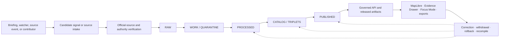

<!--
KFM_WIKI_SOURCE
page_id: Home
title: Kansas Frontier Matrix Wiki
status: PROPOSED wiki source; review required
updated: 2026-08-14
authority: orientation-only; canonical repository evidence and adopted KFM authority outrank this page
source_path: docs/wiki/Home.md
publication_effect: none until separately synchronized to the native GitHub Wiki
evidence_checkpoint: main@695c4e67063481236e627f8652faf17619260a5a
-->
<a id="top"></a>

<p align="center">
  
</p>

# Kansas Frontier Matrix

<p align="center">
  <strong>Map-first exploration · Evidence-first claims · Time-aware context · Governed publication</strong>
</p>

<p align="center">
  <a href="Getting-Started.md">Start here</a> ·
  <a href="Architecture.md">Architecture</a> ·
  <a href="Project-Status.md">Project status</a> ·
  <a href="Domains.md">Domains</a> ·
  <a href="Governance-and-Evidence.md">Evidence</a> ·
  <a href="Contributing.md">Contribute</a>
</p>

Kansas Frontier Matrix (KFM) is a Kansas-first spatial knowledge and publication system built around a harder question than **“what can we put on a map?”**

> **What can KFM show, explain, cite, review, correct, and safely release—without hiding where the knowledge came from or what limits apply?**

KFM connects place, time, domain knowledge, evidence, policy, public-safe geospatial delivery, and bounded AI around a common unit of value: the **inspectable claim**.

> [!IMPORTANT]
> This wiki is a public orientation surface. Canonical repository evidence, adopted doctrine and ADRs, contracts, schemas, policy, tests, lifecycle records, and release decisions outrank wiki prose. A polished page, map, test, receipt, commit, pull request, merge, or wiki push is not by itself implementation proof, policy approval, KFM release, or data publication.

## Start here

| Your goal | Best first page | Canonical repository source |
|---|---|---|
| Get oriented quickly | [Getting Started](Getting-Started.md) | [Repository README](https://github.com/bartytime4life/Kansas-Frontier-Matrix/blob/main/README.md) |
| Understand the whole system | [Architecture](Architecture.md) | [Architecture index](https://github.com/bartytime4life/Kansas-Frontier-Matrix/blob/main/docs/architecture/README.md) |
| Check what is actually present | [Project Status](Project-Status.md) | Current [`main`](https://github.com/bartytime4life/Kansas-Frontier-Matrix/tree/main), pull requests, checks, and emitted artifacts |
| Learn how truth and evidence work | [Governance and Evidence](Governance-and-Evidence.md) | [Doctrine index](https://github.com/bartytime4life/Kansas-Frontier-Matrix/blob/main/docs/doctrine/README.md) |
| Follow data from intake to release | [Data Lifecycle](Data-Lifecycle.md) | [Lifecycle Law](https://github.com/bartytime4life/Kansas-Frontier-Matrix/blob/main/docs/doctrine/lifecycle-law.md) |
| Browse Kansas knowledge lanes | [Domains](Domains.md) | [Domain index](https://github.com/bartytime4life/Kansas-Frontier-Matrix/blob/main/docs/domains/README.md) |
| Understand the map, Evidence Drawer, and AI | [Map, UI, and AI](Map-UI-and-AI.md) | [Explorer Web](https://github.com/bartytime4life/Kansas-Frontier-Matrix/blob/main/apps/explorer-web/README.md) and [Governed API](https://github.com/bartytime4life/Kansas-Frontier-Matrix/blob/main/apps/governed-api/README.md) |
| Find where a file belongs | [Repository Map](Repository-Map.md) | [Directory Rules](https://github.com/bartytime4life/Kansas-Frontier-Matrix/blob/main/docs/doctrine/directory-rules.md) and [ADR-0029](https://github.com/bartytime4life/Kansas-Frontier-Matrix/blob/main/docs/adr/ADR-0029-adopt-directory-governance-standard-v2.md) |
| Build or review a change | [Contributing](Contributing.md) and [Development and Validation](Development-and-Validation.md) | [CONTRIBUTING.md](https://github.com/bartytime4life/Kansas-Frontier-Matrix/blob/main/CONTRIBUTING.md) |
| Understand safety boundaries | [Security and Sensitivity](Security-and-Sensitivity.md) | [SECURITY.md](https://github.com/bartytime4life/Kansas-Frontier-Matrix/blob/main/SECURITY.md) |
| Maintain or project this wiki | [Wiki Maintenance](Wiki-Maintenance.md) | [`docs/wiki/README.md`](https://github.com/bartytime4life/Kansas-Frontier-Matrix/blob/main/docs/wiki/README.md) |

## The KFM promise

A KFM-grade claim should let a reader or reviewer determine:

| Question | What should remain inspectable |
|---|---|
| **What is asserted?** | The claim, feature, observation, classification, or interpretation |
| **What supports it?** | Source role, `EvidenceRef`, resolved `EvidenceBundle`, citations, and limitations |
| **Where and when does it apply?** | Geography, scale, valid time, observation time, source time, release time, and correction time where material |
| **What changed the source?** | Normalization, joins, generalization, redaction, modeling, aggregation, or other transforms |
| **What may be shown?** | Rights, sensitivity, access class, policy outcome, review state, and public-safe obligations |
| **Why is it public?** | Validation, proof/catalog closure, promotion decision, release state, and manifest identity |
| **How can it be corrected?** | Supersession, withdrawal, correction lineage, cache propagation, replay evidence, and rollback target |

Maps, tiles, graphs, indexes, dashboards, stories, screenshots, 3D scenes, models, and AI responses may carry a claim. They do not establish the claim by themselves.

## KFM operating law

KFM connects discovery to public-safe use through explicit, reviewable boundaries:



The lifecycle shorthand is:

```text
RAW -> WORK / QUARANTINE -> PROCESSED -> CATALOG / TRIPLETS -> PUBLISHED
```

The diagram carries several hard rules:

- **Discovery is not evidence.** Briefing prose, watcher output, search results, and generated summaries may identify work; they do not become public truth.
- **Promotion is not a file move.** It is a governed state transition supported by evidence, validation, policy, review, integrity, release, correction, and rollback records.
- **Public clients cross the trust membrane.** They use governed APIs and released public-safe artifacts rather than RAW, WORK, QUARANTINE, candidate, canonical/internal, or direct model-runtime stores.
- **Consequential claims resolve evidence.** `EvidenceRef -> EvidenceBundle` closes the support chain; missing, stale, unsafe, or conflicted support produces a bounded negative outcome.
- **Automation is a candidate producer.** Watchers, briefings, validators, and AI may propose or assess work; they do not approve or publish it.
- **Corrections remain visible.** Public carriers, caches, maps, search, exports, and AI surfaces should follow correction, withdrawal, supersession, and rollback lineage.

## Latest ideas in view

The newest architecture and reconciliation work sharpens KFM without changing its trust posture. These are **directions under review**, not claims that every capability is complete or released.

| Direction | What it adds | Boundary that remains |
|---|---|---|
| **Governed briefing intake** | Typed `BriefingSignal` candidates, deterministic identity, event clustering, explainable materiality, duplicate suppression, and bounded issue routing | Generated briefing prose and priority scores never become evidence or repository-mutation authority |
| **Temporal and authority envelopes** | Reusable identity, source-role, geography, time, certainty, lineage, and release references without flattening domain meaning | A shared envelope does not replace domain contracts or choose one global time vocabulary |
| **Evidence-binding closure** | Official-source snapshots, parse lineage, field bindings, `EvidenceRef`, `EvidenceBundle`, citation validation, and source-obligation propagation | Synthetic closure or a passing validator is not authenticated evidence, rights approval, or release authority |
| **Trust-visible map and AI** | MapLibre selection, governed API resolution, Evidence Drawer explanation, bounded Focus Mode interpretation, and safe negative states | Browser feature properties and direct model output cannot become evidence or policy |
| **Manifest-bound delivery** | Catalog closure, release manifests, digests, public-safe PMTiles/COG/GeoParquet-style carriers, correction propagation, and rollback targets | Artifact integrity does not substitute for policy, review, promotion, or cryptographic trust that has not been verified |
| **Domain source-role anti-collapse** | Distinguishes observations, authoritative interpretations, models, forecasts, regulatory records, aggregates, historical sources, and synthetic fixtures | Similar geometry or vocabulary does not make different support types interchangeable |
| **Governed improvement loop** | Questions, abstentions, validation failures, corrections, and source drift can produce reviewable candidate deltas and deterministic recompiles | The loop cannot rewrite canonical truth, approve itself, or publish itself |

Read the repository-grounded [Briefing-to-System Integration Architecture](https://github.com/bartytime4life/Kansas-Frontier-Matrix/blob/main/docs/architecture/briefing-integration.md) and the [Verification Backlog](https://github.com/bartytime4life/Kansas-Frontier-Matrix/blob/main/docs/registers/VERIFICATION_BACKLOG.md) for the current evidence boundary, partial implementations, holds, and unresolved authority questions.

> [!CAUTION]
> A detailed idea is not automatically a good implementation candidate. KFM selects work only after checking current repository behavior, accepted decisions, path authority, overlap, rights and sensitivity, testability, dependency closure, correction behavior, and rollback.

## What KFM brings together

| Dimension | KFM treatment |
|---|---|
| **Place and scale** | Kansas-centered map exploration with explicit geography, scale, coordinate, and representation limits |
| **Time and change** | Observations, validity, source versions, release state, corrections, supersession, and replay |
| **Evidence and citations** | Resolvable support chains, source roles, limitations, provenance, and cite-or-abstain behavior |
| **Knowledge lanes** | Hydrology, soil, habitat, fauna, flora, agriculture, geology, atmosphere, hazards, transport, settlements, archaeology, people/land, and cross-domain seams |
| **Governance and safety** | Rights, sovereignty, sensitivity, privacy, harmful precision, access, review, policy, and fail-closed outcomes |
| **Public-safe delivery** | Governed APIs, catalogs, released geospatial artifacts, MapLibre, Evidence Drawer, exports, and bounded Focus Mode |
| **Validation and accountability** | Contracts, schemas, fixtures, validators, tests, receipts, proofs, manifests, reviews, and exact-scope checks |
| **Correction and reversibility** | Deterministic identity where practical, lineage, withdrawal, cache invalidation, replay, and rollback |
| **Improvement** | Evidence-led candidate deltas and recompilation without autonomous truth or publication authority |

## Finite public outcomes

Trust-bearing public surfaces converge on four outward outcomes:

| Outcome | Meaning | Safe behavior |
|---|---|---|
| `ANSWER` | Released, policy-safe, evidence-supported, and in scope | Return bounded content with citations, scope, and trust state |
| `ABSTAIN` | Evidence is missing, stale, conflicted, unresolved, or outside supported scope | Explain the limitation without guessing |
| `DENY` | Rights, sensitivity, source role, release state, or exposure risk blocks the response | Withhold protected content and avoid leaking it through payloads, logs, or UI state |
| `ERROR` | A resolver, validator, adapter, policy service, or runtime failed | Fail safely, preserve diagnostics for the right audience, and do not fall back to an unsafe answer |

Internal workflows may also use `HOLD`, `NEEDS_VERIFICATION`, or other finite review states. Negative states are first-class behavior, not empty spaces to be filled with confident prose.

## Project posture

KFM is an active, broad repository with substantial documentation, application, contract, schema, policy, fixture, validator, pipeline, lifecycle, and release-supporting surfaces. Maturity is uneven and must be assessed claim by claim.

At this page's evidence checkpoint:

- the repository was inspected at `main@695c4e67063481236e627f8652faf17619260a5a`;
- accepted ADR-0029 and the adopted Directory Rules govern placement;
- the wiki source set exists under `docs/wiki/`;
- the native GitHub Wiki remains a separate projection whose current synchronization state is not established by this page;
- current implementation, check, deployment, source-rights, proof, release, and publication claims still require their own evidence.

File presence, a detailed architecture document, a passing fixture, a green workflow, or a generated receipt proves only its declared scope. Use [Project Status](Project-Status.md), current pull requests, workflow runs, manifests, receipts, and runtime evidence for current-state decisions.

## Important links

| Area | Links |
|---|---|
| Project | [Repository](https://github.com/bartytime4life/Kansas-Frontier-Matrix) · [Root README](https://github.com/bartytime4life/Kansas-Frontier-Matrix/blob/main/README.md) · [Documentation](https://github.com/bartytime4life/Kansas-Frontier-Matrix/tree/main/docs) |
| Governance | [Directory Rules](https://github.com/bartytime4life/Kansas-Frontier-Matrix/blob/main/docs/doctrine/directory-rules.md) · [ADR-0029](https://github.com/bartytime4life/Kansas-Frontier-Matrix/blob/main/docs/adr/ADR-0029-adopt-directory-governance-standard-v2.md) · [ADRs](https://github.com/bartytime4life/Kansas-Frontier-Matrix/tree/main/docs/adr) |
| Evidence and status | [Verification Backlog](https://github.com/bartytime4life/Kansas-Frontier-Matrix/blob/main/docs/registers/VERIFICATION_BACKLOG.md) · [Drift Register](https://github.com/bartytime4life/Kansas-Frontier-Matrix/blob/main/docs/registers/DRIFT_REGISTER.md) · [Generated Receipts](https://github.com/bartytime4life/Kansas-Frontier-Matrix/tree/main/data/receipts/generated) |
| Build and review | [CONTRIBUTING.md](https://github.com/bartytime4life/Kansas-Frontier-Matrix/blob/main/CONTRIBUTING.md) · [Pull requests](https://github.com/bartytime4life/Kansas-Frontier-Matrix/pulls) · [GitHub Actions](https://github.com/bartytime4life/Kansas-Frontier-Matrix/actions) |
| Public experience | [Explorer Web](https://github.com/bartytime4life/Kansas-Frontier-Matrix/blob/main/apps/explorer-web/README.md) · [Governed API](https://github.com/bartytime4life/Kansas-Frontier-Matrix/blob/main/apps/governed-api/README.md) · [Map, UI, and AI](Map-UI-and-AI.md) |
| Safety | [Security policy](https://github.com/bartytime4life/Kansas-Frontier-Matrix/blob/main/SECURITY.md) · [Security and Sensitivity](Security-and-Sensitivity.md) |
| Wiki | [Wiki source contract](https://github.com/bartytime4life/Kansas-Frontier-Matrix/blob/main/docs/wiki/README.md) · [Wiki Maintenance](Wiki-Maintenance.md) |

---

[Getting Started](Getting-Started.md) · [Architecture](Architecture.md) · [Project Status](Project-Status.md) · [Domains](Domains.md) · [Contributing](Contributing.md) · [Back to top](#top)
