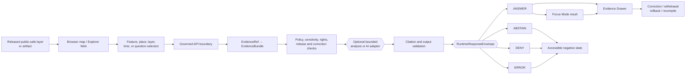
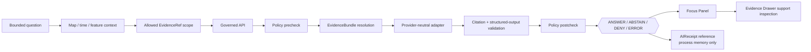

<!--
KFM_WIKI_SOURCE
page_id: Map-UI-and-AI
title: Map, UI, and AI
version: v0.2.0
status: PROPOSED wiki source; review required
created: 2026-08-07
updated: 2026-08-15
authority: orientation-only; canonical repository evidence, adopted KFM authority, accepted ADRs, contracts, schemas, policy, and owning responsibility roots outrank this page
source_path: docs/wiki/Map-UI-and-AI.md
owning_root: docs/
responsibility: public orientation to KFM's map-first experience, trust-visible UI, governed AI boundary, current bounded implementation, and safe graduation path
evidence_checkpoint: main@85fa02e81d0e8ca0b746d5b659aa987b910aecd2
prior_blob: 2ea777fa676cd1a95cb264fc81f9b20a5e9a88a3
publication_effect: none until separately synchronized to the native GitHub Wiki
related:
  - README.md
  - Architecture.md
  - Governance-and-Evidence.md
  - Data-Lifecycle.md
  - Project-Status.md
  - Security-and-Sensitivity.md
  - ../architecture/maplibre.md
  - ../architecture/ui/EVIDENCE_DRAWER.md
  - ../architecture/governed-ai/FOCUS_FLOW.md
  - ../adr/ADR-0004-apps-governed-api-is-the-trust-membrane.md
  - ../adr/ADR-0005-apps-explorer-web-is-the-canonical-map-first-shell.md
  - ../adr/ADR-0019-ai-adapter-contract-and-finite-envelopes.md
-->

<a id="top"></a>

<p align="center">
  
</p>

# Map, UI, and AI

<p align="center"><strong>How KFM turns released spatial evidence into a map-first, trust-visible, evidence-bounded experience.</strong></p>

<p align="center">
  <a href="Home.md">Home</a> ·
  <a href="Architecture.md">Architecture</a> ·
  <a href="Governance-and-Evidence.md">Governance and evidence</a> ·
  <a href="Data-Lifecycle.md">Data lifecycle</a> ·
  <a href="Security-and-Sensitivity.md">Security and sensitivity</a> ·
  <a href="Glossary.md">Glossary</a>
</p>

KFM is **map-first**, but the browser is downstream of trust. Maps, panels, popups, timelines, stories, exports, and AI explanations make released knowledge usable; they do not create evidence, decide policy, approve release, or become sovereign truth.

> [!IMPORTANT]
> This page is a **public orientation projection**. It does not accept an ADR, define a canonical contract or schema, approve a model or plugin, prove deployment, activate a source, promote data, synchronize the native wiki, or publish KFM claims.

> [!NOTE]
> **Evidence checkpoint:** repository claims below were reviewed against [`main@85fa02e81d0e8ca0b746d5b659aa987b910aecd2`](https://github.com/bartytime4life/Kansas-Frontier-Matrix/tree/85fa02e81d0e8ca0b746d5b659aa987b910aecd2). A commit proves bytes at that revision. It does not by itself prove production behavior, live service availability, rights clearance, policy approval, release state, or native-wiki synchronization.

## At a glance

| Surface | Safe current description | What remains unproved |
|---|---|---|
| **Explorer Web** | Repository-present Vite/TypeScript shell with bounded fixture-first trust UI, synthetic map-selection and composed-claim slices, and app-local tests | Live map, live Governed API transport, released-layer composition, authentication, deployment, or public operation |
| **Governed API** | Executable fail-closed WSGI scaffold with `/bootstrap`, `/layers`, and `/evidence`, each returning deterministic `ABSTAIN / NOT_IMPLEMENTED` | Evidence resolution, policy execution, caller authorization, release binding, client-envelope convergence, or deployed isolation |
| **Evidence Drawer** | Executable browser projection with finite states, keyboard open/close, focus return, labeled landmarks, and negative-state no-leak checks | Canonical cross-root payload binding, live map-click lookup, live API transport, full accessibility, telemetry, or deployment |
| **Focus Mode UI** | Synthetic composed-claim parser, injected-resolver boundary, EvidenceRef scope enforcement, Evidence Drawer handoff, citations, limitations, and no-leak tests | Live model/provider call, governed AI route, active policy engine, runtime receipt persistence, or released public AI feature |
| **Model adapters** | Deterministic no-I/O `MockAdapter` covers the four finite outcomes with repository tests | Semantic orchestration, evidence/policy/citation work, provider admission, or client-facing service |
| **MapLibre** | Proposed browser-renderer family with architecture, boundary checks, readiness tooling, and a private `0.0.0` package scaffold | Accepted renderer ADR, pinned dependency, functioning adapter, browser probes, released layer flow, or production map |
| **Shared UI package** | Documented reusable component boundary under `packages/ui/` | A mature exported design system or confirmed consumption across applications |
| **Public deployment** | **UNKNOWN** at this checkpoint | Deployed endpoints, service health, operational access policy, and public release evidence |

**Quick navigation:** [Experience law](#experience-law) · [Interaction flow](#governed-interaction-flow) · [Responsibility map](#responsibility-map) · [Current baseline](#current-bounded-implementation) · [MapLibre](#maplibre-boundary) · [Explorer](#explorer-web) · [API](#governed-api) · [Drawer](#evidence-drawer) · [Focus](#focus-mode-and-governed-ai) · [Outcomes](#finite-outcomes-and-trust-visible-state) · [Time and context](#map-time-and-context-state) · [Accessibility](#accessibility-is-governance) · [Security](#security-privacy-and-prompt-injection) · [3D](#3d-offline-and-synthetic-views) · [Acceptance](#acceptance-checklist) · [References](#where-to-inspect-next)

---

## Experience law

The public experience follows one rule:

> **A visual or generated surface may carry an inspectable claim only after evidence, policy, validation, review, release, and correction state make that claim safe to expose.**

A map click is a **candidate interaction**, not proof. A feature property is a **delivery value**, not evidence authority. A retrieval hit is a **candidate support pointer**, not evidence closure. A model response is **interpretation**, not a public contract.

### The four questions every consequential surface must answer

| Question | Reader-facing obligation |
|---|---|
| **What is being shown or said?** | Name the feature, claim, layer, time slice, comparison, or answer precisely |
| **What supports it?** | Resolve the relevant `EvidenceRef` records to governed `EvidenceBundle` support and citations |
| **Why is it allowed here?** | Preserve source role, rights, sensitivity, audience, review, release, and transformation state |
| **How can it change?** | Expose freshness, correction, withdrawal, supersession, replay, and rollback context where material |

> [!TIP]
> Ask **“What claim does this surface carry, what evidence supports it, what policy applies, and what release state made it visible?”** before asking whether the layer, popup, export, or answer looks complete.

[Back to top](#top)

---

## Governed interaction flow

A normal claim-bearing interaction should be explainable end to end:



The browser may contribute viewport, camera, layer, selected-feature, and time context. Those values narrow the request; they do not establish truth.

### Trust-membrane test

The trust membrane has been bypassed when a public surface:

- reads RAW, WORK, QUARANTINE, unpublished candidates, canonical/internal stores, or direct model output;
- treats renderer properties, pixels, popups, badges, graph edges, search hits, or generated prose as evidence;
- hides a consequential deny/restrict rule with client-side styling instead of applying an upstream public-safe transform;
- renders an answer without evidence scope, policy state, release state, or citation validation;
- suppresses stale, corrected, withdrawn, conflicted, or unsupported state to keep the interface looking complete.

Read the whole-system boundary in [Architecture](Architecture.md) and the evidence rules in [Governance and Evidence](Governance-and-Evidence.md).

[Back to top](#top)

---

## Responsibility map

KFM keeps map rendering, user experience, evidence, policy, release, and model execution in distinct responsibility homes.

| Responsibility | Owning surface | Public-experience relationship |
|---|---|---|
| Deployable browser composition | [`apps/explorer-web/`](https://github.com/bartytime4life/Kansas-Frontier-Matrix/tree/main/apps/explorer-web) | Composes governed responses and released carriers into the map-first shell |
| Dynamic trust boundary | [`apps/governed-api/`](https://github.com/bartytime4life/Kansas-Frontier-Matrix/tree/main/apps/governed-api) | Validates request scope and assembles finite public envelopes |
| Shared UI primitives | [`packages/ui/`](https://github.com/bartytime4life/Kansas-Frontier-Matrix/tree/main/packages/ui) | Reusable trust-visible presentation only |
| Renderer adapter seam | [`packages/maplibre/`](https://github.com/bartytime4life/Kansas-Frontier-Matrix/tree/main/packages/maplibre) | Proposed reusable MapLibre boundary; renderer remains downstream |
| Semantic meaning | [`contracts/`](https://github.com/bartytime4life/Kansas-Frontier-Matrix/tree/main/contracts) | Defines what request, response, evidence, UI, and receipt objects mean |
| Machine shape | [`schemas/contracts/v1/`](https://github.com/bartytime4life/Kansas-Frontier-Matrix/tree/main/schemas/contracts/v1) | Defines machine-checkable fields and constraints |
| Admissibility and obligations | [`policy/`](https://github.com/bartytime4life/Kansas-Frontier-Matrix/tree/main/policy) | Decides allow, deny, restrict, hold, redact, generalize, or abstain posture |
| Evidence and lifecycle instances | [`data/`](https://github.com/bartytime4life/Kansas-Frontier-Matrix/tree/main/data) | Stores governed lifecycle, evidence, receipt, proof, catalog, and published instances in their owning lanes |
| Release and repair authority | [`release/`](https://github.com/bartytime4life/Kansas-Frontier-Matrix/tree/main/release) | Owns release, correction, withdrawal, supersession, and rollback records |
| Model-runtime boundary | [`runtime/model_adapters/`](https://github.com/bartytime4life/Kansas-Frontier-Matrix/tree/main/runtime/model_adapters) | Keeps provider-specific execution behind governed orchestration |
| Human review | [`apps/review-console/`](https://github.com/bartytime4life/Kansas-Frontier-Matrix/tree/main/apps/review-console) and governing review lanes | Preserves review as a separate authorized judgment |

A public UI may **reference** these authorities. It must not recreate them in browser state.

[Back to top](#top)

---

## Current bounded implementation

The repository contains real executable slices, but they do not yet compose into a released public map-and-AI product. The table separates **repository-present proof** from **target architecture**.

| Area | Confirmed at the checkpoint | Bounded conclusion |
|---|---|---|
| Explorer entrypoint | Static Vite entrypoint, fail-closed shell state, and a no-input Evidence Drawer path are present | Executable UI baseline, not a functional map application |
| Evidence Drawer | Projection parser/resolver, finite states, keyboard close, focus return, labeled landmarks, and browser no-leak fixtures exist | Trust-panel projection slice, not evidence resolution authority |
| Focus composed claims | Strict request/projection parsing, injected resolver, response identity checks, allowed-EvidenceRef enforcement, citation/evidence parity checks, fixed negative copy, embedded Drawer handoff, and tests exist | Synthetic governed-UI proof, not live AI or API integration |
| Map-selection bridge | Renderer-neutral selection parsing and an injected governed resolver path exist | Candidate-selection proof, not a real MapLibre click or released-layer flow |
| Governed API | WSGI dispatch and three deterministic `ABSTAIN / NOT_IMPLEMENTED` routes exist | Fail-closed scaffold, not the complete trust membrane |
| Runtime envelopes | Contracts, schemas, fixtures, builders, validators, and finite-outcome proof tests exist | Bounded contract/proof surface; route/client convergence remains incomplete |
| Mock model adapter | No-I/O selector returns isolated prevalidated envelopes for `ANSWER`, `ABSTAIN`, `DENY`, and `ERROR` | Deterministic test adapter only |
| Ollama adapter | Placeholder file exists | No admitted live provider or model integration |
| MapLibre package | Private package metadata and placeholder export exist; readiness checks remain held | Renderer implementation and dependency admission are not established |
| Native wiki | Source page exists in `docs/wiki/` | Native-wiki synchronization is a separate reviewed action |

### Important status distinctions

- **Configured** does not mean **accepted**.
- **Present** does not mean **integrated**.
- **Tested with synthetic fixtures** does not mean **connected to live sources**.
- **Buildable** does not mean **deployed**.
- **Deployed** would not by itself mean **released KFM truth**.
- **An AIReceipt** is process memory, not proof, review, release, or publication.

For a wider implementation snapshot, read [Project Status](Project-Status.md).

[Back to top](#top)

---

## MapLibre boundary

MapLibre is the proposed disciplined browser renderer family for KFM. It should render released public-safe map products and expose bounded interaction context. It must never become the source registry, evidence store, policy engine, review authority, release system, correction authority, or AI authority.

### MapLibre may

- render released styles, sources, layers, sprites, glyphs, terrain, and public-safe delivery artifacts;
- expose camera, viewport, projection, selected feature, visible layer, and time context;
- support feature emphasis, hit testing, legends, comparison, and visual exploration;
- send stable candidate identifiers and bounded map context to governed services;
- emit safe performance and runtime diagnostics;
- consume an explicitly admitted plugin or protocol only through the accepted adapter and dependency-governance path.

### MapLibre must not

- read RAW, WORK, QUARANTINE, unreleased candidates, canonical stores, proof internals, source credentials, or model runtimes directly;
- decide source authority, evidence validity, rights, sensitivity, audience, review, release, citation validity, or correction state;
- treat style filters as public-safety transforms;
- treat rendered pixels, feature properties, clustering, interpolation, extrusion, or camera state as evidence;
- load arbitrary user-controlled URLs, plugins, protocols, workers, glyphs, sprites, styles, or tiles without admission controls;
- turn a successful render, screenshot, benchmark, or browser probe into proof of truth or publication.

### Current renderer posture

The repository includes MapLibre architecture and boundary documentation, a private `@kfm/maplibre` `0.0.0` package scaffold, a placeholder export, a comment-only Explorer adapter, import-boundary checks, and readiness tooling. The sole-renderer ADR remains proposed, and a functioning, pinned, browser-tested runtime is not established at this checkpoint.

> [!CAUTION]
> Do not describe KFM as having a working MapLibre map merely because the package, adapter path, performance scripts, schemas, or proposed ADR exist.

**Inspect:** [MapLibre architecture](https://github.com/bartytime4life/Kansas-Frontier-Matrix/blob/main/docs/architecture/maplibre.md) · [MapLibre package](https://github.com/bartytime4life/Kansas-Frontier-Matrix/blob/main/packages/maplibre/README.md) · [Renderer ADR](https://github.com/bartytime4life/Kansas-Frontier-Matrix/blob/main/docs/adr/ADR-0007%20%E2%80%94%20MapLibre%20GL%20JS%20Is%20the%20Sole%20Browser-Side%20Renderer.md)

[Back to top](#top)

---

## Explorer Web

`apps/explorer-web/` is the repository-present map-first browser composition lane. Its proposed canonical-shell ADR remains proposed, so the safest language separates the configured path from the still-unaccepted decision.

### What the shell should make visible

| Surface | Trust-visible obligation |
|---|---|
| **Explore** | Released layers, source role, time state, loading state, and map limitations |
| **Evidence Drawer** | Evidence support, citations, policy/release posture, transformations, and correction lineage |
| **Focus Mode** | Bounded question scope, finite outcome, evidence coverage, citations, limitations, and process-receipt reference |
| **Story Player** | Evidence continuity and time/release identity across every scene or step |
| **Compare** | Source, method, geography, time, version, uncertainty, and release differences |
| **Export** | Public-safe scope, citations, redaction/generalization, release identity, and correction reference |
| **Settings** | Display preferences only; never policy or release side effects |
| **Diagnostics** | Safe version, envelope, adapter, layer, and runtime information without secrets or protected payloads |

### Current shell posture

The current entrypoint is intentionally fail closed. It does not establish live API transport, a working map, authentication, a production route tree, released data, or deployment. Separately tested feature modules demonstrate important boundaries, but repository presence does not prove they are fully composed into the default user journey.

**Inspect:** [Explorer Web README](https://github.com/bartytime4life/Kansas-Frontier-Matrix/blob/main/apps/explorer-web/README.md) · [Explorer features](https://github.com/bartytime4life/Kansas-Frontier-Matrix/tree/main/apps/explorer-web/src/features) · [proposed shell ADR](https://github.com/bartytime4life/Kansas-Frontier-Matrix/blob/main/docs/adr/ADR-0005-apps-explorer-web-is-the-canonical-map-first-shell.md)

[Back to top](#top)

---

## Governed API

The Governed API is the intended dynamic trust membrane between ordinary clients and trust-bearing KFM state. It is not a truth store; it is the enforcement and projection boundary that assembles a safe response from evidence, policy, review, release, freshness, and correction authorities.

### Target request path

```text
bounded request
  -> request and caller validation
  -> evidence resolution
  -> policy / rights / sensitivity checks
  -> release / freshness / correction checks
  -> optional bounded adapter or analysis
  -> citation and output validation
  -> exactly one finite RuntimeResponseEnvelope
```

### Current API posture

At the checkpoint, the executable app registers three GET routes:

| Route | Current behavior |
|---|---|
| `/bootstrap` | deterministic `ABSTAIN / NOT_IMPLEMENTED` scaffold |
| `/layers` | deterministic `ABSTAIN / NOT_IMPLEMENTED` scaffold |
| `/evidence` | deterministic `ABSTAIN / NOT_IMPLEMENTED` scaffold |

That behavior is valuable because it fails closed. It does **not** prove authentication, authorization, evidence resolution, accepted policy evaluation, release binding, AI orchestration, client-facing `RuntimeResponseEnvelope` convergence, deployed isolation, or public availability.

> [!IMPORTANT]
> The trust-membrane ADR remains proposed. Repository configuration and placement evidence do not silently accept it.

**Inspect:** [Governed API README](https://github.com/bartytime4life/Kansas-Frontier-Matrix/blob/main/apps/governed-api/README.md) · [proposed trust-membrane ADR](https://github.com/bartytime4life/Kansas-Frontier-Matrix/blob/main/docs/adr/ADR-0004-apps-governed-api-is-the-trust-membrane.md) · [runtime envelope contract](https://github.com/bartytime4life/Kansas-Frontier-Matrix/blob/main/contracts/runtime/runtime_response_envelope.md)

[Back to top](#top)

---

## Evidence Drawer

The Evidence Drawer is the primary trust-inspection panel for a selected map feature, claim, table row, Story Node, comparison result, or Focus citation. It is a **projection of governed evidence state**, not the evidence source.

### Minimum reader-facing content

A consequential Drawer should expose, at a level appropriate to the claim:

| Dimension | Example content |
|---|---|
| Identity | Claim, feature, layer, dataset, geography, and stable IDs |
| Source | Source title, source role, authority class, and limitations |
| Evidence | Evidence references, bundle summary, citations, and validation state |
| Place | Geometry or geography version, scale, CRS, and generalization notice |
| Time | Valid, observed, source, retrieval, release, and correction time where material |
| Policy | Rights, sensitivity, access, redaction, consent, embargo, or review obligations |
| Release | Release ID, review state, manifest reference, and public-safe transform |
| Uncertainty | Missing support, disagreements, method limits, confidence, and degraded state |
| Repair | Correction, withdrawal, supersession, report-an-issue, and rollback context |
| Outcome | Finite outcome and safe reason code |

### Negative-state safety

For `DENY` and `ERROR`, the Drawer must not leak protected or private content through:

- hidden DOM nodes;
- browser logs or stack traces;
- telemetry payloads;
- copied text;
- aria labels or screen-reader-only text;
- data attributes;
- cached client objects;
- error fallbacks or retry URLs.

The current fixture-first implementation includes finite-state rendering, keyboard close, focus return, labeled landmarks, and synthetic no-leak tests. Live API lookup, accepted cross-root payload binding, production telemetry, and full accessibility remain bounded or unproved.

**Inspect:** [Evidence Drawer feature](https://github.com/bartytime4life/Kansas-Frontier-Matrix/blob/main/apps/explorer-web/src/features/evidence_drawer/README.md) · [implementation](https://github.com/bartytime4life/Kansas-Frontier-Matrix/blob/main/apps/explorer-web/src/features/evidence_drawer/index.tsx) · [architecture](https://github.com/bartytime4life/Kansas-Frontier-Matrix/blob/main/docs/architecture/ui/EVIDENCE_DRAWER.md)

[Back to top](#top)

---

## Focus Mode and governed AI

Focus Mode is a bounded, map-context-aware interpretive surface. It may help a reader understand released evidence. It cannot make evidence, approve policy, widen source authority, expose private reasoning, or publish a claim.

### Governed Focus path



### Browser rules

The Focus Panel must not:

- call OpenAI, Ollama, Anthropic, Google, or another model provider directly;
- read vector, graph, source, evidence, lifecycle, or canonical stores;
- submit unbounded prompts or hidden application state;
- render raw provider streams as authoritative content;
- expose chain-of-thought, private scratchpads, provider traces, secrets, or hidden policy reasons;
- accept evidence references outside the request's declared scope;
- invent citations, expand a source role, or answer after citation/policy failure;
- treat `AIReceipt`, schema success, model confidence, or workflow success as release proof.

### Current synthetic composed-claim slice

The repository now contains a real, no-network Focus UI proof:

- strict request and projection parsing;
- rejection of unknown fields, duplicate evidence references, unsafe control characters, and private-reasoning fields;
- request/response identity matching;
- allowed-EvidenceRef subset enforcement;
- citation-to-evidence and Drawer-to-evidence parity checks;
- `SUPPORTED` and `QUALIFIED` answer projections;
- fixed no-leak `ABSTAIN`, `DENY`, and `ERROR` copy;
- an injected governed resolver rather than browser transport;
- citations, evidence references, dependency visibility, limitations, and an embedded Evidence Drawer;
- keyboard close and focus return;
- an AI process-receipt label that explicitly says it is **not release proof**;
- tests confirming no provider, network, MapLibre, lifecycle-store, or private-reasoning imports.

This proves a bounded client-side projection and anti-bypass pattern. It does not prove a live Governed API route, model call, evidence service, policy engine, citation service, receipt store, or public AI release.

### Current adapter posture

`MockAdapter.py` is a deterministic no-I/O selector for prevalidated synthetic envelopes covering `ANSWER`, `ABSTAIN`, `DENY`, and `ERROR`. It does not interpret a request, choose an outcome semantically, resolve evidence, evaluate policy, validate citations, call a provider, or emit a receipt. `OllamaAdapter.py` remains a placeholder.

**Inspect:** [Focus Panel source](https://github.com/bartytime4life/Kansas-Frontier-Matrix/tree/main/apps/explorer-web/src/features/focus_panel) · [Focus tests](https://github.com/bartytime4life/Kansas-Frontier-Matrix/blob/main/apps/explorer-web/tests/focus-composed-claim.test.ts) · [Focus flow](https://github.com/bartytime4life/Kansas-Frontier-Matrix/blob/main/docs/architecture/governed-ai/FOCUS_FLOW.md) · [model adapters](https://github.com/bartytime4life/Kansas-Frontier-Matrix/tree/main/runtime/model_adapters) · [proposed adapter ADR](https://github.com/bartytime4life/Kansas-Frontier-Matrix/blob/main/docs/adr/ADR-0019-ai-adapter-contract-and-finite-envelopes.md)

[Back to top](#top)

---

## Finite outcomes and trust-visible state

Truth labels, runtime outcomes, and lifecycle/review states answer different questions. The UI must not collapse them.

### Public runtime outcomes

| Outcome | Meaning | UI obligation |
|---|---|---|
| `ANSWER` | The bounded request has sufficient released, policy-safe, citation-valid support | Show the answer with evidence access, scope, limits, release state, and correction state where material |
| `ABSTAIN` | Support is missing, stale, conflicted, unresolved, too weak, or outside supported scope | Explain the limitation without guessing or presenting a weaker claim as complete |
| `DENY` | Rights, sensitivity, caller role, source terms, release state, or exposure risk blocks the request | Refuse safely without leaking protected detail |
| `ERROR` | A required resolver, validator, policy service, adapter, or runtime failed | Show a safe failure reference; never fall back to an unsupported answer |

### Additional display states

These may qualify the UI without becoming new public answer outcomes:

| State | Meaning |
|---|---|
| `HOLD` | Required review, evidence, policy, or release work is incomplete |
| `STALE` | Freshness requirements are not met |
| `CONFLICTED` | Relevant support or authority surfaces disagree |
| `RESTRICTED` | A bounded audience or obligation applies |
| `REDACTED` / `GENERALIZED` | Upstream public-safety transform changed exposed precision |
| `CORRECTED` | A first-class correction affects the displayed state |
| `SUPERSEDED` | A newer governed object or release replaces the current one |
| `WITHDRAWN` | The prior claim or release is no longer active for public use |

A green badge, successful request, or attractive map state must never hide a negative or corrective state.

[Back to top](#top)

---

## Map, time, and context state

Map interaction is useful because it narrows **where**, **when**, and **what** the user is asking about. Context remains separate from evidence.

| Context family | May narrow | Must not prove |
|---|---|---|
| Viewport and camera | Geographic area and presentation | Feature existence, source authority, or public safety |
| Selected feature | Candidate identity and lookup key | Evidence closure or claim truth |
| Visible layers | User's current comparison context | Release validity or semantic compatibility |
| Time window | Requested valid/observed period | Dataset freshness or correction state |
| Projection / terrain / extrusion | Representation context | Reality beyond the source and method |
| Browser role/settings | Presentation and allowed request scope | Policy approval or hidden access |
| Cached artifact | Performance and offline continuity | Current release, correction, or withdrawal state |

### Time should be explicit

Where material, the interface should distinguish:

- observation time;
- valid time;
- source publication time;
- retrieval time;
- KFM release time;
- correction or withdrawal time.

A single generic “updated” label is often insufficient. The map, Drawer, Focus Panel, comparison view, and export should use the time vocabulary owned by their contracts.

### Correction propagation

When a release is corrected, superseded, or withdrawn, the affected state may need to propagate to:

- layer and style manifests;
- tiles, PMTiles, COGs, GeoParquet, and caches;
- search and graph projections;
- map popups and Evidence Drawer payloads;
- Focus responses and citation links;
- exports, stories, screenshots, and saved views;
- service-worker or offline stores.

The browser does not decide the correction. It must faithfully project the governed correction state and invalidate stale carriers as directed.

[Back to top](#top)

---

## Accessibility is governance

A trust-bearing interface is not inspectable if important state is inaccessible.

### Minimum obligations

- Use semantic landmarks and headings.
- Make every outcome and trust state available as text, not color alone.
- Support keyboard activation, focus entry, Escape/close behavior, and focus return.
- Keep citations and evidence links navigable and understandable out of context.
- Provide non-map access to the same public-safe claim and evidence summary where practical.
- Announce meaningful outcome changes with appropriate live-region behavior.
- Respect reduced motion and avoid animation that obscures state changes.
- Keep zoom, text scaling, contrast, touch targets, and screen-reader order testable.
- Do not hide denied, stale, corrected, or unsupported state from assistive technology.
- Ensure safe negative copy does not reveal protected values in accessible names or descriptions.

The repository has bounded keyboard, focus-return, landmark, and no-leak fixture evidence for the current Drawer and composed-claim Focus slice. That is meaningful progress, not a claim of complete WCAG conformance or production accessibility.

[Back to top](#top)

---

## Security, privacy, and prompt injection

Map, UI, and AI features create a broad input and output surface. KFM should treat all external content, retrieved text, map attributes, provider output, story content, and user prompts as untrusted until admitted for the exact operation.

### Required boundaries

| Risk | Fail-closed posture |
|---|---|
| Direct model access | Browser never calls a model provider; provider credentials stay server-side |
| Prompt injection | Retrieved or uploaded content cannot expand tools, evidence scope, policy authority, or release authority |
| Sensitive geometry | Redact, generalize, delay, stage, or deny **before** public delivery; style-only hiding is insufficient |
| Denial leakage | Return safe reason codes and copy; omit protected payload and private diagnostics |
| Telemetry leakage | Do not log raw prompts, raw evidence, secrets, protected coordinates, living-person data, or private policy reasons |
| Arbitrary resource loading | Admit hosts, protocols, workers, plugins, glyphs, sprites, styles, and tiles explicitly |
| Cache drift | Bind caches to release/correction identity and invalidate withdrawn or superseded state |
| Export escalation | Reapply audience, rights, precision, citation, and release obligations to exports |
| DOM persistence | Remove or never insert denied/error payloads; hidden content still counts as exposure |
| Client-only authorization | Do not rely on browser controls as the only enforcement boundary |

For sensitive domains, read [Security and Sensitivity](Security-and-Sensitivity.md). For AI-specific boundaries, inspect [prompt-injection guidance](https://github.com/bartytime4life/Kansas-Frontier-Matrix/blob/main/docs/architecture/governed-ai/PROMPT_INJECTION.md).

[Back to top](#top)

---

## 3D, offline, and synthetic views

Terrain, globe views, extrusions, point clouds, reconstructed places, camera paths, and offline tile archives can deepen spatial understanding. They remain **conditional carriers**.

### Admission questions

- Does the view add explanatory value beyond a simpler 2D representation?
- Does it preserve the same released evidence, filters, time slice, and policy state?
- Is it labeled as 2D, 2.5D, true 3D, modeled, reconstructed, simulated, or synthetic?
- Is vertical datum, scale, exaggeration, uncertainty, and source method visible where material?
- Were sensitive coordinates transformed before terrain, point-cloud, or offline packaging?
- Are plugins, protocols, workers, assets, and formats admitted and pinned?
- Can the view fall back to an accessible non-map or 2D representation?
- Can its manifests, caches, screenshots, and offline copies be corrected or withdrawn?

> [!CAUTION]
> A reconstruction is not an observation. A terrain mesh is not a measured subsurface volume. An extrusion is not proof of building height. A digital twin or synthetic scene needs an explicit reality-boundary note.

PMTiles, COGs, vector tiles, GeoParquet, screenshots, and offline bundles should remain bound to release identity, integrity, evidence references, policy posture, and rollback/correction handling. A downloadable or cacheable artifact is not automatically public-safe merely because it is technically static.

[Back to top](#top)

---

## Acceptance checklist

Use this checklist before describing a map, UI, or AI feature as operational.

### Authority and placement

- [ ] The owning responsibility root and feature boundary are verified.
- [ ] Applicable ADR status is checked; a proposed ADR is not described as accepted.
- [ ] Contracts define meaning, schemas define shape, and policy defines admissibility without parallel authority.
- [ ] Compatibility paths, aliases, and migration obligations are explicit.

### Evidence and release

- [ ] Consequential output resolves admitted evidence or returns a finite negative outcome.
- [ ] Source role, spatial scope, temporal scope, limitations, and citations are visible.
- [ ] Release, freshness, correction, withdrawal, and rollback state are carried where material.
- [ ] Derived carriers cannot silently become canonical truth.

### Map and renderer

- [ ] The browser consumes only governed responses or released public-safe artifacts.
- [ ] Selected IDs and map context are treated as candidates, not evidence.
- [ ] Sensitive precision is transformed upstream.
- [ ] Renderer dependency, plugin, protocol, worker, asset, host, and version admission are recorded.
- [ ] Loading, empty, stale, deny, abstain, error, and rollback states are tested.

### Governed API and AI

- [ ] Public clients never call lifecycle stores or model providers directly.
- [ ] Exactly one accepted finite envelope is returned.
- [ ] Evidence, policy, citation, precision, release, and correction checks happen in the governed path.
- [ ] Prompt injection cannot expand evidence scope, tools, authority, or network access.
- [ ] AIReceipt references are treated as process records, not release proof.
- [ ] Provider deactivation and safe fallback are testable.

### Accessibility and safety

- [ ] Keyboard, focus, landmarks, text labels, contrast, and non-map access are tested.
- [ ] Deny/error paths do not leak through DOM, logs, telemetry, accessible names, caches, or exports.
- [ ] Reduced-motion and screen-reader behavior are reviewed.
- [ ] Public-safety disclaimers do not substitute for actual policy and evidence controls.

### Operations and reversibility

- [ ] Observability is safe, bounded, and free of protected payloads.
- [ ] Cache and offline invalidation follow correction/withdrawal state.
- [ ] Rollback restores the prior compatible client and released-artifact state.
- [ ] Deployment, release, publication, and native-wiki synchronization are verified as separate transitions.

[Back to top](#top)

---

## Anti-patterns

| Anti-pattern | Why it fails |
|---|---|
| **Popup-as-evidence** | Renderer properties are not evidence closure |
| **Direct browser-to-model chat** | Bypasses evidence, policy, citation, receipt, and release controls |
| **Style-only secrecy** | Hidden features may remain downloadable, queryable, cached, or visible in the DOM |
| **Map click equals claim** | Selection supplies context, not truth |
| **Green test equals release** | Validation, review, promotion, release, deployment, and publication are separate |
| **AIReceipt equals proof** | A receipt records process memory; it does not approve or substantiate the claim |
| **One confidence score** | Hides source role, time, rights, geometry, evidence, and policy uncertainty |
| **Negative states as empty UI** | Encourages invented fallback content and conceals governance |
| **Second renderer as a shortcut** | Creates parallel runtime, dependency, evidence-parity, and rollback burdens |
| **Client-side citation construction** | Lets the browser manufacture support instead of projecting validated citations |
| **Unbounded export** | Can reintroduce restricted precision or omit release/correction context |
| **Synthetic scene presented as observation** | Collapses reconstruction, model, and measured reality |

[Back to top](#top)

---

## Reader journeys

| Goal | Reading path |
|---|---|
| Understand the whole trust path | [Architecture](Architecture.md) → this page → [Governance and Evidence](Governance-and-Evidence.md) |
| Understand current implementation | [Project Status](Project-Status.md) → [Explorer Web README](https://github.com/bartytime4life/Kansas-Frontier-Matrix/blob/main/apps/explorer-web/README.md) → [Governed API README](https://github.com/bartytime4life/Kansas-Frontier-Matrix/blob/main/apps/governed-api/README.md) |
| Review map rendering | [MapLibre architecture](https://github.com/bartytime4life/Kansas-Frontier-Matrix/blob/main/docs/architecture/maplibre.md) → [MapLibre package](https://github.com/bartytime4life/Kansas-Frontier-Matrix/blob/main/packages/maplibre/README.md) |
| Review evidence UI | [Evidence Drawer architecture](https://github.com/bartytime4life/Kansas-Frontier-Matrix/blob/main/docs/architecture/ui/EVIDENCE_DRAWER.md) → [Drawer feature](https://github.com/bartytime4life/Kansas-Frontier-Matrix/tree/main/apps/explorer-web/src/features/evidence_drawer) |
| Review governed AI | [Governed AI index](https://github.com/bartytime4life/Kansas-Frontier-Matrix/blob/main/docs/architecture/governed-ai/README.md) → [Focus flow](https://github.com/bartytime4life/Kansas-Frontier-Matrix/blob/main/docs/architecture/governed-ai/FOCUS_FLOW.md) → [adapter ADR](https://github.com/bartytime4life/Kansas-Frontier-Matrix/blob/main/docs/adr/ADR-0019-ai-adapter-contract-and-finite-envelopes.md) |
| Review sensitive-data posture | [Security and Sensitivity](Security-and-Sensitivity.md) → [deny-by-default ADR](https://github.com/bartytime4life/Kansas-Frontier-Matrix/blob/main/docs/adr/ADR-0010-deny-by-default-for-dna-rare-species-archaeology-infrastructure.md) |
| Contribute safely | [Development and Validation](Development-and-Validation.md) → [Contributing](Contributing.md) → [Wiki Maintenance](Wiki-Maintenance.md) |

[Back to top](#top)

---

## Where to inspect next

### Wiki orientation

- [Architecture](Architecture.md)
- [Governance and Evidence](Governance-and-Evidence.md)
- [Data Lifecycle](Data-Lifecycle.md)
- [Project Status](Project-Status.md)
- [Security and Sensitivity](Security-and-Sensitivity.md)
- [Glossary](Glossary.md)

### Canonical or implementation-bearing repository surfaces

- [Directory Rules](https://github.com/bartytime4life/Kansas-Frontier-Matrix/blob/main/docs/doctrine/directory-rules.md)
- [ADR index](https://github.com/bartytime4life/Kansas-Frontier-Matrix/blob/main/docs/adr/INDEX.md)
- [Explorer Web](https://github.com/bartytime4life/Kansas-Frontier-Matrix/tree/main/apps/explorer-web)
- [Governed API](https://github.com/bartytime4life/Kansas-Frontier-Matrix/tree/main/apps/governed-api)
- [Evidence Drawer implementation](https://github.com/bartytime4life/Kansas-Frontier-Matrix/blob/main/apps/explorer-web/src/features/evidence_drawer/index.tsx)
- [Focus Panel implementation](https://github.com/bartytime4life/Kansas-Frontier-Matrix/tree/main/apps/explorer-web/src/features/focus_panel)
- [Map runtime feature boundary](https://github.com/bartytime4life/Kansas-Frontier-Matrix/tree/main/apps/explorer-web/src/features/map_runtime)
- [MapLibre package](https://github.com/bartytime4life/Kansas-Frontier-Matrix/tree/main/packages/maplibre)
- [UI package](https://github.com/bartytime4life/Kansas-Frontier-Matrix/tree/main/packages/ui)
- [Model adapters](https://github.com/bartytime4life/Kansas-Frontier-Matrix/tree/main/runtime/model_adapters)
- [Runtime response contract](https://github.com/bartytime4life/Kansas-Frontier-Matrix/blob/main/contracts/runtime/runtime_response_envelope.md)
- [Runtime response schema](https://github.com/bartytime4life/Kansas-Frontier-Matrix/blob/main/schemas/contracts/v1/runtime/runtime_response_envelope.schema.json)
- [AIReceipt contract](https://github.com/bartytime4life/Kansas-Frontier-Matrix/blob/main/contracts/runtime/ai_receipt.md)
- [Generated authoring receipts](https://github.com/bartytime4life/Kansas-Frontier-Matrix/tree/main/data/receipts/generated)

## Maintenance and non-effects

Update this page when verified repository evidence materially changes the public map/UI/AI posture. Pin a new evidence checkpoint, preserve the source-page identity, and keep implementation, decision, release, deployment, and publication claims separate.

A source-only change to this page:

- does not accept ADR-0004, ADR-0005, ADR-0007, or ADR-0019;
- does not implement MapLibre, the Governed API, Evidence Drawer transport, Focus Mode transport, or a model adapter;
- does not approve a plugin, endpoint, provider, prompt, contract, schema, or policy;
- does not activate a source, release data, deploy software, publish KFM claims, or synchronize the native wiki;
- remains reversible through the normal reviewed repository workflow.

For projection and rollback procedure, read [Wiki Maintenance](Wiki-Maintenance.md).

[Back to top](#top)
