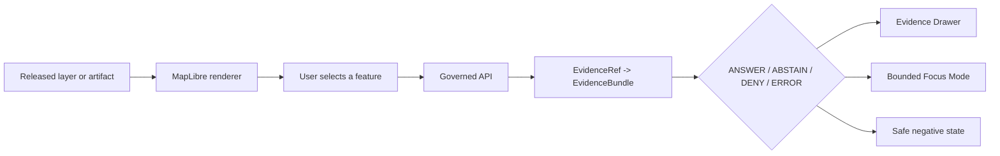

<!--
KFM_WIKI_SOURCE
page_id: Map-UI-and-AI
title: Map, UI, and AI
status: PROPOSED wiki source; review required
updated: 2026-08-07
authority: orientation-only; canonical repository evidence and adopted KFM authority outrank this page
source_path: docs/wiki/Map-UI-and-AI.md
publication_effect: none until separately synchronized to the native GitHub Wiki
-->
# Map, UI, and AI

KFM is map-first, but the renderer is downstream of trust. The public experience should make evidence, time, policy, release, stale state, and correction visible without allowing browser state or generated language to become authority.

## Governed interaction path



If a popup or answer reads raw feature properties or direct model output as evidence, the trust membrane has been bypassed.

## MapLibre boundary

MapLibre may:

- render released styles, sources, layers, terrain, and public-safe artifacts;
- expose camera, time, viewport, layer, and selection context;
- support feature emphasis and interaction;
- route selected IDs to governed services;
- emit bounded runtime diagnostics.

MapLibre must not:

- read RAW, WORK, QUARANTINE, unpublished candidates, proof internals, or model stores directly;
- decide truth, rights, sensitivity, review, release, or citation validity;
- use style-only hiding for sensitive data that should have been transformed before delivery;
- treat rendered pixels or feature properties as evidence authority.

## Explorer Web

`apps/explorer-web/` is the map-first public/semi-public application lane. At the wiki authoring checkpoint, its README documents a bounded static shell with fixture-only Evidence Drawer behavior, finite negative states, keyboard focus handling, and synthetic no-leak tests. It explicitly does **not** claim live API integration, live map data, canonical payload adoption, policy execution, or deployment.

Read the current [Explorer Web README](https://github.com/bartytime4life/Kansas-Frontier-Matrix/blob/main/apps/explorer-web/README.md) before describing implementation.

## Governed API

`apps/governed-api/` is the intended executable trust membrane. It should resolve evidence, apply policy, preserve release/correction state, and return exactly one finite envelope outcome. Candidate route names in documentation remain proposed until current route, schema, test, policy, and runtime evidence proves them.

Read the [Governed API README](https://github.com/bartytime4life/Kansas-Frontier-Matrix/blob/main/apps/governed-api/README.md).

## Evidence Drawer

The Evidence Drawer should expose, at a level appropriate to the claim:

- claim or selected-feature identity;
- source role and evidence summary;
- spatial and temporal scope;
- citations and limitations;
- review and release state;
- sensitivity or generalization notice;
- stale, correction, withdrawal, or supersession state;
- safe negative outcome and reason code.

Denied or error states must not leak blocked content through the DOM, logs, diagnostics, or client-side payload.

## Focus Mode and governed AI

Focus Mode may interpret a bounded map context over released evidence. It cannot:

- call a model directly from the public browser;
- treat retrieval hits as evidence closure;
- invent citations or hidden support;
- approve policy or release;
- expose private reasoning;
- answer when the evidence or policy state requires abstention or denial.

A safe path is:

```text
MapContextEnvelope
  -> governed API
  -> EvidenceBundle resolution
  -> policy precheck
  -> provider-neutral AI adapter
  -> citation validation
  -> policy postcheck
  -> finite response + AIReceipt reference
```

## 3D and synthetic views

Terrain, extrusions, point clouds, reconstructions, and synthetic views remain conditional carriers. They need evidence parity, representation labels, source/manifests, sensitivity transformations, and a reality-boundary note. A reconstruction is not an observation.

## UI acceptance questions

- Can every consequential state resolve to released evidence?
- Are `ABSTAIN`, `DENY`, and `ERROR` visible and accessible?
- Is time state explicit?
- Are sensitive features transformed before delivery?
- Does keyboard focus enter and return correctly?
- Do denied and error paths avoid data leakage?
- Can a user inspect release and correction state?
- Can the feature be rolled back without touching canonical truth?

## References

- [MapLibre architecture](https://github.com/bartytime4life/Kansas-Frontier-Matrix/blob/main/docs/architecture/maplibre.md)
- [Architecture index](https://github.com/bartytime4life/Kansas-Frontier-Matrix/blob/main/docs/architecture/README.md)
- [Explorer Web](https://github.com/bartytime4life/Kansas-Frontier-Matrix/blob/main/apps/explorer-web/README.md)
- [Governed API](https://github.com/bartytime4life/Kansas-Frontier-Matrix/blob/main/apps/governed-api/README.md)
- [MapLibre package](https://github.com/bartytime4life/Kansas-Frontier-Matrix/tree/main/packages/maplibre)
- [UI packages](https://github.com/bartytime4life/Kansas-Frontier-Matrix/tree/main/packages/ui)
