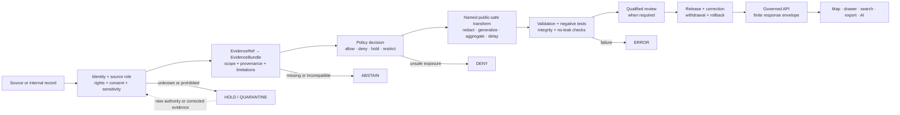

<!--
KFM_WIKI_SOURCE
page_id: Security-and-Sensitivity
title: Security and Sensitivity
version: v0.2.0
status: PROPOSED wiki source; review required
created: 2026-08-07
updated: 2026-08-15
authority: orientation-only; canonical repository evidence, adopted KFM doctrine, accepted ADRs, contracts, schemas, policy, review, release, correction, and rollback records outrank this page
source_path: docs/wiki/Security-and-Sensitivity.md
owning_root: docs/
responsibility: public orientation to KFM security, harmful-precision, sensitivity, rights, exposure, denial, reporting, correction, and rollback boundaries
evidence_snapshot: main@dc5549980158a9df81d643e367dc9d861494f378
prior_blob: 63a7ff26ca21fefdacc5267495e3e9732e5b6dfb
publication_effect: none until separately synchronized to the native GitHub Wiki
-->

<a id="top"></a>

<p align="center">
  
</p>

# Security and Sensitivity

<p align="center"><strong>How KFM protects its trust path—and protects people, places, communities, sources, and systems from harmful exposure.</strong></p>

KFM security and sensitivity are related but not interchangeable. **Security** protects the system against unauthorized access, leakage, tampering, bypass, abuse, and supply-chain failure. **Sensitivity** asks whether releasing otherwise valid information at a particular precision, time, audience, or combination could cause harm.

> [!IMPORTANT]
> **Unknown is not permission.** When identity, rights, consent, sovereignty, source role, evidence, sensitivity, review, release state, or public consequence is unresolved, KFM holds, quarantines, generalizes, abstains, denies, or errors rather than guessing a permissive result.

> [!CAUTION]
> Do not post credentials, exploit details, private endpoints, restricted source payloads, living-person private data, DNA or genomic material, exact rare-species or archaeology locations, sacred or culturally controlled knowledge, harmful infrastructure detail, or reconstructable sensitive joins in public issues, pull requests, wiki pages, logs, screenshots, fixtures, or generated receipts.

> [!NOTE]
> **Evidence checkpoint:** reviewed against [`main@dc5549980158a9df81d643e367dc9d861494f378`](https://github.com/bartytime4life/Kansas-Frontier-Matrix/tree/dc5549980158a9df81d643e367dc9d861494f378). A commit proves repository bytes at that revision. It does not by itself prove deployed controls, an active policy evaluator, private-reporting availability, release readiness, operational rehearsal, or native-wiki synchronization.

## At a glance

| Question | KFM answer |
|---|---|
| What is the default when sensitive context is incomplete? | Fail closed through `HOLD`, `QUARANTINE`, `ABSTAIN`, `DENY`, or `ERROR` |
| What may a public client read? | Governed API responses and released public-safe artifacts—not RAW, WORK, QUARANTINE, candidate, canonical, internal, secret, or direct-model stores |
| Is hiding a feature in MapLibre enough? | No. Sensitive fields and geometry must be transformed or removed before public delivery |
| Is a schema-valid object safe to publish? | Not necessarily. Shape, evidence, rights, sensitivity, policy, review, and release are separate decisions |
| Can an EvidenceBundle be sensitive? | Yes. Evidence support does not grant exposure permission |
| Can policy permit a derivative but deny the source record? | Yes. Public-safe derivatives may be narrower than steward-visible evidence |
| How should vulnerability details be reported? | Privately first through the current repository security process; do not use a public issue |
| Is KFM an emergency-alert or life-safety authority? | No. KFM may explain released evidence but must not replace official instructions or alerts |
| What is current implementation maturity? | Documentation-rich, bounded negative guards present, broader sensitivity-policy enforcement not established |
| Does this page publish or declassify anything? | No. It is public orientation source only |

**Quick navigation:** [Operating model](#security-and-sensitivity-operating-model) · [Decision axes](#keep-the-decision-axes-separate) · [Default handling](#default-fail-closed-handling) · [Trust membrane](#public-trust-membrane) · [Transforms](#transform-before-delivery) · [Inference](#inference-and-side-channel-safety) · [Finite outcomes](#finite-public-outcomes) · [Reporting](#reporting-a-security-sensitive-defect) · [Correction](#containment-correction-and-rollback) · [Current baseline](#current-bounded-implementation) · [Anti-patterns](#security-and-sensitivity-anti-patterns) · [References](#canonical-reading)

---

## Security and sensitivity operating model

Security and sensitivity controls must apply before bytes cross into a public or semi-public surface. A downstream map, search index, export, graph, story, screenshot, or AI answer cannot repair an unsafe upstream payload.



### What this model protects

- **The source cannot declassify itself.** Public availability upstream does not prove KFM redistribution rights or safe precision.
- **Evidence cannot grant permission.** Evidence may support a claim while policy still denies exposure.
- **Policy cannot invent truth.** An allow decision cannot repair missing or incompatible evidence.
- **A transform cannot erase lineage.** Public-safe derivatives remain traceable to restricted inputs without exposing them.
- **Validation cannot replace review.** A green test proves its assertion, not legal, cultural, privacy, or release approval.
- **A merge cannot become release.** Repository review and KFM publication remain separate transitions.
- **A client cannot become the security boundary.** Protected bytes must not be shipped and merely hidden.

Read the broader trust path in [Architecture](Architecture.md) and [Governance and Evidence](Governance-and-Evidence.md).

[Back to top](#top)

---

## Keep the decision axes separate

Several kinds of status may apply to the same object. Combining them into one “safe” score hides the reason a decision was made and makes correction difficult.

| Axis | Question answered | Example outcomes | What it does not prove |
|---|---|---|---|
| Security posture | Can the system prevent unauthorized access, leakage, tampering, bypass, and unsafe execution? | protected, exposed, compromised, unverified | Truth, rights, or release |
| Content sensitivity | Could exposure at this precision, time, audience, or combination cause harm? | public-safe, generalized, restricted, review-required, denied | Source authority or evidence sufficiency |
| Rights, consent, and sovereignty | Is KFM permitted to use or expose the material in this form? | open, controlled, restricted, unknown, revoked | Factual truth |
| Evidence state | Does support resolve for the requested claim scope? | closed, unresolved, stale, conflicted, incompatible | Exposure permission |
| Policy disposition | What operation may proceed for this actor, purpose, and payload? | allow, deny, hold, restrict, redact, generalize, delay | Human approval or release |
| Review state | Has the required qualified reviewer decided the bounded case? | pending, approved, rejected, held, changes requested | Runtime enforcement |
| Lifecycle state | Where is the governed material? | RAW, WORK, QUARANTINE, PROCESSED, CATALOG / TRIPLET, PUBLISHED | Public safety merely because a path exists |
| Release state | Which immutable public-safe representation is in force? | candidate, released, corrected, withdrawn, superseded | That every consumer propagated it correctly |
| Incident state | What response phase is active? | detected, contained, remediated, recovered, closed | That exposure never occurred |
| Truth label | How strongly is a statement supported in the current investigation? | `CONFIRMED`, `PROPOSED`, `UNKNOWN`, `NEEDS VERIFICATION` | Runtime or policy outcome |

The draft sensitivity doctrine further distinguishes three questions—content sensitivity, audience/access class, and release-transform tier. The exact machine mapping remains subject to accepted contracts and policy; this wiki page does not ratify one.

> [!TIP]
> When someone says an object is “safe,” ask: **safe against which threat, for which audience and purpose, under which rights, after which transform, at what time, and under which release?**

[Back to top](#top)

---

## Default fail-closed handling

The table below is public orientation, not a per-record decision. Individual disposition remains operation-specific and must use the owning policy, review, and release process.

| Material or condition | Default posture | Public-safe possibility |
|---|---|---|
| Credentials, tokens, private keys, signing material, secret-bearing configuration | **DENY public storage and disclosure** | None; rotate or revoke after exposure |
| Vulnerability or exploit detail | **Private first; restrict** | Public advisory only after coordinated review and safe wording |
| Living-person private information | **DENY or role-restrict** | Reviewed aggregation or de-identification when rights and re-identification risk close |
| DNA or genomic information | **DENY public use** | Narrow named access only with consent, qualified review, and policy support |
| Exact rare-species or rare-plant locations | **DENY exact public precision** | Generalized, aggregated, delayed, or seasonal derivative after review |
| Archaeology, burial, sacred, or culturally controlled knowledge | **DENY exact or controlled detail** | Rights-holder and sovereignty review may permit a bounded derivative |
| Critical-infrastructure interior, dependency, vulnerability, or operational detail | **DENY harmful precision** | Generalized public context that does not expose exploit-relevant detail |
| Private wells, land, title, stewardship, facilities, or person-parcel joins | **HOLD / RESTRICT** | Minimized, aggregated, or legally reviewed derivative |
| Source-restricted evidence or terms with unknown redistribution rights | **QUARANTINE / DENY release** | Metadata-only or transformed use only when terms clearly permit it |
| Unreleased RAW, WORK, QUARANTINE, candidate, or internal records | **DENY public route** | Released derivative through the governed lifecycle |
| AI prompts, hidden instructions, private reasoning, or raw provider output | **DENY public disclosure** | Bounded, cited, policy-cleared response envelope |
| Unknown classification, rights, identity, or source role | **HOLD** | Reassess after authoritative evidence or qualified review |
| Hazard or emergency information presented as KFM instruction authority | **DENY that role** | Link to official authorities and explain released evidence with clear limitations |

Default denial does not mean “never useful.” It means KFM must find the **least revealing representation that still serves a legitimate, evidence-backed purpose**—or abstain.

[Back to top](#top)

---

## Public trust membrane

Ordinary public and semi-public clients stay downstream of governed release. They do not reach canonical or unreleased stores directly.

```text
RAW / WORK / QUARANTINE / internal stores / restricted evidence / model runtime
             ↓  DENY direct public access
evidence + policy + transform + review + release + rollback
             ↓
governed API and released public-safe carriers
             ↓
Explorer Web / MapLibre / Evidence Drawer / search / export / Focus Mode
```

### Surface rules

| Surface | May receive | Must not receive |
|---|---|---|
| Public web UI | Released public-safe payloads, finite outcomes, safe citations, visible limitations | Raw records, blocked fields, exact sensitive geometry, secrets, private review notes |
| Governed API | Validated request context and released or explicitly role-authorized projections | Hidden fallback to canonical stores or raw model output |
| Map and tiles | Release-bound generalized geometry, public-safe attributes, manifest identity | Exact protected coordinates merely hidden by style |
| Evidence Drawer | Public-safe citations, source role, limitations, transform and release context | Restricted excerpts, signed source URLs, blocked values, internal locators |
| Search and graph | Released indexes and relationships at permitted precision | Edges or facets that reconstruct denied identities or locations |
| Export | Release-bound artifact plus rights, sensitivity, citation, and correction metadata | Silent field widening, unreleased joins, stripped restrictions |
| Focus Mode or AI | Admitted released evidence and bounded map context | Direct model endpoint, private prompts, RAW/WORK evidence, policy override |
| Telemetry and logs | Minimal event metadata and public-safe identifiers | Prompt text, full evidence bundles, restricted coordinates, secrets, denied payload values |
| Review console | Explicitly authenticated, role-bounded review projection | Public-path reuse or undocumented admin shortcut |
| Static screenshots and stories | Released view with citation, release, and correction context | A frozen leak that bypasses current withdrawal or sensitivity state |

> [!WARNING]
> A private-looking URL, hidden layer, client-side permission check, low zoom level, popup omission, or CSS class is not a security control when the protected bytes already reached the client.

[Back to top](#top)

---

## Transform before delivery

A public-safe derivative should be created, validated, reviewed, and released **before** the public client receives it.

```text
restricted source record
  → named deterministic transform
  → transform or redaction receipt
  → no-leak and inference tests
  → policy and qualified review
  → release manifest and rollback target
  → public-safe derivative
```

### Common transform families

| Transform | Appropriate use | Required caution |
|---|---|---|
| Geometry generalization | Coarser grid, administrative rollup, public-safe range or region | Preserve scale and uncertainty; test reverse inference |
| Aggregation | Counts or summaries over sufficient populations or areas | Do not imply an individual event or exact local condition |
| Field suppression | Remove direct or quasi-identifiers, sensitive attributes, internal locators | Check joins, labels, URLs, metadata, and derived indexes |
| Categorical replacement | Replace exact values with public-safe classes | Document the mapping and avoid false precision |
| Temporal coarsening or delay | Reduce day/time precision, embargo, seasonal or delayed release | Keep valid, observed, release, and correction time distinct |
| Role-gated projection | Provide a narrower steward/reviewer payload than the public payload | Authenticate and authorize server-side; audit access |
| Redacted evidence summary | Explain support without reproducing restricted evidence | Ensure wording does not reveal the protected fact |
| k-anonymity or differential privacy | Aggregate privacy protection where an adopted profile and validation exist | Not a generic fix; record parameters, budget, and limitations |
| Public-safe derived geometry | Publish a separate geometry built for exposure | Never overwrite the restricted source geometry |
| Complete withholding | No safe derivative meets the purpose | Return a safe denial or abstention |

### Transform requirements

A material transform should be:

1. **Named and versioned.**
2. **Deterministic or explicitly randomized under a governed reproducibility policy.**
3. **Bound to input and output digests where practical.**
4. **Reviewable for distortion, re-identification, and source-role changes.**
5. **Recorded in provenance or a transform/redaction receipt.**
6. **Reversible at the release level** through correction, withdrawal, and rollback—even when the transform itself is intentionally one-way.
7. **Tested across every downstream carrier**, not only the original API response.

[Back to top](#top)

---

## Inference and side-channel safety

Removing one obvious field is not enough when the protected fact can be reconstructed elsewhere.

Review at least these channels:

| Channel | Possible leak |
|---|---|
| Cross-layer joins | A generalized point becomes identifiable when combined with parcel, road, habitat, or person data |
| Search and autocomplete | Protected names, IDs, or places appear in suggestions or facets |
| Bounding boxes and counts | A single-feature tile, empty-ring pattern, or exact extent reveals location |
| Time controls | Repeated snapshots or precise timestamps allow triangulation |
| Labels, popups, legends, alt text | Hidden attributes are repeated in presentation text |
| Tile, file, and object metadata | Filenames, source-layer names, embedded properties, or manifests expose restricted identifiers |
| Errors and denial reasons | The response confirms that a protected record exists or identifies why it is sensitive |
| Caches and CDNs | Withdrawn bytes remain retrievable after a correction |
| Telemetry and logs | Blocked values, coordinates, prompts, signed URLs, or evidence excerpts enter observability systems |
| AI and summaries | Generated text synthesizes a protected fact from individually permitted clues |
| Screenshots, stories, and exports | Static derivatives outlive the governing release or omit correction metadata |
| 3D and terrain views | Height, mesh, camera path, or clipping boundary reveals a protected site |

A public-safe transform must be tested against the **composition**, not just each field in isolation.

[Back to top](#top)

---

## Finite public outcomes

KFM should distinguish truth refusal, policy refusal, and operational failure.

| Outcome | Use when | Safe public behavior |
|---|---|---|
| `ANSWER` | Released, evidence-supported, policy-safe information exists for the requested scope | Return the bounded answer, citations, limitations, release identity, and correction state where material |
| `ABSTAIN` | Evidence is missing, stale, conflicted, incompatible, or too weak | Say that support is unavailable or insufficient without inventing an answer |
| `DENY` | Rights, sensitivity, consent, role, purpose, release state, or harmful precision blocks exposure | Refuse without confirming protected facts or exposing detailed policy internals |
| `ERROR` | Resolver, validator, policy service, adapter, storage, or runtime failed | Return a safe incident/reference ID; never fall back to allow |
| `HOLD` / `QUARANTINE` | Review or upstream resolution is required before a lifecycle transition | Keep the object non-public and route it to the appropriate steward |

### Safe reason behavior

Public responses may identify a broad class such as `EVIDENCE_UNRESOLVED`, `ACCESS_DENIED`, `SENSITIVE_PRECISION_RESTRICTED`, or `SERVICE_ERROR` when the owning contract supports it. They should not expose:

- blocked field values;
- exact sensitive coordinates;
- private identities or source locators;
- filesystem, database, bucket, or internal service paths;
- credentials, signed URLs, or secret names;
- policy source code or thresholds that enable inference;
- stack traces;
- prompts or private reasoning;
- whether a specific protected record exists when even existence is restricted.

[Back to top](#top)

---

## Reporting a security-sensitive defect

Use the repository-root [security policy](https://github.com/bartytime4life/Kansas-Frontier-Matrix/blob/main/SECURITY.md).

> [!IMPORTANT]
> **Report privately first.** Do not open a public issue, pull-request comment, Discussion, or wiki edit containing vulnerability details or sensitive exposure evidence.

At the reviewed snapshot, `SECURITY.md` prefers GitHub private vulnerability reporting **if enabled** and otherwise directs reporters to a private maintainer channel. The exact operational contact remains `NEEDS VERIFICATION`; do not use placeholder addresses as if they were monitored.

### Include privately

- a concise problem summary;
- the affected path, route, workflow, artifact, policy, validator, or surface;
- likely impact;
- minimal synthetic reproduction steps;
- redacted evidence;
- the relevant sensitivity class;
- a bounded remediation idea when available.

### Do not include without an authorized secure transfer path

- raw tokens, keys, credentials, or signed URLs;
- exact protected coordinates;
- living-person or genomic records;
- source-restricted payloads;
- production logs containing private data;
- exploit payloads against live systems;
- unnecessary copies of the affected data.

[Back to top](#top)

---

## Containment, correction, and rollback

A sensitive exposure or trust-boundary bypass is not corrected by silently editing the visible page.

```text
detect
  → contain the affected route, artifact, cache, or release
  → preserve restricted incident evidence
  → classify affected object families and public carriers
  → revoke, rotate, redact, withdraw, or correct
  → issue governed replacement release where appropriate
  → purge or invalidate caches, indexes, tiles, exports, and AI context
  → verify propagation and rollback
  → record residual risk and follow-up controls
```

### Response responsibilities

| Concern | Owning surface |
|---|---|
| Public vulnerability intake | Root `SECURITY.md` |
| Threat and sensitivity doctrine | `docs/security/` and `docs/doctrine/` |
| Operational incident procedure | `docs/runbooks/` |
| Policy decision | `policy/` plus governed evaluation and review |
| Runtime containment | Owning application, runtime, package, or infrastructure surface |
| Evidence, receipts, and proofs | Governed `data/` accountability lanes |
| Release correction, withdrawal, and rollback | `release/` |
| Public communication | Reviewed, public-safe advisory or correction record |

The repository currently contains both `docs/security/INCIDENT_RESPONSE.md` and `docs/runbooks/INCIDENT_RESPONSE.md`. The security index treats them as doctrine versus operational procedure and records boundary drift that still needs file-specific reconciliation. This wiki page does not rename, consolidate, or choose a new canonical path.

[Back to top](#top)

---

## Current bounded implementation

The following observations are pinned to `main@dc5549980158a9df81d643e367dc9d861494f378`. They describe repository bytes and documented bounded checks—not deployment, operational admission, or release.

| Surface | Current evidence | Safe conclusion |
|---|---|---|
| Public disclosure entrypoint | Root `SECURITY.md` exists and requires private-first reporting | Reporting doctrine exists; the exact private channel/contact remains `NEEDS VERIFICATION` |
| Security documentation lane | `docs/security/` contains this lane README plus eight direct guidance files | A substantial documentation surface exists; most child documents remain draft and require file-specific reconciliation |
| Exposure guidance | Current tracked file is `docs/security/EXPOSURE_PLAN.md` | The path exists; older references to `EXPOSURE_POSTURE.md` remain documentation drift and are not resolved by this page |
| Incident guidance | Security doctrine and an operational runbook exist in separate lanes | Their intended distinction is visible; consolidation or retirement remains a separate decision |
| Deny-by-default ADR | ADR-0010 exists with effective status `proposed` | The decision is documented but not accepted or binding |
| Sensitivity policy source | `policy/sensitivity/README.md` reports 16 Rego files, 11 YAML files, six Markdown files, and 18 placeholders | The corpus is real but mixed-maturity scaffold material, not an active policy system |
| Rule defaults | The sensitivity README reports eleven scaffolds with `default allow := false` and five stubs with `default deny := false` but no operative denial rule | File presence and fail-closed-looking names do not prove protection |
| Policy runtime | No accepted sensitivity bundle, general evaluator binding, complete native tests, authenticated decision flow, or release integration is established by the reviewed evidence | Runtime sensitivity enforcement remains `UNKNOWN` / held |
| Bounded deny checks | `DENY_TESTS.md` records five app-owned route, method, manifest, internal-store-literal, and forbidden-import guards | Useful structural evidence exists; comprehensive auth, rights, sensitivity, release, runtime, and production proof does not |
| Governed public enforcement | Documentation describes governed API, release, and public-safe carriers | End-to-end sensitive-data policy enforcement, deployment, and public operation are not established by this page |
| Native GitHub Wiki | This is source-managed Markdown in the main repository | Native-wiki synchronization and readback remain separate and unperformed by this source update |

### Current maturity summary

**CONFIRMED:** KFM has substantive public security guidance, a documented fail-closed posture, a populated security-documentation lane, a sensitivity-policy source corpus, bounded structural deny tests, and explicit release/correction boundaries.

**PROPOSED or NEEDS VERIFICATION:** accepted sensitivity semantics, qualified owners, private reporting configuration, coherent evaluator and bundle binding, complete negative fixtures, governed consumer enforcement, release-significant operation, incident rehearsal, cache purge behavior, deployment, and native-wiki publication.

[Back to top](#top)

---

## Reader and reviewer routes

| Need | Start here |
|---|---|
| Report a vulnerability | [Repository security policy](https://github.com/bartytime4life/Kansas-Frontier-Matrix/blob/main/SECURITY.md) |
| Understand the security lane | [Security guidance index](https://github.com/bartytime4life/Kansas-Frontier-Matrix/blob/main/docs/security/README.md) |
| Review threat families | [Threat model](https://github.com/bartytime4life/Kansas-Frontier-Matrix/blob/main/docs/security/THREAT_MODEL.md) |
| Review exposure boundaries | [Exposure plan](https://github.com/bartytime4life/Kansas-Frontier-Matrix/blob/main/docs/security/EXPOSURE_PLAN.md) |
| Review data classification | [Data classification](https://github.com/bartytime4life/Kansas-Frontier-Matrix/blob/main/docs/security/DATA_CLASSIFICATION.md) |
| Review negative-path doctrine | [Deny tests](https://github.com/bartytime4life/Kansas-Frontier-Matrix/blob/main/docs/security/DENY_TESTS.md) |
| Review sensitivity doctrine | [Sensitivity](https://github.com/bartytime4life/Kansas-Frontier-Matrix/blob/main/docs/doctrine/sensitivity.md) |
| Review current policy-source boundary | [Sensitivity policy](https://github.com/bartytime4life/Kansas-Frontier-Matrix/blob/main/policy/sensitivity/README.md) |
| Review proposed deny-by-default decision | [ADR-0010](https://github.com/bartytime4life/Kansas-Frontier-Matrix/blob/main/docs/adr/ADR-0010-deny-by-default-for-dna-rare-species-archaeology-infrastructure.md) |
| Execute operational incident procedure | [Incident-response runbook](https://github.com/bartytime4life/Kansas-Frontier-Matrix/blob/main/docs/runbooks/INCIDENT_RESPONSE.md) |
| Review release and rollback authority | [Release root](https://github.com/bartytime4life/Kansas-Frontier-Matrix/tree/main/release) |
| Understand evidence and release separation | [Governance and Evidence](Governance-and-Evidence.md) |
| Understand map and AI delivery | [Map, UI, and AI](Map-UI-and-AI.md) |

[Back to top](#top)

---

## Security and sensitivity anti-patterns

Reject these patterns:

- shipping exact sensitive bytes and relying on a client-side filter;
- treating a schema pass as rights or sensitivity clearance;
- treating an EvidenceBundle as an allow decision;
- treating a policy allow as human review or release;
- using a single confidence score to hide evidence, rights, identity, precision, and review gaps;
- putting real protected data in fixtures, examples, screenshots, receipts, or logs;
- returning denial reasons that reveal the protected fact;
- assuming absence of a matching rule means allow;
- treating a Rego filename, comment, or default as proof that a deployed evaluator enforces it;
- letting AI refusal instructions substitute for server-side policy;
- exposing direct model endpoints to the browser;
- allowing admin or review routes to become the normal public path;
- assuming a private-looking URL is access control;
- overlooking cross-layer, temporal, search, metadata, export, or AI inference;
- silently replacing a sensitive artifact instead of correcting, withdrawing, and invalidating derivatives;
- treating a green workflow, pull request, merge, wiki page, map layer, or generated receipt as publication;
- publishing security-sensitive defect details in a public collaboration surface;
- presenting KFM as an emergency-alert or life-safety authority.

[Back to top](#top)

---

## Canonical reading

### Public and security entrypoints

- [Repository security policy](https://github.com/bartytime4life/Kansas-Frontier-Matrix/blob/main/SECURITY.md)
- [Security guidance and trust-boundary index](https://github.com/bartytime4life/Kansas-Frontier-Matrix/blob/main/docs/security/README.md)
- [Threat model](https://github.com/bartytime4life/Kansas-Frontier-Matrix/blob/main/docs/security/THREAT_MODEL.md)
- [Exposure plan](https://github.com/bartytime4life/Kansas-Frontier-Matrix/blob/main/docs/security/EXPOSURE_PLAN.md)
- [Data classification](https://github.com/bartytime4life/Kansas-Frontier-Matrix/blob/main/docs/security/DATA_CLASSIFICATION.md)
- [Deny tests](https://github.com/bartytime4life/Kansas-Frontier-Matrix/blob/main/docs/security/DENY_TESTS.md)

### Doctrine, policy, and decision boundaries

- [Sensitivity doctrine](https://github.com/bartytime4life/Kansas-Frontier-Matrix/blob/main/docs/doctrine/sensitivity.md)
- [Trust membrane](https://github.com/bartytime4life/Kansas-Frontier-Matrix/blob/main/docs/doctrine/trust-membrane.md)
- [Lifecycle law](https://github.com/bartytime4life/Kansas-Frontier-Matrix/blob/main/docs/doctrine/lifecycle-law.md)
- [Policy root](https://github.com/bartytime4life/Kansas-Frontier-Matrix/tree/main/policy)
- [Sensitivity policy boundary](https://github.com/bartytime4life/Kansas-Frontier-Matrix/blob/main/policy/sensitivity/README.md)
- [ADR-0010 — proposed deny-by-default decision](https://github.com/bartytime4life/Kansas-Frontier-Matrix/blob/main/docs/adr/ADR-0010-deny-by-default-for-dna-rare-species-archaeology-infrastructure.md)
- [Release, correction, withdrawal, and rollback](https://github.com/bartytime4life/Kansas-Frontier-Matrix/tree/main/release)

### Wiki orientation

- [Architecture](Architecture.md)
- [Governance and Evidence](Governance-and-Evidence.md)
- [Data Lifecycle](Data-Lifecycle.md)
- [Map, UI, and AI](Map-UI-and-AI.md)
- [Project Status](Project-Status.md)

[Back to top](#top)

---

## Wiki boundary

This page is designed for public orientation. It must never contain or reproduce:

- credentials, tokens, private keys, or secret names that aid discovery;
- private endpoints or signed source URLs;
- exploit steps or active vulnerability details;
- exact protected coordinates or reconstructable sensitive joins;
- living-person private records or genomic material;
- restricted source payloads or non-redistributable excerpts;
- private incident evidence or reviewer notes;
- blocked payload values;
- raw prompts, private reasoning, or model-provider output;
- internal denial thresholds whose disclosure would materially aid bypass.

The native GitHub Wiki is a separate repository. Updating this source page does not synchronize, release, deploy, or publish that projection.

[Back to top](#top)

---

## Maintenance and rollback

Update this page when:

- security or sensitivity doctrine changes;
- ADR-0010 or another relevant decision changes status;
- the disclosure channel becomes verified;
- policy evaluator, bundle, consumer, or negative-test maturity changes;
- a new public surface or sensitive class is admitted;
- the exposure-plan or incident-response path boundary is resolved;
- correction, withdrawal, cache invalidation, or rollback behavior changes; or
- a native-wiki synchronization is explicitly reviewed and performed.

For a source-only correction, restore the previous page blob:

```text
63a7ff26ca21fefdacc5267495e3e9732e5b6dfb
```

After merge, use a normal revert or reviewed forward fix. If these bytes are later synchronized to the native wiki, correct the main-repository source first, then revert or republish the native-wiki commit through the documented maintenance process. Do not force-push shared history merely to hide a correction.

[Back to top](#top)
