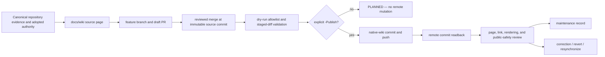

<!--
KFM_WIKI_SOURCE
page_id: Wiki-Maintenance
title: Wiki Maintenance
version: v0.2.0
status: PROPOSED wiki source; review required
created: 2026-08-07
updated: 2026-08-15
authority: orientation-and-operations guidance only; canonical repository evidence, adopted KFM authority, repository security policy, and reviewed source bytes outrank this page
source_path: docs/wiki/Wiki-Maintenance.md
owning_root: docs/
responsibility: public-safe maintenance guidance for authoring, reviewing, synchronizing, validating, correcting, and rolling back the KFM native GitHub Wiki projection
evidence_snapshot: main@2be86d8d60ba2b33e724935208682153fc06d812
prior_blob: 15401ed968973108bd5c957e4aa1450a949dfdef
publication_effect: none until a separately authorized native-wiki synchronization succeeds and is read back
-->

<a id="top"></a>

<p align="center">
  
</p>

# Wiki Maintenance

<p align="center"><strong>How KFM keeps a public GitHub Wiki useful without turning it into a second authority, an unreviewed publishing path, or a place where corrections disappear.</strong></p>

KFM maintains its wiki pages as reviewed source files under `docs/wiki/` in the main repository. The native GitHub Wiki is a separate Git repository and a **derived public orientation mirror**. Source authoring, pull-request review, merge, native-wiki synchronization, readback, rendering review, correction, and rollback are distinct steps.

> [!IMPORTANT]
> **A source merge is not a wiki synchronization, and a wiki synchronization is not KFM data publication.** Neither operation adopts doctrine, approves policy, releases lifecycle data, proves runtime behavior, or makes wiki prose authoritative.

> [!CAUTION]
> **Native-wiki synchronization is a public remote mutation.** Use an immutable reviewed source commit, stage only the allowlisted pages, inspect the diff, push without force, read back the remote commit, and preserve a correction path.

> [!NOTE]
> **Evidence checkpoint:** reviewed against [`main@2be86d8d60ba2b33e724935208682153fc06d812`](https://github.com/bartytime4life/Kansas-Frontier-Matrix/tree/2be86d8d60ba2b33e724935208682153fc06d812). Repository metadata reports `has_wiki: true`. The GitHub connector did not resolve a readable native `Home` page or a normal REST repository for `Kansas-Frontier-Matrix.wiki`; that observation does **not** prove whether the native wiki is empty, uninitialized, inaccessible through this connector, or already populated. Native-wiki state remains `NEEDS VERIFICATION` until an authorized operator performs Git readback.

## At a glance

| Question | Current answer |
|---|---|
| Where are wiki pages authored? | [`docs/wiki/`](https://github.com/bartytime4life/Kansas-Frontier-Matrix/tree/main/docs/wiki) in the main repository |
| What is the native wiki? | A separate derived public mirror at `Kansas-Frontier-Matrix.wiki.git` |
| How many files are in the source packet? | 17 Markdown files: 16 synchronization-allowlisted pages plus the source-governing `README.md` |
| Is `docs/wiki/README.md` published to the native wiki? | No; it governs the source packet and is intentionally excluded |
| What tool performs bounded synchronization? | [`tools/docs/wiki/sync_kfm_github_wiki.ps1`](https://github.com/bartytime4life/Kansas-Frontier-Matrix/blob/main/tools/docs/wiki/sync_kfm_github_wiki.ps1) |
| What is the default tool behavior? | Dry-run planning; remote mutation requires `-Publish` |
| What source revision should an operator use? | An explicit 40-character commit whose wiki-source change is merged and reviewed |
| Is the helper's built-in default current? | No assumption should be made; it points to the original wiki-foundation review and is a historical safe baseline |
| Does the helper delete unexpected native pages? | No; page retirement or cleanup requires a separate reviewed action |
| Is native-wiki synchronization confirmed in this page update? | No |
| What outranks wiki prose? | Current repository evidence, adopted doctrine, accepted ADRs, owning contracts/schemas/policy, review records, and release/correction/rollback authority |

**Quick navigation:** [Operating model](#operating-model-and-authority-boundary) · [Current checkpoint](#current-repository-checkpoint) · [Page set](#source-packet-and-page-allowlist) · [State model](#maintenance-state-model) · [Source workflow](#source-authoring-and-review-workflow) · [Initialization](#first-time-native-wiki-initialization) · [Dry run](#dry-run-synchronization) · [Publish](#explicit-native-wiki-synchronization) · [Readback](#readback-and-rendering-validation) · [Drift](#drift-detection-and-reconciliation) · [Correction](#correction-sensitive-exposure-and-rollback) · [Automation](#automation-admission-gates) · [Troubleshooting](#troubleshooting) · [Backlog](#open-verification-backlog)

---

## Operating model and authority boundary

The source-controlled wiki model preserves reviewability while acknowledging that GitHub stores native wiki content in a separate repository.



In plain language:

```text
authority and repository evidence
  -> reviewed docs/wiki source
  -> merged immutable source commit
  -> bounded dry run
  -> explicit public wiki synchronization
  -> remote commit readback
  -> rendering and safety review
  -> maintenance record
  -> correction or rollback when needed
```

| Surface | Owns | Does not own |
|---|---|---|
| Main-repository authority roots | Doctrine, decisions, contracts, schemas, policy, evidence, implementation, release, and correction state | Native-wiki transport |
| `docs/wiki/` | Reviewable public-orientation source and source-set maintenance contract | KFM truth, policy, release, or runtime authority |
| `tools/docs/wiki/` | Bounded synchronization tooling | Content approval or native-wiki canonicality |
| Native `<repository>.wiki.git` | Public orientation projection | Source of truth, lifecycle publication, or release authority |
| Pull request | Reviewable proposed source change | Human approval merely by existing |
| Generated authoring receipt | AI-authoring provenance and artifact binding | Human review, proof, release, or publication |
| Wiki commit | Exact native-wiki byte revision | Proof that the content is correct, current, safe, or canonical |

> [!IMPORTANT]
> **The native wiki must remain downstream of the main repository.** Emergency native edits may be necessary, but they must be backported into `docs/wiki/` immediately so a later synchronization cannot resurrect the defect.

[Back to top](#top)

---

## Current repository checkpoint

The following observations are bounded to the evidence snapshot named in this page metadata.

| Surface | Confirmed repository evidence | Safe conclusion |
|---|---|---|
| Repository setting | Public repository metadata reports `has_wiki: true` | Wiki functionality is enabled at the repository level |
| Native `Home` read | The connected GitHub tool returned `404` for the native `Home` page | Native initialization and content state remain `NEEDS VERIFICATION`; connector behavior is not authoritative Git readback |
| Source packet | `docs/wiki/` contains the 16 allowlisted native pages plus `README.md` | Main-repository source exists and is reviewable |
| Source contract | `docs/wiki/README.md` classifies the native wiki as a derived orientation target | Source and projection authority are deliberately separated |
| Synchronization helper | PowerShell helper exists under `tools/docs/wiki/` | Bounded transport is implemented as source code |
| Helper default | `SourceCommit` defaults to `3b2c4dc05a2a30ed045e7a04a6d15d103ce83a0d` | The default is a historical reviewed foundation, not an instruction to publish current `main` |
| Explicit mutation gate | Helper requires `-Publish` before commit and push | Default execution is non-mutating |
| Allowlist | Helper carries an exact ordered 16-page list and rejects unexpected changed or staged paths | The normal sync path is bounded to the approved page names |
| History safety | Helper contains no force-push, hard-reset, or clean operation and verifies remote branch SHA after push | Transport is designed to preserve shared history and require readback |
| Source-level contract test | `tests/ci/test_sync_kfm_github_wiki_contract.py` checks dry-run default, exact source commit format, allowlist, no-force posture, and remote readback logic | Repository-native source assertions exist; this does not prove a real publish run |
| Published wiki commit | No `APPLIED` maintenance record or native-wiki commit was established in the bounded repository search | Native synchronization state is `UNKNOWN` |
| Review route | Repository CODEOWNERS defaults review to `@bartytime4life` | GitHub routing is confirmed; independent documentation stewardship and operator separation remain `NEEDS VERIFICATION` |

### Current safest operator rule

Do not rely on the helper's built-in default when synchronizing newer reviewed content. Supply the exact merged source commit deliberately:

```powershell
pwsh -File tools/docs/wiki/sync_kfm_github_wiki.ps1 `
  -SourceCommit <reviewed-40-character-source-commit>
```

Only add `-Publish` after inspecting the dry-run plan and confirming operator authority.

[Back to top](#top)

---

## Source packet and page allowlist

The source packet currently contains 17 Markdown files. Sixteen are native-wiki pages; one governs the source packet and remains repository-only.

### Orientation

| Page | Native role |
|---|---|
| [`Home.md`](Home.md) | Public landing page |
| [`Getting-Started.md`](Getting-Started.md) | First-time orientation |
| [`Project-Status.md`](Project-Status.md) | Evidence-bounded project state |

### System and governance

| Page | Native role |
|---|---|
| [`Architecture.md`](Architecture.md) | Connected operating model and trust membrane |
| [`Repository-Map.md`](Repository-Map.md) | Responsibility-root navigation |
| [`Governance-and-Evidence.md`](Governance-and-Evidence.md) | Evidence, policy, review, release, and correction |
| [`Data-Lifecycle.md`](Data-Lifecycle.md) | RAW-to-PUBLISHED lifecycle |

### Knowledge and experience

| Page | Native role |
|---|---|
| [`Domains.md`](Domains.md) | Domain lanes and cross-domain seams |
| [`Map-UI-and-AI.md`](Map-UI-and-AI.md) | MapLibre, Evidence Drawer, and governed AI |
| [`Security-and-Sensitivity.md`](Security-and-Sensitivity.md) | Fail-closed security and harmful-precision posture |

### Build and maintain

| Page | Native role |
|---|---|
| [`Development-and-Validation.md`](Development-and-Validation.md) | Development and verification orientation |
| [`Contributing.md`](Contributing.md) | Contribution workflow |
| [`Glossary.md`](Glossary.md) | Shared vocabulary |
| [`Wiki-Maintenance.md`](Wiki-Maintenance.md) | This maintenance contract |

### Native special pages

| Page | Native role |
|---|---|
| [`_Sidebar.md`](_Sidebar.md) | Global page navigation |
| [`_Footer.md`](_Footer.md) | Authority, correction, and security reminder |

### Repository-only source contract

[`README.md`](README.md) is deliberately excluded from synchronization. It governs the source packet, page inventory, editing rules, validation, and projection boundary. Publishing it as an ordinary native page would blur source governance with reader navigation.

> [!CAUTION]
> **Allowlist changes are structural documentation changes.** Adding, renaming, removing, or retiring a native page requires synchronized updates to the source packet, helper allowlist, contract test, sidebar, source README, links, receipts, and rollback plan. This page alone cannot change that set.

[Back to top](#top)

---

## Maintenance state model

Do not compress source, transport, verification, and correction into a single word such as “published.”

### Source states

| State | Meaning |
|---|---|
| `SOURCE_DRAFT` | Source bytes exist on a branch or unmerged pull request |
| `SOURCE_REVIEWED` | Intended content review is complete for a named scope |
| `SOURCE_MERGED` | Reviewed bytes exist at an immutable main-repository commit |
| `SOURCE_SUPERSEDED` | A later reviewed source revision replaces the prior source |

### Transport outcomes

These labels are emitted or implied by the current helper and are not KFM policy decisions.

| Outcome | Meaning |
|---|---|
| `NOOP` | Allowlisted native pages already match the selected source snapshot |
| `PLANNED` | Staged diff validated; no native-wiki commit or push occurred |
| `APPLIED` | Native-wiki commit was pushed and the remote branch SHA matched local readback |
| `ERROR` | A precondition, clone, copy, allowlist, staging, commit, push, or readback step failed |

### Post-transport verification states

| State | Meaning |
|---|---|
| `COMMIT_READBACK_VERIFIED` | Source and wiki commits are recorded and remote SHA readback matches |
| `PAGESET_VERIFIED` | Intended pages exist and no unexpected page was introduced by the sync |
| `RENDER_VERIFIED` | Pages, links, tables, alerts, diagrams, images, keyboard flow, and mobile layout were inspected |
| `PUBLIC_SAFETY_VERIFIED` | No secret, restricted evidence, harmful precision, or unsafe reporting instruction was found |
| `DRIFT_DETECTED` | Native bytes or meaning differ from reviewed source |
| `CORRECTION_REQUIRED` | A defect or exposure requires source and/or native-wiki correction |

A successful `APPLIED` transport can still require correction. Conversely, a merged source page can remain unsynchronized indefinitely. Record each axis separately.

[Back to top](#top)

---

## Source authoring and review workflow

### 1. Inspect the evidence and authority

Before editing a wiki source page:

1. read the complete current page;
2. identify the claims, repository paths, statuses, dates, versions, and links that may have drifted;
3. inspect the canonical sources for those claims;
4. check the target history and open pull requests;
5. preserve the page ID, title, source path, stable anchors, and reader-facing role unless a separate migration is authorized;
6. use `CONFIRMED`, `PROPOSED`, `UNKNOWN`, and `NEEDS VERIFICATION` honestly;
7. keep secrets, restricted evidence, private review notes, and harmful precision out of public source.

### 2. Update on a feature branch

Make the smallest coherent documentation change. Direct dependencies may include:

- `_Sidebar.md` or `_Footer.md` when navigation or global wording changes;
- `docs/wiki/README.md` when page inventory or source rules change;
- `tools/docs/wiki/` and its test when the synchronization contract changes;
- generated authoring receipts for substantively AI-authored pages;
- link, graph, metadata, accessibility, and stale-reference repairs introduced by the change.

Do not create a sibling “new,” “v2,” “final,” or “improved” page merely to avoid updating the existing source.

### 3. Validate before review

At minimum, verify:

- one H1 on ordinary pages;
- preserved `KFM_WIKI_SOURCE` identity;
- orderly headings;
- balanced fences, HTML, tables, and alerts;
- resolving internal anchors;
- existing relative wiki targets;
- existing canonical repository targets;
- sidebar coverage and no duplicate page entries;
- public-safe text and examples;
- artifact hash parity for any generated receipt;
- repository-native documentation checks applicable to the change.

### 4. Review and merge source

The pull request should name:

- exact base and head;
- changed pages and direct dependencies;
- source evidence;
- authority and Directory Rules basis;
- current implementation and native-wiki limits;
- validation performed;
- security and sensitivity review;
- rollback target;
- explicit statement that native-wiki synchronization did not occur unless separately proven.

After merge, capture the immutable merge commit or another reviewed commit containing the complete intended page set. Do not use a moving branch name as the synchronization source.

[Back to top](#top)

---

## First-time native-wiki initialization

GitHub may not expose the `.wiki.git` repository until at least one native page exists. The current connector evidence does not establish whether initialization has happened.

An authorized repository owner or maintainer should use this bounded sequence:

1. Confirm repository metadata still enables the Wiki feature.
2. Open the repository **Wiki** tab through GitHub.
3. If GitHub requires a first page, create a minimal public-safe temporary `Home` page.
4. Record that this is a public documentation mutation, not a KFM release.
5. Verify from an authorized environment that the wiki repository can be read:

   ```bash
   git ls-remote https://github.com/bartytime4life/Kansas-Frontier-Matrix.wiki.git
   ```

6. Run the synchronization helper in dry-run mode with an explicit reviewed source commit.
7. Inspect the staged replacement of the temporary `Home` page and the complete allowlisted page set.
8. Run the explicit `-Publish` operation.
9. Record the resulting source and wiki commits.
10. Perform page, link, rendering, accessibility, and public-safety readback.

> [!CAUTION]
> If initialization creates any page outside the 16-page allowlist, the current helper will not delete it. Remove or retain that page only through a separate reviewed native-wiki change with a recorded rollback target.

[Back to top](#top)

---

## Dry-run synchronization

The helper is the preferred transport because it pins a source commit, uses an exact page allowlist, validates staged paths, runs `git diff --cached --check`, and defaults to no push.

### Preconditions

- Git is installed and available on `PATH`.
- PowerShell 5.1 or PowerShell 7 is available.
- The native wiki is initialized and cloneable.
- The selected source commit is a complete, reviewed, immutable commit.
- Every allowlisted page exists at that commit.
- The operator can read the source and native repositories.
- No sensitive incident or unresolved source defect is active.
- A correction and rollback plan is understood before remote mutation.

### Run the plan

From a checkout containing the helper:

```powershell
$SourceCommit = "<reviewed-40-character-source-commit>"

pwsh -File tools/docs/wiki/sync_kfm_github_wiki.ps1 `
  -SourceCommit $SourceCommit
```

Expected finite result:

- `NOOP` when the native wiki already matches the selected source set; or
- `PLANNED` when a validated staged diff exists and no commit or push occurred.

Review:

- selected source commit;
- changed page names;
- additions, modifications, and any unexpected deletion;
- sidebar and footer changes;
- links and images;
- source metadata comments;
- public-safety and authority language.

Use `-KeepWorkspace` only when inspection or troubleshooting requires retaining the temporary clones. The default cleanup behavior removes the temporary workspace after success or failure.

> [!WARNING]
> Running the helper without `-SourceCommit` selects its built-in historical foundation commit. That may be useful for a controlled historical comparison, but it is not a safe shortcut for synchronizing the current reviewed page set.

[Back to top](#top)

---

## Explicit native-wiki synchronization

Add `-Publish` only after the dry-run plan has been reviewed and the operator is authorized to mutate the public wiki repository.

```powershell
$SourceCommit = "<reviewed-40-character-source-commit>"

pwsh -File tools/docs/wiki/sync_kfm_github_wiki.ps1 `
  -SourceCommit $SourceCommit `
  -Publish
```

The helper then:

1. warns that `-Publish` performs a public mutation;
2. commits the staged allowlisted pages;
3. pushes without force to the current native-wiki branch;
4. resolves the local wiki commit;
5. reads the remote branch with `git ls-remote`;
6. fails if local and remote commits differ;
7. reports `APPLIED` with source commit, wiki branch, and wiki commit.

### Required maintenance record

A successful operation should record at least:

| Field | Required value |
|---|---|
| Source repository | `bartytime4life/Kansas-Frontier-Matrix` |
| Source commit | Exact 40-character reviewed commit |
| Wiki repository | `bartytime4life/Kansas-Frontier-Matrix.wiki.git` |
| Wiki branch | Branch returned by the native clone |
| Wiki commit | Exact remote-readback commit |
| Operator | Verified GitHub identity or approved automation identity |
| Review reference | Source pull request or equivalent reviewed record |
| Outcome | `NOOP`, `PLANNED`, `APPLIED`, or `ERROR` |
| Changed pages | Exact path list |
| Timestamp | UTC date-time |
| Readback | Commit, page-set, render, link, accessibility, and safety results |
| Correction target | Source commit or wiki commit to revert/replace |

The durable home for synchronization records remains `NEEDS VERIFICATION`. Until one is adopted, use the source pull request or another reviewed repository record rather than an untracked local note.

[Back to top](#top)

---

## Readback and rendering validation

Remote commit equality is necessary but insufficient. After `APPLIED`, inspect the public surface.

### Commit and page-set readback

- verify the native remote branch SHA equals the helper-reported wiki commit;
- verify the selected source commit is recorded;
- confirm all 16 allowlisted pages exist;
- confirm `README.md` is absent;
- identify any pre-existing non-allowlisted native page;
- verify `_Sidebar` reaches every intended reader-facing page exactly once;
- verify `_Footer` appears consistently.

### Content and navigation review

Open every page and verify:

- page title and single H1;
- logo and image loading;
- tables and callouts;
- code fences and command wrapping;
- Mermaid rendering or a usable text fallback;
- relative page links;
- links back to canonical repository files;
- anchors and “Back to top” links;
- mobile layout;
- keyboard navigation and visible focus;
- no duplicated or orphaned page.

### Trust and public-safety review

Confirm that the native projection does not:

- claim current implementation without repository evidence;
- turn proposed ADRs or policy scaffolds into accepted authority;
- imply a merge or wiki sync is KFM publication;
- expose secrets, credentials, private endpoints, restricted source material, living-person data, genomic material, protected coordinates, or harmful infrastructure detail;
- reveal denied payloads, internal prompts, private reasoning, or unsafe policy-oracle detail;
- instruct readers to treat KFM as an emergency-alert or life-safety authority.

### Readback outcome

Record one of:

- `RENDER_VERIFIED`;
- `RENDER_VERIFIED_WITH_LIMITATIONS`;
- `DRIFT_DETECTED`;
- `CORRECTION_REQUIRED`.

Do not label the native wiki “current” based only on a successful push.

[Back to top](#top)

---

## Drift detection and reconciliation

Drift is any byte, meaning, navigation, authority, or public-safety difference between the reviewed source and the native projection.

### Comparison basis

A meaningful drift check requires:

- one immutable source commit;
- one native-wiki commit;
- the same 16-page allowlist;
- normalized line-ending handling where needed;
- separate reporting for byte equality and semantic/rendering equality.

### Drift classes

| Class | Example | Response |
|---|---|---|
| Exact match | Native bytes equal selected source bytes | Record commits and verification |
| Expected platform difference | GitHub renders supported Markdown differently from repository preview | Record limitation; correct source when reader impact is material |
| Source ahead | Reviewed source changed after last sync | Schedule a new explicit synchronization |
| Native emergency correction | Native page was corrected directly | Backport source immediately, review, then resynchronize |
| Both changed | Source and native page diverged independently | Hold; reconcile unique history before overwriting |
| Unsupported native claim | Native-only text exceeds evidence or authority | Correct or remove promptly; never promote it into source by default |
| Extra native page | Page exists outside current allowlist | Classify and review separately; helper will not delete it |
| Missing native page | Allowlisted page absent after sync | Treat as `ERROR` or `CORRECTION_REQUIRED`; investigate commit and path |
| Navigation drift | Sidebar omits, duplicates, or misroutes a page | Correct source and resynchronize |
| Security drift | Native content exposes restricted detail | Follow the security incident path immediately |

### One-way source rule

Normal flow is:

```text
reviewed docs/wiki source -> native wiki
```

The only permitted reverse flow is a deliberately reviewed backport of an emergency native correction. Never bulk-copy native wiki bytes into `docs/wiki/` merely because they are newer.

[Back to top](#top)

---

## Correction, sensitive exposure, and rollback

### Source defect before synchronization

Update or close the source pull request. No native-wiki action is required.

### Source merged but not synchronized

Revert or forward-correct the main-repository source. The native wiki remains unchanged.

### Incorrect but non-sensitive native synchronization

1. stop additional synchronization;
2. identify the source and wiki commits;
3. decide whether the source is wrong, transport is wrong, or rendering is wrong;
4. correct the source through review when source is wrong;
5. revert the native-wiki commit or synchronize a corrected reviewed source;
6. read back all affected pages;
7. record the correction and supersession relationship.

### Emergency native correction

A direct native edit is acceptable only when waiting for the normal source path would prolong material public harm or severe misinformation.

After the emergency edit:

1. preserve the native correction commit;
2. open a bounded source correction immediately;
3. reconcile wording and evidence;
4. merge the source correction;
5. resynchronize from the corrected immutable source commit;
6. verify native/source parity.

### Sensitive or security-relevant exposure

Follow the repository-root [`SECURITY.md`](https://github.com/bartytime4life/Kansas-Frontier-Matrix/blob/main/SECURITY.md). Do not discuss exploit details or protected content in a public issue or pull request.

Priorities are:

1. contain public exposure through the fastest safe platform path;
2. preserve private incident evidence;
3. rotate affected credentials or revoke access when applicable;
4. identify source, wiki, cache, screenshot, export, and copied-content blast radius;
5. correct source and native projection;
6. document public-safe correction information;
7. verify that the same material cannot be reintroduced by the next synchronization.

### Rollback rules

- Never force-push merely to erase an embarrassing wiki commit.
- Prefer a normal revert commit or a corrected forward commit.
- Preserve the source commit, wiki commit, correction commit, and reason.
- Treat public screenshots, forks, caches, and copies as potential residue; rollback does not guarantee erasure.
- A native-wiki rollback is separate from reverting the main-repository source.
- Source and generated authoring receipt should be reverted or corrected together when the receipt binds the changed page.

[Back to top](#top)

---

## Roles, review, and separation of duties

| Role | Responsibility | Must not imply |
|---|---|---|
| Source author | Updates `docs/wiki/` against canonical evidence | Self-approval |
| Documentation reviewer | Reviews meaning, links, authority, accessibility, and public safety | Release or policy authority |
| Synchronization operator | Selects reviewed source commit, inspects plan, invokes `-Publish`, records readback | Content approval merely by transport |
| Repository owner/admin | Enables or initializes the GitHub Wiki and controls repository-level access | Canonicality of native content |
| Security responder | Handles sensitive exposure through private-first process | Public disclosure of incident detail |
| Automation identity | Performs only an explicitly admitted, least-privilege sync workflow | Independent review or human judgment |

Repository CODEOWNERS currently routes default review to `@bartytime4life`. That is a verified GitHub route, not proof of review, independent approval, documentation stewardship, synchronization authority, or separation of duties.

For a low-risk source-only page correction, one verified reviewer may be the current practical bootstrap. For a change affecting security reporting, sensitive-domain posture, authority boundaries, page allowlist, synchronization behavior, credentials, or automation, require the qualified reviewers appropriate to the risk and preserve the unresolved assignment as `NEEDS VERIFICATION` rather than inventing a team.

[Back to top](#top)

---

## Security and credential handling

The synchronization helper stores no token and should rely on the operator's existing Git credential mechanism.

Never place in:

- source pages;
- helper arguments;
- command transcripts;
- issue or pull-request comments;
- generated receipts;
- screenshots;
- temporary retained workspaces;
- native-wiki commit messages;

any personal access token, password, private key, signed URL, private endpoint, restricted payload, protected coordinate, or incident detail.

Additional rules:

- use least-privilege credentials scoped to the native wiki when platform support permits;
- do not expose write credentials to untrusted forks or pull-request code;
- do not run unreviewed repository code with wiki-write credentials;
- do not convert a failed authentication into a public troubleshooting dump;
- remove retained temporary workspaces after troubleshooting;
- treat the initial Wiki-tab page creation as a public write;
- verify the active remote before pushing;
- do not use administrative bypass merely to make synchronization convenient.

[Back to top](#top)

---

## Automation admission gates

Automated synchronization is not enabled merely because a manual helper exists. A future workflow must satisfy all of the following before admission:

| Gate | Required evidence |
|---|---|
| Authority | Accepted decision or explicit repository-owner approval for automated native-wiki mutation |
| Threat model | Fork, token, workflow-injection, compromised dependency, and malicious-source scenarios reviewed |
| Source pinning | Immutable reviewed source commit; never a moving unreviewed branch |
| Allowlist | Exact page set, source existence checks, unexpected-path denial, and tested retirement behavior |
| Review boundary | Protected environment or equivalent explicit approval before remote mutation |
| Credentials | Least privilege, no fork exposure, rotation, revocation, and audit plan |
| Dry run | Reviewable staged diff produced before commit/push |
| History safety | No force push, reset, or silent deletion |
| Readback | Remote commit, page-set, and render validation |
| Failure behavior | Fail closed; no partial success reported as complete |
| Public safety | Secret and sensitive-content checks appropriate to the source packet |
| Audit | Source commit, wiki commit, actor, timestamp, review reference, and outcome retained |
| Correction | Revert/forward-fix process, emergency correction, and source backport |
| Ownership | Named accountable maintainer and incident responder |

A green workflow run would prove only its declared assertions. It would not prove that wiki content is current, correct, authoritative, public-safe, or equivalent to KFM publication.

[Back to top](#top)

---

## Troubleshooting

| Symptom | Likely boundary | Safe action |
|---|---|---|
| Wiki clone says repository not found | Native wiki may be uninitialized, credentials may lack access, or platform/connector behavior may differ | Verify `has_wiki`, open the Wiki tab, use `git ls-remote`, and initialize a minimal safe `Home` page only with authority |
| Source checkout mismatch | Requested commit was mistyped, unavailable, or not fetched | Stop; verify the exact 40-character reviewed commit |
| Required source page missing | Source commit predates a page or allowlist/source packet drift exists | Stop; choose a complete reviewed commit or repair the source/tool contract |
| Unexpected wiki path changed | Local/native state contains a path outside the allowlist | Stop; inspect and classify it; do not widen the allowlist casually |
| `git diff --cached --check` fails | Whitespace or patch-integrity defect | Correct source or staged bytes; do not bypass the check |
| Dry run returns `NOOP` unexpectedly | Native pages may already match the selected historical commit rather than current source | Confirm the exact `SourceCommit` and compare it with intended source |
| Push fails | Authentication, authorization, branch, network, or remote state problem | Stop; preserve logs without secrets; do not force push |
| Remote readback mismatch | Push did not land where expected or remote changed concurrently | Treat as `ERROR`; do not claim `APPLIED`; inspect branch and commits |
| Public page renders poorly | Markdown dialect, image, table, Mermaid, or link difference | Correct source, review, and resynchronize; avoid native-only long-term divergence |
| Extra native page remains | Current helper does not delete non-allowlisted pages | Review and remove/retain through a separate native-wiki change |
| Sensitive text appeared publicly | Security incident | Contain immediately through private-first process; then correct source and sync lineage |
| Emergency native fix would be overwritten | Source still contains old bytes | Backport and merge the correction before the next routine synchronization |

### Manual fallback

Use manual synchronization only when the helper cannot run and the operator can reproduce its controls:

- exact immutable source checkout;
- exact 16-page allowlist;
- no `README.md`;
- no unexpected changed or staged path;
- staged whitespace check;
- inspected diff;
- non-force commit and push;
- remote branch SHA readback;
- complete maintenance record;
- page, link, rendering, accessibility, and safety review.

A manual copy loop without those controls is not equivalent to the repository helper.

[Back to top](#top)

---

## Maintenance record template

Use this public-safe template in the source pull request or another adopted record:

```text
KFM native wiki synchronization
source_repository: bartytime4life/Kansas-Frontier-Matrix
source_commit: <40-character SHA>
source_review_reference: <PR or reviewed record>
wiki_repository: bartytime4life/Kansas-Frontier-Matrix.wiki.git
wiki_branch: <branch>
wiki_commit: <40-character SHA or null>
operator: <verified identity>
started_at: <UTC timestamp>
completed_at: <UTC timestamp>
outcome: NOOP | PLANNED | APPLIED | ERROR
changed_pages:
  - <page>
commit_readback: PASS | FAIL | SKIPPED
page_set_validation: PASS | FAIL | SKIPPED
render_validation: PASS | FAIL | SKIPPED
link_validation: PASS | FAIL | SKIPPED
accessibility_review: PASS | FAIL | SKIPPED
public_safety_review: PASS | FAIL | SKIPPED
limitations:
  - <bounded limitation>
correction_or_rollback_target: <commit or procedure>
```

Do not include credentials, private incident evidence, restricted payloads, or protected locations.

[Back to top](#top)

---

## Open verification backlog

| ID | Verification item | Current state | Closure evidence |
|---|---|---|---|
| `WIKI-M-001` | Determine whether the native wiki is initialized and identify its default branch | `NEEDS VERIFICATION` | Authorized `git ls-remote`, clone, and page readback |
| `WIKI-M-002` | Record the current native-wiki commit and page inventory | `UNKNOWN` | Commit-pinned native tree |
| `WIKI-M-003` | Determine whether any synchronization has completed with `APPLIED` and rendering review | `UNKNOWN` | Maintenance record with source/wiki commits |
| `WIKI-M-004` | Decide whether the helper's historical default `SourceCommit` should be removed, refreshed, or retained | `PROPOSED follow-up` | Separate code/test PR and reviewer decision |
| `WIKI-M-005` | Define reviewed behavior for retiring pages and removing extra native pages | `NEEDS VERIFICATION` | Allowlist migration contract, tests, and rollback |
| `WIKI-M-006` | Adopt a durable home and schema for wiki synchronization records | `NEEDS VERIFICATION` | Directory Rules review plus accepted record contract |
| `WIKI-M-007` | Verify operator identity, credential scope, and recovery process | `NEEDS VERIFICATION` | Authorized access review without exposing secrets |
| `WIKI-M-008` | Verify native rendering of every page, Mermaid diagram, image, table, and anchor | `UNKNOWN` | Public render review at a recorded wiki commit |
| `WIKI-M-009` | Verify mobile and keyboard navigation across the native page set | `UNKNOWN` | Accessibility review tied to wiki commit |
| `WIKI-M-010` | Decide whether automated synchronization is justified | `HOLD` | Threat model, least-privilege design, approval gate, tests, audit, and rollback |
| `WIKI-M-011` | Confirm whether repository rules require independent approval for public wiki mutation | `NEEDS VERIFICATION` | Current ruleset/settings and governance review |
| `WIKI-M-012` | Establish a periodic drift cadence and accountable maintainer | `NEEDS VERIFICATION` | Reviewed maintenance assignment and schedule |

These items are not permission to mutate settings, credentials, automation, or native content. Each requires its own bounded evidence and authority.

[Back to top](#top)

---

## Wiki-maintenance anti-patterns

Avoid:

- editing the native wiki as the normal authoring path;
- synchronizing from a moving branch or unreviewed commit;
- using the helper's historical default without confirming intent;
- treating `PLANNED` as `APPLIED`;
- treating `APPLIED` as render or safety verification;
- claiming “published” without naming whether source, native wiki, or KFM lifecycle publication is meant;
- copying `docs/wiki/README.md` into the native wiki;
- widening the allowlist to silence an unexpected-path failure;
- force-pushing or rewriting shared history to hide a mistake;
- letting emergency native fixes remain unbackported;
- deleting native pages without a migration and rollback record;
- exposing tokens or private incident detail in logs;
- assuming a commit proves current implementation or policy;
- treating wiki text, diagrams, badges, maps, or AI explanations as sovereign truth;
- enabling automated write credentials before threat modeling and explicit approval;
- allowing a synchronization tool to decide content approval.

[Back to top](#top)

---

## Canonical reading

Use these sources according to their responsibility:

- [`docs/wiki/README.md`](README.md) — source-packet boundary, inventory, editing contract, and projection rules.
- [`tools/docs/wiki/README.md`](https://github.com/bartytime4life/Kansas-Frontier-Matrix/blob/main/tools/docs/wiki/README.md) — operator-tool contract and finite transport outcomes.
- [`sync_kfm_github_wiki.ps1`](https://github.com/bartytime4life/Kansas-Frontier-Matrix/blob/main/tools/docs/wiki/sync_kfm_github_wiki.ps1) — executable synchronization behavior.
- [`tests/ci/test_sync_kfm_github_wiki_contract.py`](https://github.com/bartytime4life/Kansas-Frontier-Matrix/blob/main/tests/ci/test_sync_kfm_github_wiki_contract.py) — source-level safety assertions.
- [`SECURITY.md`](https://github.com/bartytime4life/Kansas-Frontier-Matrix/blob/main/SECURITY.md) — private-first vulnerability and sensitive-exposure entry point.
- [Directory Rules](https://github.com/bartytime4life/Kansas-Frontier-Matrix/blob/main/docs/doctrine/directory-rules.md), adopted by [ADR-0029](https://github.com/bartytime4life/Kansas-Frontier-Matrix/blob/main/docs/adr/ADR-0029-adopt-directory-governance-standard-v2.md) — placement and authority boundaries.
- [`CONTRIBUTING.md`](https://github.com/bartytime4life/Kansas-Frontier-Matrix/blob/main/CONTRIBUTING.md) — repository contribution workflow.
- [`data/receipts/generated/README.md`](https://github.com/bartytime4life/Kansas-Frontier-Matrix/blob/main/data/receipts/generated/README.md) — generated-authoring provenance lane.

When sources conflict, use current repository evidence for current behavior and adopted authority for governance. Record unresolved conflict rather than letting the wiki choose a winner.

[Back to top](#top)

---

## Maintenance triggers

Review this page and its connected tooling when:

- the page allowlist changes;
- a wiki page is added, renamed, retired, or split;
- the helper or contract test changes;
- GitHub changes wiki initialization, clone, branch, or rendering behavior;
- the repository security reporting path changes;
- a native-wiki synchronization is first completed;
- automation is proposed;
- credential or operator ownership changes;
- a native/source drift or sensitive exposure occurs;
- Directory Rules or wiki-source authority changes;
- the native wiki gains extra pages or a new navigation structure.

## Rollback for this source page

Before merge, close the source pull request and abandon the feature branch.

After merge but before native synchronization, revert or forward-correct the main-repository change.

After native synchronization, source rollback and native-wiki rollback are separate operations. Reverting this source page does not alter the native wiki automatically. Restore the prior source blob only when its older guidance remains accurate for the intended state:

```text
15401ed968973108bd5c957e4aa1450a949dfdef
```

Then rerun documentation metadata, links, graph, stale-reference, accessibility, and generated-receipt validation. If the reverted page was already synchronized, create a normal native-wiki revert or synchronize a reviewed corrected source commit—never rewrite shared history merely to make the timeline appear clean.

[Back to top](#top)
