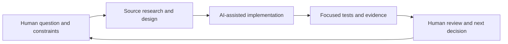

<!--
KFM_WIKI_SOURCE
page_id: Builder-Profile
title: The builder — AI-assisted product and systems work
status: source-grounded showcase; independent review pending
updated: 2026-10-09
authority: orientation-only; repository evidence and adopted authority outrank this page
source_path: docs/wiki/builder-profile.md
publication_effect: native wiki documentation only; no data admission or release
evidence_checkpoint: main@459ffbe892929cbe994add8665805549694740b6
-->

# The builder

**Human direction. AI-assisted execution. Inspectable results.**

Kansas Frontier Matrix is a project led by [@bartytime4life](https://github.com/bartytime4life). This portfolio presents the capabilities visible in the project artifacts: framing a difficult problem, designing an exploratory interface, connecting software and data systems, and keeping the evidence behind a result accessible.

[Visual tour](visual-tour.md) · [Engineering case studies](engineering-case-studies.md) · [Repository](https://github.com/bartytime4life/Kansas-Frontier-Matrix)

## The problem worth building for

A map makes information easy to see. It can also make incomplete information look certain. Kansas water, geology, land use, weather, and historical records come from different providers, dates, units, and collection methods. KFM's central product challenge is to make those differences usable: let a person investigate a place while preserving what each source actually supports.

That challenge connects interface design to data provenance, rendering performance, asynchronous state, privacy, and release controls. It gives this project its breadth—and gives a reviewer concrete decisions to discuss.

## Capabilities you can evaluate

| Capability | Observable work | Start with |
|---|---|---|
| Product definition | Area-first investigation, deliberate selection, source context, explicit unavailable states | [Investigation workflow](Map-UI-and-AI.md) |
| Interaction and information design | Linked 2D/3D inspection, depth controls, keyboard comparison divider, fallback views | [Visual tour](visual-tour.md) |
| Full-stack development | React/TypeScript interface, Worker routes, D1/R2 integration, local runtime | [Architecture](Architecture.md) and [local operation](Development-and-Validation.md#local-operation-and-recovery) |
| Geospatial and temporal reasoning | Recorded depth units, separate observation/retrieval times, compatible imagery pairs | [Cases 01 and 02](engineering-case-studies.md) |
| Reliability and security thinking | Bounded requests, cancellation, withheld stale results, privacy-aware exports | [Cases 02 and 03](engineering-case-studies.md) |
| AI-assisted delivery | Reviewable source changes, generated-artifact provenance, focused regression work | [AI-assisted delivery](Contributing.md#ai-assisted-delivery) |
| Cross-system coordination | GitHub implementation, Notion work coordination, Drive research and proposal lineage, Sites delivery | [Responsibility map](Repository-Map.md) |

**Choose your depth:** [Product behavior](Map-UI-and-AI.md) → [system design](Architecture.md) → [validation](Development-and-Validation.md) → [security boundaries](Security-and-Sensitivity.md).

Each row gives a reviewer a concrete artifact to inspect and a decision to discuss.

## How human direction and AI work together

The project owner's role is to define useful outcomes, select priorities, challenge the result, and decide what is ready for the next step. AI contributes drafts, code, alternative designs, research synthesis, and checks. The public artifacts are the basis for evaluating that collaboration; this page does not assign every line of code to a person or model.

The workflow is concrete: identify the component and source revision; describe expected behavior and its limits; implement a bounded change; exercise failure paths; preserve the resulting evidence and rollback path. [Generated-work receipts](https://github.com/bartytime4life/Kansas-Frontier-Matrix/blob/459ffbe892929cbe994add8665805549694740b6/data/receipts/generated/README.md) record AI-authored artifact provenance and human-review state. They do not replace review.

## Three conversations worth having

1. **“How do you make 3D compelling without overstating the science?”** Walk through the recorded-column viewer, units, unknown intervals, camera choices, and the difference between a display envelope and a geological inference. [Subsurface case study](engineering-case-studies.md#01--make-the-underground-readable).
2. **“What happens when the user changes their mind before a request finishes?”** Inspect imagery cancellation and the reviewed-water export's A → B → A selection protection. [State and trust case studies](engineering-case-studies.md#02--compare-time-without-substituting-history).
3. **“How do you keep a growing AI-assisted project understandable?”** Follow a feature from its source guide to implementation, regression tests, and review history. Discuss what remains unknown and how the next slice would be accepted. [Evidence map](engineering-case-studies.md#inspect-the-work).

## A useful fit for teams building complex tools

This work is relevant to conversations about AI-assisted product development, geospatial interfaces, research tooling, data applications, developer experience, and technical documentation. The value to evaluate is the ability to connect those responsibilities and make the resulting system understandable.

**Continue:** [See the experience](visual-tour.md) → [Review the implementation](engineering-case-studies.md) → [Explore the owner's public work](https://github.com/bartytime4life).
