# 🤖 **Kansas Frontier Matrix — AI Explainability & Bias Audit Workflow (`ai-explainability.yml`)**  
`docs/workflows/ai-explainability.yml.md`

**Purpose**  
Define the **governed CI/CD workflow** that runs AI explainability, fairness, and drift audits for KFM models.  
This workflow turns every model change into a **documented, reproducible, and PROV-traceable** explainability report,  
feeding the Neo4j knowledge graph, STAC/DCAT catalogs, and FAIR+CARE governance dashboards.

---

## 📘 Overview

### 1. Workflow Intent

The `ai-explainability.yml` GitHub Actions workflow:

- Runs **explainability and bias audits** whenever models or training configs change.  
- Produces **versioned, deterministic** artifacts (SHAP/feature attributions, fairness metrics, drift checks).  
- Emits **telemetry** (duration, energy, carbon, FAIR+CARE scores) into `focus-telemetry.json`.  
- Writes **lineage-ready metadata** so results can be ingested into:
  - Neo4j (:ModelVersion, :ExplainabilityRun, :Dataset nodes + typed relationships),
  - STAC/DCAT catalogs (explainability reports as datasets/items),
  - Governance dashboards and Story Nodes.

This document is the **canonical plan** for that workflow under KFM-MDP v11.2.4 and MCP-DL v6.3.

### 2. Triggers (High-Level)

The workflow is expected to trigger on:

- `push` / `pull_request` to:
  - `src/models/**`
  - `mcp/model_cards/**`
  - `configs/models/**`
- Manual dispatch (`workflow_dispatch`) for ad-hoc audits and backfills.

Exact trigger patterns live in `.github/workflows/ai-explainability.yml` and must stay in sync with this spec.

### 3. Responsibilities

This workflow is responsible for:

- **Reproducible audits**  
  - All runs are config-driven (`configs/models/<model>.yaml`) with fixed random seeds logged.
- **Governed outputs**  
  - Metrics mapped to FAIR+CARE governance matrix and model cards.
- **Provenance & cataloging**  
  - Every run emits PROV-compliant lineage and DCAT/STAC metadata fragments.
- **Sustainability**  
  - Energy and carbon metrics captured per run and fed into sustainability reports.

---

## 🗂️ Directory Layout

~~~text
📁 .github/
└── 📁 workflows/
    📄 ai-explainability.yml             — GitHub Actions workflow (explainability & bias audit)

📁 docs/
└── 📁 workflows/
    📄 README.md                         — CI/CD & Governance Workflows index
    📄 ai-explainability.yml.md          — ← This specification

📁 src/
└── 📁 models/
    📁 <model_family>/
        📄 train.py                      — Training entrypoint (consumed by CI/CD)
        📄 explainability.py             — Shared explainability routines (SHAP, LIME, etc.)

📁 configs/
└── 📁 models/
    📄 <model_name>.yaml                 — Model config (paths, seeds, explainability settings)

📁 tools/
└── 📁 ai/
    📄 run_explainability_audit.py       — CLI entrypoint used by the workflow
    📄 explainability_schema.json        — Local validation schema for audit outputs

📁 mcp/
└── 📁 experiments/
    📄 <timestamp>_AI-EXPL-<id>.md       — Human-readable experiment logs (linked from CI)

📁 data/
└── 📁 processed/
    📁 models/
        📁 <model_name>/
            📄 model_metadata.json       — Model version manifest
            📄 explainability_report.json
            📄 fairness_metrics.json
            📄 drift_report.json
~~~

**Directory rules**

- Any new explainability-related code **must** live under `src/models/**` or `tools/ai/**`.  
- New metrics / output formats **must** be reflected in:
  - `tools/ai/explainability_schema.json`  
  - This document’s **📦 Data & Metadata** section.

---

## 🧭 Context

### 1. Relation to Other Workflows

- **Upstream:**  
  - `ai-train.yml` produces model artifacts and base metrics that this workflow audits.
- **Sibling workflows:**  
  - `ai-explainability.yml` complements `faircare-validate.yml` by focusing on **model-level** risk,  
    while FAIR+CARE validation focuses on **dataset and documentation** compliance.
- **Downstream:**  
  - Telemetry feeds into governance dashboards and Focus Mode Story Nodes for models.

### 2. MCP & Reproducibility

In line with MCP 2.0, all audits must be:

- **Config-driven** – no hard-coded magic values; configs stored in git and versioned with the run ID. :contentReference[oaicite:0]{index=0}  
- **Deterministic** – seeds pinned and logged; reruns with the same config over the same data must reproduce metrics.  
- **Documented** – each run links to an `mcp/experiments/*AI-EXPL-*.md` log, generated or updated by the workflow.

---

## 🗺️ Diagrams

### 1. High-Level Workflow (GitHub Actions)

```mermaid
flowchart LR
    A["Code / Config Change"] --> B["ai-explainability.yml Triggered"]
    B --> C["Checkout + Setup Python"]
    C --> D["Resolve Model + Dataset from Config"]
    D --> E["Run Explainability & Fairness Audit CLI"]
    E --> F["Validate Outputs (JSON Schema)"]
    F --> G["Upload Artifacts & Telemetry"]
    G --> H["Update Graph + Catalogs (via API)"]
    H --> I["Post Status & Links to PR"]
```

### 2. Timeline of a Typical Run

~~~mermaid
timeline
    title AI Explainability Workflow – Run Lifecycle
    section CI Events
      T0 : Push / PR opened : Trigger workflow
      T1 : Environment ready : Python + deps cached
      T2 : Audit running : Explainability + fairness scripts
      T3 : Reports validated : JSON schema checks
      T4 : Telemetry emitted : focus-telemetry.json updated
      T5 : Governance updated : Neo4j + catalogs patched
~~~

---

## 🧱 Architecture

### 1. Jobs & Steps

**Job: `explainability-audit`**

- **Runs-on:** `ubuntu-latest` (or designated KFM runner label).  
- **Key steps (conceptual spec):**

1. **Checkout**
   - `actions/checkout@v4`

2. **Setup Python**
   - `actions/setup-python@v5` with `python-version` from workflow inputs or default matrix (e.g. `3.11`).

3. **Install Dependencies**
   - Use cached `pip`/`uv` environment.
   - Install:
     - `requirements.txt` (core repo),
     - `requirements-explainability.txt` (model audit extras).

4. **Resolve Model & Config**
   - Determine `MODEL_ID`, `CONFIG_PATH`, and `RUN_ID`:
     - `MODEL_ID` from changed paths or workflow input.
     - `CONFIG_PATH` = `configs/models/${MODEL_ID}.yaml`.
     - `RUN_ID` = `${GITHUB_RUN_ID}-${MODEL_ID}`.

5. **Run Audit CLI**
   - Call:
     - `python tools/ai/run_explainability_audit.py --config ${CONFIG_PATH} --run-id ${RUN_ID}`
   - Responsibilities of CLI:
     - Load model + reference dataset snapshot.
     - Run:

       - Feature importance / SHAP or equivalent.
       - Local explanations for representative predictions.
       - Fairness metrics (per-group performance, parity metrics).
       - Data & prediction drift checks.

     - Write outputs under:
       - `data/processed/models/${MODEL_ID}/explainability_report.json`
       - `data/processed/models/${MODEL_ID}/fairness_metrics.json`
       - `data/processed/models/${MODEL_ID}/drift_report.json`
       - `data/processed/models/${MODEL_ID}/explainability_manifest.json` (index + provenance).

6. **Validate Outputs**
   - Run schema validation using `tools/ai/explainability_schema.json`.
   - Fail the job if required fields or shapes are missing.

7. **Upload Artifacts**
   - Attach JSON reports under a single artifact (e.g. `ai-explainability-${MODEL_ID}-${RUN_ID}`).

8. **Emit Telemetry**
   - Append a record to `releases/v11.2.4/ai-explainability-telemetry.json`
     (or per-run temp file consumed by a central telemetry workflow).

9. **Update Graph & Catalogs (Optional / Separate Job)**
   - Call internal API(s) (e.g. `src/api/`) to:
     - Upsert `:ExplainabilityRun` node with relationships:
       - `(:ExplainabilityRun)-[:AUDITS]->(:ModelVersion)`
       - `(:ExplainabilityRun)-[:USED_DATASET]->(:Dataset)`
     - Register reports as DCAT/STAC records where appropriate.

10. **Report Status**
    - Post PR comment summarizing:
      - Key fairness metrics deltas,
      - Any guardrail violations,
      - Links to artifacts and experiment log.

### 2. Reproducibility Guarantees

- Seeds (`numpy`, `torch`, etc.) fixed from config and logged in:
  - `explainability_manifest.json`
  - `mcp/experiments/*AI-EXPL-*.md`
- Data snapshots referenced by **content hashes** so audits can be rerun against identical inputs.
- Every explainability run is a **PROV Activity** with clearly linked inputs/outputs (see **🌐 STAC, DCAT & PROV Alignment**).

---

## 🧪 Validation & CI/CD

### 1. Quality Gates

The workflow must **fail** if:

- Schema validation fails for any JSON output.  
- Critical fairness guardrails are violated (e.g. parity metrics outside configured thresholds).  
- Explainability summary coverage (e.g. number of features or slices audited) is below config minimums.  
- Telemetry emission or provenance export fails.

### 2. Integration into CI/CD

- Included in the KFM CI pipeline as a **required check** on PRs that touch:
  - `src/models/**`, `configs/models/**`, `mcp/model_cards/**`.
- Uses standard CI/CD stages (build → test → package → deploy/notify) as described in the CI/CD guide. :contentReference[oaicite:1]{index=1}  
- Should be **fast enough** for PR feedback (target < 10–15 minutes per model where feasible),  
  leveraging sampling strategies in configs to keep runtimes bounded.

### 3. Test Profiles

- `markdown-lint` / `schema-lint` / `metadata-check`:
  - Validate this document and configs for the workflow.
- Workflow-level tests:
  - Dry-run mode in `run_explainability_audit.py` for smoke testing in CI.
  - Unit tests for each metric implementation (under `tests/ai/`).

---

## 📦 Data & Metadata

### 1. Core Output Files (per MODEL_ID + RUN_ID)

All written under `data/processed/models/${MODEL_ID}/`:

- `explainability_report.json`
  - Global and local feature importances.
  - Example explanations (e.g. per segment or exemplar instance).
- `fairness_metrics.json`
  - Per-group performance metrics (accuracy, recall, etc.).
  - Group fairness metrics (e.g. demographic parity, equal opportunity).
  - Thresholds and pass/fail flags.
- `drift_report.json`
  - Data distribution shifts vs. reference baseline.
  - Model prediction distribution shifts.
- `explainability_manifest.json`
  - Metadata index and PROV/DCAT-friendly summary:
    - `model_id`, `model_version`, `dataset_id`, `dataset_version`.
    - `run_id`, timestamps, seeds, git commit.
    - URIs/paths to other outputs.
    - Basic DCAT fields (title, description, license, temporal coverage).

### 2. JSON Schema Expectations

`tools/ai/explainability_schema.json` should validate:

- Required top-level keys. Example (schematic):

~~~json
{
  "type": "object",
  "required": ["run_id", "model_id", "dataset_id", "metrics", "explanations"],
  "properties": {
    "run_id": { "type": "string" },
    "model_id": { "type": "string" },
    "dataset_id": { "type": "string" },
    "metrics": {
      "type": "object",
      "required": ["fairness", "performance", "drift"]
    },
    "explanations": {
      "type": "object",
      "required": ["global", "local"]
    }
  }
}
~~~

- Metric-specific constraints (e.g. fairness scores between 0 and 1).  
- Provenance fields (`git_commit`, `config_path`, `seeds`) are present and non-empty.

### 3. Telemetry Record Shape

Each workflow run contributes a record to `ai-explainability-telemetry.json`, e.g.:

~~~json
{
  "workflow": "ai-explainability",
  "run_id": "ai-expl_2025-12-06T18-22-00Z_model-ks-property-tax_v3",
  "model_id": "ks-property-tax_v3",
  "workflow_duration_sec": 420,
  "faircare_score": 0.96,
  "guardrails_passed": true,
  "docs_updated": true,
  "energy_wh": 7.4,
  "carbon_gco2e": 0.0041,
  "timestamp": "2025-12-06T18:22:15Z"
}
~~~

Telemetry schema is governed by `telemetry_schema` and the global KFM telemetry standards.

---

## 🌐 STAC, DCAT & PROV Alignment

### 1. PROV-O Modeling

Treat each explainability run as a PROV Activity:

- **Entities**
  - `ex:ModelVersion_{id}` → `prov:Entity`
  - `ex:DatasetVersion_{id}` → `prov:Entity`
  - `ex:ExplainabilityReport_{run_id}` → `prov:Entity`
- **Activity**
  - `ex:ExplainabilityRun_{run_id}` → `prov:Activity`
- **Agents**
  - `ex:KFM_CI_Bot` → `prov:SoftwareAgent`
  - `ex:ModelOwnerTeam` → `prov:Organization`

Key relations:

- `ex:ExplainabilityRun_{run_id} prov:used ex:ModelVersion_{id}`  
- `ex:ExplainabilityRun_{run_id} prov:used ex:DatasetVersion_{id}`  
- `ex:ExplainabilityReport_{run_id} prov:wasGeneratedBy ex:ExplainabilityRun_{run_id}`  
- `ex:ExplainabilityReport_{run_id} prov:wasAttributedTo ex:ModelOwnerTeam` :contentReference[oaicite:2]{index=2}  

These records may be exported as RDF (Turtle/JSON-LD) or as PROV-JSON for later ingestion.

### 2. DCAT Alignment

Model explainability reports as DCAT Datasets/Distributions:

- `dcat:Dataset`
  - `dct:title`: "Explainability & Bias Audit for ${MODEL_ID} (${RUN_ID})"
  - `dct:description`: Short human-readable summary.
  - `dct:issued`: audit run timestamp.
  - `dct:creator` / `dct:publisher`: model owner / KFM project.
  - `dct:temporal`: audit time window.
- `dcat:Distribution`
  - `dcat:downloadURL`: raw GitHub or storage URL for `explainability_report.json`.
  - `dcat:mediaType`: `application/json`.
  - `spdx:checksum`: SHA-256 of the report for integrity. :contentReference[oaicite:3]{index=3}  

Explainability datasets are grouped in a dedicated **DatasetSeries** per model where appropriate.

### 3. STAC Alignment

For geo-aware models (e.g. predicting over Kansas parcels or grid cells):

- Treat each explainability report as a **STAC Item** in an `ai-explainability` Collection:
  - `id`: `${MODEL_ID}-${RUN_ID}`
  - `properties.datetime`: run time.
  - `assets.explainability-report`:
    - `href`: URL to JSON report.
    - `type`: `application/json`.
  - `geometry` / `bbox`:
    - Optional; can use Kansas-wide bbox or the model’s operational area if appropriate.

STAC metadata is generated by mapping DCAT/PROV fields into STAC Item properties, following the KFM STAC profile. :contentReference[oaicite:4]{index=4}  

---

## 🧠 Story Node & Focus Mode Integration

### 1. Story Nodes for Explainability Runs

Each explainability run can be summarized as a **Story Node**, e.g.:

- `urn:kfm:story-node:ai:explainability:${MODEL_ID}:${RUN_ID}`

With:

- Textual summary of:
  - Key influential features.
  - Fairness status (pass/fail, groups most impacted).
  - Notable drift or risk signals.
- Links to:
  - Model card in `mcp/model_cards/`.
  - DCAT/STAC entries for the reports.
  - PROV Activity and Entities.

### 2. Focus Mode Behavior

When a user focuses on a model or an explainability report:

- Focus Mode **may**:
  - Summarize key findings and fairness status.
  - Highlight temporal trends across multiple runs (e.g., drift over 6 months).
  - Surface links to telemetry and experiment logs.
- Focus Mode **must not**:
  - Override or alter metrics.
  - Invent governance decisions not present in reports or this spec.

---

## ⚖ FAIR+CARE & Governance

### 1. FAIR

- **Findable**
  - Explainability artifacts live in predictable paths and have stable IDs (`MODEL_ID`, `RUN_ID`).
- **Accessible**
  - JSON outputs stored in repo or governed storage with documented access controls.
- **Interoperable**
  - PROV-O, DCAT, and STAC mappings enable machine use across tools and catalogs. :contentReference[oaicite:5]{index=5}  
- **Reusable**
  - Clear licensing (`CC-BY 4.0`), versioning, and provenance metadata.

### 2. CARE

- **Collective Benefit**
  - Bias and fairness telemetry supports community accountability for KFM models.
- **Authority to Control**
  - Sensitive groups and attributes configured per governance policy; redaction rules enforced in the CLI.
- **Responsibility**
  - Workflow fails if fairness guardrails are violated, forcing explicit mitigation.
- **Ethics**
  - No speculative inferences from protected attributes; metrics must be interpretable and documented.

### 3. Governance Hooks

- Enforcement points:
  - Required PR check: explainability must be **green** for risk-critical models (as defined by governance).
  - Telemetry thresholds may be used by `faircare-validate.yml` for additional gating.
- Review:
  - Quarterly governance review of:
    - Metric definitions,
    - Thresholds,
    - Drift detection strategy.

---

## 🕰️ Version History

| Version   | Date       | Summary                                                                                         |
|----------:|------------|-------------------------------------------------------------------------------------------------|
| v11.2.4   | 2025-12-06 | Initial governed specification of `ai-explainability.yml`; aligned with KFM-MDP v11.2.4 and CI/CD & provenance standards. |

---

🤖 **Kansas Frontier Matrix — AI Explainability & Bias Audit Workflow (`ai-explainability.yml`)**  
Deterministic Audits · FAIR+CARE Governance · Explainable Intelligence for Kansas Frontier Matrix  

[⬅ Back to CI/CD & Governance Workflows](./README.md) ·  
[📘 Docs Root](../README.md) ·  
[⚖ Governance Charter](../standards/governance/ROOT-GOVERNANCE.md)

