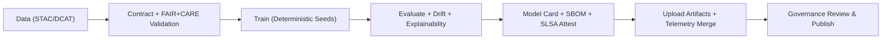

<div align="center">

# 🧠 **AI Training Workflow — `ai-train.yml`**  
`docs/workflows/ai-train.yml.md`

**Purpose:**  
Define the **GitHub Actions workflow** that trains and evaluates KFM AI models (e.g., **Focus Transformer v2.1**), enforces **FAIR+CARE** & **MCP-DL v6.3** governance, generates **Model Cards**, computes **bias/drift/explainability** metrics, signs artifacts (SLSA/OIDC), and exports **telemetry** & **SBOM** for Diamond⁹/Crown∞Ω certification.

[](../README.md)
[](../../LICENSE)
[](../standards/faircare.md)
[](#)

</div>

---

## 📘 Overview

This workflow orchestrates **data→model** steps with auditable governance:

- ✅ **Reproducibility:** pinned environments, lockfiles, deterministic seeds, artifact versioning.  
- ⚖️ **Ethics by design:** **FAIR+CARE** checks, PII scans, data-contract enforcement, consent gates.  
- 🔍 **Quality:** unit tests, eval suites, OOD & **drift** checks, **SHAP/LIME/IG** explainability.  
- 🔐 **Supply chain:** **SLSA** provenance, SBOM, image signing (OIDC + Cosign).  
- 📊 **Telemetry v3:** training & eval metrics, energy (Wh), CO₂e, bias/fairness — merged into `focus-telemetry.json`.

> **Hard gate:** training **fails** if any input asset is flagged `care.tag = sensitive` or is quarantined under `data/work/staging/**/abandonment_candidates/` without explicit governance override.

---

## 🗂️ Triggers & Inputs

| Trigger | When | Inputs (defaults) |
|--------:|------|--------------------|
| `workflow_dispatch` | Manual runs | `model_id`, `dataset_ref`, `config_path`, `epochs`, `device` |
| `push` | Changes in `src/ai/**`, `data/training/**`, `configs/ai/**` | — |
| `schedule` | Nightly health checks | — |

**Input schema (example):**
```yaml
on:
  workflow_dispatch:
    inputs:
      model_id:     { description: "focus_transformer_v2_1", required: true,  type: string }
      dataset_ref:  { description: "STAC Collection ID or bundle", required: true, type: string }
      config_path:  { description: "Training config", default: "configs/ai/focus_v2_1.yaml", type: string }
      epochs:       { description: "Epoch count", default: "3", type: number }
      device:       { description: "cpu|cuda", default: "cuda", type: choice, options: [cpu, cuda] }
```

---

## 🧩 Workflow (YAML)

```yaml
name: "AI Train (Governed)"

on:
  push:
    paths:
      - "src/ai/**"
      - "data/training/**"
      - "configs/ai/**"
  workflow_dispatch:
    inputs:
      model_id:    { required: true, type: string }
      dataset_ref: { required: true, type: string }
      config_path: { required: false, default: "configs/ai/focus_v2_1.yaml", type: string }
      epochs:      { required: false, default: "3", type: number }
      device:      { required: false, default: "cuda", type: choice, options: [cpu, cuda] }

permissions:
  contents: read
  id-token: write
  actions: read

concurrency:
  group: ai-train-${{ github.ref }}-${{ inputs.model_id || 'focus_transformer_v2_1' }}
  cancel-in-progress: true

env:
  PYTHON_VERSION: "3.11"
  PIP_CACHE_DIR: ~/.cache/pip
  HF_HOME: ~/.cache/huggingface
  PIP_DISABLE_PIP_VERSION_CHECK: "1"

jobs:
  train:
    name: Train & Validate (${{ inputs.model_id || 'focus_transformer_v2_1' }})
    runs-on: ${{ inputs.device == 'cuda' && 'ubuntu-22.04-gpu' || 'ubuntu-22.04' }}
    timeout-minutes: 480
    env:
      MODEL_ID:    ${{ inputs.model_id }}
      DATASET_REF: ${{ inputs.dataset_ref }}
      CONFIG_PATH: ${{ inputs.config_path }}
      EPOCHS:      ${{ inputs.epochs }}
    steps:
      - name: Checkout
        uses: actions/checkout@v4

      - name: Setup Python
        uses: actions/setup-python@v5
        with: { python-version: ${{ env.PYTHON_VERSION }} }

      - name: Cache deps
        uses: actions/cache@v4
        with:
          path: |
            ${{ env.PIP_CACHE_DIR }}
            ${{ env.HF_HOME }}
          key: ${{ runner.os }}-pip-${{ hashFiles('pyproject.toml','poetry.lock','requirements.lock') }}
          restore-keys: ${{ runner.os }}-pip-

      - name: Install deps
        run: |
          pip install -U pip wheel
          pip install -r requirements.txt -r requirements.train.txt

      - name: Validate data contract
        run: |
          python scripts/validate_contract.py \
            --dataset $DATASET_REF \
            --contract docs/contracts/data-contract-v3.json \
            --out data/work/staging/tabular/tmp/validation/contract_${MODEL_ID}.json

      - name: FAIR+CARE audit
        run: |
          python tools/validation/faircare_validator.py \
            --dataset $DATASET_REF \
            --out data/work/staging/tabular/tmp/validation/faircare_${MODEL_ID}.json

      - name: PII / Sensitive gate
        run: |
          python scripts/scan_pii_sensitive.py --dataset $DATASET_REF --fail-on-sensitive

      - name: Train model
        env:
          HF_TOKEN: ${{ secrets.HF_TOKEN }}
        run: |
          python src/ai/train.py \
            --model $MODEL_ID \
            --data $DATASET_REF \
            --config $CONFIG_PATH \
            --epochs $EPOCHS \
            --device ${{ inputs.device }}

      - name: Evaluate (metrics + OOD + drift)
        run: |
          python src/ai/eval.py        --model $MODEL_ID --data $DATASET_REF --out reports/ai/${MODEL_ID}/metrics.json
          python src/ai/drift_check.py --model $MODEL_ID --baseline releases/models/${MODEL_ID}/baseline_metrics.json --out reports/ai/${MODEL_ID}/drift.json

      - name: Explainability (SHAP/LIME/IG)
        run: |
          python src/ai/explainability/run_shap.py --model $MODEL_ID --data $DATASET_REF --out reports/ai/${MODEL_ID}/explainability.json

      - name: Generate Model Card
        run: |
          python scripts/make_model_card.py \
            --model $MODEL_ID \
            --metrics reports/ai/${MODEL_ID}/metrics.json \
            --drift   reports/ai/${MODEL_ID}/drift.json \
            --explain reports/ai/${MODEL_ID}/explainability.json \
            --template docs/templates/model_card.md \
            --out releases/models/${MODEL_ID}/MODEL_CARD.md

      - name: Build SBOM (SPDX)
        uses: anchore/syft-action@v1
        with:
          args: "dir:. -o spdx-json=./releases/v10.2.0/sbom.spdx.json"

      - name: Attest Build Provenance (SLSA)
        uses: slsa-framework/slsa-github-generator/actions/attest-build-provenance@v1
        with:
          subject-path: "releases/models/${{ env.MODEL_ID }}/"

      - name: Install Cosign
        uses: sigstore/cosign-installer@v3

      - name: Cosign sign model card
        run: |
          cosign sign-blob --yes \
            --output-signature releases/models/${MODEL_ID}/signature.sig \
            --output-certificate releases/models/${MODEL_ID}/certificate.pem \
            releases/models/${MODEL_ID}/MODEL_CARD.md

      - name: Upload artifacts
        uses: actions/upload-artifact@v4
        with:
          name: ai_${{ env.MODEL_ID }}_artifacts
          path: |
            releases/models/${{ env.MODEL_ID }}/
            reports/ai/${{ env.MODEL_ID }}/
            data/work/staging/tabular/tmp/validation/*${{ env.MODEL_ID }}*.json

      - name: Emit telemetry (v3)
        run: |
          python scripts/emit_telemetry.py \
            --kind ai_train \
            --summary reports/ai/${MODEL_ID}/metrics.json \
            --drift   reports/ai/${MODEL_ID}/drift.json \
            --explain reports/ai/${MODEL_ID}/explainability.json \
            --out telemetry_ai_${MODEL_ID}.json

      - name: Merge telemetry → unified log
        run: |
          python scripts/merge_telemetry.py \
            --in telemetry_ai_${MODEL_ID}.json \
            --dest releases/v10.2.0/focus-telemetry.json
```

---

## 🧮 Inputs, Artifacts & Outputs

| Type | Key | Description |
|------|-----|-------------|
| **Input** | `model_id` | Model to train (e.g., `focus_transformer_v2_1`) |
| **Input** | `dataset_ref` | STAC/DCAT collection or contracted data bundle |
| **Artifact** | `releases/models/<model_id>/MODEL_CARD.md` | Governed Model Card (FAIR+CARE-certified) |
| **Artifact** | `reports/ai/<model_id>/*.json` | Metrics, drift, explainability packs |
| **Artifact** | `releases/v10.2.0/sbom.spdx.json` | Supply-chain SBOM (SPDX) |
| **Telemetry** | `releases/v10.2.0/focus-telemetry.json` | Energy, CO₂e, runtime, bias, quality, drift |

---

## ⚖️ FAIR+CARE & Governance

| Principle | Enforcement | Evidence |
|-----------|-------------|----------|
| **Findable** | STAC/DCAT registration; model/dataset IDs included | `manifest_ref` |
| **Accessible** | Role-scoped artifact access + published model cards | Repo artifacts |
| **Interoperable** | JSON Schema + DCAT 3.0; optional ONNX/MLflow exports | Metadata & SBOM |
| **Reusable** | CC-BY docs; MIT code; config/version locks | LICENSE + configs |
| **CARE** | PII scan, consent checks, ethics gates, council approvals | Validation JSONs |

---

## 🔐 Security & Supply Chain

- **OIDC + Cosign** for signatures; provenance via **SLSA** attestations.  
- SAST/Trivy scans recommended pre-training.  
- Ephemeral runners; least-privilege `permissions`; no long-lived secrets.

---

## 🔍 Telemetry & Sustainability (v3)

Emitted to `focus-telemetry.json` (`ai-train-v3` schema):

| Metric | Example | Notes |
|--------|---------|------|
| `train_time_min` | 142.3 | End-to-end duration |
| `energy_wh` | 1835 | Runner power telemetry/estimator |
| `carbon_gco2e` | 612 | Calculated w/ grid mix |
| `f1_macro` | 0.842 | Primary quality metric |
| `bias_score` | 0.05 | Lower is better |
| `drift_flag` | false | From PSI/KS |
| `explainability.stability` | 0.93 | LIME/SHAP stability |
| `license_spdx` | `Apache-2.0` | From SBOM scan |

---

## 🧭 Mermaid: High-Level Flow



---

## 🕰️ Version History

| Version | Date | Author | Summary |
|---------|------|--------|---------|
| **v10.2.4** | 2025-11-12 | `@kfm-devops` | Upgraded to telemetry schema v3; Focus v2.1 alignment; added PII/sensitive gate; updated SBOM/manifest refs to v10.2.0. |
| v10.1.0 | 2025-11-10 | `@kfm-devops` | Telemetry v2; IG explainability; SLSA/Cosign attestations. |
| v9.9.0  | 2025-11-08 | `@kfm-devops` | Initial governed AI training workflow doc (drift/explainability + telemetry export). |

---

<div align="center">

**Kansas Frontier Matrix**  
*Governed AI × FAIR+CARE Ethics × SLSA Provenance*  
© 2025 Kansas Frontier Matrix · CC-BY 4.0 · Master Coder Protocol v6.3 · Diamond⁹ Ω / Crown∞Ω Ultimate Certified  
[Back to Workflows Index](README.md) · [Governance Charter](../standards/governance/ROOT-GOVERNANCE.md)

</div>