<div align="center">

# 🧪 **Documentation Lint Workflow — `docs-lint.yml`**  
`docs/workflows/docs-lint.yml.md`

**Purpose:**  
Define the **GitHub Actions** workflow that validates all KFM documentation against **Platinum README v7.1**, **MCP-DL v6.3**, and **FAIR+CARE** rules.  
Enforces **front-matter schemas**, **GFM structure**, **link integrity**, **Mermaid guardrails**, **table width limits**, and **badge ordering**, producing machine-readable reports and **telemetry v3** for the governance ledger.

[](../README.md)
[](../../LICENSE)
[](../standards/faircare.md)
[](#)

</div>

---

## 📘 Overview

`docs-lint.yml` is the **first line of defense** for high-integrity, machine-parseable documentation. It runs on every PR and protected-branch push to guarantee:

- ✅ Required **YAML front-matter** keys and value formats  
- ✅ **GFM** structural rules (single H1, emoji-prefixed sections, fenced code blocks with languages)  
- ✅ **Link health** (internal relatives, anchors, external URLs with retry)  
- ✅ **Style** (table rows ≤ 100 chars, heading hierarchy, max one Mermaid per section)  
- ✅ **Badge order** (Docs · MCP → License → FAIR+CARE → Status)  
- ✅ **Footer** conformance (centered © + license + MCP/FAIR+CARE marks + nav)

Findings are exported to `reports/self-validation/docs/lint_summary.json` and merged into **telemetry v3** (`focus-telemetry.json`) for governance trends.

---

## 🗂️ Trigger & Scope

| Trigger | Paths | Notes |
|--------:|------|------|
| `pull_request` | `docs/**`, `**/*.md`, `**/*.mdx` | Blocks merge on failure |
| `push` (protected) | `docs/**`, `**/*.md`, `**/*.mdx` | Required on `main` & `release/**` |
| `workflow_dispatch` | — | Manual re-runs for hotfixes |

**Ignored:** `node_modules/**`, `**/vendor/**`, `**/CHANGELOG.md`, `**/LICENSE`, `**/README-images/**`

---

## 🧩 Workflow (YAML)

```yaml
name: "Docs Lint (Governed)"

on:
  pull_request:
    paths: ["docs/**", "**/*.md", "**/*.mdx"]
  push:
    branches: ["main", "release/**"]
    paths: ["docs/**", "**/*.md", "**/*.mdx"]
  workflow_dispatch: {}

permissions:
  contents: read

concurrency:
  group: docs-lint-${{ github.ref }}
  cancel-in-progress: true

jobs:
  lint:
    runs-on: ubuntu-22.04
    steps:
      - name: Checkout
        uses: actions/checkout@v4

      - name: Setup Node
        uses: actions/setup-node@v4
        with:
          node-version: "20"

      - name: Install linters
        run: |
          npm i -g markdownlint-cli@0.39.0 markdown-link-check@3.12.1 remark-cli@11 \
            @github-docs/mdlinks@latest @stoplight/spectral-cli@6
          pipx install yq
          pipx install jsonschema

      - name: Run markdownlint (Platinum rules)
        run: |
          mkdir -p reports/self-validation/docs
          markdownlint "**/*.md" -c .github/linters/markdownlint.json \
            --ignore "node_modules/**" \
            --ignore "**/CHANGELOG.md" \
            --output reports/self-validation/docs/markdownlint.txt || true

      - name: Validate front-matter schema (MCP-DL)
        run: |
          python scripts/validate_front_matter.py \
            --schema docs/standards/markdown_frontmatter.schema.json \
            --glob "**/*.md" \
            --out reports/self-validation/docs/frontmatter_validation.json

      - name: Link check (internal & external)
        run: |
          npx markdown-link-check -q -c .github/linters/mlc.config.json \
            -p -r -v $(git ls-files "*.md") \
            | tee reports/self-validation/docs/link_check.log || true

      - name: Mermaid guardrails
        run: |
          node scripts/validate_mermaid.mjs --maxPerSection=1 --types="flowchart" \
            --paths "docs/**" > reports/self-validation/docs/mermaid_audit.json

      - name: Table width & code fence audit
        run: |
          node scripts/audit_tables_and_fences.mjs --maxWidth=100 --requireLang=true \
            --paths "docs/**" > reports/self-validation/docs/format_audit.json

      - name: Badge order & footer check
        run: |
          node scripts/validate_badges_footer.mjs --paths "docs/**" \
            --out reports/self-validation/docs/badges_footer_audit.json

      - name: Summarize results
        run: |
          node scripts/summarize_docs_lint.mjs \
            --inputs "reports/self-validation/docs/*.json" \
            --markdown "reports/self-validation/docs/summary.md" \
            --json "reports/self-validation/docs/lint_summary.json"

      - name: Upload artifacts
        uses: actions/upload-artifact@v4
        with:
          name: docs_lint_reports
          path: reports/self-validation/docs/

      - name: Emit telemetry (v3)
        run: |
          python scripts/emit_telemetry.py \
            --kind docs_lint \
            --summary reports/self-validation/docs/lint_summary.json \
            --out docs_lint_telemetry.json

      - name: Append to unified telemetry
        run: |
          python scripts/merge_telemetry.py \
            --in docs_lint_telemetry.json \
            --dest releases/v10.2.0/focus-telemetry.json
```

---

## ✅ Validation Rules

### 1) Front-matter (required keys)

| Key | Type | Rule |
|-----|------|------|
| `title` | string | Emoji prefix + descriptive title |
| `path` | string | Repo-relative, matches file location |
| `version` | SemVer (`v10.x.y`) | Required |
| `last_updated` | ISO-8601 | `YYYY-MM-DD` |
| `review_cycle` | enum | `Continuous`, `Quarterly / Autonomous`, etc. |
| `commit_sha` | hash(7–40) or `<latest-commit-hash>` | Required |
| `sbom_ref`, `manifest_ref` | relative paths | Must exist |
| `telemetry_ref`, `telemetry_schema` | relative paths | Must exist |
| `governance_ref` | relative path | Must exist |
| `license` | SPDX or project label | Required |
| `mcp_version` | string | `MCP-DL v6.3` (or newer) |

> Missing or malformed fields **fail** the job.

### 2) Structure & Style

- Single **H1** at top; emoji-prefixed section headers (📘, 🗂️, 🧩, ⚙️, ⚖️, 🧮, 🕰️).  
- **One Mermaid diagram per section**, `flowchart TD|LR` only; quoted labels; no custom `classDef`.  
- **Tables** ≥ 3 columns; each row ≤ 100 chars; use `—` for N/A.  
- **Code fences** must declare language (` ```ts`, ` ```json`, ` ```yaml`, etc.).  
- **Badges** order: Docs · MCP → License → FAIR+CARE → Status.  
- **Footer**: centered © year, license, MCP/FAIR+CARE marks, nav links.

### 3) Links

- Relative links must resolve; avoid absolute GitHub URLs (prefer repo-relative).  
- External links: retry/backoff; soft-fail permitted (flagged in report).  
- Anchors must match GitHub-rendered IDs.

---

## 🧪 Outputs & Artifacts

| Artifact | Purpose |
|---------|---------|
| `reports/self-validation/docs/lint_summary.json` | Canonical machine-readable results |
| `reports/self-validation/docs/summary.md` | Human-readable PR summary |
| `reports/self-validation/docs/link_check.log` | Raw link checker output |
| `reports/self-validation/docs/mermaid_audit.json` | Mermaid usage analysis |
| `reports/self-validation/docs/frontmatter_validation.json` | Front-matter schema results |
| `reports/self-validation/docs/badges_footer_audit.json` | Badge/footer conformance |
| `reports/self-validation/docs/format_audit.json` | Table width & code-fence audit |

All metrics are merged into: `releases/v10.2.0/focus-telemetry.json` (schema: **`docs-index-v3`**).

---

## ⚖️ FAIR+CARE & Governance Alignment

| Principle | Enforcement | Evidence |
|-----------|-------------|----------|
| **Findable** | Front-matter indexing; `path` + `version` + `sbom_ref`. | `lint_summary.json` |
| **Accessible** | Public artifacts; clear failure summaries. | `summary.md` |
| **Interoperable** | JSON Schema + DCAT-style references. | `frontmatter_validation.json` |
| **Reusable** | CC-BY 4.0; deterministic lints; reproducible workflow. | This doc + `docs-lint.yml` |
| **CARE** | Flags sensitive content cues; prohibits PII in docs; energy telemetry tracked. | FAIR+CARE lints + telemetry |

---

## 🔒 Supply Chain & Sustainability

- Optional **SBOM** via Syft; link hashes to checksum registry.  
- Runner energy & duration appended to telemetry (**ISO 50001**, **ISO 14064**).  
- Concurrency prevents redundant executions on hot branches.

---

## 🧭 Mermaid — High-Level Flow

```mermaid
flowchart LR
  A["PR/Push"] --> B["Front-matter & Style Lints"]
  B --> C["Link Check & Mermaid Guardrails"]
  C --> D["Summaries & Artifacts"]
  D --> E["Telemetry Merge → Governance Ledger"]
```



---

## 🕰️ Version History

| Version | Date | Author | Summary |
|---------|------|--------|---------|
| **v10.2.4** | 2025-11-12 | `@kfm-docs` | Upgraded to telemetry schema **v3**; unified artifact paths under `reports/self-validation/docs/`; strengthened table/code-fence audits. |
| v10.1.0 | 2025-11-10 | `@kfm-docs` | Telemetry v2; improved Mermaid guardrails; artifacts uploader v4. |
| v9.9.0  | 2025-11-08 | `@kfm-docs` | Initial governed docs-lint workflow documentation. |

---

<div align="center">

**Kansas Frontier Matrix**  
*Documentation Excellence × FAIR+CARE Governance × Sustainable CI/CD*  
© 2025 Kansas Frontier Matrix · CC-BY 4.0 · Master Coder Protocol v6.3 · Diamond⁹ Ω / Crown∞Ω Ultimate Certified  
[Back to Workflows Index](README.md) · [Governance Charter](../standards/governance/ROOT-GOVERNANCE.md)

</div>