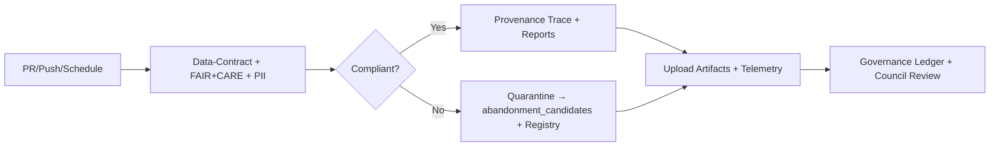

<div align="center">

# ⚖️ **FAIR+CARE Validation Workflow — `faircare-validate.yml`**  
`docs/workflows/faircare-validate.yml.md`

**Purpose:**  
Define the **GitHub Actions** workflow that validates datasets and docs for **FAIR+CARE** compliance, performs **ethics/PII scans**, enforces **data contracts**, manages **abandonment candidates**, and emits **governance-ready reports** with full telemetry for Diamond⁹ / Crown∞Ω certification.

[](../README.md)
[](../../LICENSE)
[](../standards/faircare.md)
[](#)

</div>

---

## 📘 Overview

`faircare-validate.yml` is the **ethics and governance gate** for KFM. It ensures:

- ✅ **FAIR** — Findable, Accessible, Interoperable, Reusable checks  
- ✅ **CARE** — Collective benefit, Authority to control, Responsibility, Ethics  
- ✅ **Contracts** — JSON Schema & data-contract conformance (e.g., `data-contract-v3.json`)  
- ✅ **PII/Sensitive** — Automated redaction & cultural sensitivity screening  
- ✅ **Quarantine** — Noncompliant assets moved to `abandonment_candidates/` with registry entry  
- ✅ **Reports** — Machine-readable audit, provenance, and council-ready review packs

Outputs are written to `reports/` and appended to **telemetry v3** (`focus-telemetry.json`).

---

## 🗂️ Trigger & Scope

| Trigger | Paths | Notes |
|--------:|------|------|
| `pull_request` | `data/**`, `docs/**`, `schemas/**` | Blocks merge on failure |
| `push` (protected) | `data/**`, `docs/**`, `schemas/**` | Required for releases |
| `schedule` | nightly | Continuous surveillance of staged data |

**Ignored:** large binaries (`*.tif`, `*.pmtiles`) for lint; associated metadata is still validated.

---

## 🧩 Workflow (YAML)

```yaml
name: "FAIR+CARE Validate (Governed)"

on:
  pull_request:
    paths: ["data/**", "docs/**", "schemas/**"]
  push:
    branches: ["main", "release/**"]
    paths: ["data/**", "docs/**", "schemas/**"]
  schedule:
    - cron: "0 3 * * *"

permissions:
  contents: read
  id-token: write

concurrency:
  group: faircare-validate-${{ github.ref }}
  cancel-in-progress: true

jobs:
  validate:
    runs-on: ubuntu-22.04
    steps:
      - uses: actions/checkout@v4

      - uses: actions/setup-python@v5
        with: { python-version: "3.11" }

      - name: Install validators
        run: |
          pip install -r requirements.txt
          pip install jsonschema jq yq

      - name: Validate data contracts (schema)
        run: |
          python scripts/validate_contract.py \
            --root data/ --contract docs/contracts/data-contract-v3.json \
            --out reports/faircare/contract_summary.json

      - name: FAIR+CARE audit (ethics & governance)
        run: |
          python scripts/faircare_audit.py \
            --input data/ --standards docs/standards/faircare.yaml \
            --out reports/faircare/faircare_summary.json

      - name: PII & sensitive content scan
        run: |
          python scripts/pii_scan.py \
            --input data/ --rules docs/standards/pii_rules.yaml \
            --out reports/faircare/pii_scan.json

      - name: Flag noncompliant → abandonment candidates
        run: |
          python scripts/abandonment_triage.py \
            --violations reports/faircare/faircare_summary.json \
            --pii reports/faircare/pii_scan.json \
            --staging data/work/staging/tabular \
            --quarantine data/work/staging/tabular/abandonment_candidates \
            --registry data/work/staging/tabular/abandonment_candidates/abandonment_registry.json

      - name: Generate provenance trace
        run: |
          python scripts/make_provenance.py \
            --root data/ --out reports/faircare/provenance_trace.json

      - name: Upload artifacts
        uses: actions/upload-artifact@v4
        with:
          name: faircare_reports
          path: |
            reports/faircare/**
            data/work/staging/tabular/abandonment_candidates/abandonment_registry.json

      - name: Emit telemetry (v3)
        run: |
          python scripts/emit_telemetry.py \
            --kind faircare \
            --summary  reports/faircare/faircare_summary.json \
            --pii      reports/faircare/pii_scan.json \
            --contract reports/faircare/contract_summary.json \
            --out faircare_telemetry.json

      - name: Append telemetry to unified log
        run: |
          python scripts/merge_telemetry.py \
            --in faircare_telemetry.json \
            --dest releases/v10.2.0/focus-telemetry.json
```

---

## 🔎 Inputs, Artifacts & Outputs

| Type | Key/Path | Description |
|------|----------|-------------|
| **Input** | `data/**` | Tabular/spatial/metadata under review |
| **Artifact** | `reports/faircare/contract_summary.json` | Contract conformance |
| **Artifact** | `reports/faircare/faircare_summary.json` | FAIR+CARE audit |
| **Artifact** | `reports/faircare/provenance_trace.json` | DCAT/PROV-O lineage |
| **Artifact** | `reports/faircare/pii_scan.json` | PII / sensitive markers |
| **Artifact** | `abandonment_registry.json` | Quarantined dataset registry |
| **Telemetry** | `releases/v10.2.0/focus-telemetry.json` | Aggregated governance metrics |

---

## ✅ FAIR+CARE Rule Set

**FAIR**  
- *F1 (Findable):* Required front-matter; STAC/DCAT presence; stable IDs.  
- *A1 (Accessible):* License clarity; role-based access; reproducible links.  
- *I1 (Interoperable):* JSON Schema OK; DCAT vocab; CRS & units declared.  
- *R1 (Reusable):* Provenance, versioning, checksums; contract fields.

**CARE**  
- *Collective Benefit:* Community-benefit tags; no extractive use.  
- *Authority to Control:* `care_tag` enforced; consent & opt-out honored.  
- *Responsibility:* PII scan; redaction/masking pipelines.  
- *Ethics:* Cultural sensitivity checks (Indigenous data, minors, health).

**Failure policy:** Noncompliant assets are quarantined with checksum + reason; publication blocked until remediated/approved.

---

## 🧭 Abandonment Candidates Integration

1. Move violating assets to `abandonment_candidates/`.  
2. Append registry entry (id, reason, checksum, reviewer).  
3. Produce `reports/` (validation, provenance, ethics review).  
4. Emit telemetry events: `dataset-flagged`, `remediated`, `archived`.  
5. Require **FAIR+CARE Council** decision for release/retire.

---

## 📊 Telemetry & Sustainability

Appends governance metrics to `focus-telemetry.json`:

| Metric | Example | Notes |
|--------|---------|------|
| `datasets_scanned` | 152 | By type (csv/parquet/geojson) |
| `violations_found` | 7 | FAIR+CARE failures |
| `quarantined` | 3 | Added to abandonment registry |
| `energy_wh` | 96 | ISO 50001 estimate |
| `duration_min` | 12.4 | Workflow runtime |
| `policy_version` | `faircare@2025.4` | Standards pack hash |

---

## 🔒 Supply Chain & Provenance

- Optional **Syft** SBOM + **SLSA** attestations for evidence.  
- **OIDC** for artifact signing if redaction packages are produced.  
- Provenance maps link datasets → sources → contracts → decisions.

---

## 🧭 Mermaid — High-Level Flow



---

## 🕰️ Version History

| Version | Date | Author | Summary |
|---------|------|--------|---------|
| **v10.2.4** | 2025-11-12 | `@kfm-governance` | Telemetry schema v3; artifact paths unified; clarified schedule behavior & quarantine registry. |
| v10.1.0 | 2025-11-10 | `@kfm-governance` | Contract summary emission; telemetry v2 adoption. |
| v9.9.0  | 2025-11-08 | `@kfm-governance` | Introduced quarantine registry, PII scan, provenance export, telemetry merge. |

---

<div align="center">

**Kansas Frontier Matrix**  
*Ethical Automation × FAIR+CARE Governance × Sustainable CI/CD*  
© 2025 Kansas Frontier Matrix · CC-BY 4.0 · Master Coder Protocol v6.3 · Diamond⁹ Ω / Crown∞Ω Ultimate Certified  
[Back to Workflows Index](README.md) · [Governance Charter](../standards/governance/ROOT-GOVERNANCE.md)

</div>