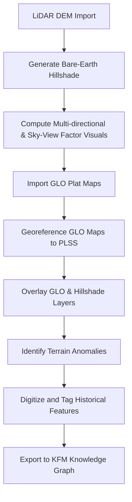

<div align="center">

# 🗺️ **Kansas Frontier Matrix — LiDAR & GLO Integration Field Guide**
`docs/workflows/lidar-glo-integration.md`

**Purpose:**  
Provides a **FAIR+CARE-aligned workflow** for integrating **bare-earth LiDAR hillshades** with **19th-century General Land Office (GLO) plats** to identify historical human landscapes in Kansas.  
This guide supports archaeologists, historians, and AI-assisted analysts seeking to locate vanished settlements, roads, or agricultural patterns through geospatial overlays and terrain analysis.

[](../../README.md)
[](../../LICENSE)
[](../../docs/standards/FAIRCARE.md)
[](../../releases/)
</div>

---

## 📘 Overview

Bare-earth **LiDAR-derived terrain models (DTMs)** reveal subtle surface anomalies—mounds, depressions, berms, and cuts—that often correspond to historical human features.  
Overlaying **georeferenced GLO plats** from 1854–1900 allows direct comparison of past land division, settlement, and environmental change with today’s landscape.

This integration enables AI-assisted detection of hidden cultural features through elevation, hydrology, and vegetation context layers.

---

## 🗂️ Directory Layout

```bash
docs/workflows/lidar-glo-integration.md
data/raw/lidar/              # Source LiDAR DEM tiles (GeoTIFF, LAZ)
data/processed/lidar/        # Mosaicked & hillshaded DEMs
data/raw/glo_plats/          # Historical survey plats (TIFF, PDF, GeoTIFF)
data/processed/glo/          # Georeferenced & digitized plats
src/pipelines/geospatial/    # QGIS/Python scripts for alignment and analysis
outputs/analysis/terrain/    # Rendered visualizations, slope, SVF, and contour maps
outputs/analysis/historic/   # Feature detections and overlays
```

---

## 🧩 Workflow Summary



---

## ⚙️ Data Sources

| Dataset | Provider | Format |
|----------|-----------|---------|
| LiDAR Bare-Earth DEM | Kansas Data Access & Support Center (DASC) | GeoTIFF, LAZ |
| PLSS Grids (Township-Range-Section) | KDOT / DASC | Shapefile, GeoPackage |
| GLO Plats & Field Notes | Bureau of Land Management (BLM GLO Records) | TIFF, PDF |
| Hydrography (NHDPlus) | USGS | GeoDatabase |
| Historic Aerials / Topos | USGS, USGS EarthExplorer | GeoTIFF |

---

## 🧾 Geoprocessing Procedure

| Step | Tool | Description |
|------|------|-------------|
| 1 | **QGIS / PDAL** | Import LiDAR tiles, filter ground returns, and build DTM |
| 2 | **QGIS Hillshade / RVT** | Create hillshade, multi-illumination, slope, and SVF layers |
| 3 | **QGIS Georeferencer** | Load GLO plat scans and tie to PLSS intersections or water features |
| 4 | **Raster Alignment** | Match projection to LiDAR CRS (EPSG: 26914 / NAD83 UTM Zone 14N) |
| 5 | **Overlay & Compare** | Adjust transparency; visually locate anomalies |
| 6 | **Digitize Findings** | Vectorize outlines of mounds, ditches, old roads, or depressions |
| 7 | **Export Metadata** | Save to GeoPackage with attribution and FAIR+CARE fields |

---

## 🧠 Analytical Enhancements (AI-Assisted)

| Layer | AI Method | Outcome |
|--------|------------|----------|
| Terrain Hillshade | CNN / Vision Transformer | Detect microtopographic anomalies |
| SVF & Slope | SHAP Feature Ranking | Rank feature importance in detections |
| GLO Overlay | OCR + Entity Linking | Extract and label surveyor notes |
| Hydrography | Graph Query | Connect historical flow paths to modern |
| Output | Neo4j Integration | Adds spatial provenance to KFM Graph |

---

## ⚖️ FAIR+CARE Alignment

| Principle | Implementation |
|------------|----------------|
| **Findable** | Persistent identifiers (UUIDs) and crosslinked metadata |
| **Accessible** | Open GeoTIFF and GeoPackage with CC-BY licensing |
| **Interoperable** | EPSG codes, DCAT 3.0, CIDOC CRM spatial mappings |
| **Reusable** | Full provenance and AI model metadata stored in ledger |
| **Collective Benefit (CARE)** | Promotes cultural heritage preservation |
| **Authority to Control (CARE)** | Attribution to indigenous & settler sources maintained |
| **Responsibility (CARE)** | Ethical visualization avoiding exposure of sensitive sites |
| **Ethics (CARE)** | Alignment with FAIR+CARE Council Review Guidelines |

---

## 🕰️ Version History

| Version | Date | Author | Summary |
|----------|------|---------|----------|
| v1.0 | 2025-11-08 | KFM Team | Initial publication — LiDAR + GLO integration guide |

---

<div align="center">

© 2025 Kansas Frontier Matrix · Master Coder Protocol v6.3 · FAIR+CARE Certified · Diamond⁹ Ω / Crown∞Ω Ultimate Certified  
[Back to `docs/workflows`](../workflows/) · [Governance Charter](../../docs/standards/governance/ROOT-GOVERNANCE.md)

</div>
````
