<div align="center">

# 🗺️ **Kansas Frontier Matrix — LiDAR & GLO Integration Field Guide**
`docs/workflows/lidar-glo-integration.md`

**Purpose:**  
Define a **FAIR+CARE-aligned workflow** for fusing **bare-earth LiDAR** terrain products with **19th-century General Land Office (GLO) plats** to locate and document historical features (settlements, roads, field boundaries) across Kansas.  
This guide supports archaeologists, historians, and AI analysts with a **reproducible, auditable** method that feeds results directly into the **KFM Knowledge Graph** and Focus Mode.

[](../../README.md)
[](../../LICENSE)
[](../../docs/standards/faircare.md)
[](../../releases/)
</div>

---

## 📘 Overview

Bare-earth **LiDAR-derived DTMs** expose subtle microtopography — berms, ditches, mounds, wagon ruts — often matching GLO-recorded cultural features.  
Georeferencing **GLO plats (1854–1900)** to **PLSS** and overlaying them on hillshades, SVF, and slope rasters enables systematic discovery and documentation.  
Outputs (features, provenance, and ethics tags) are published to **STAC/DCAT**, linked in **Neo4j**, and surfaced in **Focus Mode**.

---

## 🗂️ Directory Layout

```plaintext
docs/workflows/lidar-glo-integration.md
data/raw/lidar/              # LiDAR DEM tiles (GeoTIFF, LAZ/LAZ-ED)
data/processed/lidar/        # Mosaics, hillshade, MDI, SVF
data/raw/glo_plats/          # GLO plats (TIFF, PDF, GeoTIFF) + field notes
data/processed/glo/          # Georeferenced plats + digitized vectors
src/pipelines/geospatial/    # QGIS/PDAL/GDAL scripts for alignment & analysis
outputs/analysis/terrain/    # Slope, SVF, MDI, contours
outputs/analysis/historic/   # Digitized features + overlays + reports
```

---

## 🧩 Workflow Summary

```mermaid
flowchart LR
    A["LiDAR DEM Import"] --> B["Bare-Earth Hillshade (RVT/MDI)"]
    B --> C["Sky-View Factor · Slope · Contours"]
    C --> D["GLO Plat Import"]
    D --> E["Georeference to PLSS (control: section corners, hydro)"]
    E --> F["Overlay & Compare (transparency, blend modes)"]
    F --> G["Anomaly Review (QA with multi-illumination)"]
    G --> H["Digitize, Attribute & Tag"]
    H --> I["Publish (STAC/DCAT) + Ingest (Neo4j) + Focus Mode"]
```



---

## ⚙️ Data Sources

| Dataset | Provider | Format |
|--------|----------|--------|
| LiDAR Bare-Earth DEM | Kansas DASC / USGS 3DEP | GeoTIFF, LAZ |
| PLSS Grids (TRS) | KDOT / DASC | Shapefile, GeoPackage |
| GLO Plats & Field Notes | BLM GLO Records | TIFF, PDF |
| Hydrography (NHDPlus) | USGS | GDB, Shapefile |
| Historic Aerials / Topos | USGS EarthExplorer / USGS Topo | GeoTIFF |

---

## 🧾 Geoprocessing Procedure

| Step | Tooling | Notes |
|-----:|--------|-------|
| 1 | **PDAL / QGIS** | Ground filtering → DTM mosaic (EPSG:26914 UTM 14N) |
| 2 | **RVT / QGIS** | Hillshade (multi-illumination), **MDI**, **SVF**, slope |
| 3 | **QGIS Georeferencer** | GLO control: PLSS corners, meanders, road/creek crossings |
| 4 | **GDAL** | Reproject to analysis CRS; align to LiDAR grid |
| 5 | **Overlay** | Transparency + blend modes to co-visualize |
| 6 | **Digitize** | Vectorize features (roads, ditches, mounds, foundations) |
| 7 | **Metadata** | Attribute FAIR+CARE + provenance; export GeoPackage |

**MDI = Multi-Directional Illumination; SVF = Sky-View Factor**

---

## 🧠 AI-Assisted Enhancements

| Layer | Method | Output |
|------:|--------|--------|
| Hillshade/MDI | CNN / ViT detection | Candidate microrelief features |
| SVF/Slope | SHAP ranking | Feature importance for anomaly scoring |
| GLO Text | OCR + NER/EL | Parsed labels (e.g., “Road”, “School”, “Mill”) with links |
| Hydrography | Graph queries | Past → present stream path associations |
| Export | Neo4j | Nodes: Place/Event/Document + spatial provenance |

---

## 🧮 Export & Catalog

- **STAC Item** per raster & vector layer (with `proj`, `raster`, `checksum`, `version` extensions).  
- **DCAT Dataset** mirror for discovery portals.  
- Assets: COG hillshades, PMTiles vector tiles, GeoPackages, thumbnails.  
- Add `kfm:care_tag` (`public`/`restricted`/`sensitive`) and providers/licensing.

---

## ⚖️ FAIR+CARE Alignment

| Principle | Implementation |
|-----------|----------------|
| **Findable** | UUIDs, `self` links, and Collection/Item hierarchy |
| **Accessible** | CC-BY assets, open formats (COG, GPKG, PMTiles) |
| **Interoperable** | EPSG codes, STAC/DCAT, CIDOC CRM spatial mappings |
| **Reusable** | Provenance, checksums, and model cards for AI steps |
| **Collective Benefit** | Aids preservation; supports education & tribes |
| **Authority to Control** | Respect site sensitivity; council review for `sensitive` |
| **Responsibility** | Avoids exposing fragile or sacred features; redaction by policy |
| **Ethics** | Bias checks on AI detections; human-in-the-loop QA |

---

## 🧪 Quality Assurance Checklist

- [ ] LiDAR DTM aligned (EPSG, pixel size, grid)  
- [ ] GLO georeference RMS ≤ 3–10 m (document control)  
- [ ] SVF/MDI layers generated and reviewed  
- [ ] Features digitized with attributes (`feature_type`, `confidence`, `source`)  
- [ ] STAC/DCAT Items validated (`stac-validate.yml`)  
- [ ] `care_tag` assigned & reviewed; sensitive sites handled per policy  
- [ ] Neo4j ingest tested; Focus Mode summary verified

---

## 🕰️ Version History

| Version | Date | Author | Summary |
|---------|------|--------|---------|
| **v1.1** | 2025-11-10 | `@kfm-geo` | Added MDI workflow, DCAT mirror, CARE tags; aligned with v10.1.0 telemetry & governance. |
| v1.0 | 2025-11-08 | `@kfm-geo` | Initial publication — LiDAR + GLO integration guide. |

---

<div align="center">

**Kansas Frontier Matrix** · *Geospatial Insight × FAIR+CARE Governance × Cultural Stewardship*  
© 2025 Kansas Frontier Matrix · CC-BY 4.0 · Master Coder Protocol v6.3 · Diamond⁹ Ω / Crown∞Ω Ultimate Certified  
[Back to `docs/workflows`](../workflows/) · [Governance Charter](../../docs/standards/governance/DATA-GOVERNANCE.md)

</div>
