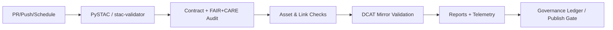

<div align="center">

# 🗂️ **STAC/DCAT Validation Workflow — `stac-validate.yml`**  
`docs/workflows/stac-validate.yml.md`

**Purpose:**  
Define the **GitHub Actions** workflow that validates all **STAC 1.0** Catalogs/Collections/Items and their **DCAT 3.0** mirrors, checks asset availability & checksums, enforces **FAIR+CARE**/contract fields, and publishes machine-readable validation reports with **telemetry** for Diamond⁹ / Crown∞Ω certification.

[](../README.md)
[](../../LICENSE)
[](../standards/faircare.md)
[](#)

</div>

---

## 📘 Overview

`stac-validate.yml` is the **catalog gate** for KFM. It guarantees that everything under `data/stac/**`:

- ✅ Conforms to **STAC 1.0.0** (core + extensions: `proj`, `raster`, `eo`, `label`, `version`, `checksum`)  
- ✅ Mirrors into **DCAT 3.0** where required (see `docs/architecture/data-architecture.md`)  
- ✅ Has **dereferenceable assets** (HTTP/PMTiles/WMS/WFS) and **verifiable checksums**  
- ✅ Satisfies **FAIR+CARE** and **data-contract** required metadata (license, temporal extent, bbox, provider, `care_tag`)  
- ✅ Emits **validation reports** and **telemetry** (counts, error types, energy/duration) for governance

---

## 🗂️ Trigger & Scope

| Trigger | Paths | Notes |
|--------:|------|------|
| `pull_request` | `data/stac/**`, `schemas/**`, `docs/**` | Blocks merge on failure |
| `push` (protected) | `data/stac/**` | Required for releases |
| `schedule` | nightly | Catalog regression & link rot checks |

**Ignored:** large binary assets (`*.tif`, `*.cog.tif`, `*.zip`) are not uploaded but **HEAD**/range-checked.

---

## 🧩 Workflow (YAML)

```yaml
name: "STAC/DCAT Validate (Governed)"

on:
  pull_request:
    paths: ["data/stac/**", "schemas/**", "docs/**"]
  push:
    branches: ["main", "release/**"]
    paths: ["data/stac/**"]
  schedule:
    - cron: "15 2 * * *"

permissions:
  contents: read

concurrency:
  group: stac-validate-${{ github.ref }}
  cancel-in-progress: true

jobs:
  validate:
    runs-on: ubuntu-22.04
    timeout-minutes: 45
    steps:
      - name: Checkout
        uses: actions/checkout@v4

      - name: Setup Python 3.11
        uses: actions/setup-python@v5
        with: { python-version: "3.11" }

      - name: Install validators
        run: |
          pip install pystac[validator]==1.10.1 stac-validator==3.3.0 stactools==0.5.5 \
                     jsonschema==4.23.0 rfc3986==2.0.0 requests==2.32.3 \
                     lxml==5.* \
                     kfm-stac-tools[checksums,links]
          sudo apt-get update && sudo apt-get install -y jq moreutils

      - name: Validate STAC structure (catalog/collection/item)
        run: |
          python -m pystac.validate data/stac --recursive --ignore-links \
            --output-format json > reports/stac/structure.json || true

      - name: Run stac-validator (strict)
        run: |
          mkdir -p reports/stac
          stac-validator data/stac --recursive --log-level INFO --extended --asset --links \
            | tee reports/stac/validator.log

      - name: Verify required fields (FAIR+CARE + Contract)
        run: |
          python scripts/stac_contract_check.py \
            --root data/stac \
            --contract docs/contracts/data-contract-v3.json \
            --faircare docs/standards/faircare.yaml \
            --out reports/stac/contract_faircare.json

      - name: Asset availability & checksum audit
        run: |
          python scripts/stac_asset_audit.py \
            --root data/stac \
            --concurrency 10 \
            --require-checksum \
            --out reports/stac/assets_audit.json

      - name: DCAT mirror validation
        run: |
          python scripts/dcat_validate.py \
            --stac-root data/stac \
            --dcat-out reports/stac/dcat_validation.json

      - name: Summarize results
        run: |
          python scripts/stac_summarize.py \
            --structure reports/stac/structure.json \
            --validator_log reports/stac/validator.log \
            --contract reports/stac/contract_faircare.json \
            --assets reports/stac/assets_audit.json \
            --dcat reports/stac/dcat_validation.json \
            --out reports/stac_validation.json \
            --markdown reports/stac_summary.md

      - name: Upload artifacts
        uses: actions/upload-artifact@v4
        with:
          name: stac_validation_reports
          path: reports/

      - name: Emit telemetry
        run: |
          python scripts/emit_telemetry.py \
            --kind stac_validate \
            --summary reports/stac_validation.json \
            --out stac_telemetry.json

      - name: Append to unified telemetry
        run: |
          python scripts/merge_telemetry.py \
            --in stac_telemetry.json \
            --dest releases/v10.1.0/focus-telemetry.json
```

---

## ✅ Validation Rules

### STAC Core & Extensions
- **Core**: `type`, `id`, `stac_version`, `links`, `assets` (where applicable)  
- **Item**: `bbox`, `geometry`, `properties.datetime` or `start_datetime`/`end_datetime`  
- **Extensions**:  
  - `proj` (CRS), `proj:epsg` or `proj:wkt2`  
  - `raster` stats for COG assets (band count, dtype, nodata)  
  - `label` / `eo` / `version` / `checksum:multihash` as declared

### FAIR+CARE & Contract Fields
- `license` (SPDX / CC) — required & non-empty  
- `providers` (roles: producer, licensor, host)  
- `kfm:care_tag` ∈ {`public`, `restricted`, `sensitive`}  
- `kfm:contract_id`, `kfm:checksum_sha256` (or `checksum:multihash`)  
- Temporal & spatial `extent` present for Collections

### Link & Asset Checks
- `self`, `root`, `parent` links resolve (2xx)  
- Asset URLs **HEAD** / **Range** OK; COGs show `Content-Type` & `Accept-Ranges`  
- PMTiles `pmtiles://` URLs whitelisted by protocol mapping (documented in `web/src/...`)

---

## 🧩 Outputs & Artifacts

| Artifact | Purpose |
|---------|---------|
| `reports/stac_validation.json` | Canonical machine-readable summary (pass/fail, counts, errors) |
| `reports/stac_summary.md` | Human summary for PR checks |
| `reports/stac/structure.json` | PySTAC recursive validation output |
| `reports/stac/validator.log` | Raw `stac-validator` transcript |
| `reports/stac/assets_audit.json` | Asset reachability & checksum results |
| `reports/stac/dcat_validation.json` | DCAT mirror compliance report |
| `reports/stac/contract_faircare.json` | Contract + FAIR+CARE field audit |

All metrics are merged into `releases/v10.1.0/focus-telemetry.json` (schema: `stac-validate-v2`).

---

## ⚖️ FAIR+CARE & Governance Alignment

| Principle | Enforcement | Evidence |
|-----------|-------------|----------|
| **Findable** | STAC/DCAT IDs, `self` links, `collection`/`parent` relations | `structure.json` |
| **Accessible** | Asset reachability, license presence | `assets_audit.json` |
| **Interoperable** | Extension schema validation; DCAT parity | `validator.log`, `dcat_validation.json` |
| **Reusable** | Checksums, providers, citations, summaries | `contract_faircare.json` |
| **CARE** | `kfm:care_tag` & sensitive flags respected | `contract_faircare.json` |

> Items flagged `sensitive` are **not** published to public endpoints until **FAIR+CARE Council** approval.

---

## 🔒 Supply Chain & Sustainability

- Optionally build **SBOM** for catalog builder (Syft)  
- Append **duration/energy** to telemetry (ISO 50001)  
- Use **concurrency** to avoid duplicate runs on large PRs

---

## 🧭 Mermaid — High-Level Flow



---

## 🕰️ Version History

| Version | Date | Author | Summary |
|---------|------|--------|---------|
| **v10.1.0** | 2025-11-10 | `@kfm-devops` | Upgraded to v10.1.0 artifacts; stricter checksum/link rules; telemetry schema v2. |
| v9.9.0 | 2025-11-08 | `@kfm-devops` | Initial governed STAC/DCAT validation doc with asset/link checks and telemetry export. |

---

<div align="center">

**Kansas Frontier Matrix**  
*Interoperable Catalogs × FAIR+CARE Governance × Sustainable CI/CD*  
© 2025 Kansas Frontier Matrix · CC-BY 4.0 · Master Coder Protocol v6.3 · Diamond⁹ Ω / Crown∞Ω Ultimate Certified  
[Back to Workflows Index](README.md) · [Governance Charter](../standards/governance/ROOT-GOVERNANCE.md)

</div>
