<div align="center">

# 📈 **Telemetry Export Workflow — `telemetry-export.yml`**  
`docs/workflows/telemetry-export.yml.md`

**Purpose:**  
Aggregate and normalize **build, validation, and governance metrics** from all CI jobs (docs, STAC/DCAT, FAIR+CARE, AI training, web builds) into a single, FAIR+CARE-aligned telemetry ledger: **`releases/<version>/focus-telemetry.json`**.  
Provides a **machine-readable, auditable** source for sustainability dashboards, governance reviews, and certification under **MCP-DL v6.3** and **Diamond⁹ Ω / Crown∞Ω**.

[](../README.md)
[](../../LICENSE)
[](../standards/faircare.md)
[](#)

</div>

---

## 📘 Overview

`telemetry-export.yml` consolidates metrics emitted by other workflows, including:

- **Documentation** — `docs-lint.yml` (front-matter, links, mermaid guardrails)  
- **Governance** — `faircare-validate.yml` (FAIR+CARE, PII, abandonment registry)  
- **Catalog** — `stac-validate.yml` (STAC/DCAT + asset checksums)  
- **AI** — `ai-train.yml` (training/eval, drift, explainability, SBOM, SLSA)  
- **Builds** — web/pipelines build time, size, cache hits, test results

All inputs are normalized to a **stable telemetry schema** and appended to **`focus-telemetry.json`** for longitudinal analysis.

---

## 🗂️ Trigger & Scope

| Trigger | Paths | Notes |
|--------:|------|------|
| `workflow_run` | listens to success of: docs-lint, faircare-validate, stac-validate, ai-train | primary mode |
| `schedule` | nightly | roll-up of last N runs; trend refresh |
| `workflow_dispatch` | manual | backfill or emergency re-aggregation |

**Upstream requirements:** Each contributing workflow must emit a JSON summary conforming to its telemetry schema (see **Schemas & Contracts** below).

---

## 🧩 Workflow (YAML)

```yaml
name: "Telemetry Export (Governed)"

on:
  workflow_run:
    workflows:
      - "Docs Lint (Governed)"
      - "FAIR+CARE Validate (Governed)"
      - "STAC/DCAT Validate (Governed)"
      - "AI Train (Governed)"
    types: [completed]
  schedule:
    - cron: "0 * * * *" # hourly aggregation
  workflow_dispatch: {}

permissions:
  contents: write
  id-token: write

concurrency:
  group: telemetry-export-${{ github.ref }}
  cancel-in-progress: true

jobs:
  export:
    runs-on: ubuntu-22.04
    timeout-minutes: 20
    steps:
      - name: Checkout
        uses: actions/checkout@v4

      - name: Setup Python
        uses: actions/setup-python@v5
        with: { python-version: "3.11" }

      - name: Install tooling
        run: |
          pip install jsonschema jq
          pip install -r requirements.txt || true

      - name: Collect inputs
        run: |
          mkdir -p .telemetry/in .telemetry/out releases/v9.9.0
          # Example pulls; adapt to your artifact names/paths:
          python scripts/pull_artifact.py --name docs_lint_reports --out ./.telemetry/in/docs
          python scripts/pull_artifact.py --name faircare_reports --out ./.telemetry/in/faircare
          python scripts/pull_artifact.py --name stac_validation_reports --out ./.telemetry/in/stac
          python scripts/pull_artifact.py --name ai_*_artifacts --out ./.telemetry/in/ai || true

      - name: Normalize to telemetry schema
        run: |
          python scripts/normalize_docs_lint.py \
            --in .telemetry/in/docs --schema schemas/telemetry/workflows/docs-lint-v1.json \
            --out .telemetry/out/docs.json
          python scripts/normalize_faircare.py \
            --in .telemetry/in/faircare --schema schemas/telemetry/workflows/faircare-validate-v1.json \
            --out .telemetry/out/faircare.json
          python scripts/normalize_stac.py \
            --in .telemetry/in/stac --schema schemas/telemetry/workflows/stac-validate-v1.json \
            --out .telemetry/out/stac.json
          python scripts/normalize_ai.py \
            --in .telemetry/in/ai --schema schemas/telemetry/workflows/ai-train-v1.json \
            --out .telemetry/out/ai.json || echo "{}" > .telemetry/out/ai.json

      - name: Merge streams → focus-telemetry.json
        run: |
          python scripts/merge_telemetry.py \
            --in .telemetry/out/*.json \
            --dest releases/v9.9.0/focus-telemetry.json

      - name: Validate unified telemetry
        run: |
          python - <<'PY'
          import json,sys
          from jsonschema import validate, Draft202012Validator
          schema=json.load(open("schemas/telemetry/docs-index-v1.json"))
          data=json.load(open("releases/v9.9.0/focus-telemetry.json"))
          Draft202012Validator(schema).validate(data)
          print("Unified telemetry valid; entries:", len(data.get("events", [])))
          PY

      - name: Export quick summaries
        run: |
          python scripts/summarize_telemetry.py \
            --in releases/v9.9.0/focus-telemetry.json \
            --out reports/telemetry/summary.json \
            --md  reports/telemetry/summary.md
          echo "Telemetry summary written."

      - name: Attach artifacts
        uses: actions/upload-artifact@v4
        with:
          name: telemetry_ledger
          path: |
            releases/v9.9.0/focus-telemetry.json
            reports/telemetry/**
```

---

## 🧪 Schemas & Contracts

Each upstream workflow must output a JSON summary conforming to its schema:

| Source | Required Schema | Example Output |
|--------|------------------|----------------|
| docs-lint | `workflows/docs-lint-v1.json` | `reports/docs_lint.json` |
| faircare-validate | `workflows/faircare-validate-v1.json` | `reports/faircare/faircare_summary.json` |
| stac-validate | `workflows/stac-validate-v1.json` | `reports/stac_validation.json` |
| ai-train | `workflows/ai-train-v1.json` | `reports/ai/<model>/metrics.json` |

The exporter validates each input against its schema before merging.

---

## 🧮 Metrics & Dimensions

**Core fields appended to `focus-telemetry.json`:**

| Field | Type | Description |
|------:|------|-------------|
| `event_id` | string | UUIDv4 per record |
| `event_type` | enum | `docs_lint` \| `faircare` \| `stac_validate` \| `ai_train` \| `build` |
| `timestamp` | ISO-8601 | Event time (UTC) |
| `branch` | string | Git ref / release tag |
| `duration_sec` | number | Total workflow runtime |
| `energy_wh` | number | Estimated energy (ISO 50001) |
| `status` | enum | `success` \| `warning` \| `failure` |
| `payload` | object | Validated summary (schema-typed) |

> Energy may be estimated via runner power models or read from `ACTIONS_RUNNER_DEBUG` + custom probes; carbon intensity (gCO₂e/kWh) can be added via provider APIs.

---

## ♻️ Sustainability & Governance

- Tracks **energy** and **duration** per job; computes monthly totals.  
- Flags **hotspots** (long-running, high-energy steps) for refactoring.  
- Emits **FAIR+CARE** alignment snapshot for council review.  
- Prohibits merging telemetry from quarantined data unless **abandonment registry** marks `remediated`.

---

## 🔐 Supply Chain & Integrity

- Optionally sign the telemetry ledger with **Sigstore Cosign** and attach **SLSA** attestations.  
- Store `focus-telemetry.json` under `releases/<version>/` with immutability guarantees.  
- Include SBOM pointer (`sbom_ref`) in front-matter for traceability.

---

## 🧭 Mermaid — High-Level Flow

```mermaid
flowchart LR
  A["Upstream Workflows"] --> B["Normalize & Validate (schemas)"]
  B --> C["Merge → focus-telemetry.json"]
  C --> D["Summaries & Artifacts"]
  D --> E["Governance Ledger & Dashboards"]
```



---

## 🕰️ Version History

| Version | Date | Author | Summary |
|--------:|------|--------|---------|
| v9.9.0  | 2025-11-08 | `@kfm-devops` | Initial governed telemetry exporter with schema validation and sustainability metrics. |

---

<div align="center">

**Kansas Frontier Matrix**  
*Evidence-Driven Governance × FAIR+CARE Telemetry × Sustainable CI/CD*  
© 2025 Kansas Frontier Matrix · CC-BY 4.0 · Master Coder Protocol v6.3 · Diamond⁹ Ω / Crown∞Ω Ultimate Certified  
[Back to Workflows Index](README.md) · [Governance Charter](../standards/governance/ROOT-GOVERNANCE.md)

</div>

