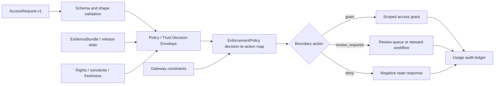

<!-- [KFM_META_BLOCK_V2]
doc_id: kfm://doc/NEEDS-VERIFICATION
title: Enforcement
type: standard
version: v1
status: draft
owners: OWNER_TBD_AFTER_CODEOWNERS_RECHECK
created: TODO(date): confirm original enforcement/README.md creation date
updated: 2026-05-02
policy_label: TODO(policy): confirm public/restricted label before merge
related: [../policy/README.md, ../policies/README.md, ../schemas/README.md, ../contracts/README.md, ../tools/README.md, ../tests/README.md, ../data/README.md, ./enforcement_policy_default.json, ./enforcement_spec_example.json, ./requests/example_access_request.json]
tags: [kfm, enforcement, policy, access-control, fail-closed, audit]
notes: [README-like standard doc for enforcement/. Current runtime enforcement depth remains UNKNOWN until repo tests, workflows, gateways, audit ledgers, and platform settings are verified.]
[/KFM_META_BLOCK_V2] -->

<a id="top"></a>

# Enforcement

Decision-to-action guidance for KFM access boundaries, fail-closed runtime behavior, and audit-ready enforcement examples.


> [!IMPORTANT]
> **Status:** experimental / draft  
> **Owners:** `OWNER_TBD_AFTER_CODEOWNERS_RECHECK`  
> **Path:** `enforcement/README.md`  
> **Truth posture:** CONFIRMED directory examples / PROPOSED operating guidance / UNKNOWN runtime enforcement depth  
> **Quick jumps:** [Scope](#scope) · [Repo fit](#repo-fit) · [Accepted inputs](#accepted-inputs) · [Exclusions](#exclusions) · [Directory tree](#directory-tree) · [Operating model](#operating-model) · [Outcomes](#enforcement-outcomes) · [Validation](#validation) · [Rollback](#rollback) · [Open verification](#open-verification)

> [!NOTE]
> This README explains the enforcement lane. It does **not** prove that branch protection, gateway middleware, audit logging, policy bundles, runtime checks, or deployment controls are active. Treat those as **NEEDS VERIFICATION** until current repo evidence, workflow output, gateway code, logs, and platform settings are inspected.

---

## Scope

`enforcement/` is the narrow lane for turning a verified decision into a boundary action.

In KFM terms, enforcement sits after source, schema, evidence, and policy evaluation. Its job is to make access behavior explicit, reviewable, testable, and auditable without becoming the source of policy law.

### This lane should answer

- What happens when a decision says `allow`, `warn`, `review`, `block`, or `unknown`?
- What request shape is expected at an enforcement boundary?
- Which default action applies when the decision or evidence is incomplete?
- Which audit obligation must be emitted when access is attempted?
- Which enforcement assumptions are still only examples?

### This lane should preserve

| KFM invariant | Enforcement consequence |
|---|---|
| Cite-or-abstain | Enforcement must not grant claim-bearing access when evidence closure fails. |
| Default deny / fail closed | `unknown`, invalid, stale, incomplete, or unsupported inputs deny or route to review. |
| Policy-aware release | Enforcement consumes policy or trust decisions; it does not invent allow/deny meaning. |
| Public clients use governed interfaces | Enforcement examples must not normalize direct access to RAW, WORK, QUARANTINE, canonical stores, or model runtimes. |
| Receipts and proofs stay separate | Usage audit records, run receipts, release proofs, and catalogs are separate object families. |
| AI is evidence-subordinate | Model output must not bypass enforcement or become an access grant. |

[Back to top](#top)

---

## Repo fit

`enforcement/` is a boundary-support lane beside KFM policy, contracts, schemas, runtime, data lifecycle, and release surfaces.

| Relationship | Path | Status | Role |
|---|---:|---|---|
| This README | `./README.md` | draft | Explains lane purpose, inputs, exclusions, outcomes, and verification gaps. |
| Default decision map | `./enforcement_policy_default.json` | CONFIRMED example | Maps decision labels to enforcement actions. |
| Example enforcement spec | `./enforcement_spec_example.json` | CONFIRMED example | Demonstrates default-deny posture, trust-decision source, loopback gateway posture, and audit intent. |
| Example request | `./requests/example_access_request.json` | CONFIRMED example | Shows a minimal `AccessRequest.v1` shape. |
| Policy meaning | `../policy/` and `../policies/` | NEEDS VERIFICATION | Policy law and policy bundles; enforcement must not duplicate them. |
| Machine schemas | `../schemas/` | NEEDS VERIFICATION | Structural validation for enforcement, request, policy, and runtime objects. |
| Human contracts | `../contracts/` | NEEDS VERIFICATION | Normative meaning of decision envelopes, policy decisions, and enforcement specs. |
| Runtime implementation | `../apps/`, `../packages/`, `../runtime/`, `../infra/` | UNKNOWN | Actual gateway, API, host, proxy, and middleware behavior. |
| Evidence lifecycle | `../data/` | NEEDS VERIFICATION | Receipts, proofs, catalogs, and release artifacts; enforcement does not store canonical truth. |
| Tests and tools | `../tests/`, `../tools/` | NEEDS VERIFICATION | Fixtures and validators that should prove fail-closed behavior. |

> [!WARNING]
> `enforcement/` is not a convenient place to hide policy logic, security secrets, raw source access, workflow-only controls, or publication approval. It should stay thin, explicit, and testable.

[Back to top](#top)

---

## Accepted inputs

The lane accepts reviewable examples and enforcement-facing contracts.

| Input | Belongs here when… | Must remain linked to… |
|---|---|---|
| `EnforcementPolicy.v1` examples | They map decision labels to boundary actions. | Policy decisions, runtime envelopes, and tests. |
| `EnforcementSpec.v1` examples | They document default action, decision source, gateway posture, and audit requirements. | Runtime gateway contracts and audit ledger expectations. |
| `AccessRequest.v1` examples | They show subject, action, target, and protected-resource intent. | Identity, authn/authz, policy, and source-sensitivity surfaces. |
| Enforcement README docs | They explain how enforcement should behave without claiming runtime maturity. | Contracts, schemas, policy, runtime, data, and release docs. |
| Negative-case fixtures | They prove `unknown`, `warn`, invalid, expired, or restricted inputs fail closed. | `../tests/` and repo-native validators. |
| Audit expectations | They describe what usage records or receipts should be emitted. | `../data/receipts/`, `../data/proofs/`, and release/correction surfaces. |

[Back to top](#top)

---

## Exclusions

Do not put these in `enforcement/`.

| Do not put here | Use instead | Why |
|---|---|---|
| Policy law or rule bundles | `../policy/` or `../policies/` | Enforcement applies decisions; policy defines admissibility. |
| Canonical schemas | `../schemas/` | Prevents parallel machine-contract authority. |
| Human-readable object contracts | `../contracts/` | Keeps meaning separate from enforcement examples. |
| Gateway middleware implementation | `../apps/`, `../packages/`, `../runtime/`, or `../infra/` | Runtime code needs tests, deployment review, and operational ownership. |
| RAW, WORK, QUARANTINE, PROCESSED, CATALOG, or PUBLISHED data | `../data/` lifecycle paths | Enforcement examples are not canonical stores. |
| Usage logs, receipts, proofs, or release manifests | `../data/receipts/`, `../data/proofs/`, `../release/` | Instances belong in lifecycle/proof families, not docs/examples. |
| Secrets, keys, tokens, `.env`, VPN credentials, or host firewall rules | Secret manager / host configuration / infra runbook | Prevents sensitive operational exposure. |
| UI-only trust labels | `../ui/`, `../web/`, or app shell docs | UI reflects enforcement; it does not replace backend gates. |

[Back to top](#top)

---

## Directory tree

Current public-main snapshot, subject to branch recheck before merge:

```text
enforcement/
├── README.md
├── enforcement_policy_default.json
├── enforcement_spec_example.json
└── requests/
    └── example_access_request.json
```

### Possible next fill pattern

PROPOSED only:

```text
enforcement/
├── README.md
├── enforcement_policy_default.json
├── enforcement_spec_example.json
├── requests/
│   ├── example_access_request.json
│   ├── invalid_missing_subject.json
│   ├── invalid_unknown_decision.json
│   └── restricted_location_request.json
├── decisions/
│   ├── allow_grant_example.json
│   ├── review_required_example.json
│   └── deny_unknown_example.json
└── README_CHANGELOG.md
```

> [!CAUTION]
> Do not add new executable enforcement code to this directory unless an ADR or repo convention explicitly makes `enforcement/` an executable package. Prefer tested implementation homes under `apps/`, `packages/`, `runtime/`, `tools/`, or `infra/`.

[Back to top](#top)

---

## Operating model

Enforcement is a boundary translation step.



### Boundary rules

| Rule | Posture |
|---|---|
| Missing request shape | `DENY` |
| Missing or unresolved decision source | `DENY` |
| Missing EvidenceBundle where consequential access depends on evidence | `DENY` or `ABSTAIN` upstream |
| Missing rights, sensitivity, or review posture | `DENY` or `review_required`, never silent grant |
| `unknown` decision | `DENY` |
| `warn` decision | `DENY` until explicit staged enforcement policy says otherwise |
| `review` decision | `review_required` |
| `block` decision | `DENY` |
| `allow` decision | grant only within declared constraints |

[Back to top](#top)

---

## Enforcement outcomes

The current default example expresses this decision-to-action map:

| Decision label | Boundary action | Practical meaning |
|---|---|---|
| `allow` | `grant` | Access may be granted if scope, gateway, and audit constraints are satisfied. |
| `warn` | `deny` | Warning is not sufficient to grant access by default. |
| `review` | `review_required` | Human/steward/release review is required before access proceeds. |
| `block` | `deny` | Access is denied. |
| `unknown` | `deny` | Missing or unrecognized trust state fails closed. |

The current default example also declares `single_use_by_default: true` under grant constraints. Treat that as a safe example posture, not as proven runtime behavior.

### Runtime response posture

| Enforcement action | Recommended response shape | Notes |
|---|---|---|
| `grant` | `ANSWER` or scoped access response | Must include scope, expiry or single-use constraint when applicable, audit reference, and source decision reference. |
| `review_required` | `DENY` or `REVIEW_REQUIRED` depending on runtime envelope convention | Must include reason codes and obligations. |
| `deny` | `DENY` | Must include stable reason codes without leaking restricted details. |
| invalid input | `ERROR` or `DENY` depending on caller contract | Must be audit-visible and fail closed. |

[Back to top](#top)

---

## Current examples

### Default enforcement policy

The current default policy example is intentionally conservative:

```json
{
  "schema": "EnforcementPolicy.v1",
  "decision_to_action": {
    "allow": "grant",
    "warn": "deny",
    "review": "review_required",
    "block": "deny",
    "unknown": "deny"
  },
  "grant_constraints": {
    "single_use_by_default": true
  }
}
```

### Enforcement spec example

The current enforcement spec example declares default-deny behavior, trust-decision-envelope sourcing, loopback-only gateway posture, and audit-ledger intent:

```json
{
  "schema": "EnforcementSpec.v1",
  "enforcement_id": "enf-1",
  "dataset_id": "ds-1",
  "enforcement": {
    "default_action": "deny"
  },
  "decision_source": {
    "mode": "trust-decision-envelope"
  },
  "gateway": {
    "loopback_only": true
  },
  "audit": {
    "write_usage_audit_ledger": true
  }
}
```

### Access request example

```json
{
  "schema": "AccessRequest.v1",
  "action": "read",
  "target": {
    "protected_resource_id": "pres_x"
  },
  "subject": {
    "subject_id": "user-1",
    "subject_type": "human"
  }
}
```

> [!NOTE]
> These examples are useful because they show the lane’s intended vocabulary. They do not prove that a gateway currently enforces them, that a schema validates them, or that audit ledgers are emitted.

[Back to top](#top)

---

## Validation

### Manual inspection

```bash
# Run from the repository root.
cat enforcement/enforcement_policy_default.json
cat enforcement/enforcement_spec_example.json
cat enforcement/requests/example_access_request.json
```

### Proposed validation gates

NEEDS VERIFICATION: replace the placeholder commands below with repo-native validators once schema home, test runner, and policy toolchain are confirmed.

```bash
# PROPOSED / NEEDS VERIFICATION
tools/validators/enforcement/validate_enforcement_policy \
  enforcement/enforcement_policy_default.json

tools/validators/enforcement/validate_enforcement_spec \
  enforcement/enforcement_spec_example.json

tools/validators/enforcement/validate_access_request \
  enforcement/requests/example_access_request.json
```

### Minimum negative paths to prove

| Negative path | Expected result |
|---|---|
| Missing `subject` | deny or validation error; no grant. |
| Missing `target.protected_resource_id` | deny or validation error; no grant. |
| `decision_to_action.unknown = grant` | policy/test failure. |
| `warn` mapped to `grant` without ADR-backed staged policy | policy/test failure. |
| `gateway.loopback_only` false for local-only protected resource | deny or review-required. |
| Missing audit configuration | deny or validation error for protected resources. |
| Attempt to access RAW / WORK / QUARANTINE directly | deny. |
| EvidenceBundle resolution failure for consequential claim | deny or upstream abstain. |

[Back to top](#top)

---

## Review checklist

Use this checklist before treating enforcement changes as merge-ready.

- [ ] Confirm `enforcement/` owner from `CODEOWNERS` or explicit maintainer assignment.
- [ ] Confirm whether `policy/` or `policies/` is the active policy-authority lane for this enforcement surface.
- [ ] Confirm machine schema home for `EnforcementPolicy.v1`, `EnforcementSpec.v1`, and `AccessRequest.v1`.
- [ ] Add valid and invalid fixtures for decision-to-action mapping.
- [ ] Prove `unknown`, `warn`, invalid, and restricted cases fail closed.
- [ ] Confirm runtime gateway implementation path, or keep runtime claims `UNKNOWN`.
- [ ] Confirm audit ledger target and receipt/proof separation.
- [ ] Confirm no direct access path to RAW, WORK, QUARANTINE, canonical stores, or model runtimes.
- [ ] Confirm no secrets, keys, host rules, VPN details, or deployment-sensitive material are committed here.
- [ ] Confirm rollback target for any change that affects default-deny posture.

[Back to top](#top)

---

## Definition of done

This README is healthy when maintainers can answer four questions from it without guessing:

1. **What belongs in `enforcement/`?**  
   Thin examples, request shapes, decision-to-action maps, and enforcement documentation.

2. **What does not belong in `enforcement/`?**  
   Policy law, schemas, gateway implementation, secrets, canonical stores, runtime logs, receipts, proofs, release manifests, and UI-only trust labels.

3. **What is the default behavior under uncertainty?**  
   Deny, abstain upstream, or route to review. Never silent grant.

4. **What still needs proof?**  
   Runtime gateway behavior, active validators, policy toolchain, workflow enforcement, audit output, branch protection, and owner routing.

[Back to top](#top)

---

## Rollback

Rollback is required when a change weakens default-deny posture, maps `unknown` or `warn` to grant without review, bypasses policy or evidence closure, hides audit obligations, introduces secrets, or normalizes direct public access to protected stores.

```bash
# CAUTION: restores this README from the checked-out branch state.
git checkout -- enforcement/README.md
```

Rollback notes:

- Revert documentation changes separately from policy JSON changes when possible.
- Preserve a correction note if a merged README accidentally overstated active runtime enforcement.
- If enforcement JSON changed, rerun negative fixtures before restoring public trust language.
- If runtime gateway behavior changed, rollback belongs in the runtime/app/infra lane, not only in this README.

[Back to top](#top)

---

## Open verification

| Item | Status | Needed evidence |
|---|---|---|
| Enforcement lane owner | UNKNOWN | `CODEOWNERS`, maintainer assignment, or ADR. |
| `policy/` versus `policies/` authority | NEEDS VERIFICATION | Repo docs or ADR clarifying policy surface split. |
| Active schema files | UNKNOWN | Schema inventory for `EnforcementPolicy.v1`, `EnforcementSpec.v1`, and `AccessRequest.v1`. |
| Active validator command | UNKNOWN | Tool path, test output, CI invocation, and fixture evidence. |
| Runtime gateway | UNKNOWN | App/package/infra implementation evidence and tests. |
| Audit ledger path | UNKNOWN | Receipt/log schema, lifecycle location, and emitted example. |
| Workflow enforcement | UNKNOWN | Workflow YAML, required checks, branch rules, and recent run evidence. |
| Release impact | UNKNOWN | Whether enforcement examples participate in release manifests or proof packs. |
| Security posture | NEEDS VERIFICATION | Host, proxy, auth, and secrets review for protected resources. |

[Back to top](#top)

---

## FAQ

### Is `enforcement/` the policy engine?

No. `enforcement/` documents and examples how a decision becomes an action. Policy law belongs in the policy lane, and structural validation belongs in schemas/contracts according to the repo’s resolved authority model.

### Does an `allow` decision always grant access?

No. `allow` may become `grant` only when scope, gateway constraints, rights, sensitivity, freshness, review, release, and audit obligations are satisfied.

### Why does `warn` deny by default?

Because a warning is not a release or access grant. KFM’s fail-closed posture requires explicit review or staged enforcement policy before weakening a boundary.

### Can this directory contain secrets or host firewall rules?

No. Keep secrets, tokens, gateway credentials, firewall rules, VPN details, and deployment-sensitive configuration out of this lane.

### Can the UI override enforcement?

No. The UI may display trust state and denial reasons, but backend enforcement remains the gate.

[Back to top](#top)

---

<details>
<summary><strong>Appendix A — Evidence boundary for this README</strong></summary>

| Evidence | Status | Supports | Limits |
|---|---|---|---|
| `enforcement/README.md` | CONFIRMED current public-main placeholder | Target path exists. | It is currently not enough documentation by itself. |
| `enforcement/enforcement_policy_default.json` | CONFIRMED example | Default decision-to-action mapping and single-use-by-default example. | Does not prove runtime enforcement or tests. |
| `enforcement/enforcement_spec_example.json` | CONFIRMED example | Default deny, trust-decision source, loopback-only gateway, audit-ledger intent. | Does not prove gateway implementation or audit emission. |
| `enforcement/requests/example_access_request.json` | CONFIRMED example | Minimal access request shape. | Does not prove schema validation or identity/auth behavior. |
| KFM doctrine corpus | CONFIRMED doctrine | Fail-closed posture, trust membrane, EvidenceBundle priority, governed APIs, receipt/proof separation. | Does not prove this branch implements all controls. |
| Mounted local workspace | CONFIRMED not a repo | Current local session cannot prove branch runtime behavior. | Use current GitHub/repo inspection before merge. |

</details>

<details>
<summary><strong>Appendix B — Compact glossary</strong></summary>

| Term | Meaning in this lane |
|---|---|
| `AccessRequest.v1` | A request to perform an action on a protected resource. |
| `EnforcementPolicy.v1` | A decision-to-action mapping used at an enforcement boundary. |
| `EnforcementSpec.v1` | A boundary configuration example describing default action, decision source, gateway posture, and audit requirement. |
| `grant` | Scoped access allowed after constraints pass. |
| `deny` | Access blocked. |
| `review_required` | Access cannot proceed until review obligations are satisfied. |
| `EvidenceBundle` | The inspectable support package that outranks generated language and UI summaries. |
| `PolicyDecision` / `DecisionEnvelope` | The policy/trust output that enforcement consumes. |
| `Usage audit ledger` | Process memory for attempted or granted access; not the same as release proof. |

</details>
