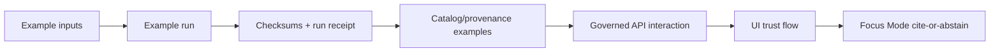

<!-- [KFM_META_BLOCK_V2]
doc_id: kfm://doc/677a9d0c-ca5d-4a30-be1e-f4bec92d976f
title: examples/ — Governed, Reproducible End-to-End Examples
type: standard
version: v2
status: draft
owners: KFM Maintainers (resolve via CODEOWNERS)
created: 2026-02-24
updated: 2026-02-27
policy_label: public
related:
  - ../README.md
  - ../CONTRIBUTING.md
  - ../SECURITY.md
  - ../contracts/README.md
  - ../configs/README.md
  - ../data/README.md
  - ../.github/README.md
tags:
  - kfm
  - examples
  - reproducibility
  - evidence-first
  - cite-or-abstain
notes:
  - Defines the directory contract for /examples with a default-deny posture.
  - Examples are small, policy-safe, and reproducible; they demonstrate trust surfaces and gates.
  - Adds a machine-readable Example Registry pattern and CI expectations (anti-skip gates).
[/KFM_META_BLOCK_V2] -->

<a id="top"></a>

# `examples/` — Governed, reproducible examples
**Purpose:** minimal, reproducible, *policy-safe* examples that demonstrate end-to-end KFM workflows  
**Status:** draft • **Owners:** resolve via CODEOWNERS • **Policy:** `public` (this README; individual examples may vary)


> [!IMPORTANT]
> `examples/` is the **sandbox of truth** — small enough to run locally, strict enough to survive CI.
>
> - Examples **MUST NOT** bypass governed APIs or policy boundaries.
> - Examples **MUST** be reproducible and emit evidence (receipts + checksums).
> - Examples **MUST** be safe under policy (default-deny; no sensitive leakage).
>
> If an example can’t be made safe to publish, it does not belong here.

---

## Quick navigation

- [Truth status legend](#truth-status-legend)
- [What this directory is](#what-this-directory-is)
- [Directory contract](#directory-contract)
- [Reality check](#reality-check)
- [Quickstart](#quickstart)
- [Example package standard](#example-package-standard)
- [Evidence and provenance](#evidence-and-provenance)
- [Data and safety rules](#data-and-safety-rules)
- [Promotion gates for example outputs](#promotion-gates-for-example-outputs)
- [Example registry](#example-registry)
- [Recommended layout](#recommended-layout)
- [CI gates](#ci-gates)
- [Contributing](#contributing)
- [Further reading](#further-reading)

---

## Truth status legend

This README uses explicit truth tags so it stays evidence-first and fail-closed:

- **CONFIRMED (design):** KFM invariants (truth path, trust membrane, cite-or-abstain)
- **PROPOSED:** a recommended template/pattern for this repo
- **UNKNOWN (repo):** not yet verified on this branch (include verification steps)

> [!NOTE]
> Treat all “runner commands” as **PROPOSED** until your repo’s tooling is confirmed and linked.

<p align="right"><a href="#top">Back to top ↑</a></p>

---

## What this directory is

This directory contains **minimal packages** that demonstrate one or more governed workflows:

- **Data → pipeline → validation → receipts/checksums**
- **Catalog/provenance concepts (DCAT/STAC/PROV) in miniature**
- **Governed API usage** (no direct DB or object-store access from clients)
- **UI trust surfaces** (EvidenceDrawer / ReceiptViewer behavior in sample form)
- **Focus Mode** behavior (cite-or-abstain) *only* with policy-safe, synthetic or approved inputs

### How examples fit the system



> [!IMPORTANT]
> Examples demonstrate the **behavior**; they are not an alternate production pipeline.
> Canonical dataset lifecycle lives under `data/` and is promoted via the Promotion Contract.

<p align="right"><a href="#top">Back to top ↑</a></p>

---

## Directory contract

### What belongs here

✅ Runnable examples that are **small**, **reproducible**, and **policy-safe**, demonstrating one primary claim.

✅ Synthetic or explicitly approved sample data **small enough to commit**, with license + sensitivity declared.

✅ Examples with:
- a single-command run step
- a deterministic verify step (or explicit manual verification checklist)
- evidence outputs (run receipt + checksums)
- a clear policy posture (what is allowed, what is denied, what is generalized)

### What must not go here

🚫 Secrets, tokens, private keys, credentials, or real `.env` values  
🚫 Direct DB access or “storage fetch” that bypasses the governed API boundary  
🚫 Unlicensed or unclear-rights data, scraped content without explicit permission  
🚫 PII, sensitive locations, culturally restricted knowledge, or doxxable specifics  
🚫 Large artifacts (raw dumps, large rasters, model weights); use governed pointers + reproducible fetch scripts **only if allowed**

> [!WARNING]
> “It’s just an example” is not an exception. Examples are where unsafe patterns spread fastest.

<p align="right"><a href="#top">Back to top ↑</a></p>

---

## Reality check

Before enforcing or depending on anything in this README, verify the repo’s actual state:

```bash
# Confirm the directory exists and see what's currently there
ls -la examples || true
find examples -maxdepth 2 -type f -name 'README.md' -print 2>/dev/null

# If registry exists (PROPOSED), list it
ls -la examples/registry 2>/dev/null || true
```

If your repo uses a different location for runnable examples, update this README and the CI gates accordingly.

<p align="right"><a href="#top">Back to top ↑</a></p>

---

## Quickstart

> [!NOTE]
> The commands below are **PROPOSED**. Replace them with repo-real targets once your tooling is confirmed.

1) List examples:
```bash
ls -1 examples
```

2) Read the example’s README:
```bash
cat examples/<example-id>/README.md
```

3) Run the example:
```bash
./examples/<example-id>/run.sh
```

4) Verify deterministically:
```bash
./examples/<example-id>/verify.sh
```

If an example can’t provide a `verify` script, it MUST clearly document:
- expected outputs (paths + stable shapes),
- validation criteria,
- what constitutes failure.

<p align="right"><a href="#top">Back to top ↑</a></p>

---

## Example package standard

Each example is a self-contained package under `examples/<example-id>/`.

### Naming convention

Use **kebab-case**. Prefix by category:

- `api-...` — governed API request/response patterns
- `pipe-...` — pipeline/validation/promotion demonstration (toy-scale)
- `ui-...` — UI trust flows (evidence drawer, receipts viewer)
- `focus-...` — Focus Mode cite-or-abstain (policy-safe only)
- `gov-...` — governance behaviors (labels, obligations, deny UX), with synthetic fixtures

Examples:
- `api-feature-query`
- `pipe-validate-and-promote-toy`
- `ui-evidence-drawer-minimal`
- `focus-cite-or-abstain-toy`
- `gov-policy-labels-obligations`

### Required files (minimum)

Every `examples/<example-id>/` MUST include:

- `README.md` — one-line purpose + steps + expected outputs + safety notes
- `kfm.example.yaml` — machine-readable manifest (inputs/outputs/licenses/sensitivity)
- `run.sh` — single-command runner (no secrets; safe defaults)
- `verify.sh` — deterministic verification (or a documented substitute)
- `evidence/run-receipt.json` — run receipt (policy-safe)
- `evidence/checksums.json` — input + output digests

### Recommended extras

- `src/` — minimal code / scripts
- `data/` — tiny inputs (synthetic or approved), **never** sensitive
- `outputs/` — expected normalized outputs (small, diff-friendly)
- `evidence/notes.md` — explanations, thresholds, and “why we trust it”
- `contracts/` — local copies of *example-level* schemas (NOT canonical contracts)

> [!TIP]
> If an example needs canonical schemas/contracts, reference them from `contracts/` rather than duplicating.

<p align="right"><a href="#top">Back to top ↑</a></p>

---

## Evidence and provenance

Each example MUST be able to answer:

1) **What ran?** (runner, versions, minimal environment)
2) **What inputs?** (license + sensitivity + checksums)
3) **What outputs?** (paths + checksums + stable shapes)
4) **What policy decisions?** (deny/allow + obligations such as generalization)
5) **What verification passed?** (checks + thresholds)

### `kfm.example.yaml` template (v1)

```yaml
# examples/<example-id>/kfm.example.yaml
kfm_example_manifest_version: "v1"

example_id: "<example-id>"
title: "<Short human title>"
summary: "<One paragraph describing the goal and the single primary claim this example demonstrates>"

owners:
  - "<team-or-person>"
status: "draft"   # draft | review | published
policy_label: "public"  # public | restricted | internal | ...

# Optional: declare what the example demonstrates (helps indexing & CI selection)
tags:
  - "api"
  - "evidence"
  - "policy"

inputs:
  - name: "<input-name>"
    path: "data/<file>"
    media_type: "<optional>"
    license: "<SPDX identifier or reference>"
    attribution: "<optional>"
    sensitivity: "public"   # public | restricted | ...
    checksum: "sha256:<...>"

outputs:
  - name: "<output-name>"
    path: "outputs/<file>"
    media_type: "<optional>"
    checksum: "sha256:<...>"

repro:
  run: "./run.sh"
  verify: "./verify.sh"

evidence:
  run_receipt: "evidence/run-receipt.json"
  checksums: "evidence/checksums.json"
  notes: "evidence/notes.md"

claims:
  - id: "claim-1"
    text: "<What a reviewer can conclude if verify passes>"
    evidence_paths:
      - "evidence/run-receipt.json"
      - "evidence/checksums.json"
      - "outputs/<file>"

# Optional: declare dependencies on shared fixtures or other examples
depends_on: []
```

### Run receipt minimum fields

A policy-safe `evidence/run-receipt.json` SHOULD include:

- `kfm_run_receipt_version`
- `example_id`
- `run_id` (local opaque id acceptable)
- `git_commit` (if available)
- `runner` + tool versions (policy-safe)
- `inputs[]` (paths + digests)
- `outputs[]` (paths + digests)
- `checks[]` (pass/fail + thresholds)
- `policy[]` (allow/deny + obligations applied)
- `created_at` (allowed; avoid injecting nondeterminism into golden outputs)

> [!WARNING]
> Receipts must not record secrets, user identifiers, internal-only endpoints, or restricted dataset existence (unless policy allows acknowledging it).

<p align="right"><a href="#top">Back to top ↑</a></p>

---

## Data and safety rules

Examples are **default-deny** when unclear:

- **License unknown?** Don’t include it. Use synthetic or approved data with explicit terms.
- **Sensitivity unknown?** Treat as restricted and exclude from public examples until reviewed.
- **Vulnerable locations?** No precise coordinates. Use generalized geometry or coarse regions.

### Allowed data patterns

✅ Synthetic fixtures (recommended)  
✅ Public-domain / permissive licensed samples with attribution  
✅ Toy extracts that cannot be re-identified and have explicit approval

### Disallowed data patterns

🚫 PII / PHI / private records  
🚫 Anything that enables targeting or harm  
🚫 Scraped data with unclear permission  
🚫 Precise coordinates for restricted-sensitive-location topics

<p align="right"><a href="#top">Back to top ↑</a></p>

---

## Promotion gates for example outputs

Some examples demonstrate the Promotion Contract. When they do, examples must show the **same artifacts**, at toy scale.

### Minimum artifacts before calling something “publishable” (toy)

| Artifact | Why it matters | Where in the example |
|---|---|---|
| Identity + version pin | prevents “floating latest” | `kfm.example.yaml` + receipt |
| License + attribution | rights-aware publishing | `kfm.example.yaml` |
| Sensitivity + obligations | default-deny; generalize | `kfm.example.yaml` + `evidence/notes.md` |
| Validation results | correctness gate | receipt `checks[]` |
| Checksums | integrity + rollback | `evidence/checksums.json` |
| Evidence linkability | cite-or-abstain posture | receipt `policy[]` + output references |

> [!NOTE]
> Examples may include “toy catalogs” (DCAT/STAC/PROV) for demonstration, but canonical catalog enforcement lives in `contracts/` + `data/`.

<p align="right"><a href="#top">Back to top ↑</a></p>

---

## Example registry

To scale safely, keep a machine-readable registry of examples.

> [!PROPOSED]
> `examples/registry/examples.v1.json` is the canonical index used by CI and humans.

Example registry shape (illustrative):

```json
{
  "kfm_example_registry_version": "v1",
  "updated": "2026-02-27",
  "examples": [
    {
      "example_id": "api-feature-query",
      "path": "examples/api-feature-query",
      "policy_label": "public",
      "tags": ["api", "evidence", "policy"],
      "owners": ["kfm-maintainers"],
      "run": "./run.sh",
      "verify": "./verify.sh"
    }
  ]
}
```

Registry Definition of Done:
- [ ] Every example directory has a matching registry entry
- [ ] Every entry includes `policy_label`, owners, and run/verify commands
- [ ] CI can select examples to run (by tag, by changed paths, or nightly batch)

<p align="right"><a href="#top">Back to top ↑</a></p>

---

## Recommended layout

> This layout is **PROPOSED**. Adopt it if the repo doesn’t already standardize a different pattern.

```text
examples/                                         # End-to-end examples (small, reproducible, policy-safe)  (PROPOSED)
├─ README.md                                      # Directory contract + safety rules + how to run/verify
├─ .gitignore                                     # Ignore generated outputs + local logs (no secrets) (recommended)
├─ LICENSES/                                      # (Optional) example-level third-party notices (tiny, text-only)
│  └─ README.md                                   # How attribution is tracked for example inputs
│
├─ registry/                                      # Machine-readable registries + schemas + fixtures (small)
│  ├─ examples.v1.json                            # Canonical example registry (paths, owners, tags, run/verify)
│  ├─ examples.v1.schema.json                     # Schema for the registry itself (optional but recommended)
│  │
│  ├─ schemas/                                    # Schemas for example manifests + evidence artifacts
│  │  ├─ kfm.example.manifest.v1.schema.json      # Schema for kfm.example.yaml (manifest)
│  │  ├─ kfm.run_receipt.v1.schema.json           # Schema for evidence/run-receipt.json
│  │  ├─ kfm.checksums.v1.schema.json             # Schema for evidence/checksums.json
│  │  ├─ kfm.policy_summary.v1.schema.json        # (Optional) schema for evidence/policy-summary.json
│  │  └─ README.md                                # How schema versioning works for examples
│  │
│  └─ fixtures/                                   # CI validation fixtures (valid/invalid)
│     ├─ manifests/
│     │  ├─ valid/
│     │  │  ├─ minimal_public.yaml
│     │  │  ├─ with_outputs_and_claims.yaml
│     │  │  └─ with_dependencies.yaml
│     │  └─ invalid/
│     │     ├─ missing_license.yaml
│     │     ├─ missing_sensitivity.yaml
│     │     ├─ missing_verify.yaml
│     │     └─ non_deterministic_timestamps.yaml
│     ├─ receipts/
│     │  ├─ valid/
│     │  │  ├─ receipt_minimal.json
│     │  │  └─ receipt_with_policy_obligations.json
│     │  └─ invalid/
│     │     ├─ receipt_missing_digests.json
│     │     └─ receipt_contains_secret_like_value.json
│     ├─ checksums/
│     │  ├─ valid/
│     │  │  └─ checksums_minimal.json
│     │  └─ invalid/
│     │     └─ checksums_path_escape.json
│     └─ README.md                                # What fixtures prove + how CI uses them
│
├─ _shared/                                       # Shared tiny fixtures and helpers (optional, but high leverage)
│  ├─ README.md                                   # What shared assets exist + safety constraints
│  │
│  ├─ data/                                       # Tiny synthetic datasets (safe-by-default; NO sensitive coords)
│  │  ├─ toy_events.csv                           # Example time+place table (synthetic)
│  │  ├─ toy_points.geojson                       # Tiny GeoJSON points (synthetic; coarse extents)
│  │  ├─ toy_polygons.geojson                     # Tiny polygons (synthetic; no vulnerable sites)
│  │  ├─ toy_story/
│  │  │  ├─ story_text.md                         # Small narrative text (no claims without citations)
│  │  │  └─ citations.json                        # Example citations referencing toy evidence refs
│  │  └─ README.md                                # Data provenance + why it’s safe to publish
│  │
│  └─ scripts/                                    # Shared helper scripts (portable, policy-safe)
│     ├─ require_tools.sh                         # Checks required CLIs exist (jq, curl, etc.) (optional)
│     ├─ hash_tree.sh                             # Computes sha256 digests for a folder (deterministic ordering)
│     ├─ normalize_json.sh                        # Canonicalizes JSON for diffs (sort keys, strip volatile fields)
│     ├─ normalize_geojson.sh                     # Normalizes GeoJSON (ordering, precision) for diffs
│     ├─ redact_logs.sh                           # Scrubs obvious secrets/PII patterns from logs (best-effort)
│     ├─ assert_no_secrets.sh                     # Fails if secrets-like patterns found in tracked files
│     ├─ assert_no_sensitive_coords.sh            # Fails if restricted coord patterns appear in public examples
│     └─ README.md                                # Script contracts + expected outputs
│
├─ api-feature-query/                              # Example: use governed API + evidence resolver (NO bypass)
│  ├─ README.md                                   # Purpose, prerequisites, policy posture, expected outputs
│  ├─ kfm.example.yaml                             # Example manifest (inputs/outputs/licenses/sensitivity)
│  ├─ run.sh                                       # Runs API calls and writes normalized outputs
│  ├─ verify.sh                                    # Deterministic verification (schemas + digests + invariants)
│  │
│  ├─ src/
│  │  ├─ lib/
│  │  │  ├─ env.sh                                 # Env parsing (KFM_API_BASE_URL, auth placeholder)
│  │  │  ├─ http.sh                                # Curl wrapper (policy-safe logging)
│  │  │  └─ assert.sh                              # Assertions (exit codes, json fields, etc.)
│  │  ├─ requests/
│  │  │  ├─ 00_health.curl.sh                      # GET /health (or equivalent) (policy-safe)
│  │  │  ├─ 10_catalog_datasets.curl.sh            # GET /catalog/datasets (example)
│  │  │  ├─ 20_feature_query.curl.sh               # Query with bbox/time/filter (example)
│  │  │  └─ 30_evidence_resolve.curl.sh            # Resolve EvidenceRef → EvidenceBundle (example)
│  │  └─ normalize/
│  │     ├─ strip_volatile_fields.jq               # Removes request_id/timestamps for stable diffs
│  │     └─ normalize_outputs.sh                   # Produces outputs/expected-style JSON
│  │
│  ├─ data/
│  │  ├─ request_templates/
│  │  │  ├─ bbox_small.json                        # Small bbox template (synthetic)
│  │  │  ├─ time_window.json                       # Time range template
│  │  │  └─ filters.json                           # Example attribute filters
│  │  └─ README.md                                 # No real secrets; what templates are used for
│  │
│  ├─ outputs/
│  │  ├─ expected/                                 # Committed expected results (tiny; normalized)
│  │  │  ├─ datasets.json
│  │  │  ├─ features.json
│  │  │  └─ evidence_bundle.json
│  │  └─ generated/                                # Generated outputs (gitignored)
│  │
│  └─ evidence/
│     ├─ run-receipt.json                          # Run receipt (policy-safe; no secrets)
│     ├─ checksums.json                            # Digests for outputs + evidence artifacts
│     ├─ policy-summary.json                       # Allow/deny + obligations applied (display-only)
│     ├─ audit-ref.txt                             # Opaque audit ref (if returned)
│     └─ notes.md                                  # What was proven + how it maps to KFM invariants
│
├─ pipe-validate-and-promote-toy/                  # Example: toy pipeline → QA → promotion artifacts (no prod publish)
│  ├─ README.md
│  ├─ kfm.example.yaml
│  ├─ run.sh                                       # Runs toy pipeline (local) and writes toy zone artifacts
│  ├─ verify.sh                                    # Verifies gates A–F at toy scale (schemas + linkcheck + digests)
│  │
│  ├─ src/
│  │  ├─ dataset/
│  │  │  ├─ source_registry_entry.yml              # Toy source registry entry (synthetic)
│  │  │  ├─ dataset_spec.v1.json                   # Toy dataset spec used for spec_hash demonstration
│  │  │  └─ terms_snapshot.txt                     # Explicit terms snapshot (synthetic/permissive)
│  │  ├─ pipeline/
│  │  │  ├─ steps.yml                              # Normalize → validate → package (toy)
│  │  │  ├─ qa_rules.yml                           # Schema/time/geo checks (toy thresholds)
│  │  │  ├─ redaction_plan.yml                     # Demonstrates obligations (generalize/suppress export)
│  │  │  └─ promotion_gates.yml                    # Gate definitions (toy) aligned to Promotion Contract A–F
│  │  ├─ generators/
│  │  │  ├─ make_checksums.sh                      # Writes checksums.json
│  │  │  ├─ make_run_receipt.sh                    # Writes run-receipt.json
│  │  │  ├─ make_promotion_manifest.sh             # Writes promotion_manifest.json
│  │  │  ├─ make_dcat.sh                           # Writes toy dcat.jsonld
│  │  │  ├─ make_stac.sh                           # Writes toy STAC collection/items
│  │  │  └─ make_prov.sh                           # Writes toy prov.jsonld
│  │  └─ validators/
│  │     ├─ validate_schemas.sh                    # Validates manifests/receipts/catalogs against schemas
│  │     ├─ validate_cross_links.sh                # Validates DCAT↔STAC↔PROV link expectations (toy)
│  │     ├─ validate_policy_posture.sh             # Ensures deny-by-default states are handled
│  │     └─ validate_hash_drift.sh                 # Ensures spec_hash stable for the toy spec
│  │
│  ├─ data/
│  │  ├─ inputs/
│  │  │  ├─ toy_events.csv                         # Toy input
│  │  │  └─ README.md
│  │  └─ README.md
│  │
│  ├─ outputs/                                     # Toy “zones” (example-local; not canonical data/)
│  │  ├─ raw/
│  │  │  └─ toy_dataset/<acq_id>/
│  │  │     ├─ manifest.json
│  │  │     ├─ artifacts/
│  │  │     └─ checksums.json
│  │  ├─ work/
│  │  │  └─ toy_dataset/<work_run_id>/
│  │  │     ├─ artifacts/
│  │  │     ├─ qa/
│  │  │     ├─ checksums.json
│  │  │     └─ status.json                         # Optional: quarantine-style status (toy)
│  │  ├─ processed/
│  │  │  └─ toy_dataset/<dataset_version_id>/
│  │  │     ├─ artifacts/
│  │  │     ├─ checksums.json
│  │  │     └─ qa/validation_report.json
│  │  └─ catalog/
│  │     └─ toy_dataset/<dataset_version_id>/
│  │        ├─ dcat.jsonld
│  │        ├─ stac/collection.json
│  │        ├─ stac/items/
│  │        ├─ prov/prov.jsonld
│  │        ├─ receipts/<run_id>.json
│  │        └─ promotion_manifest.json
│  │
│  └─ evidence/
│     ├─ run-receipt.json
│     ├─ checksums.json
│     ├─ qa_report.json
│     ├─ linkcheck_report.json
│     ├─ policy-summary.json
│     └─ notes.md
│
└─ ui-story-node-minimal/                          # Example: minimal Story Node + view_state + citations
   ├─ README.md
   ├─ kfm.example.yaml
   ├─ run.sh                                       # Assembles a minimal story package (toy) + renders preview
   ├─ verify.sh                                    # Verifies citations resolve (or deny safely) + policy rules
   │
   ├─ src/
   │  ├─ story/
   │  │  ├─ story.md                               # Story Node markdown (with MetaBlock)
   │  │  ├─ story.sidecar.v3.json                  # Machine sidecar (map state, citations)
   │  │  ├─ citations.json                         # Citation list (EvidenceRefs)
   │  │  └─ assets/                                # Tiny assets (optional; rights clear)
   │  │     ├─ placeholder.png
   │  │     └─ attribution.txt
   │  ├─ view_state/
   │  │  ├─ view_state.json                        # Reproducible view state token/body
   │  │  └─ view_state.compat.json                 # (Optional) compatibility expectations by version
   │  ├─ render/
   │  │  ├─ render_story.sh                        # Renders markdown → preview artifact (toy)
   │  │  └─ preview_template.html                  # Minimal local preview (no JS injection)
   │  └─ validate/
   │     ├─ validate_meta_block.sh                 # Ensures MetaBlock present + stable doc_id
   │     ├─ validate_citations.sh                  # Ensures EvidenceRefs present for claims
   │     ├─ validate_citation_resolution.sh        # Calls resolver (or mocks) and enforces cite-or-abstain
   │     ├─ validate_policy_label.sh               # Ensures story policy label rules are met
   │     └─ validate_no_sensitive_coords.sh        # Prevents leaking restricted coordinates
   │
   ├─ outputs/
   │  ├─ expected/
   │  │  ├─ story_render.md                        # Normalized render output
   │  │  └─ story_package.json                     # Small packaging manifest (toy)
   │  └─ generated/                                # Generated preview (gitignored)
   │
   └─ evidence/
      ├─ run-receipt.json
      ├─ checksums.json
      ├─ citation_resolution_report.json
      ├─ audit-ref.txt
      ├─ screenshots/                              # Optional, tiny (PNG) for UI trust flow demo
      └─ notes.md
```

<p align="right"><a href="#top">Back to top ↑</a></p>

---

## CI gates

Examples are only valuable if they don’t rot. Treat example validation as merge gates.

Recommended CI checks (PROPOSED):
- **Example manifest lint:** validate `kfm.example.yaml` shape and required fields
- **Secret scan:** block secrets in examples (scripts, docs, receipts)
- **Size limits:** block large files and accidental binaries
- **License/sensitivity lint:** require license + sensitivity for all inputs
- **Run + verify:** run selected examples and enforce verify success
- **Anti-skip gate summary:** a final job that fails if required example gates didn’t run

> [!IMPORTANT]
> Anti-skip rule: required gates must not be bypassable via path filters or `if:` conditions.
> Prefer a “gate summary” check as the required status check.

<p align="right"><a href="#top">Back to top ↑</a></p>

---

## Contributing

1. Copy an existing example and change one thing at a time.
2. Keep data tiny and safe; prefer synthetic fixtures.
3. Add deterministic verify rules and normalize outputs.
4. Emit receipts + checksums.
5. Add your example to the Example Registry (if used).
6. Keep the example focused on **one primary claim**.

Review expectations:
- Examples that touch policy boundaries (deny UX, obligations, generalization) should route to governance owners.
- Examples that introduce dependencies must justify them and include lockfile changes where applicable.

<p align="right"><a href="#top">Back to top ↑</a></p>

---

## Further reading

- Root README for system overview and invariants
- `contracts/` for schema/contract surfaces
- `configs/` for governed configuration inputs
- `data/` for the canonical truth path zones
- `.github/` for CI gates, required checks, and CODEOWNERS routing

<p align="right"><a href="#top">Back to top ↑</a></p>
