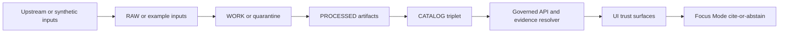
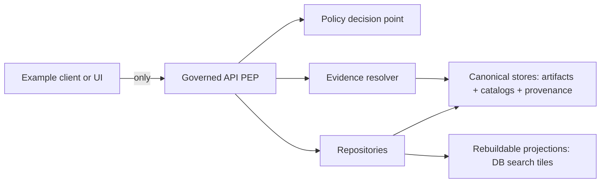

<!-- [KFM_META_BLOCK_V2]
doc_id: kfm://doc/677a9d0c-ca5d-4a30-be1e-f4bec92d976f
title: examples/ — Governed, Reproducible End-to-End Examples
type: standard
version: v3
status: draft
owners: KFM Maintainers (resolve via CODEOWNERS)
created: 2026-02-24
updated: 2026-03-01
policy_label: public
related:
  - ../README.md
  - ../CONTRIBUTING.md
  - ../SECURITY.md
  - ../contracts/README.md
  - ../configs/README.md
  - ../data/README.md
  - ../.github/README.md
tags:
  - kfm
  - examples
  - reproducibility
  - evidence-first
  - cite-or-abstain
notes:
  - Defines the directory contract for /examples with a default-deny posture.
  - Examples are small, policy-safe, and reproducible; they demonstrate trust surfaces and gates.
  - Adds policy-as-code PDP/PEP language and controlled vocabulary anchors (policy_label, citation.kind).
  - Aligns toy “promotion” gates with Promotion Contract naming and includes release/promotion manifest.
  - Clarifies EvidenceRef → EvidenceBundle resolution and hard citation gates for Story + Focus Mode examples.
[/KFM_META_BLOCK_V2] -->

<a id="top"></a>

# `examples/` — Governed, reproducible examples
**Purpose:** minimal, reproducible, *policy-safe* examples that demonstrate end-to-end KFM workflows  
**Status:** draft • **Owners:** resolve via CODEOWNERS • **Policy:** `public` (this README; individual examples may vary)


> [!IMPORTANT]
> `examples/` is the **sandbox of truth** — small enough to run locally, strict enough to survive CI.
>
> - Examples **MUST NOT** bypass governed APIs, policy checks, or evidence resolution.
> - Examples **MUST** be reproducible and emit evidence (receipts + checksums).
> - Examples **MUST** be safe under policy (default-deny; no sensitive leakage).
>
> If an example can’t be made safe to publish, it does not belong here.

---

## Quick navigation

- [Truth status legend](#truth-status-legend)
- [Normative language](#normative-language)
- [What this directory is](#what-this-directory-is)
- [Where it fits in the repo](#where-it-fits-in-the-repo)
- [Directory contract](#directory-contract)
- [Reality check](#reality-check)
- [Maintainer verification checklist](#maintainer-verification-checklist)
- [Quickstart](#quickstart)
- [Example package standard](#example-package-standard)
- [Evidence and provenance](#evidence-and-provenance)
- [Citations are EvidenceRefs](#citations-are-evidencerefs)
- [Data and safety rules](#data-and-safety-rules)
- [Policy labels and obligations](#policy-labels-and-obligations)
- [Controlled vocabularies](#controlled-vocabularies)
- [Policy-as-code architecture](#policy-as-code-architecture)
- [Promotion gates for example outputs](#promotion-gates-for-example-outputs)
- [Example registry](#example-registry)
- [Recommended layout](#recommended-layout)
- [CI gates](#ci-gates)
- [Contributing](#contributing)
- [Further reading](#further-reading)

---

## Truth status legend

This README uses explicit truth tags so it stays evidence-first and fail-closed:

- **CONFIRMED (docs):** invariants documented in KFM design/governance docs (truth path, trust membrane, cite-or-abstain)
- **PROPOSED:** a recommended template/pattern for this repo
- **UNKNOWN (repo):** not yet verified on this branch (includes minimum verification steps)

> [!NOTE]
> Treat all “runner commands” and “expected paths” as **PROPOSED** until your repo’s tooling is confirmed and linked.
> If you rename paths, update this README *and* the CI gates together.

<p align="right"><a href="#top">Back to top ↑</a></p>

---

## Normative language

This README uses RFC-style keywords:

- **MUST / MUST NOT** — required for compliance
- **SHOULD / SHOULD NOT** — strongly recommended
- **MAY** — optional

<p align="right"><a href="#top">Back to top ↑</a></p>

---

## What this directory is

This directory contains **minimal packages** that demonstrate one or more governed workflows:

- **Data → pipeline → validation → receipts/checksums**
- **Catalog/provenance concepts (DCAT/STAC/PROV) in miniature**
- **Governed API usage** (no direct DB or object-store access from clients)
- **UI trust surfaces** (EvidenceDrawer / ReceiptViewer behavior in sample form)
- **Focus Mode** behavior (cite-or-abstain) *only* with policy-safe, synthetic, or explicitly approved inputs

### How examples fit the system

> [!NOTE]
> This is a **toy-scale reference flow**. Examples are not an alternate production pipeline.



### Trust membrane reminder



> [!IMPORTANT]
> Examples demonstrate the **behavior**; they MUST NOT create backdoors around policy or provenance.
> Canonical dataset lifecycle lives under `data/` and is promoted via the Promotion Contract.

<p align="right"><a href="#top">Back to top ↑</a></p>

---

## Where it fits in the repo

Conceptually, `examples/` complements these repo surfaces:

- `data/` — canonical truth-path zones and promoted datasets (raw/work/processed/catalog/published)
- `contracts/` — canonical schemas and API contracts
- `configs/` — governed config inputs (specs, policy labels, thresholds)
- `.github/` — CI gates and CODEOWNERS routing

> [!NOTE]
> The directories above are referenced via `related:` in the MetaBlock. Treat their exact presence and layout as **UNKNOWN (repo)** until verified.

<p align="right"><a href="#top">Back to top ↑</a></p>

---

## Directory contract

### What belongs here

✅ Runnable examples that are **small**, **reproducible**, and **policy-safe**, demonstrating one primary claim.

✅ Synthetic or explicitly approved sample data **small enough to commit**, with license + sensitivity declared.

✅ Examples with:
- a single-command run step
- a deterministic verify step (or an explicit manual verification checklist)
- evidence outputs (run receipt + checksums)
- a clear policy posture (what is allowed, what is denied, what is generalized)

### What must not go here

🚫 Secrets, tokens, private keys, credentials, or real `.env` values  
🚫 Direct DB access or “storage fetch” that bypasses the governed API boundary  
🚫 Unlicensed or unclear-rights data, scraped content without explicit permission  
🚫 PII, sensitive locations, culturally restricted knowledge, or doxxable specifics  
🚫 Large artifacts (raw dumps, large rasters, model weights); use governed pointers + reproducible fetch scripts **only if allowed**

> [!WARNING]
> “It’s just an example” is not an exception. Examples are where unsafe patterns spread fastest.

<p align="right"><a href="#top">Back to top ↑</a></p>

---

## Reality check

Before enforcing or depending on anything in this README, verify the repo’s actual state:

```bash
# Confirm the directory exists and see what's currently there
ls -la examples || true
find examples -maxdepth 2 -type f -name 'README.md' -print 2>/dev/null

# If registry exists (PROPOSED), list it
ls -la examples/registry 2>/dev/null || true
```

If your repo uses a different location for runnable examples, update this README and the CI gates accordingly.

<p align="right"><a href="#top">Back to top ↑</a></p>

---

## Maintainer verification checklist

> [!IMPORTANT]
> This is a **minimum** checklist for maintainers to keep `examples/` aligned with real repo + CI posture.
> Treat failures as **fail-closed**: downgrade claims to PROPOSED/UNKNOWN until verified.

- [ ] Capture current commit and root tree (attach to PR): `git rev-parse HEAD` and `tree -L 3`
- [ ] Confirm required foundation exists (or is explicitly absent): `spec_hash`, policy pack/tests, validators/linkcheck, evidence resolver route, dataset registry schema
- [ ] Extract the merge-blocking CI gate list from `.github/workflows` and document what is required
- [ ] Choose 1 MVP dataset/example and ensure it can traverse gates with receipts + catalogs (toy-scale is acceptable)
- [ ] Validate UI cannot bypass the PEP and EvidenceRefs resolve end-to-end in Map Explorer and Story publishing
- [ ] Run Focus Mode evaluation harness and store golden outputs + diffs as build artifacts

<p align="right"><a href="#top">Back to top ↑</a></p>

---

## Quickstart

> [!NOTE]
> The commands below are **PROPOSED**. Replace them with repo-real targets once your tooling is confirmed.

1) List examples:
```bash
ls -1 examples
```

2) Read the example’s README:
```bash
cat examples/<example-id>/README.md
```

3) Run the example:
```bash
./examples/<example-id>/run.sh
```

4) Verify deterministically:
```bash
./examples/<example-id>/verify.sh
```

If an example can’t provide a `verify` script, it MUST clearly document:
- expected outputs (paths + stable shapes),
- validation criteria,
- what constitutes failure.

<p align="right"><a href="#top">Back to top ↑</a></p>

---

## Example package standard

Each example is a self-contained package under `examples/<example-id>/`.

### Naming convention

Use **kebab-case**. Prefix by category:

- `api-...` — governed API request/response patterns
- `pipe-...` — pipeline/validation/promotion demonstration (toy-scale)
- `ui-...` — UI trust flows (evidence drawer, receipts viewer)
- `focus-...` — Focus Mode cite-or-abstain (policy-safe only)
- `gov-...` — governance behaviors (labels, obligations, deny UX), with synthetic fixtures

Examples:
- `api-feature-query`
- `pipe-validate-and-promote-toy`
- `ui-evidence-drawer-minimal`
- `focus-cite-or-abstain-toy`
- `gov-policy-labels-obligations`

### Required files (minimum)

Every `examples/<example-id>/` MUST include:

- `README.md` — one-line purpose + steps + expected outputs + safety notes
- `kfm.example.yaml` — machine-readable manifest (inputs/outputs/licenses/sensitivity)
- `run.sh` — single-command runner (no secrets; safe defaults)
- `verify.sh` — deterministic verification (or a documented substitute)
- `evidence/run-receipt.json` — run receipt (policy-safe)
- `evidence/checksums.json` — input + output digests

### Recommended extras

- `src/` — minimal code / scripts
- `data/` — tiny inputs (synthetic or approved), **never** sensitive
- `outputs/` — expected normalized outputs (small, diff-friendly)
- `evidence/notes.md` — explanations, thresholds, and “why we trust it”
- `contracts/` — local copies of *example-level* schemas (NOT canonical contracts)

> [!TIP]
> If an example needs canonical schemas/contracts, reference them from `contracts/` rather than duplicating.

<p align="right"><a href="#top">Back to top ↑</a></p>

---

## Evidence and provenance

Each example MUST be able to answer:

1) **What ran?** (runner, versions, minimal environment)
2) **What inputs?** (license + sensitivity + checksums)
3) **What outputs?** (paths + checksums + stable shapes)
4) **What policy decisions?** (deny/allow + obligations such as generalization)
5) **What verification passed?** (checks + thresholds)

### Determinism and hashing expectations

- If you compute stable IDs from specs (e.g., `spec_hash`), you MUST use a canonicalization scheme and you MUST test for stability across OS/CI.
- Checksums MUST use deterministic ordering (no locale-dependent sorting).
- “Freshness” for examples SHOULD be treated as “last verified,” not “last edited.”

### `kfm.example.yaml` template (v1)

```yaml
# examples/<example-id>/kfm.example.yaml
kfm_example_manifest_version: "v1"

example_id: "<example-id>"
title: "<Short human title>"
summary: "<One paragraph describing the goal and the single primary claim this example demonstrates>"

owners:
  - "<team-or-person>"
status: "draft"   # draft | review | published

# MUST be from controlled vocabulary; see: Controlled vocabularies
policy_label: "public"  # public | public_generalized | restricted | restricted_sensitive_location | internal | embargoed | quarantine

tags:
  - "api"
  - "evidence"
  - "policy"

# Optional: helps CI preflight without running the world
citations_used:     # EvidenceRef schemes preferred; raw URLs discouraged
  - { ref: "dcat://...", kind: "dcat" }   # kind: dcat | stac | prov | doc | graph | url (discouraged)

inputs:
  - name: "<input-name>"
    path: "data/<file>"
    media_type: "<optional>"
    license: "<SPDX identifier or reference>"
    attribution: "<optional>"
    sensitivity: "public"   # public | restricted | ...
    checksum: "sha256:<...>"

outputs:
  - name: "<output-name>"
    path: "outputs/<file>"
    media_type: "<optional>"
    checksum: "sha256:<...>"

repro:
  run: "./run.sh"
  verify: "./verify.sh"

evidence:
  run_receipt: "evidence/run-receipt.json"
  checksums: "evidence/checksums.json"
  notes: "evidence/notes.md"

claims:
  - id: "claim-1"
    text: "<What a reviewer can conclude if verify passes>"
    evidence_paths:
      - "evidence/run-receipt.json"
      - "evidence/checksums.json"
      - "outputs/<file>"

depends_on: []
```

### Run receipt minimum fields

A policy-safe `evidence/run-receipt.json` SHOULD include:

- `kfm_run_receipt_version`
- `example_id`
- `run_id` (local opaque id acceptable)
- `git_commit` (if available)
- `environment` (tool versions; container digest if used)
- `inputs[]` (paths + digests)
- `outputs[]` (paths + digests)
- `checks[]` (pass/fail + thresholds)
- `policy` (decision id, policy label, obligations applied)
- `created_at` (allowed; avoid injecting nondeterminism into golden outputs)

> [!WARNING]
> Receipts must not record secrets, user identifiers, internal-only endpoints, or restricted dataset existence (unless policy allows acknowledging it).

<p align="right"><a href="#top">Back to top ↑</a></p>

---

## Citations are EvidenceRefs

In KFM, a “citation” is **not** a URL pasted into text. It is an **EvidenceRef** that must resolve—via the evidence resolver—into an **EvidenceBundle** that contains sufficient metadata, artifacts, and provenance to inspect the claim.

Requirements for `examples/`:
- Examples that make user-facing claims MUST emit EvidenceRefs (or equivalent IDs) and demonstrate how they resolve.
- “Verify” MUST fail if citations cannot be resolved or are policy-denied.
- When policy denies evidence, examples MUST fail closed (abstain, narrow scope, or show deny UX) without leaking restricted details.

### EvidenceRef kinds (starter)

Preferred `kind` values:
- `dcat` — dataset/distribution metadata
- `stac` — collections/items/assets
- `prov` — runs/lineage
- `doc` — governed docs (policy-safe)
- `graph` — entity relations (if enabled)
- `url` — **discouraged** (use resolvable schemes when possible)

> [!TIP]
> If you can’t call a real evidence resolver in CI, use a policy-safe local mock that preserves the same *allow/deny + obligation* semantics.

<p align="right"><a href="#top">Back to top ↑</a></p>

---

## Data and safety rules

Examples are **default-deny** when unclear:

- **License unknown?** Don’t include it. Use synthetic or approved data with explicit terms.
- **Sensitivity unknown?** Treat as restricted and exclude from public examples until reviewed.
- **Vulnerable locations?** No precise coordinates. Use generalized geometry or coarse regions.

### Allowed data patterns

✅ Synthetic fixtures (recommended)  
✅ Public-domain / permissive licensed samples with attribution  
✅ Toy extracts that cannot be re-identified and have explicit approval

### Disallowed data patterns

🚫 PII / PHI / private records  
🚫 Anything that enables targeting or harm  
🚫 Scraped data with unclear permission  
🚫 Precise coordinates for restricted-sensitive-location topics

### Rights: “metadata-only reference” is allowed

If rights do not allow mirroring, examples MAY demonstrate:
- cataloging an item (metadata) without embedding the media
- showing deny UX for downloads/exports
- requiring steward review before publish

> [!WARNING]
> Online availability is not permission. Rights and license are policy inputs.

<p align="right"><a href="#top">Back to top ↑</a></p>

---

## Policy labels and obligations

Policy labeling is a **gate input**. Examples MUST declare `policy_label` and MUST treat unknown classification as restricted.

Rules of thumb (fail closed):
- Default-deny for `restricted` and `restricted_sensitive_location`.
- If any public representation is allowed, produce a separate `public_generalized` output.
- Never leak restricted metadata in “not found” / “forbidden” UX or errors.
- Treat redaction/generalization as a first-class transform (record it in receipts and provenance outputs where applicable).

### Controlled vocabularies

Controlled vocabularies must be versioned and maintained (starter lists):

**`policy_label` (starter)**
- `public`
- `public_generalized`
- `restricted`
- `restricted_sensitive_location`
- `internal`
- `embargoed`
- `quarantine`

**`artifact.zone` (starter)**
- `raw`
- `work`
- `processed`
- `catalog`
- `published`

**`citation.kind` (starter)**
- `dcat`
- `stac`
- `prov`
- `doc`
- `graph`
- `url` (discouraged)

### Policy-as-code architecture

KFM requires the same policy semantics in CI and runtime (or at minimum the same fixtures and outcomes).

Recommended pattern:
- **PDP (Policy Decision Point):** OPA (in-process or sidecar).
- **PEPs (Policy Enforcement Points):**
  - CI: schema validation + policy tests block merges.
  - Runtime API: policy checks before serving data.
  - Evidence resolver: policy checks before resolving evidence and rendering bundles.
  - UI: policy badges and notices; **UI never makes policy decisions**.

<p align="right"><a href="#top">Back to top ↑</a></p>

---

## Promotion gates for example outputs

Some examples demonstrate the Promotion Contract. When they do, examples must show the **same gates**, at toy scale.

> [!NOTE]
> Gate *letters* vary across drafts; gate **names and required artifacts** are the stable part. This README uses names and provides an A–G ordering for convenience.

### Minimum gates before calling something “publishable” (toy)

| Gate | What must be present (toy) | Where in the example |
|---|---|---|
| A — Identity & versioning | stable identity; deterministic hashes where used; content digests | `kfm.example.yaml` + receipt + checksums |
| B — Licensing & rights metadata | license + attribution; optional upstream terms snapshot | `kfm.example.yaml` (+ `terms_snapshot.*` if used) |
| C — Sensitivity & obligations | `policy_label` + recorded obligations (generalization/redaction) | manifest + receipt `policy` + `evidence/notes.md` |
| D — Catalog triplet validation | DCAT/STAC/PROV validate and cross-link; EvidenceRefs resolve | `outputs/catalog/` + validators |
| E — QA & thresholds | explicit checks + thresholds + QA report | receipt `checks[]` (+ `evidence/qa_report.*`) |
| F — Run receipt & audit record | run receipt ties outputs to inputs + policy decisions | `evidence/run-receipt.json` (+ `audit-ref.*` if used) |
| G — Release/promotion manifest | release record references artifacts + digests + approvals | `outputs/**/promotion_manifest.json` (or equivalent) |

> [!NOTE]
> Examples may include “toy catalogs” (DCAT/STAC/PROV) for demonstration, but canonical catalog enforcement lives in `contracts/` + `data/`.

<p align="right"><a href="#top">Back to top ↑</a></p>

---

## Example registry

To scale safely, keep a machine-readable registry of examples.

> [!PROPOSED]
> `examples/registry/examples.v1.json` is the canonical index used by CI and humans.

Example registry shape (illustrative):

```json
{
  "kfm_example_registry_version": "v1",
  "updated": "2026-03-01",
  "examples": [
    {
      "example_id": "api-feature-query",
      "path": "examples/api-feature-query",
      "policy_label": "public",
      "tags": ["api", "evidence", "policy"],
      "owners": ["kfm-maintainers"],
      "run": "./run.sh",
      "verify": "./verify.sh"
    }
  ]
}
```

Registry Definition of Done:
- [ ] Every example directory has a matching registry entry
- [ ] Every entry includes `policy_label`, owners, and run/verify commands
- [ ] CI can select examples to run (by tag, by changed paths, or nightly batch)

<p align="right"><a href="#top">Back to top ↑</a></p>

---

## Recommended layout

> This layout is **PROPOSED**. Adopt it if the repo doesn’t already standardize a different pattern.

<details>
<summary><strong>Proposed directory tree (click to expand)</strong></summary>

```text
examples/                                         # End-to-end examples (small, reproducible, policy-safe)  (PROPOSED)
├─ README.md                                      # Directory contract + safety rules + how to run/verify
├─ .gitignore                                     # Ignore generated outputs + local logs (no secrets) (recommended)
├─ LICENSES/                                      # (Optional) example-level third-party notices (tiny, text-only)
│  └─ README.md                                   # How attribution is tracked for example inputs
│
├─ registry/                                      # Machine-readable registries + schemas + fixtures (small)
│  ├─ examples.v1.json                            # Canonical example registry (paths, owners, tags, run/verify)
│  ├─ examples.v1.schema.json                     # Schema for the registry itself (optional but recommended)
│  │
│  ├─ schemas/                                    # Schemas for example manifests + evidence artifacts
│  │  ├─ kfm.example.manifest.v1.schema.json      # Schema for kfm.example.yaml (manifest)
│  │  ├─ kfm.run_receipt.v1.schema.json           # Schema for evidence/run-receipt.json
│  │  ├─ kfm.checksums.v1.schema.json             # Schema for evidence/checksums.json
│  │  ├─ kfm.policy_summary.v1.schema.json        # (Optional) schema for evidence/policy-summary.json
│  │  └─ README.md                                # How schema versioning works for examples
│  │
│  └─ fixtures/                                   # CI validation fixtures (valid/invalid)
│     ├─ manifests/
│     │  ├─ valid/
│     │  │  ├─ minimal_public.yaml
│     │  │  ├─ with_outputs_and_claims.yaml
│     │  │  └─ with_dependencies.yaml
│     │  └─ invalid/
│     │     ├─ missing_license.yaml
│     │     ├─ missing_sensitivity.yaml
│     │     ├─ missing_verify.yaml
│     │     └─ non_deterministic_timestamps.yaml
│     ├─ receipts/
│     │  ├─ valid/
│     │  │  ├─ receipt_minimal.json
│     │  │  └─ receipt_with_policy_obligations.json
│     │  └─ invalid/
│     │     ├─ receipt_missing_digests.json
│     │     └─ receipt_contains_secret_like_value.json
│     ├─ checksums/
│     │  ├─ valid/
│     │  │  └─ checksums_minimal.json
│     │  └─ invalid/
│     │     └─ checksums_path_escape.json
│     └─ README.md                                # What fixtures prove + how CI uses them
│
├─ _shared/                                       # Shared tiny fixtures and helpers (optional, but high leverage)
│  ├─ README.md                                   # What shared assets exist + safety constraints
│  │
│  ├─ data/                                       # Tiny synthetic datasets (safe-by-default; NO sensitive coords)
│  │  ├─ toy_events.csv                           # Example time+place table (synthetic)
│  │  ├─ toy_points.geojson                       # Tiny GeoJSON points (synthetic; coarse extents)
│  │  ├─ toy_polygons.geojson                     # Tiny polygons (synthetic; no vulnerable sites)
│  │  ├─ toy_story/
│  │  │  ├─ story_text.md                         # Small narrative text (no claims without citations)
│  │  │  └─ citations.json                        # Example citations referencing toy evidence refs
│  │  └─ README.md                                # Data provenance + why it’s safe to publish
│  │
│  └─ scripts/                                    # Shared helper scripts (portable, policy-safe)
│     ├─ require_tools.sh                         # Checks required CLIs exist (jq, curl, etc.) (optional)
│     ├─ hash_tree.sh                             # Computes sha256 digests for a folder (deterministic ordering)
│     ├─ normalize_json.sh                        # Canonicalizes JSON for diffs (sort keys, strip volatile fields)
│     ├─ normalize_geojson.sh                     # Normalizes GeoJSON (ordering, precision) for diffs
│     ├─ redact_logs.sh                           # Scrubs obvious secrets/PII patterns from logs (best-effort)
│     ├─ assert_no_secrets.sh                     # Fails if secrets-like patterns found in tracked files
│     ├─ assert_no_sensitive_coords.sh            # Fails if restricted coord patterns appear in public examples
│     └─ README.md                                # Script contracts + expected outputs
│
├─ api-feature-query/                             # Example: use governed API + evidence resolver (NO bypass)
│  ├─ README.md
│  ├─ kfm.example.yaml
│  ├─ run.sh
│  ├─ verify.sh
│  ├─ src/
│  ├─ data/
│  ├─ outputs/
│  └─ evidence/
│
├─ pipe-validate-and-promote-toy/                 # Example: toy pipeline → QA → promotion artifacts (no prod publish)
│  ├─ README.md
│  ├─ kfm.example.yaml
│  ├─ run.sh
│  ├─ verify.sh
│  ├─ src/
│  ├─ data/
│  ├─ outputs/
│  └─ evidence/
│
└─ ui-story-node-minimal/                         # Example: minimal Story Node + view_state + citations
   ├─ README.md
   ├─ kfm.example.yaml
   ├─ run.sh
   ├─ verify.sh
   ├─ src/
   ├─ outputs/
   └─ evidence/
```

</details>

<p align="right"><a href="#top">Back to top ↑</a></p>

---

## CI gates

Examples are only valuable if they don’t rot. Treat example validation as merge gates.

Recommended CI checks (PROPOSED):
- **Example manifest lint:** validate `kfm.example.yaml` shape + controlled vocab use
- **Policy fixture tests:** validate allow/deny + obligations using the same policy semantics as runtime
- **Secret scan:** block secrets in examples (scripts, docs, receipts)
- **Size limits:** block large files and accidental binaries
- **License/sensitivity lint:** require license + sensitivity for all inputs
- **Catalog validators + linkcheck:** validate DCAT/STAC/PROV + cross-links
- **Evidence resolution lint:** fail if EvidenceRefs can’t resolve (mock or real)
- **Run + verify:** run selected examples and enforce verify success
- **Focus eval harness (if present):** golden queries; merge blocked on regressions
- **Anti-skip gate summary:** final job fails if required example gates didn’t run

> [!IMPORTANT]
> Anti-skip rule: required gates must not be bypassable via path filters or `if:` conditions.
> Prefer a “gate summary” check as the required status check.

<p align="right"><a href="#top">Back to top ↑</a></p>

---

## Contributing

1. Copy an existing example and change one thing at a time.
2. Keep data tiny and safe; prefer synthetic fixtures.
3. Add deterministic verify rules and normalize outputs.
4. Emit receipts + checksums.
5. Add your example to the Example Registry (if used).
6. Keep the example focused on **one primary claim**.

Review expectations:
- Examples that touch policy boundaries (deny UX, obligations, generalization) should route to governance owners.
- Examples that introduce dependencies must justify them and include lockfile changes where applicable.

<p align="right"><a href="#top">Back to top ↑</a></p>

---

## Further reading

- Root README for system overview and invariants
- `contracts/` for schema/contract surfaces
- `configs/` for governed configuration inputs
- `data/` for the canonical truth path zones
- `.github/` for CI gates, required checks, and CODEOWNERS routing

<p align="right"><a href="#top">Back to top ↑</a></p>
