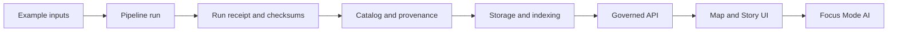

<!-- [KFM_META_BLOCK_V2]
doc_id: kfm://doc/677a9d0c-ca5d-4a30-be1e-f4bec92d976f
title: Examples
type: standard
version: v1
status: draft
owners: KFM Maintainers (TODO: set owning team)
created: 2026-02-24
updated: 2026-02-24
policy_label: public
related:
  - TODO: ../README.md
  - TODO: ../docs/ (governance + architecture)
tags: [kfm, examples]
notes:
  - This file defines the contract for content under /examples.
  - It is intentionally conservative: examples must be reproducible and policy-safe by default.
[/KFM_META_BLOCK_V2] -->

# Examples

**Purpose:** Minimal, reproducible, *governed* examples that demonstrate end-to-end KFM workflows  
**Status:** Draft · **Owners:** KFM Maintainers (TODO) · **Policy:** Public (this README)


---

## Quick navigation

- [What this directory is](#what-this-directory-is)
- [Directory contract](#directory-contract)
- [Quickstart](#quickstart)
- [Example package standard](#example-package-standard)
- [Evidence and provenance](#evidence-and-provenance)
- [Data and safety rules](#data-and-safety-rules)
- [Promotion gates for example outputs](#promotion-gates-for-example-outputs)
- [Recommended layout](#recommended-layout)
- [Contributing](#contributing)
- [Further reading](#further-reading)

---

## What this directory is

This directory is the **sandbox of truth**: every example is expected to be small enough to run locally, but strict enough to:
- demonstrate the **policy boundary** (no direct DB hits; go through governed APIs),
- emit **traceable evidence** (inputs → transforms → outputs),
- survive review and CI (deterministic, reversible, and auditable).

> NOTE  
> If an example can’t be made safe to publish, it doesn’t belong here. Put it in a restricted area (path TBD) and link to it from governance docs instead.

### How examples fit the system



[Back to top](#examples)

---

## Directory contract

### What belongs here

✅ **Runnable, minimal** examples that demonstrate one or more of:
- **Data → pipeline → catalog/provenance → storage/index → governed API → UI**
- API usage patterns (requests + responses) *without secrets*
- Validation patterns (schema checks, QA thresholds, redaction behavior)
- UI “Story Node” examples (small, self-contained)

✅ **Synthetic or policy-approved** sample data, *small* enough to commit.

✅ **Documentation-first** examples: someone should be able to understand the goal by reading `examples/<example>/README.md`.

### What must not go here

🚫 Anything that breaks the trust membrane:
- secrets, tokens, private keys, credentials, `.env` with real values
- direct DB access snippets that bypass the governed API boundary
- “works on my machine” examples with undocumented prerequisites

🚫 Anything that violates governance:
- unlicensed datasets or unclear provenance
- personal data, sensitive locations, culturally restricted knowledge
- exact coordinates for vulnerable sites (use coarse geography instead)

🚫 Large artifacts:
- raw data dumps, large rasters, huge model weights, etc.  
  (Use pointers + reproducible download scripts in a governed way, if allowed.)

[Back to top](#examples)

---

## Quickstart

> This section intentionally uses placeholders. Replace the commands once the repo’s actual tooling is confirmed.

1) **List examples**
```bash
ls -1 examples
```

2) **Pick one and read its README**
```bash
cat examples/<example-id>/README.md
```

3) **Run**
```bash
# TODO: replace with actual runner (make, task, npm, uv, poetry, etc.)
./examples/<example-id>/run.sh
```

4) **Verify**
```bash
# TODO: example should define a deterministic verify step
./examples/<example-id>/verify.sh
```

If an example cannot provide a `verify` step, it **must** clearly document:
- what outputs to expect,
- how to validate them,
- what constitutes failure.

[Back to top](#examples)

---

## Example package standard

Every example lives under its own directory:

- `examples/<example-id>/README.md` (human intent + steps)
- `examples/<example-id>/kfm.example.yaml` (machine-readable metadata)
- `examples/<example-id>/src/` (code, configs, notebooks)
- `examples/<example-id>/data/` (small inputs; synthetic or approved)
- `examples/<example-id>/outputs/` (small, checked-in expected outputs when feasible)
- `examples/<example-id>/evidence/` (run receipts, checksums, screenshots)

### Naming convention

Use **kebab-case** and scope to the primary domain:

- `api-...` (API request/response examples)
- `pipe-...` (pipeline execution examples)
- `ui-...` (UI / story examples)
- `gov-...` (policy + governance behavior examples)
- `data-...` (dataset packaging / validation examples)

Examples:
- `api-feature-query`
- `pipe-validate-and-publish`
- `ui-story-node-minimal`

### `kfm.example.yaml` template

```yaml
# examples/<example-id>/kfm.example.yaml
example_id: "<example-id>"
title: "<Short human title>"
summary: "<One paragraph describing the goal and the claim this example demonstrates>"

owners:
  - "<team-or-person>"
status: "draft"   # draft | review | published
policy_label: "public"  # public | restricted | ...

inputs:
  - name: "<input-name>"
    path: "data/<file>"
    license: "<SPDX identifier or reference>"
    sensitivity: "<public|restricted|...>"
    checksum: "<sha256:...>"

outputs:
  - name: "<output-name>"
    path: "outputs/<file>"
    checksum: "<sha256:...>"

repro:
  # One command that runs end-to-end.
  run: "./run.sh"
  verify: "./verify.sh"

evidence:
  receipt: "evidence/run-receipt.json"
  notes: "evidence/notes.md"

claims:
  - id: "claim-1"
    text: "<What a user can conclude if the example passes verify>"
    evidence_paths:
      - "evidence/run-receipt.json"
      - "outputs/<file>"

depends_on:
  - "<optional: other examples or shared fixtures>"

notes:
  - "TODO: anything reviewers should know"
```

> TIP  
> Keep `kfm.example.yaml` **diff-friendly**: stable ordering, explicit checksums, no generated timestamps unless required.

[Back to top](#examples)

---

## Evidence and provenance

Every example must be able to answer:

1) **What did we run?** (command, tool versions, environment)
2) **What did we use?** (inputs + licenses + sensitivity)
3) **What changed?** (outputs + checksums)
4) **Why should we trust it?** (validation results + policy decisions)

### Minimum “run receipt” fields

A good `evidence/run-receipt.json` includes:

- `example_id`
- `git_commit` (or “not available” for local-only runs)
- `runner` (script/CLI invoked)
- `started_at`, `finished_at` (optional for determinism; keep out of golden files)
- `inputs[]` with checksums
- `outputs[]` with checksums
- `validation[]` results (pass/fail + thresholds)
- `policy_decisions[]` (redactions, access rules applied)

> WARNING  
> Do not record secrets, access tokens, internal URLs, or user identifiers in receipts.

[Back to top](#examples)

---

## Data and safety rules

Examples **default-deny** when unclear:

- **License unknown?** Don’t include the data. Use synthetic data or an approved dataset with explicit license terms.
- **Sensitivity unknown?** Treat as restricted and exclude from public examples until reviewed.
- **Vulnerable locations?** No precise coordinates. Use generalized areas.

### Allowed data patterns

✅ Synthetic fixtures (recommended)  
✅ Public-domain / permissively licensed samples with attribution  
✅ “Toy” extracts that can’t be re-identified and have explicit approval

### Disallowed data patterns

🚫 PII / PHI / student records / customer records  
🚫 Anything that enables targeting or harm  
🚫 Scraped data with unclear permission

[Back to top](#examples)

---

## Promotion gates for example outputs

Examples may demonstrate the KFM data lifecycle. When they do, examples **must** show the required artifacts for promotion:

Raw → Work or Quarantine → Processed → Published

### Minimum artifacts before “Published”

| Artifact | Why it matters | Where to put it |
|---|---|---|
| Metadata (identity, schema, extents) | discovery + interoperability | `kfm.example.yaml` + `evidence/` |
| License + attribution | legal + ethical use | `kfm.example.yaml` |
| Sensitivity label + redaction notes | trust + harm reduction | `kfm.example.yaml` + `evidence/notes.md` |
| Validation results + thresholds | correctness gate | `evidence/run-receipt.json` |
| Provenance links | traceable claims | `evidence/run-receipt.json` |
| Checksums | integrity and rollback | `kfm.example.yaml` + receipt |

### Definition of Done checklist

- [ ] Runs end-to-end from a clean checkout (documented prerequisites)
- [ ] Has deterministic verify step (or a clearly documented manual validation)
- [ ] Includes `kfm.example.yaml` with license + sensitivity for every input
- [ ] Emits a run receipt with checksums for inputs + outputs
- [ ] Does not include secrets or restricted data
- [ ] Does not bypass governed APIs or policy boundaries
- [ ] Includes enough narrative for a reviewer to understand the claim

[Back to top](#examples)

---

## Recommended layout

> Not confirmed in repo: this is the **recommended** structure for scaling examples.

```text
examples/
  README.md
  api-feature-query/
    README.md
    kfm.example.yaml
    src/
    data/
    outputs/
    evidence/
  pipe-validate-and-publish/
    README.md
    kfm.example.yaml
    src/
    data/
    outputs/
    evidence/
  ui-story-node-minimal/
    README.md
    kfm.example.yaml
    src/
    outputs/
    evidence/
```

If you add new top-level categories, update this README and keep them **few and obvious**.

[Back to top](#examples)

---

## Contributing

1. Copy the template structure above.
2. Keep inputs small; prefer synthetic fixtures.
3. Add a `verify` step that can run in CI.
4. Add or update evidence outputs.
5. Make sure the example demonstrates exactly one primary claim.

### Review expectations

- Examples that touch policy boundaries (redaction, access) should be reviewed by governance owners.
- Examples that introduce new dependencies should justify them and include lockfiles.

[Back to top](#examples)

---

## Further reading

This repo ships with a bundled reference library (path TBD). If you’re looking for background material:
- Git workflows and collaboration
- Webpack/React build patterns
- Data analytics lifecycles and validation
- Data acquisition and signal/noise concepts (useful for QA/measurement thinking)

See the **Project Library Index** for a navigable list of PDFs.

[Back to top](#examples)
