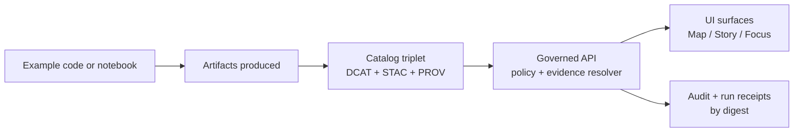

# Examples — Kansas Frontier Matrix (KFM)
Runnable, **governed** examples that demonstrate KFM’s end-to-end flow: **data → catalogs/provenance → governed APIs → Map/Story/Focus UI**.

**Status:** Draft (vNext)  
**Owners:** _TODO: add GitHub handles / CODEOWNERS path_  
**Last reviewed:** _TODO: YYYY-MM-DD_

<!-- Replace ORG/REPO + workflow filenames with real values if/when you add badges. -->
<!-- Badges are intentionally optional here; keep them accurate if you enable them. -->
[](#)
[](#)
[](#)

**Quick nav:**  
- [What belongs in `examples/`](#what-belongs-in-examples)  
- [How to run an example](#how-to-run-an-example)  
- [Example contract](#example-contract)  
- [Governance invariants](#governance-invariants)  
- [Adding a new example](#adding-a-new-example)  
- [Definition of Done](#definition-of-done)  
- [Troubleshooting](#troubleshooting)

---

## What belongs in `examples/`

This folder is the **canonical place for runnable demonstrations** that:
- prove a **thin slice** works end-to-end (contracts → validation → provenance → policy → UI), and
- are safe to run locally or in CI using **fixtures** by default.

Examples may cover (non-exhaustive):
- **Pipelines:** fetch/snapshot → normalize/QA → publishable artifacts
- **Catalog triplet:** DCAT + STAC + PROV generation and validation
- **Policy gates:** default-deny behaviors, license allow/deny, sensitivity/redaction checks
- **Governed API:** dataset discovery, evidence resolution, story/focus endpoints
- **UI primitives:** map layer rendering, time filters, story nodes, evidence drawer
- **Focus Mode harnesses:** cite-or-abstain behaviors, regression tests, golden queries

> NOTE  
> If an “example” needs access to restricted data, private services, or credentials, it is **not** an example by default. It should live under a controlled path and be treated as a governed integration test.

---

## How to run an example

Because repo tooling evolves, **each example MUST be self-documenting**:
1. `cd examples/<example-id>/`
2. Read `examples/<example-id>/README.md`
3. Run the exact commands listed there.

Recommended structure for example READMEs:
- **Prereqs** (runtime, container tools, env vars)
- **Inputs** (fixtures vs real data; licenses)
- **Commands** (copy-paste)
- **Outputs** (where artifacts end up; expected checksums if relevant)
- **Verification** (tests or validators to run)

---

## Example contract

Every example folder MUST include:

- `README.md` — how to run it + what success looks like
- `LICENSES/` or `LICENSE.md` notes for any bundled fixtures (when applicable)
- `fixtures/` — synthetic or public-safe test inputs (default)
- `expected/` — expected outputs or checks (when stable)
- `tests/` (or a documented validation command) — so CI can verify behavior

Strongly recommended:
- `run.sh` (or `Makefile`) — one-command entrypoint
- `manifest.json` or `example.yml` — machine-readable metadata (for future listing/automation)
- `prov/` — example run receipt output (or a pointer to the repo-wide run receipt location)

### Suggested example folder layout

```text
examples/
  README.md                  # (this file)
  <example-id>/
    README.md
    fixtures/
    src/                      # scripts/notebooks/code for the example
    expected/                 # stable expected outputs (optional)
    tests/                    # unit/contract tests (recommended)
```

---

## Architecture map for examples



---

## Governance invariants

Examples are not “toy code” — they are **reference implementations** of KFM’s governance posture.

### 1) Truth path zones (lifecycle)

Examples SHOULD demonstrate (or at least respect) KFM’s lifecycle zones:

- **RAW**: immutable acquisition (what was fetched, from where, under what terms) + checksums  
- **WORK / QUARANTINE**: normalization, QA, candidate redactions; quarantine for failed validation/unclear licensing/sensitivity concerns  
- **PROCESSED**: publishable artifacts + checksums + derived runtime metadata  
- **CATALOG/TRIPLET**: DCAT + STAC + PROV cross-links (the interoperability/evidence surface)  
- **PUBLISHED**: runtime surfaces may only serve promoted versions with processed artifacts, validated catalogs, run receipts, and policy labels

> WARNING  
> Do not write examples that “skip the truth path” by editing RAW or bypassing promotion/validation steps.

### 2) Promotion Contract mindset (fail-closed)

If an example claims something is “publishable”, it MUST show (or simulate) minimum gates:
- identity/versioning
- licensing/rights metadata
- sensitivity classification + redaction plan
- catalog triplet validation
- run receipts + checksums
- policy + contract tests

### 3) Trust membrane (no direct DB/storage access)

Examples that touch the UI or API MUST respect the trust membrane:
- clients/UI do **not** talk directly to storage/DB
- access flows through the **governed API** where policy/evidence/versioning are enforced consistently

### 4) Cite-or-abstain behaviors (Focus Mode & narrative)

If an example includes Focus Mode behavior, it MUST:
- provide **resolvable citations**, or
- **abstain** (and explain why in policy-safe terms)

---

## Example registry

Fill this table in as you add examples (it’s intentionally empty to avoid inventing repo state):

| Example ID | Demonstrates | Default inputs | Outputs | Owner |
|---|---|---|---|---|
| _TBD_ | _TBD_ | fixtures | _TBD_ | _TBD_ |

---

## Adding a new example

1. Create a new folder: `examples/<example-id>/`
2. Add `README.md` with:
   - prerequisites
   - commands
   - expected outputs + validation steps
3. Prefer **fixtures/synthetic data**. If you must reference real sources:
   - do **not** vendor restricted data into git
   - document licensing/terms + sensitivity posture
4. Add validations/tests so CI can run it.
5. If the example produces artifacts, emit (or mock) a **run receipt** and checksums.

---

## Definition of Done

- [ ] Example is runnable from a clean checkout using the documented steps
- [ ] Default path uses fixtures/synthetic or public-safe data
- [ ] Licenses/terms are recorded for any fixture content
- [ ] Outputs are deterministic enough to validate (or explicitly non-deterministic with a safe check)
- [ ] Catalog/provenance validation is included when relevant (DCAT/STAC/PROV)
- [ ] No policy bypasses (no direct storage/DB calls from “client” code)
- [ ] If Focus Mode is involved: cite-or-abstain is demonstrated + tested

---

## Troubleshooting

- **Example fails in CI but works locally:** check pinned tool versions and environment parity.
- **Catalog validation fails:** ensure DCAT/STAC/PROV cross-links are correct and artifacts have digests.
- **Policy blocks publication:** treat this as success; update metadata/labels/redaction plan rather than weakening the gate.

---

<sub>Back to top: <a href="#examples--kansas-frontier-matrix-kfm">↑</a></sub>
