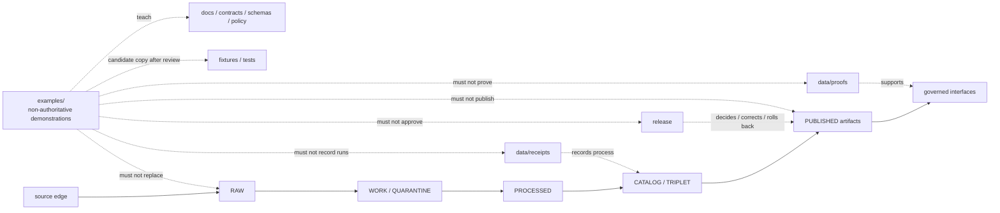

<!-- [KFM_META_BLOCK_V2]
doc_id: kfm://doc/examples/readme
title: examples/ — Governed Worked-Example Root
type: readme; root-readme; canonical-examples-root; non-authoritative-demonstration-boundary; bounded-inventory
version: v0.3.0
status: "draft; repository-grounded; canonical-root-confirmed; non-authoritative; static-example-heavy; runnable-status-unverified; examples-validation-unestablished; no-public-authority"
owners: "OWNER_TBD — Examples steward · Docs steward · Evidence/proof steward · Source/receipt steward · Policy/sensitivity reviewer · Release/correction/rollback steward · UI/API/map/story steward · Applicable domain stewards"
created: "NEEDS VERIFICATION — a short root README existed before the 2026-06-30 v0.2.0 expansion"
updated: 2026-07-23
supersedes: v0.2.0 examples root README at the same path
prepared_under_prompt: KFM Markdown Engineering, Modernization & GitHub Documentation Implementation Agent v5.0.0
policy_label: "public-review; examples-root; non-authoritative; synthetic-first; fail-closed; no-direct-public-path; no-release-authority; cite-or-abstain; correction-aware; rollback-aware"
current_path: examples/README.md
truth_posture: >
  CONFIRMED existing examples root README and stable document identity; Directory Rules v1.4
  canonical examples responsibility root and mandatory folder-README order; current CONTRIBUTING
  placement rule for worked runnable examples; eight direct child README lanes and three concrete
  Markdown walkthroughs at the pinned revision; child-lane non-authority contracts; default
  CODEOWNERS review route; Makefile validation scope; and documentation build, link, and
  accessibility readiness holds / PROPOSED example maturity vocabulary, admission contract,
  runnable-example packet, examples-to-fixtures graduation path, and future examples validator /
  CONFLICTED the root's worked-runnable purpose versus the bounded inventory's mainly static
  Markdown character; focus-flow naming versus any future area-scoped Focus Mode example
  convention; and settlements-infrastructure versus settlement segment usage in adjacent roots /
  UNKNOWN exhaustive recursive inventory, executable entrypoints, dependency closure, no-network
  reproducibility, runtime parity, external consumers, third-party sample licensing, and public
  effects / NEEDS VERIFICATION accountable owners, dedicated review routing, accepted example
  schema, examples-specific validator and CI lane, link checker, host rendering, accessibility
  execution, stale-example policy, correction propagation, and retirement drills
evidence_snapshot:
  repository: bartytime4life/Kansas-Frontier-Matrix
  repository_id: "1059091169"
  visibility: public
  base_ref: main
  base_commit: f7826223ae7c443647aae2206fb27e1e37d71d9d
  prior_blob: fdba59b94997066c200a673fdaa286a3850450ac
  directory_rules_blob: 2affb080e6f0043867c64c7f06c1ca52030fbd55
  contributing_blob: 935f8bbefd8f966275887c9f58277746b9c67c28
  codeowners_blob: dd2a84aa514d8ecd9208bc347f90f9a2ed37dd61
  makefile_blob: 51537af34ee065c2de571134688415042b83b22a
  docs_build_workflow_blob: 202360a8bee431b50633e78c442cc70ca939206a
  link_check_workflow_blob: c91477f6a6da84203e61b3151076eb46b3a65941
  accessibility_workflow_blob: 3b2fc53fb686bfd8c2628e01e77c067857460c78
  bounded_direct_readme_lanes: "8"
  bounded_concrete_walkthroughs: "3"
  overlap_preflight: "no open pull request or matching examples modernization branch surfaced in bounded GitHub search before authoring"
  inventory_method: exact GitHub file reads plus bounded pull-request, branch, and exact-path probes; no recursive git tree, local checkout, example execution, deployment, or runtime was inspected
related:
  - ../README.md
  - ../CONTRIBUTING.md
  - ../docs/doctrine/directory-rules.md
  - ../docs/doctrine/trust-membrane.md
  - ../docs/doctrine/lifecycle-law.md
  - ../docs/adr/INDEX.md
  - ../.github/CODEOWNERS
  - ../.github/workflows/docs-build.yml
  - ../.github/workflows/link-check.yml
  - ../.github/workflows/accessibility.yml
  - ../Makefile
  - ../fixtures/README.md
  - ../tests/README.md
  - ../tools/README.md
  - ../contracts/README.md
  - ../schemas/README.md
  - ../policy/README.md
  - ../data/README.md
  - ../data/proofs/README.md
  - ../data/receipts/README.md
  - ../data/published/README.md
  - ../release/README.md
  - evidence_bundles/README.md
  - focus_flows/README.md
  - focus_flows/hydrology_huc12_question.md
  - habitat/README.md
  - ingest_receipts/README.md
  - settlements-infrastructure/README.md
  - source_intake/README.md
  - source_intake/usgs_nwis_walkthrough.md
  - story_decks/README.md
  - story_decks/kansas_drought_2012.md
  - viewer_styles/README.md
tags: [kfm, examples, worked-examples, walkthroughs, synthetic, non-authoritative, review-aids, runnable-examples, negative-states, finite-outcomes, source-intake, receipts, evidence-bundles, focus-flows, habitat, settlements-infrastructure, story-decks, viewer-styles, validation, correction, rollback]
notes:
  - "v0.3.0 is a same-path, no-loss modernization of the existing examples root contract."
  - "The first twelve H2 sections follow Directory Rules section 15 exactly."
  - "The bounded inventory proves static Markdown lanes and walkthroughs, not runnable packages or runtime parity."
  - "This README does not create an example schema, validator, fixture, test, release object, public route, or publication state."
[/KFM_META_BLOCK_V2] -->

<a id="top"></a>

# `examples/` — Governed Worked-Example Root

[](#status)
[](#authority-level)
[](#authority-level)
[](#current-bounded-inventory)
[](#validation)
[](#what-does-not-belong-here)
[](#example-contract)

> **One-line purpose.** `examples/` holds small, reviewable, preferably synthetic worked examples that demonstrate KFM contracts, flows, failure states, and trust boundaries without becoming source truth, test authority, runtime behavior, release authority, or published content.

**Quick navigation:** [Purpose](#purpose) · [Authority](#authority-level) · [Status](#status) · [Belongs](#what-belongs-here) · [Does not belong](#what-does-not-belong-here) · [Inputs](#inputs) · [Outputs](#outputs) · [Validation](#validation) · [Review](#review-burden) · [Related roots](#related-folders) · [ADRs](#adrs) · [Last reviewed](#last-reviewed) · [Inventory](#current-bounded-inventory) · [Maturity](#example-maturity-model) · [Contract](#example-contract) · [Lifecycle](#lifecycle-and-trust-membrane-relationship) · [Crosswalk](#operational-home-crosswalk) · [Safety](#sensitive-data-and-safety-posture) · [Maintenance](#maintenance-correction-and-rollback) · [Verification](#open-verification-register) · [Evidence](#evidence-ledger) · [No-loss](#v020-to-v030-no-loss-ledger) · [Summary](#status-summary)

> [!IMPORTANT]
> `examples/` is canonical **for examples**, not for the things an example depicts. A polished example, parseable payload, merged pull request, successful screenshot, or persuasive walkthrough does not establish source authority, evidence closure, policy permission, test coverage, runtime behavior, release approval, or KFM publication.

> [!WARNING]
> The bounded inventory is primarily static Markdown. No repository-owned examples runner, dependency closure, examples-specific validator, deterministic smoke suite, or runtime-parity proof was established in this review. Do not label the current tree “runnable” merely because Directory Rules permits worked runnable examples in this root.

> [!CAUTION]
> Examples must not become a side door around the trust membrane. Public clients and ordinary UI surfaces remain downstream of governed interfaces and released public-safe artifacts; examples must not read RAW, WORK, QUARANTINE, candidate, canonical, proof, receipt, registry, model-runtime, or other internal stores as a normal public path.

---

## Purpose

`examples/` is the KFM responsibility root for worked demonstrations, walkthroughs, review aids, and deliberately bounded example assemblies.

A useful example should show at least one of the following:

- the smallest understandable success path;
- a negative path such as `ABSTAIN`, `DENY`, `ERROR`, `HOLD`, or `QUARANTINE`;
- the distinction between illustrative shape and operational authority;
- the relationship between an example and the correct contract, schema, policy, fixture, test, app, package, data, proof, receipt, or release home;
- how source role, evidence, rights, sensitivity, review, release, correction, and rollback remain visible where material.

Examples make doctrine inspectable. They become harmful when readers cannot tell where illustration ends and governed behavior begins.

[Back to top](#top)

---

<a id="authority-posture"></a>

## Authority level

| Surface | Authority posture |
|---|---|
| `examples/` root | **Canonical responsibility root for examples.** |
| Example content | **Non-authoritative demonstration.** |
| Operational meaning | Owned by `contracts/`, schemas, policy, implementation, tests, lifecycle records, proofs, and release records—not by this root. |
| Public truth | Denied by placement. An example must never become an uncited public claim. |
| Test/fixture status | Not automatic. Graduation requires a separate accepted copy or move under the verified test/fixture strategy. |
| Release/publication status | None. Examples cannot approve release or become `PUBLISHED` by being committed. |

Examples may quote or mirror a bounded shape for teaching, but they must point back to the owning authority and must not evolve as a competing source of truth.

[Back to top](#top)

---

<a id="status-notes"></a>

## Status

| Finding | Truth status | Current bounded result |
|---|---:|---|
| Root path and README | `CONFIRMED` | `examples/README.md` exists with stable `kfm://doc/examples/readme` identity. |
| Direct child README lanes | `CONFIRMED BOUNDED` | Eight lanes were read at the pinned revision. |
| Concrete walkthrough documents | `CONFIRMED BOUNDED` | Three substantive Markdown walkthroughs were read. |
| Runnable example packages | `UNKNOWN` | No accepted entrypoint, manifest, lock, dependency closure, run log, or smoke result was established. |
| Examples-specific validation | `NEEDS VERIFICATION` | No accepted examples validator, test lane, fixture corpus, or workflow was found at checked paths. |
| Docs build, link check, accessibility | `WORKFLOW_HOLD` | Current workflows are readiness holds, not render, link, axe, or keyboard passes. |
| Dedicated review route | `NEEDS VERIFICATION` | CODEOWNERS falls back to `@bartytime4life`; no explicit `/examples/` rule was found. |
| Recursive inventory and consumers | `UNKNOWN` | No recursive tree or deployed consumer inventory was inspected. |
| Public release readiness | `DENY` | Example placement never proves release or publication. |

### Known tensions

- Directory Rules and `CONTRIBUTING.md` describe `examples/` as the home for worked, runnable patterns, while the verified inventory is chiefly Markdown guidance and synthetic walkthroughs.
- `examples/focus_flows/` is verified, but no `examples/focus-modes/README.md` or `examples/focus_modes/README.md` was found at the checked paths. A future area-scoped convention must not be invented by this README.
- `settlements-infrastructure` and `settlement` remain inconsistent across adjacent domain/proof/receipt surfaces; examples do not settle that ADR-class question.

[Back to top](#top)

---

<a id="accepted-material"></a>

## What belongs here

Accepted material is small, inspectable, deterministic where practical, synthetic or safely redacted, and visibly marked as an example.

| Material | Required posture |
|---|---|
| Worked walkthroughs | State scenario, assumptions, expected outcome, operational home, and non-goals. |
| Minimal payload sketches | Include visible example markers and synthetic identifiers. |
| Negative-state examples | Use finite outcomes and reason codes without leaking restricted detail. |
| Example configuration or code | Include an entrypoint, dependency boundary, expected output, cleanup, and failure behavior before being called runnable. |
| Example EvidenceRef/EvidenceBundle relationships | Illustrative only; proof support remains under `data/proofs/`. |
| Source-intake and receipt sketches | Illustrative only; source and process authority remain in registry, connectors, RAW/QUARANTINE, and receipts. |
| UI, story, Focus, map, or style examples | Show governed inputs and trust-visible states; never normalize internal-store reads or style-as-policy. |
| Domain examples | Preserve owning-domain source roles and sensitivity boundaries. |
| Local README files | Define scope, accepted material, exclusions, validation, correction, retirement, and evidence limits. |

Recommended structured marker:

```json
{
  "example": true,
  "authority": "non_authoritative_example",
  "do_not_publish": true,
  "example_id": "kfm://example/NEEDS-VERIFICATION",
  "expected_outcome": "ABSTAIN",
  "reason": "illustrative example; operational evidence and behavior remain unverified"
}
```

[Back to top](#top)

---

<a id="exclusions"></a>

## What does NOT belong here

| Do not place here | Correct home or action |
|---|---|
| RAW source payloads, downloads, API dumps, scans, rasters, vectors, or source mirrors | `data/raw/`, `data/work/`, or `data/quarantine/` according to state |
| Processed data, catalog records, triplets, graph exports, release candidates | The corresponding `data/` phase or `release/candidates/` |
| EvidenceBundles, ProofPacks, validation reports, citation-validation records | `data/proofs/` |
| Run, ingest, transform, validation, AI, telemetry, correction, rollback, or render receipts | `data/receipts/` |
| Published PMTiles, GeoParquet, GeoJSON, COGs, API payloads, stories, reports, or downloads | `data/published/` after release gates close |
| ReleaseManifest, PromotionDecision, CorrectionNotice, WithdrawalNotice, RollbackCard, signatures, release changelog | `release/` |
| SourceDescriptors, source activation decisions, source registry records | `data/registry/`, `control_plane/`, or the accepted registry home |
| Contracts, schemas, policy, validators, tests, fixtures, apps, packages, pipelines, connectors, workflows | Their canonical responsibility roots |
| Secrets, credentials, private tokens, proprietary terms, restricted payloads | Never commit; quarantine or follow the incident/secret-handling path |
| Exact sensitive locations, living-person data, DNA/genomic records, archaeology or sacred-site clues, rare-species locations, critical-infrastructure detail, private parcel joins, reconstructive redaction clues | Synthesize, generalize, redact, restrict, delay, quarantine, or deny |
| Generated prose presented as evidence | Governed surfaces may cite evidence; generated text is not evidence |

[Back to top](#top)

---

## Inputs

Examples may be authored from:

- accepted doctrine, ADRs, contracts, schemas, policy, and source standards;
- current implementation and bounded tests when the example is explicitly documenting real behavior;
- synthetic public-safe data designed for a stated learning objective;
- safely redacted or generalized material with transform rationale;
- verified fixtures copied or linked under an explicit example/fixture relationship;
- review findings, failure reports, or correction cases rewritten as non-sensitive teaching scenarios.

Before admitting an input, record:

1. its source and authority class;
2. whether values are real, synthetic, transformed, or placeholders;
3. rights and redistribution posture;
4. sensitivity and harmful-precision posture;
5. the operational object or behavior the example must not replace;
6. the expected finite outcome and known limitations.

Unknown rights, unclear source role, unresolved sensitivity, or unverifiable provenance blocks using real material. Prefer a synthetic substitute.

[Back to top](#top)

---

## Outputs

`examples/` may emit documentation-facing artifacts such as:

- a worked Markdown walkthrough;
- a small synthetic JSON/YAML/configuration sketch;
- a runnable local demonstration package after the [runnable admission contract](#runnable-example-admission-contract) closes;
- expected example output and cleanup instructions;
- a review checklist or failure-state matrix;
- a candidate proposed for separate fixture/test graduation.

It must not emit or claim:

- canonical data or source records;
- operational receipts or proofs;
- policy or release decisions;
- production runtime responses;
- deployed services or public endpoints;
- KFM `PUBLISHED` state.

### Promotion out of examples

When an example becomes operationally important, create or move the operational artifact into its owning root through a reviewed change. Keep a minimal example only when it still teaches something and its lineage/update burden is explicit.

[Back to top](#top)

---

<a id="validation-checklist"></a>

## Validation

Validation must match the maturity claimed. A Markdown parser pass cannot certify a runnable example; a successful run cannot certify source truth or release authority.

### Root README checks

- parse KFM metadata;
- preserve stable `doc_id`, path, legacy fragments, and no-loss content;
- verify heading hierarchy, fenced blocks, HTML balance, relative links, fragments, and image alt text;
- scan for credentials and sensitive content;
- verify the bounded inventory and every introduced repository link at the pinned revision.

### Example checks

| Claimed state | Minimum evidence |
|---|---|
| `README_ONLY` | README parses and states boundaries. |
| `STATIC_WALKTHROUGH` | Example marker, synthetic/rights posture, expected outcome, and internal consistency checks. |
| `STRUCTURE_VALIDATED` | Accepted schema/contract reference and observed validation result. |
| `RUNNABLE_LOCAL` | Pinned runtime/dependencies, documented command, deterministic input/output, no-network default, cleanup, positive and negative smoke tests, observed run. |
| `FIXTURE_MIRRORED` | Separate fixture/test path, lineage/update contract, consumer test, and drift check. |

### Current repository limits

- `make validate` is a schema/contract baseline, not an examples suite.
- `docs-build` is an explicit generator/preview readiness hold; it does not render or publish docs.
- `link-check` is an explicit readiness hold; it does not validate links or anchors.
- `accessibility` is an explicit axe/keyboard readiness hold; it does not validate accessibility.
- No `tools/validators/examples/README.md`, `tests/examples/README.md`, `fixtures/examples/README.md`, or `.github/workflows/examples.yml` was found at the checked paths.

### Suggested future command shape

```bash
# PROPOSED only — no accepted entrypoint was established.
python tools/validators/examples/validate_examples.py examples/
python -m pytest tests/examples -q
```

Do not publish these commands as operational until the files, fixtures, dependencies, ownership, and outcomes are verified.

[Back to top](#top)

---

## Review burden

CODEOWNERS currently applies the default `@bartytime4life` route. That is review routing, not a stewardship assignment, independent approval, policy decision, release authorization, or proof that review occurred.

| Change type | Additional review needed |
|---|---|
| README-only guidance | Docs and examples stewardship. |
| Claim-like example | Evidence steward plus owning domain steward. |
| Source-intake or receipt example | Source/connector/receipt steward. |
| Policy, rights, sensitivity, or restricted detail | Policy/sensitivity reviewer and affected domain steward. |
| Public API/UI/map/story/style behavior | Relevant API/UI/map/story steward. |
| Example proposed as test or fixture | Test/fixture and validator/tooling owner. |
| Release/publication reference | Release/correction/rollback steward. |
| Real data or third-party sample | Rights, source-role, sensitivity, and redistribution review; prefer synthetic material. |

Authors must not approve their own policy-significant example graduation merely because they authored the example or its generated receipt.

[Back to top](#top)

---

## Related folders

| Root | Relationship |
|---|---|
| [`docs/`](../docs/README.md) | Doctrine, architecture, source standards, ADRs, and human explanations. |
| [`contracts/`](../contracts/README.md) | Semantic meaning examples may demonstrate but not redefine. |
| [`schemas/`](../schemas/README.md) | Machine shapes examples may reference but not replace. |
| [`policy/`](../policy/README.md) | Admissibility and sensitivity decisions examples must not make. |
| [`fixtures/`](../fixtures/README.md) | Reusable deterministic test inputs; example status does not confer fixture status. |
| [`tests/`](../tests/README.md) | Enforceability proof and consumer tests. |
| [`tools/`](../tools/README.md) | Validators, generators, builders, and example runners when accepted. |
| [`apps/`](../apps/README.md), [`packages/`](../packages/README.md) | Deployable and shared runtime behavior examples may illustrate but not implement. |
| [`connectors/`](../connectors/README.md), [`pipelines/`](../pipelines/README.md) | Source admission and transformation behavior examples may demonstrate but not execute. |
| [`data/`](../data/README.md) | Lifecycle data, registries, receipts, proofs, and published artifacts. |
| [`release/`](../release/README.md) | Release, correction, withdrawal, and rollback decisions. |
| [`runtime/`](../runtime/README.md) | Local runtime adapters and harnesses behind governed interfaces. |
| [`artifacts/`](../artifacts/README.md) | Transitional generated outputs; not example or trust authority. |

[Back to top](#top)

---

## ADRs

The current ADR index records numbered decisions as effectively `proposed`. This README does not accept or promote any of them.

| ADR | Relevance to examples |
|---|---|
| [`ADR-0004`](../docs/adr/ADR-0004-apps-governed-api-is-the-trust-membrane.md) | Public-flow examples must not normalize a direct internal-store path. |
| [`ADR-0010`](../docs/adr/ADR-0010-deny-by-default-for-dna-rare-species-archaeology-infrastructure.md) | Sensitive examples fail closed and avoid harmful precision. |
| [`ADR-0011`](../docs/adr/ADR-0011-receipts-vs-proofs-vs-manifests-vs-catalog-separation.md) | Receipt-, proof-, catalog-, and release-like examples remain separate and non-authoritative. |
| [`ADR-0017`](../docs/adr/ADR-0017-source-descriptor-admission-process.md) | Source-intake examples illustrate admission without activating sources. |
| [`ADR-0019`](../docs/adr/ADR-0019-ai-adapter-contract-and-finite-envelopes.md) | Focus/AI examples use bounded finite outcomes rather than raw model output. |
| [`ADR-0020`](../docs/adr/ADR-0020-abstain-is-a-first-class-decision.md) | Negative examples show honest abstention. |
| [`ADR-0025`](../docs/adr/ADR-0025-public-client-never-reads-canonical-internal-stores.md) | Public-facing examples preserve the trust membrane. |
| [`ADR-0027`](../docs/adr/ADR-0027-county-focus-mode-control-plane.md) | Area-scoped Focus Mode example placement needs reconciliation with the generalized flow lane. |
| [`ADR-0028`](<../docs/adr/ADR-0028 — State-scale Focus Mode scope.md>) | State-scale Focus Mode examples must not silently redefine scope or domain coverage. |

No accepted ADR was found that promotes examples to evidence, proof, policy, fixture, test, runtime, release, or publication authority.

[Back to top](#top)

---

## Last reviewed

| Field | Value |
|---|---|
| Evidence inspection date | 2026-07-23 |
| Repository snapshot | `main@f7826223ae7c443647aae2206fb27e1e37d71d9d` |
| Prior README blob | `fdba59b94997066c200a673fdaa286a3850450ac` |
| Direct child README lanes read | 8 |
| Concrete walkthrough files read | 3 |
| Overlapping open PR or matching branch found | No, in bounded search before authoring |
| Recursive tree inspection | Not performed |
| Example execution | Not performed; no accepted runner established |
| Repository-native CI for this revision | Pending after draft pull-request creation; no pass claim is made here |
| Host rendering | Not formally validated |
| Human review | Pending |

Re-review this root when example lanes are added or retired, a runnable example lands, an example becomes a fixture/test candidate, example metadata is standardized, validation or CI is implemented, Focus Mode placement changes, or an operational contract/schema/policy/release change invalidates an example.

[Back to top](#top)

---

<a id="known-child-lanes"></a>
<a id="suggested-layout"></a>

## Current bounded inventory

This is an orientation index, not a complete recursive manifest.

| Lane or document | Current bounded character | Authority limit |
|---|---|---|
| [`evidence_bundles/`](evidence_bundles/README.md) | EvidenceRef/EvidenceBundle and citation-closure examples. | Not proof authority. |
| [`focus_flows/`](focus_flows/README.md) | Focus request/response flow, Evidence Drawer handoff, finite outcomes. | Not route, model, policy, or runtime authority. |
| [`focus_flows/hydrology_huc12_question.md`](focus_flows/hydrology_huc12_question.md) | Synthetic HUC12 question; expected outcome `ABSTAIN`. | Not Hydrology truth or live API behavior. |
| [`habitat/`](habitat/README.md) | Habitat/suitability/connectivity/restoration examples with sensitive-join guardrails. | Not habitat or occurrence truth. |
| [`ingest_receipts/`](ingest_receipts/README.md) | Receipt-shape and intake process-memory examples. | Not emitted receipts. |
| [`settlements-infrastructure/`](settlements-infrastructure/README.md) | Settlement identity and public-safe infrastructure examples. | Not municipal certification or infrastructure disclosure authority. |
| [`source_intake/`](source_intake/README.md) | Pre-RAW source-admission examples. | Not SourceDescriptor or activation authority. |
| [`source_intake/usgs_nwis_walkthrough.md`](source_intake/usgs_nwis_walkthrough.md) | Synthetic USGS/NWIS walkthrough; instructional `ALLOW_TO_RAW_EXAMPLE`; operational admission `none`. | Not a live query or source admission. |
| [`story_decks/`](story_decks/README.md) | Story sequence, evidence callout, reality-boundary, and finite-state examples. | Not StoryManifest, Story Player, release, or story truth. |
| [`story_decks/kansas_drought_2012.md`](story_decks/kansas_drought_2012.md) | Synthetic evidence-gated story plan; consequential claims default to `ABSTAIN`. | Not a historical drought record. |
| [`viewer_styles/`](viewer_styles/README.md) | Style, legend, trust-badge, accessibility, and negative-style examples. | Styling is not policy, geoprivacy, evidence, or release. |

Inventory rules:

- A row proves only the bounded file/README read at the pinned revision.
- Child READMEs may be newer or more precise than this root summary.
- Omitted files are not thereby absent; update this table only after exact verification.
- Do not create a speculative child tree merely to match a planning document.

[Back to top](#top)

---

## Example maturity model

The following vocabulary is **PROPOSED** for consistent reporting; it is not a claim that a lane has graduated.

| State | Minimum evidence | Must not be inferred from |
|---|---|---|
| `README_ONLY` | Boundary README exists. | Directory name alone. |
| `STATIC_WALKTHROUGH` | Reviewable synthetic document/payload with expected outcome and non-authority markers. | Polished prose alone. |
| `STRUCTURE_VALIDATED` | Accepted schema/contract reference and observed validation result. | Parseability alone. |
| `RUNNABLE_LOCAL` | Reproducible command, pinned dependencies/runtime, deterministic inputs/outputs, cleanup, negative case, observed run. | A code block or filename. |
| `FIXTURE_MIRRORED` | Separate fixture/test artifact with lineage, drift check, and consumer agreement test. | Copying an example into `fixtures/`. |
| `STALE` | Referenced behavior or contract changed and the example no longer agrees. | Age alone. |
| `RETIRED` | Consumer/reference review completed; replacement or historical note recorded; deletion/redirect reviewed. | Silent abandonment. |

### Runnable example admission contract

<a id="runnable-example-admission-contract"></a>

A runnable example must declare:

```text
example identity and purpose
supported runtime and exact entrypoint
pinned or locked dependencies
synthetic/no-network default inputs
expected deterministic output
negative/failure example
cleanup and side effects
security, rights, and sensitivity posture
owning implementation and contract references
smoke-test command and observed result
correction and retirement path
```

It must not write canonical data, mutate lifecycle stores, contact a live source, call a model provider, publish artifacts, or require secrets by default unless a separately governed profile explicitly permits and audits that behavior.

[Back to top](#top)

---

<a id="example-contract"></a>

## Example contract

Every consequential example should answer:

| Question | Expected answer |
|---|---|
| What scenario is illustrated? | A bounded synthetic or safely transformed scenario. |
| What is real versus synthetic? | Explicit field- or section-level declaration. |
| What operational object/behavior is represented? | A precise reference to the owning root. |
| What evidence and source role apply? | Synthetic refs or verified support; roles do not collapse. |
| What policy/sensitivity state applies? | A finite illustrative state and safe failure behavior. |
| What outcome should render? | `ANSWER`, `ABSTAIN`, `DENY`, `ERROR`, `HOLD`, `QUARANTINE`, or a documented non-runtime state. |
| What is the release posture? | Normally `not_released`; an operational release ref only when verified outside examples. |
| How is it validated? | Exact bounded checks matching the claimed maturity. |
| How is it corrected or retired? | Owner, trigger, reference search, replacement/rollback plan. |
| What must not happen? | No operational authority or publication by example placement. |

### Finite-outcome rules

- Missing, stale, conflicting, or citation-invalid evidence → `ABSTAIN`.
- Rights, sensitivity, role, or public-safety prohibition → `DENY` or `HOLD` as the applicable contract defines.
- Tool/schema/adapter/runtime failure → `ERROR`.
- Quarantined source material → `QUARANTINE`/`HOLD`, never a weaker public answer.
- `ANSWER` requires evidence, policy, review, release, and citation posture appropriate to the scenario.

[Back to top](#top)

---

<a id="guardrails"></a>
<a id="lifecycle-relationship"></a>

## Lifecycle and trust-membrane relationship


```mermaid
flowchart LR
    EX["examples/<br/>non-authoritative demonstrations"] -. "teach" .-> DOCS["docs / contracts / schemas / policy"]
    EX -. "candidate copy after review" .-> FIX["fixtures / tests"]

    SRC["source edge"] --> RAW["RAW"]
    RAW --> WQ["WORK / QUARANTINE"]
    WQ --> PROC["PROCESSED"]
    PROC --> CT["CATALOG / TRIPLET"]
    CT --> PUB["PUBLISHED artifacts"]
    PUB --> API["governed interfaces"]

    PROOF["data/proofs"] -. "supports" .-> API
    RECEIPT["data/receipts"] -. "records process" .-> CT
    REL["release"] -. "decides / corrects / rolls back" .-> PUB

    EX -. "must not replace" .-> RAW
    EX -. "must not prove" .-> PROOF
    EX -. "must not record runs" .-> RECEIPT
    EX -. "must not publish" .-> PUB
    EX -. "must not approve" .-> REL
```

Examples are outside the lifecycle trust spine. They may explain the spine and provide candidates for a separately governed fixture/test copy, but they do not enter a lifecycle phase merely because they resemble an artifact from that phase.

[Back to top](#top)

---

<a id="repo-fit"></a>

## Operational home crosswalk

| Example family | Example home | Operational homes it must not replace |
|---|---|---|
| Source intake | `examples/source_intake/` | `docs/sources/`, source registry, connectors, RAW/QUARANTINE, ingest receipts |
| Receipt shapes | `examples/ingest_receipts/` | `data/receipts/` and receipt schemas/tests |
| Evidence support | `examples/evidence_bundles/` | `data/proofs/`, citation validation, ProofPack lanes |
| Focus flows | `examples/focus_flows/` | governed API, explorer UI, policy, evidence resolver, AI receipts |
| Domain demonstrations | `examples/<verified-lane>/` | domain docs, lifecycle data, proofs, policy, release, published layers |
| Story decks | `examples/story_decks/` | story contracts/schemas, Story Player, published stories, release manifests |
| Viewer styles | `examples/viewer_styles/` | MapLibre/UI packages, app shell, style/layer manifests, published layers |
| Test inputs | Not automatic | `fixtures/` and `tests/` through explicit graduation |
| Release/public outputs | Never examples | `release/` and `data/published/` after gates close |

[Back to top](#top)

---

## Sensitive data and safety posture

Examples are public-review material by default, so the safe baseline is stricter than “not production.”

| Risk | Required example posture |
|---|---|
| Living-person or DNA/genomic material | Synthetic only unless explicit governed authorization proves a safer path. |
| Archaeology, burial, sacred/cultural places | No exact locations or reconstructive clues; generalize, redact, restrict, or deny. |
| Rare species or sensitive ecology | No exact occurrences or join patterns that recover them. |
| Critical infrastructure | No vulnerability, dependency, condition, operator-sensitive, or restricted geometry detail. |
| Private parcels/land-title joins | Synthetic/generalized; no person-parcel exposure. |
| Source terms/credentials | Never include credentials; verify redistribution/attribution or synthesize. |
| Model prompts or outputs | No hidden reasoning, private prompt logs, provider transcripts, or raw model output as evidence. |
| Styling/geoprivacy | Transform sensitive geometry before rendering; style filters and opacity are not protection. |

A redacted example should explain the transform category and why it is safe without publishing the hidden value or a reversible reconstruction recipe.

[Back to top](#top)

---

## Maintenance, correction, and rollback

### Change discipline

1. Identify the learning objective and consumer.
2. Re-read the owning operational contract/implementation.
3. Preserve example identity and stable links when possible.
4. Update positive and negative states together.
5. Re-run the checks matching the claimed maturity.
6. Record what became stale, corrected, superseded, or retired.
7. Search inbound references before moving or deleting.

### Stale example response

| Condition | Action |
|---|---|
| Contract/schema changes | Correct the example or mark `STALE`; do not silently preserve an invalid shape. |
| Runtime behavior changes | Re-run and update expected output before retaining `RUNNABLE_LOCAL`. |
| Rights/sensitivity changes | Remove unsafe content immediately; quarantine or use a synthetic replacement. |
| Example graduates to implementation/fixture | Put the operational artifact in its owning root; retain only a maintained teaching copy or retire it. |
| No consumer or learning value remains | Retire through reviewed deletion with link search and rollback note. |

### Rollback for this README modernization

Restore `examples/README.md` from prior blob:

```text
fdba59b94997066c200a673fdaa286a3850450ac
```

No example payload, runtime behavior, fixture, test, source admission, lifecycle state, release decision, deployment, or public artifact requires rollback for this documentation/provenance-only change.

[Back to top](#top)

---

## Open verification register

| Verification item | Status | Required evidence |
|---|---|---|
| Exhaustive recursive examples inventory | `UNKNOWN` | Pinned recursive tree and generated/LFS/submodule classification. |
| Runnable example packages | `UNKNOWN` | Entry points, manifests, locks, commands, smoke tests, observed runs. |
| Root-wide example metadata contract | `PROPOSED` | Accepted contract/schema and migration decision. |
| Examples-specific validator and CI | `NEEDS VERIFICATION` | Repository-owned command, deterministic fixtures, tests, workflow wiring. |
| Link and fragment validation | `WORKFLOW_HOLD` | Accepted checker, ignore/expiry policy, no-network posture, run evidence. |
| Accessibility validation | `WORKFLOW_HOLD` | Accepted source/render/browser checks. |
| Host rendering | `NEEDS VERIFICATION` | GitHub or documentation-host render review. |
| Dedicated examples review route | `NEEDS VERIFICATION` | Verified identities, assignments, ruleset enforcement. |
| Example-to-fixture graduation | `PROPOSED` | Copy/lineage/update contract plus consumer test. |
| Focus-flow versus area-scoped Focus Mode path | `CONFLICTED / NEEDS VERIFICATION` | Directory Rules/ADR review and migration impact. |
| Settlement segment reconciliation | `CONFLICTED / NEEDS VERIFICATION` | Accepted ADR and cross-root migration map. |
| Third-party sample licensing | `UNKNOWN` | Per-sample rights and attribution review. |
| Stale-example detection | `PROPOSED` | Dependency metadata, validator, correction workflow. |
| Security/sensitivity scanning | `NEEDS VERIFICATION` | Accepted scanners, synthetic fixtures, incident path. |

[Back to top](#top)

---

<a id="evidence-ledger"></a>

## Evidence ledger

| Evidence | Observation | Status / limit |
|---|---|---|
| This README before revision | v0.2.0 root contract at blob `fdba59b94997066c200a673fdaa286a3850450ac`. | `CONFIRMED` |
| [`directory-rules.md`](../docs/doctrine/directory-rules.md) | `examples/` is the examples root; folder READMEs use the required order. | `CONFIRMED doctrine` |
| [`CONTRIBUTING.md`](../CONTRIBUTING.md) | Worked runnable patterns belong under `examples/`; documentation changes preserve identity, links, and evidence boundaries. | `CONFIRMED guidance` |
| [CODEOWNERS](../.github/CODEOWNERS) | No dedicated `/examples/` rule; default route is `@bartytime4life`; enforcement/independence unverified. | `CONFIRMED routing` |
| [`Makefile`](../Makefile) | `make validate` covers aggregate schemas and schema/contract tests, not examples. | `CONFIRMED bounded command` |
| [`docs-build.yml`](../.github/workflows/docs-build.yml) | Build/preview remain explicit holds; no render or publication occurs. | `CONFIRMED workflow definition` |
| [`link-check.yml`](../.github/workflows/link-check.yml) | No link/anchor checker is accepted; current job is a readiness hold. | `CONFIRMED workflow definition` |
| [`accessibility.yml`](../.github/workflows/accessibility.yml) | Axe and keyboard jobs are readiness holds and execute no accessibility test. | `CONFIRMED workflow definition` |
| Eight child READMEs | All carry draft, synthetic/non-authoritative boundaries and route operational artifacts elsewhere. | `CONFIRMED bounded inventory` |
| Hydrology HUC12 Focus walkthrough | Synthetic; expected outcome `ABSTAIN`; not runtime or Hydrology truth. | `CONFIRMED example document` |
| USGS/NWIS intake walkthrough | Synthetic; instructional `ALLOW_TO_RAW_EXAMPLE`; operational admission `none`. | `CONFIRMED example document` |
| Kansas Drought 2012 story deck | Synthetic; claim slots are evidence-gated and default to `ABSTAIN`. | `CONFIRMED example document` |
| Open PR/branch search | No overlapping open PR or matching modernization branch surfaced before authoring. | `CONFIRMED bounded search` |
| Recursive tree, execution, deployment, production | Not established. | `UNKNOWN / NEEDS VERIFICATION` |

Exact reads and bounded searches do not replace a recursive tree, local checkout, dependency install, example run, deterministic fixture suite, CI history, deployed-consumer inventory, runtime telemetry, or host-render review.

[Back to top](#top)

---

## v0.2.0 to v0.3.0 no-loss ledger

| v0.2.0 element | v0.3.0 disposition |
|---|---|
| Examples-root purpose | Preserved and made the first required section. |
| Canonical-root/non-authority distinction | Preserved and strengthened under **Authority level**. |
| Eight child lanes and three walkthroughs | Preserved in a pinned bounded inventory. |
| Repo-fit crosswalk | Preserved and expanded as **Operational home crosswalk**. |
| Accepted material and exclusions | Preserved under the exact Directory Rules headings. |
| Example marker JSON | Preserved and strengthened. |
| Guardrails and sensitive-domain fail-closed posture | Preserved and expanded. |
| Lifecycle Mermaid | Preserved and expanded to show fixture/test graduation and governed delivery. |
| Suggested tree | Replaced by verified inventory plus a non-path-specific runnable packet. |
| Validation checklist | Preserved and reconciled with workflow holds. |
| Review burden | Preserved and reconciled with CODEOWNERS limits. |
| Status notes and evidence ledger | Preserved and refreshed. |
| Truth labels and finite outcomes | Preserved throughout. |
| Stable fragments | Retained for `authority-posture`, `known-child-lanes`, `repo-fit`, `accepted-material`, `exclusions`, `example-contract`, `guardrails`, `lifecycle-relationship`, `suggested-layout`, `validation-checklist`, `status-notes`, and `evidence-ledger`. |

[Back to top](#top)

---

## Change history

### v0.3.0 — 2026-07-23

- reordered the first twelve H2 sections to the Directory Rules folder-README contract;
- reconciled the root with the current eight-lane and three-walkthrough bounded inventory;
- separated static, validated, runnable, fixture-mirrored, stale, and retired maturity states;
- surfaced the absence of an accepted runner, examples validator, link checker, accessibility execution, and dedicated review route;
- added input/output contracts, runnable admission, graduation discipline, maintenance rules, and an open verification register;
- preserved the v0.2.0 non-authority, lifecycle, finite-outcome, safety, evidence, correction, and rollback substance;
- changed documentation and generated provenance only.

### v0.2.0 — 2026-06-30

- replaced the short root README with a governed examples-root contract;
- indexed eight child example lanes and three walkthroughs;
- added non-authority, accepted-material, exclusion, marker, lifecycle, validation, review, status, and evidence guidance.

[Back to top](#top)

---

<a id="status-summary"></a>

## Status summary

`examples/` is the canonical responsibility root for KFM worked examples, but its contents remain non-authoritative demonstrations.

Current evidence establishes eight direct child README lanes and three substantive synthetic Markdown walkthroughs. It does **not** establish a complete recursive inventory, runnable packages, dependency closure, examples-specific schema or validator, link checking, accessibility execution, fixture/test graduation, runtime parity, public release, or production effects.

The smallest safe next increment is one bounded runnable example whose operational dependency is already implemented: give it synthetic no-network input, a reviewed local entrypoint, deterministic expected output, cleanup, a negative case, and a targeted smoke test—while keeping the example outside truth, policy, proof, release, and publication authority.

<p align="right"><a href="#top">Back to top</a></p>
