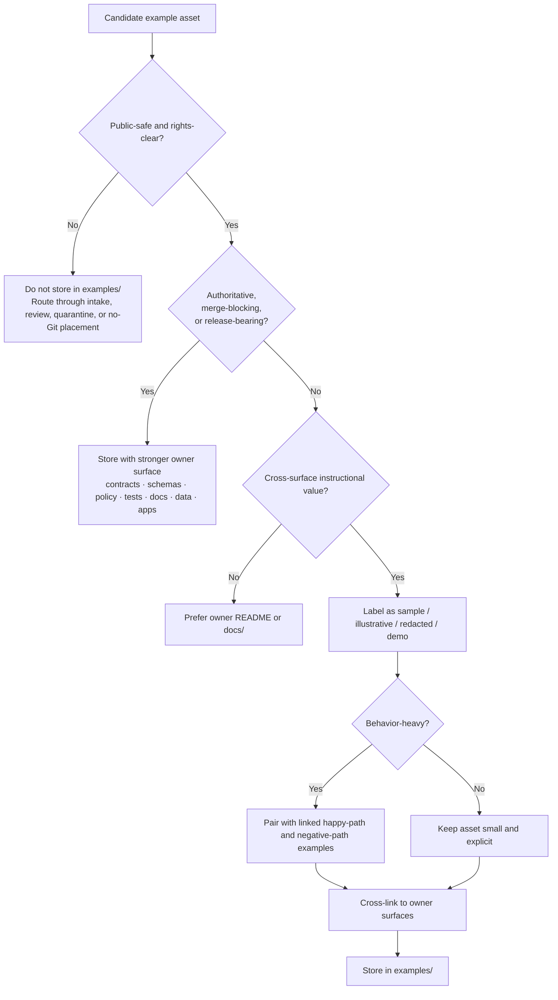

<!-- [KFM_META_BLOCK_V2]
doc_id: kfm://doc/NEEDS-VERIFICATION
title: examples
type: standard
version: v1
status: draft
owners: @bartytime4life
created: YYYY-MM-DD
updated: YYYY-MM-DD
policy_label: public
related: [../README.md, ../CONTRIBUTING.md, ../.github/README.md, ../contracts/, ../schemas/, ../policy/, ../tests/, ../docs/, ../data/, ../apps/]
tags: [kfm, examples, fixtures, readme]
notes: [Revised against the public GitHub main branch plus March 2026 KFM doctrine; /examples/ currently contains README.md only; created/updated dates and stable doc_id still need commit-history verification.]
[/KFM_META_BLOCK_V2] -->

# examples

Public-safe, non-authoritative examples and demo assets for Kansas Frontier Matrix.

> Status: Experimental  
> Owners: `@bartytime4life`  
>        
> Quick jumps: [Scope](#scope) · [Repo fit](#repo-fit) · [Accepted inputs](#accepted-inputs) · [Exclusions](#exclusions) · [Directory tree](#directory-tree) · [Quickstart](#quickstart) · [Usage](#usage) · [Diagram](#diagram) · [Tables](#tables) · [Task list](#task-list--definition-of-done) · [FAQ](#faq) · [Appendix](#appendix)  
> Repo fit: `examples/README.md` · upstream [../README.md](../README.md) · [../CONTRIBUTING.md](../CONTRIBUTING.md) · [../.github/README.md](../.github/README.md)

> [!IMPORTANT]
> This README is **repo-aware** and **evidence-bounded**.
>
> The live public `main` branch confirms that `examples/` exists and currently contains `README.md` only. March 2026 KFM doctrine adds the governing rules that make this lane useful: examples must stay public-safe, non-authoritative, easy to inspect, and easy to relocate once a stronger owner surface exists.
>
> Read statements here as:
>
> - **CONFIRMED** — proven by the current visible repo or stable KFM doctrine
> - **INFERRED** — strongly suggested by repo/doctrine alignment, but not directly re-run or re-emitted here
> - **PROPOSED** — recommended next shape or usage pattern
> - **UNKNOWN** — not established strongly enough from current evidence
> - **NEEDS VERIFICATION** — placeholder or branch-local detail that should be checked before merge

> [!NOTE]
> Nothing in `examples/` should masquerade as canonical truth, release evidence, policy truth, or rights-unclear source material.

---

## Scope

`examples/` is KFM’s **public-safe example lane**.

Its job is not to become a shadow data lake, a hidden fixture dump, or a second authority layer. Its job is to help contributors, reviewers, and maintainers understand how KFM artifacts and trust-visible surfaces are supposed to look **without** confusing sample material with promoted releases, authoritative contracts, or runtime truth.

That keeps the scope intentionally narrow:

- keep **small, inspectable, instructional** material here
- keep **authoritative or executable** material with its owning surface
- keep **sensitive, rights-unclear, or release-bearing** material out
- keep example packs obviously **illustrative**, not canonical

A healthy `examples/` lane improves contributor understanding while staying easy to delete, rename, or move later.

[Back to top](#examples)

## Repo fit

`examples/README.md` is the directory README for KFM’s example lane.

| Field | Value |
| --- | --- |
| Path | `examples/README.md` |
| Branch | `main` |
| Visibility | public |
| Current contents | `README.md` only |
| Role | cross-surface example lane for public-safe demos, walkthrough payloads, and instructional assets |
| Upstream anchors | [../README.md](../README.md) · [../CONTRIBUTING.md](../CONTRIBUTING.md) · [../.github/README.md](../.github/README.md) |
| Adjacent owner surfaces | [../contracts/](../contracts/) · [../schemas/](../schemas/) · [../policy/](../policy/) · [../tests/](../tests/) · [../docs/](../docs/) · [../data/](../data/) · [../apps/](../apps/) |

### Why this lane exists

KFM’s documentation and contract doctrine repeatedly push toward **named, typed, inspectable artifacts**: envelopes, manifests, bundles, proof objects, example payloads, and trust-visible UI states. `examples/` provides a small, repo-native place to show those things **as examples** without moving their authority away from contracts, tests, docs, policy, or governed data lanes.

### Stronger owner surfaces

Use `examples/` only after checking whether one of the owner lanes below is the better home:

| Stronger owner | What belongs there | Why it should not default to `examples/` |
| --- | --- | --- |
| `../contracts/` | stable API examples, shared object definitions, outward payload examples coupled to a contract | contract truth should stay versioned and reviewable where the contract lives |
| `../schemas/` | schema files, schema-owned valid/invalid examples, compatibility rules | schema drift is harder to detect when examples are split away from the schema owner |
| `../policy/` | executable policy bundles, reason/obligation registries, policy tests, decision grammar | governance should not hide in a demo lane |
| `../tests/` | merge-blocking fixtures, negative-path packs, screenshot baselines, runtime verification packs | executable proof belongs with the harness that enforces it |
| `../docs/` | walkthroughs, runbooks, ADRs, long-form explanation, screenshots with narrative context | narrative authority belongs in docs |
| `../data/` | governed manifests, dataset-linked example artifacts, release-linked sample outputs, receipts | examples must not replace the truth path |
| `../apps/` | runtime-owned UI/API behavior, surface-state examples tied tightly to implementation | app truth should stay near the app that renders or emits it |

> [!TIP]
> `examples/` is the cross-surface **demo lane**, not the universal home for every sample, fixture, or payload.

[Back to top](#examples)

## Accepted inputs

Content that belongs here includes:

- small, public-safe request/response examples that explain a contract, route, or user flow
- redacted example payloads for **Explorer**, **Timeline**, **Story**, **Dossier**, **Evidence Drawer**, **Focus**, **Compare**, **Export**, or **Review** surfaces
- tiny walkthrough assets that help a contributor inspect KFM behavior without needing real source captures
- demo manifests or sidecars that explain expected fields while staying clearly illustrative
- instructional packs used in onboarding docs, screenshots, tutorials, or diagrams
- public-safe thin-slice illustrations when they are explicitly marked as **illustrative** and not executable truth
- temporary cross-surface examples that do not yet have a stronger owner surface, provided they are easy to move later

A useful heuristic:

- **illustrative**
- **redacted or public-safe**
- **small enough to review quickly**
- **easy to relocate once a stronger owner exists**

[Back to top](#examples)

## Exclusions

The following do **not** belong here:

| Do not store here | Why | Put it instead in… |
| --- | --- | --- |
| canonical dataset versions, raw captures, or published catalog artifacts | examples must not replace the governed truth path | `../data/` and its governed sublanes |
| authoritative schemas, policy bundles, or stable API contracts | these are authority-bearing, not illustrative | `../schemas/`, `../policy/`, `../contracts/` |
| release manifests, proof packs, receipts, or correction notices presented as operational truth | these are evidence-bearing release objects | release, runtime, runbook, or governed data lanes |
| merge-blocking valid/invalid fixtures | executable proof should stay with the enforcing harness | `../tests/`, `../schemas/`, or `../contracts/` |
| secrets, tokens, environment files, or machine-local configuration | never commit secrets into example material | secret managers / environment provisioning |
| rights-unclear, restricted, or precise sensitive-location material | KFM should fail closed under ambiguity | intake, review, quarantine, redaction, or no-Git placement |
| large binaries, model weights, or convenience dumps | high weight, low review value | owner-specific artifact or storage surface |
| narrative claims presented as fact without evidence, limits, or provenance context | violates KFM’s cite-or-abstain posture | docs or review drafts until evidence is attached |

> [!WARNING]
> If a file is needed to make CI fail, policy decide, promotion pass, or runtime truth resolve, it probably has a stronger owner than `examples/`.

[Back to top](#examples)

## Directory tree

### Current verified shape

```text
examples/
└── README.md
```

The current directory is intentionally minimal.

<details>
<summary><strong>PROPOSED growth shapes</strong></summary>

Use a larger shape only when the branch actually accumulates enough example material to justify it.

```text
# General cross-surface growth shape — illustrative only
examples/
├── api/
├── story/
├── ui/
├── thin_slice/
└── README.md
```

```text
# Doctrine-aligned hydrology illustration pack — PROPOSED, not current repo fact
examples/
└── thin_slice/
    └── hydrology/
        └── README.md
```

If a hydrology-first pack ever lands here, keep it **instructional only**. Executable hydrology fixtures, gates, and proof objects still belong with their owner surfaces—most often `../tests/`, `../contracts/`, `../schemas/`, `../data/`, or `../docs/runbooks/`.
</details>

[Back to top](#examples)

## Quickstart

Inspect the lane first. Do not assume it contains more than the checked-out branch proves.

```bash
# Inspect the current lane
ls -la examples
find examples -maxdepth 3 -type f | sort
```

Inspect stronger owner surfaces before adding new example material:

```bash
# Check likely owner lanes first
ls -la contracts schemas policy tests docs data apps
find contracts schemas policy tests docs data apps -maxdepth 2 -type f | sort | sed -n '1,200p'
```

Use a verification-first local flow before documenting behavior as fact:

```bash
# Illustrative only — run only if analogous targets exist in your checkout
make validate-schemas
make test
make sample-ingest SOURCE=example_fixture
```

Before adding a new artifact, answer these questions:

1. Is it public-safe and rights-clear?
2. Is it obviously non-authoritative?
3. Does it belong more naturally with `contracts/`, `schemas/`, `policy/`, `tests/`, `docs/`, `data/`, or `apps/`?
4. If it demonstrates governed behavior, where is the owner surface that proves it?
5. Can it be deleted or moved later without breaking the repo’s source of truth?

[Back to top](#examples)

## Usage

### 1. Choose the owning surface first

Decide where the **source of truth** lives before you decide where the example should live.

- Contract- or schema-defining material usually belongs with `../contracts/` or `../schemas/`.
- Policy-bearing examples usually belong with `../policy/`.
- Executable positive/negative proof usually belongs with `../tests/`.
- Governed data examples and manifest-linked objects usually belong with `../data/`.
- UI walkthroughs and long-form explanation usually belong with `../docs/`.
- Runtime-owned behavior examples often belong with `../apps/`.

Put something in `examples/` only when its value is **instructional**, **cross-surface**, and **public-safe**.

### 2. Keep examples small and explicit

A good example in this directory should be:

- tiny enough to inspect in one screenful or one diff
- labeled as `illustrative`, `sample`, `redacted`, or `demo`
- obvious about what it proves and what it does **not** prove
- easy to replace, delete, or move later

### 3. Prefer paired examples for behavior-heavy changes

If the example exists to demonstrate validation, policy, or runtime behavior, prefer a pair:

- one happy-path example
- one negative-path or constrained example

That keeps the examples lane aligned with KFM’s fail-closed posture instead of documenting only the polished path.

### 4. Cross-link, do not duplicate authority

A strong example should point back to:

- the owning contract or schema
- the relevant test lane
- the governing doc or runbook
- the relevant policy or review rule, when one exists

`examples/` should make the repo easier to navigate, not create a second unofficial authority layer.

### 5. Move examples out when they harden

Move material out of `examples/` once it becomes:

- merge-blocking
- schema-governing
- release-bearing
- tightly owned by one app, lane, or contract family
- the only place where an important behavior is described

[Back to top](#examples)

## Diagram


```mermaid
flowchart TD
    A[Candidate example asset] --> B{Public-safe and rights-clear?}
    B -- No --> X[Do not store in examples/<br/>Route through intake, review, quarantine, or no-Git placement]
    B -- Yes --> C{Authoritative,<br/>merge-blocking,<br/>or release-bearing?}
    C -- Yes --> Y[Store with stronger owner surface<br/>contracts · schemas · policy · tests · docs · data · apps]
    C -- No --> D{Cross-surface instructional value?}
    D -- No --> E[Prefer owner README or docs/]
    D -- Yes --> F[Label as sample / illustrative / redacted / demo]
    F --> G{Behavior-heavy?}
    G -- Yes --> H[Pair with linked happy-path and negative-path examples]
    G -- No --> I[Keep asset small and explicit]
    H --> J[Cross-link to owner surfaces]
    I --> J
    J --> K[Store in examples/]
```

[Back to top](#examples)

## Tables

### Placement matrix

| Artifact class | Keep in `examples/`? | Stronger owner when authoritative | Why |
| --- | --- | --- | --- |
| Tiny redacted API example | Yes | `../contracts/` or `../apps/` | Great for walkthroughs; weak as source of truth |
| Demo Explorer / Focus / Evidence Drawer payload | Yes, if public-safe | `../apps/` plus `../tests/` and `../docs/` | Helpful for onboarding and review |
| Valid schema example | Sometimes | `../schemas/` or `../tests/` | Canonical validation ownership should stay near the schema or harness |
| Invalid fixture / failure case | Sometimes | `../tests/` or `../contracts/` | Negative behavior should stay executable somewhere reviewable |
| Example `EvidenceBundle` / envelope sketch | Yes, if clearly illustrative | `../contracts/`, `../data/`, or runtime docs | Useful for explanation; risky if treated as live truth |
| Hydrology thin-slice walkthrough asset | Sometimes | `../tests/`, `../data/`, or `../docs/runbooks/` once it hardens | Good for explanation; poor home for executable proof |
| Canonical dataset snapshot | No | `../data/` | Examples must not replace governed truth |
| Release manifest / proof pack / correction artifact | No | release, runtime, or governed data surface | These are operational trust objects |
| Secret-bearing or rights-unclear material | No | nowhere in Git until resolved | Violates KFM trust posture |

### Status guide for this directory

| Label | Use here when… |
| --- | --- |
| **CONFIRMED** | the current repo or stable KFM doctrine directly proves the statement |
| **INFERRED** | repo shape plus doctrine strongly suggest the statement, but the exact branch-local behavior is not re-run here |
| **PROPOSED** | the shape is a sensible next step, not present branch fact |
| **UNKNOWN** | ownership, implementation depth, or content presence is not verified strongly enough |
| **NEEDS VERIFICATION** | a placeholder value, date, path detail, or branch-local fact should be checked before merge |

[Back to top](#examples)

## Task list / Definition of done

A contribution to `examples/` is ready when all relevant checks below are true:

- [ ] It is public-safe, rights-clear, and small enough to review quickly.
- [ ] It is labeled as `example`, `demo`, `redacted`, `illustrative`, or equivalent.
- [ ] It does not pretend to be canonical truth, a promoted dataset, or release evidence.
- [ ] The stronger owner surface was checked first.
- [ ] The owning surface is identified and linked when one exists.
- [ ] If it demonstrates behavior, the related schema, contract, test, policy, or runbook is linked.
- [ ] If a negative case matters, a failing or constrained example exists somewhere reviewable.
- [ ] No secrets, tokens, local machine paths, or restricted precise coordinates are embedded.
- [ ] The example improves contributor understanding more than it increases maintenance cost.
- [ ] Deletion or relocation will be easy once the stronger owner surface becomes clearer.

[Back to top](#examples)

## FAQ

### Why can this directory stay almost empty?

Because the lane still has value even when it contains only its README. It tells contributors where safe example material belongs, and just as importantly, where it does **not** belong.

### Why not store real dataset snapshots here?

Because KFM separates examples from authoritative truth. Governed data belongs in the truth path and its owner surfaces, not in a convenience folder.

### Where should executable fixtures live?

With the owner that enforces them. In practice that usually means `../tests/`, `../schemas/`, `../contracts/`, or `../policy/`.

### Can screenshots or demo assets live here?

Yes, when they are public-safe, small, clearly labeled, and not the only place where important behavior is described.

### Why mention hydrology here at all?

Because KFM’s March 2026 doctrine repeatedly treats hydrology as the strongest first thin slice. This README reflects that pressure, but keeps hydrology-in-`examples/` strictly **PROPOSED** and **illustrative** unless the branch proves otherwise.

### When should something move out of `examples/`?

Move it once it becomes authoritative, merge-blocking, schema-governing, release-bearing, or tightly bound to one owner surface.

[Back to top](#examples)

## Appendix

<details>
<summary><strong>PROPOSED sidecar fields for richer example packs</strong></summary>

Use a sidecar only when the example needs more context than a filename can carry.

```yaml
example_id: NEEDS-VERIFICATION
title: Example title
purpose: Short sentence explaining what this demonstrates
authority_status: illustrative
owner_surface: ../contracts/ | ../schemas/ | ../policy/ | ../tests/ | ../docs/ | ../data/ | ../apps/
redaction_status: public_safe
source_links:
  - ../README.md
  - ../CONTRIBUTING.md
validation_links:
  - ../schemas/
  - ../tests/
notes:
  - Replace placeholders before commit
  - Link the stronger owner surface when known
  - Re-check branch-local path assumptions before standardizing filenames
```

A sidecar should reduce ambiguity, not add ceremony.
</details>

<details>
<summary><strong>PROPOSED naming guidance</strong></summary>

Prefer names that tell a reviewer what the asset is doing:

- `public-read-example.json`
- `focus-abstain-example.json`
- `story-citation-example.md`
- `catalog-closure-example.json`
- `redacted-feature-example.geojson`

Avoid names that imply authority or production state:

- `final.json`
- `real_data.csv`
- `release-ready.geojson`
- `truth-layer.parquet`
- `production-response.json`
</details>

<details>
<summary><strong>Doctrine-driven note on hydrology-first examples</strong></summary>

KFM doctrine repeatedly treats hydrology as the best first thin slice because it is public-safe often enough to prove the governed path without immediately forcing the hardest rights burdens.

That does **not** mean `examples/` should automatically become the hydrology lane.

Working rule:

- instructional hydrology walk-through assets may live here
- executable hydrology fixtures should stay with `../tests/` or another owner surface
- authoritative hydrology releases, manifests, bundles, and correction artifacts should stay with governed data, contract, runtime, or runbook owners

Keep the examples lane explanatory. Keep proof-bearing hydrology artifacts with their enforcing owners.
</details>

[Back to top](#examples)
