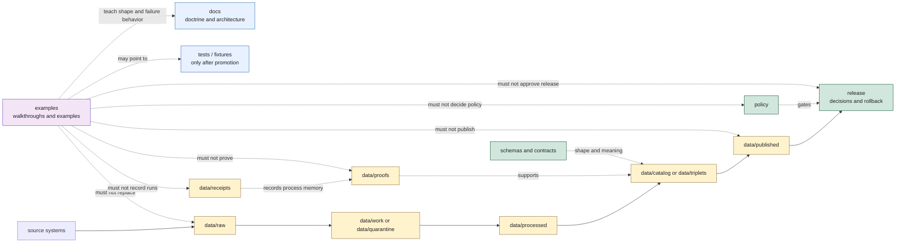

<!-- [KFM_META_BLOCK_V2]
doc_id: kfm://doc/examples/readme
title: Examples Root README
type: standard
version: v0.2.0
status: draft
owners: TODO(owner): examples steward; TODO(owner): docs steward; TODO(owner): evidence steward; TODO(owner): policy steward; TODO(owner): release steward; TODO(owner): UI steward; TODO(owner): governed API steward; TODO(owner): domain stewards as applicable
created: NEEDS VERIFICATION - short root README existed before 2026-06-30 expansion
updated: 2026-06-30
policy_label: public-review
related: [evidence_bundles/README.md, focus_flows/README.md, habitat/README.md, ingest_receipts/README.md, settlements-infrastructure/README.md, source_intake/README.md, story_decks/README.md, viewer_styles/README.md, ../docs/doctrine/directory-rules.md, ../data/proofs/README.md, ../data/receipts/README.md, ../data/published/README.md, ../release/]
tags: [kfm, examples, walkthroughs, example-assemblies, non-authoritative, synthetic, fixtures, source-intake, ingest-receipts, evidence-bundles, focus-flows, habitat, settlements-infrastructure, story-decks, viewer-styles, finite-outcomes, cite-or-abstain, no-public-path]
notes: ["This README replaces the short root stub at `examples/README.md`.", "Directory Rules treats `examples/` as a canonical root for examples, but canonical root placement does not make an example source truth, proof authority, receipt authority, policy authority, release authority, schema authority, contract authority, or public payload authority.", "Examples may teach shape, review behavior, finite outcomes, negative states, and safe failure modes. Operational artifacts must live under their responsibility roots.", "README presence does not prove all child example inventory, schemas, validators, fixtures, CI checks, governed API route behavior, runtime behavior, release manifests, published payloads, or hosting readiness."]
[/KFM_META_BLOCK_V2] -->

<a id="top"></a>

# Examples

Worked examples, walkthroughs, synthetic payload sketches, and review aids for KFM behavior.

<p>
  
  
  
  
  
</p>

**Status:** draft / root contract for examples  
**Owning root:** `examples/`  
**Authority posture:** canonical examples root / non-authoritative example content  
**Quick links:** [Purpose](#purpose) · [Authority posture](#authority-posture) · [Known child lanes](#known-child-lanes) · [Repo fit](#repo-fit) · [Accepted material](#accepted-material) · [Exclusions](#exclusions) · [Example contract](#example-contract) · [Guardrails](#guardrails) · [Lifecycle relationship](#lifecycle-relationship) · [Suggested layout](#suggested-layout) · [Validation checklist](#validation-checklist) · [Status notes](#status-notes) · [Evidence ledger](#evidence-ledger)

> [!IMPORTANT]
> Files under `examples/` are examples. They can teach shape, behavior, review posture, finite outcomes, negative states, and safe failure modes, but they are not source truth, lifecycle data, EvidenceBundles, ProofPacks, receipts, schemas, contracts, policy decisions, release decisions, public API responses, UI runtime behavior, published artifacts, validators, tests, or fixtures unless an accepted test/fixture strategy explicitly promotes a copy elsewhere.

> [!CAUTION]
> Do not use this root to bypass KFM's trust membrane. Examples must not read directly from RAW, WORK, QUARANTINE, PROCESSED, unpublished CATALOG/TRIPLET, internal stores, proof stores, receipt stores, source registries, graph/vector stores, model runtimes, or canonical/private stores as a normal public path.

---

## Purpose

`examples/` is the KFM home for reviewable examples and walkthrough assemblies.

Use it to show:

- how a governed flow should look before it becomes operational;
- how positive and negative examples differ;
- how finite outcomes such as `ANSWER`, `ABSTAIN`, `DENY`, `ERROR`, `HOLD`, `QUARANTINE`, and disabled/withheld viewer states should be represented;
- how source role, rights, sensitivity, evidence support, policy posture, release posture, correction path, and rollback posture should stay visible;
- how reviewers should identify when an example must remain synthetic, generalized, redacted, delayed, denied, or moved to the correct operational root.

Examples are useful because they make doctrine inspectable. They are dangerous if they become hidden authority. This README exists to keep that boundary clear.

---

## Authority posture

Directory Rules identifies `examples/` as a canonical root for examples. That means the path is appropriate for examples. It does **not** mean examples are authoritative data, proof, policy, release, or runtime behavior.

| Question | Answer |
|---|---|
| Is `examples/` a recognized root? | Yes, as the examples root. |
| Are examples public truth? | No. Examples are illustrative unless promoted through the correct operational root. |
| Can examples contain real data? | Avoid it by default. Use synthetic, generalized, redacted, delayed, or explicitly fixture-scoped material. |
| Can examples prove claims? | No. Proof support belongs in `data/proofs/`. |
| Can examples emit receipts? | No. Receipt process memory belongs in `data/receipts/`. |
| Can examples publish? | No. Published artifacts belong in `data/published/`, and release decisions belong in `release/`. |
| Can examples define schemas, contracts, or policy? | No. Those belong in `schemas/`, `contracts/`, and `policy/`. |
| Can examples become tests or fixtures? | Only by creating or promoting a separate copy under an accepted `tests/` or `fixtures/` strategy. |

---

## Known child lanes

The table below reflects child lanes inspected or discovered during this README expansion. It is not a recursive inventory of every possible file under `examples/`.

| Path | Purpose | Boundary |
|---|---|---|
| [`evidence_bundles/`](evidence_bundles/README.md) | EvidenceBundle-like examples, citation closure, finite outcomes, EvidenceRef behavior. | Not proof authority. Operational proof support belongs under `data/proofs/`. |
| [`focus_flows/`](focus_flows/README.md) | Focus Mode request/response flow examples, Evidence Drawer handoffs, finite outcomes. | Not governed API routes, model traces, policy decisions, or runtime behavior. |
| [`focus_flows/hydrology_huc12_question.md`](focus_flows/hydrology_huc12_question.md) | Synthetic Hydrology HUC12 Focus question example. | Expected example outcome is `ABSTAIN`; not HUC12 evidence or hydrology truth. |
| [`habitat/`](habitat/README.md) | Habitat example lane for suitability, land-cover context, ecoregions, connectivity, restoration opportunity, and sensitive joins. | Not Habitat truth, occurrence truth, public layers, proofs, receipts, policy, or release. |
| [`ingest_receipts/`](ingest_receipts/README.md) | Ingest receipt shape and process-memory examples. | Not emitted receipts. Operational ingest receipts belong under `data/receipts/ingest/`. |
| [`settlements-infrastructure/`](settlements-infrastructure/README.md) | Settlement identity and public-safe infrastructure examples. | Not settlement truth, municipal certification, operator/dependency disclosure, proof, receipt, or release. |
| [`source_intake/`](source_intake/README.md) | Pre-RAW source-admission examples. | Not SourceDescriptors, SourceActivationDecisions, SourceIntakeRecords, RAW captures, or receipts. |
| [`source_intake/usgs_nwis_walkthrough.md`](source_intake/usgs_nwis_walkthrough.md) | Synthetic USGS Water Data / NWIS source-intake walkthrough. | Not a real USGS/NWIS admission, endpoint test, RAW capture, or hydrology record. |
| [`story_decks/`](story_decks/README.md) | Story sequence examples for nodes, evidence callouts, reality-boundary notes, finite outcomes, and release gates. | Not `StoryManifest`, `StoryNode`, published story payload, release, or Story Player behavior. |
| [`story_decks/kansas_drought_2012.md`](story_decks/kansas_drought_2012.md) | Synthetic Kansas Drought 2012 story deck example. | Factual drought claims are evidence-gated slots, not historical truth. |
| [`viewer_styles/`](viewer_styles/README.md) | Viewer style, legend, trust-badge, accessibility, MapLibre style-fragment examples. | Not StyleManifest, LayerManifest, MapLibre runtime code, UI code, published layer artifact, or geoprivacy control. |

---

## Repo fit

| Example family | Examples home | Operational homes examples must not replace |
|---|---|---|
| Source intake | `examples/source_intake/` | `docs/sources/`, `data/registry/sources/`, `connectors/`, `data/raw/`, `data/quarantine/`, `data/receipts/ingest/` |
| Ingest receipts | `examples/ingest_receipts/` | `data/receipts/ingest/`, `data/receipts/validation/`, receipt schemas/validators/tests when accepted |
| Evidence support | `examples/evidence_bundles/` | `data/proofs/evidence_bundle/`, `data/proofs/citation_validation/`, `data/proofs/proof_pack/` |
| Focus flows | `examples/focus_flows/` | `docs/architecture/governed-ai/`, `apps/governed-api/`, `apps/explorer-web/`, `policy/focus/`, `data/proofs/` |
| Domain examples | `examples/<domain-or-topic>/` | `docs/domains/`, `data/raw/`, `data/work/`, `data/quarantine/`, `data/processed/`, `data/catalog/`, `data/proofs/`, `data/published/`, `release/` |
| Story decks | `examples/story_decks/` | `docs/architecture/story/`, `data/published/stories/`, Story schemas/contracts, Story Player code, release manifests |
| Viewer styles | `examples/viewer_styles/` | `packages/maplibre/`, `packages/ui/`, `apps/explorer-web/`, `data/published/layers/`, style schemas/contracts/policy |
| Tests and fixtures | Not automatically examples | `tests/`, `fixtures/`, `tools/validators/` |
| Release decisions | Never examples | `release/` |
| Public outputs | Never examples | `data/published/` and governed API/public delivery surfaces after release gates close |

---

## Accepted material

Accepted material should be small, deterministic, inspectable, synthetic or safely redacted, and clearly marked as an example.

| Accepted item | Use | Required markings |
|---|---|---|
| `*.example.json` / `*.example.yaml` | Non-authoritative shape examples. | `example: true`, `authority: non_authoritative_example`, `do_not_publish: true`. |
| `*.walkthrough.md` | Narrative walk-through of a governed flow or failure mode. | Explicitly state what is synthetic and what would be required operationally. |
| Negative-state examples | Show `ABSTAIN`, `DENY`, `ERROR`, `HOLD`, `QUARANTINE`, or disabled/withheld viewer states. | Include reason codes and no restricted detail leakage. |
| Evidence-handling examples | Show EvidenceRef/EvidenceBundle-like relationships. | Must not become proof records. |
| Source-role examples | Teach source-role separation and anti-collapse. | Must not become SourceDescriptors or source registry records. |
| Public UI/story/style examples | Show trust-visible public behavior. | Must not read internal stores or become runtime UI/API artifacts. |
| README files | Explain local scope, boundaries, accepted material, exclusions, validation, and evidence ledger. | Must distinguish CONFIRMED / PROPOSED / UNKNOWN / NEEDS VERIFICATION. |

---

## Exclusions

| Do not place here | Correct home or action |
|---|---|
| RAW source payloads, source downloads, scans, rasters, vectors, full API responses, source-system mirrors | `data/raw/`, `data/work/`, or `data/quarantine/` depending on state |
| WORK candidates, scratch transforms, normalization outputs, repair outputs, notebooks, QA products | `data/work/` or implementation roots |
| Quarantined rights/source-role/sensitivity/release-unclear material | `data/quarantine/` |
| Processed data | `data/processed/` |
| Catalog records, triplets, graph projections, release candidates | `data/catalog/`, `data/triplets/`, `release/candidates/` as applicable |
| EvidenceBundles, ProofPacks, citation-validation reports, proof indexes, integrity records | `data/proofs/` |
| Run, ingest, validation, transform, AI, telemetry, release, correction, rollback, representation, or style-build receipts | `data/receipts/` |
| Published PMTiles, GeoParquet, GeoJSON, COGs, story payloads, reports, screenshots, downloads, API payloads | `data/published/` after release gates close |
| ReleaseManifest, PromotionDecision, CorrectionNotice, WithdrawalNotice, RollbackCard, signatures, release changelog | `release/` |
| SourceDescriptors, registries, source activation decisions | `data/registry/`, `control_plane/`, or ADR-accepted source registry homes |
| Contracts, schemas, policy bundles, validators, tests, fixtures, apps, packages, pipelines, connectors, workflows | Their canonical responsibility roots |
| Secrets, credentials, private tokens, exact sensitive locations, rare-species locations, archaeology/burial/sacred-site clues, living-person data, DNA/genomic records, infrastructure-sensitive detail, private parcel joins, proprietary terms, reconstructive redaction clues | Quarantine, restrict, redact, generalize, synthesize, or deny |
| Generated summaries presented as evidence | Governed AI/story/UI surfaces may cite evidence; generated text is not evidence |

---

## Example contract

Every consequential example should answer these questions:

| Question | Expected answer |
|---|---|
| What scenario is illustrated? | A bounded synthetic or safely redacted scenario. |
| What root owns the operational version? | The correct data, docs, policy, schema, contract, package, app, proof, receipt, fixture, test, or release root. |
| What source role applies? | Explicit role where relevant; roles must not collapse. |
| What evidence support is implied? | Synthetic refs or clearly marked `NEEDS VERIFICATION`; real proof belongs in `data/proofs/`. |
| What policy/sensitivity posture applies? | `allow`, `restrict`, `hold`, `deny`, `abstain`, `error`, or `needs_review` as an illustrative state only. |
| What finite outcome should render? | `ANSWER`, `ABSTAIN`, `DENY`, `ERROR`, `HOLD`, `QUARANTINE`, or a disabled/withheld state where applicable. |
| What is the release posture? | `not_released`, synthetic release ref, or operational release ref only when verified outside examples. |
| What must not happen? | No operational authority by example placement. |

Use a visible marker like this in structured examples:

```json
{
  "example": true,
  "authority": "non_authoritative_example",
  "do_not_publish": true,
  "example_id": "kfm://example/NEEDS-VERIFICATION",
  "expected_outcome": "ABSTAIN",
  "reason": "illustrative example only; operational evidence, policy, release, schema, route, validator, and fixture behavior NEEDS VERIFICATION",
  "forbidden_use": [
    "source_truth",
    "raw_payload",
    "proof_record",
    "receipt_record",
    "catalog_record",
    "policy_decision",
    "release_decision",
    "public_payload",
    "runtime_fixture_without_promotion"
  ]
}
```

---

## Guardrails

| Risk | Guardrail |
|---|---|
| Example becomes truth | Keep example authority visibly non-authoritative. Operational claims require evidence, proof, policy, review, and release. |
| Example bypasses lifecycle | Examples may demonstrate lifecycle behavior but cannot become RAW, WORK, QUARANTINE, PROCESSED, CATALOG, TRIPLET, PUBLISHED, proof, receipt, registry, or release authority. |
| Example becomes proof | Evidence-like examples remain examples. Proof support belongs in `data/proofs/`. |
| Example becomes receipt | Receipt-like examples remain examples. Emitted process memory belongs in `data/receipts/`. |
| Example becomes policy or release | Policy decisions and release decisions live under their authority roots, not examples. |
| Example becomes runtime | Route, app, package, connector, validator, test, and fixture behavior must be implemented and validated in the correct roots. |
| Sensitive detail leaks | Use synthetic, generalized, redacted, delayed, restricted, or denied examples by default. |
| Generated text overclaims | AI/story/UI narration is downstream. EvidenceBundle and policy state outrank generated language. |
| Compatibility root drift | Examples must not legitimize `styles/`, `viewer_templates/`, `ui/`, `web/`, `jsonschema/`, `policies/`, or `artifacts/` as new authority roots. |
| Stale examples mislead | Stale or broken examples should be repaired, marked stale, moved, or deleted. |

---

## Lifecycle relationship


```mermaid
flowchart LR
    EX["examples<br/>walkthroughs and examples"] -. "teach shape and failure behavior" .-> DOCS["docs<br/>doctrine and architecture"]
    EX -. "may point to" .-> TESTS["tests / fixtures<br/>only after promotion"]

    SRC["source systems"] --> RAW["data/raw"]
    RAW --> WORK["data/work or data/quarantine"]
    WORK --> PROC["data/processed"]
    PROC --> CAT["data/catalog or data/triplets"]
    CAT --> PUB["data/published"]
    PUB --> REL["release<br/>decisions and rollback"]

    PROOF["data/proofs"] -. "supports" .-> CAT
    RECEIPT["data/receipts"] -. "records process memory" .-> PROOF
    POLICY["policy"] -. "gates" .-> REL
    SCHEMA["schemas and contracts"] -. "shape and meaning" .-> CAT

    EX -. "must not replace" .-> RAW
    EX -. "must not prove" .-> PROOF
    EX -. "must not record runs" .-> RECEIPT
    EX -. "must not decide policy" .-> POLICY
    EX -. "must not publish" .-> PUB
    EX -. "must not approve release" .-> REL

    classDef example fill:#f3e5f5,stroke:#6f42c1,color:#202124;
    classDef doc fill:#e7f1ff,stroke:#2b6cb0,color:#202124;
    classDef data fill:#fff3cd,stroke:#8a6d3b,color:#202124;
    classDef gate fill:#d1e7dd,stroke:#0f5132,color:#202124;
    class EX example;
    class DOCS,TESTS doc;
    class RAW,WORK,PROC,CAT,PUB,PROOF,RECEIPT data;
    class REL,POLICY,SCHEMA gate;
```

Examples are outside the trust spine. They can make the trust spine easier to understand, but they cannot stand in for it.

---

## Suggested layout

This tree is **PARTIAL / CONFIRMED WHERE FETCHED OR SEARCHED**. It is not a complete recursive listing.

```text
examples/
├── README.md
├── evidence_bundles/
│   └── README.md
├── focus_flows/
│   ├── README.md
│   └── hydrology_huc12_question.md
├── habitat/
│   └── README.md
├── ingest_receipts/
│   └── README.md
├── settlements-infrastructure/
│   └── README.md
├── source_intake/
│   ├── README.md
│   └── usgs_nwis_walkthrough.md
├── story_decks/
│   ├── README.md
│   └── kansas_drought_2012.md
└── viewer_styles/
    └── README.md
```

Potential future additions should follow the local child README contracts and should not create new authority roots inside `examples/`.

---

## Validation checklist

Before adding or changing examples here, verify:

- [ ] The file is marked as an example and non-authoritative.
- [ ] The file has a clear owning example lane and points to the operational home it must not replace.
- [ ] The file does not create schema, contract, policy, proof, receipt, release, source-registry, route, model-runtime, app, package, connector, fixture, validator, or test authority.
- [ ] Any IDs, hashes, signatures, source refs, layer refs, evidence refs, release refs, policy refs, geometry, and timestamps are synthetic or clearly marked `NEEDS VERIFICATION` unless they are verified fixtures in a correct fixture root.
- [ ] Source role, rights, sensitivity, temporal scope, evidence support, policy posture, review state, release state, correction path, and rollback posture are visible where material.
- [ ] Evidence-missing, stale, conflicting, citation-failed, rights-unclear, source-role-unclear, sensitivity-unclear, or release-missing examples render `ABSTAIN`, `DENY`, `HOLD`, `QUARANTINE`, `ERROR`, or a safely withheld state.
- [ ] Sensitive domains fail closed: living people, DNA/genomic data, rare species, archaeology/burial/sacred sites, cultural/sovereignty context, critical infrastructure, private parcels, and exact sensitive locations are denied, generalized, redacted, delayed, restricted, or synthetic.
- [ ] Public UI/API/story/style examples show governed surfaces and do not normalize direct internal-store reads.
- [ ] Relative links still resolve.
- [ ] Operational fixtures, tests, validators, schemas, policies, receipts, proofs, published payloads, and release decisions are placed in their accepted roots.

---

## Review burden

| Change type | Review expectation |
|---|---|
| README-only example guidance | Docs steward plus owning example-lane steward. |
| Example with claim-like content | Evidence steward and relevant domain steward. |
| Example touching policy/sensitivity | Policy steward and sensitivity/domain reviewer. |
| Example touching public UI/API/story/style behavior | UI/API/story/map steward as applicable. |
| Example referencing release/publication | Release steward. |
| Example proposed as fixture/test | Test/fixture strategy owner and validator/tooling steward. |
| Example with real data or restricted source material | Prefer quarantine or deny; do not merge as a normal example without steward decision. |

---

## Status notes

| Item | Status | Notes |
|---|---:|---|
| Target path presence | CONFIRMED | `examples/README.md` existed as a short root README before this update. |
| Examples root authority | CONFIRMED doctrine | Directory Rules lists `examples/` as a canonical root for examples. |
| Example content authority | NON-AUTHORITATIVE | Child README pattern consistently states examples are illustrative and not operational authority. |
| Child example lane inventory | PARTIAL / NEEDS VERIFICATION | Known child lanes were fetched or discovered, but this edit did not recursively enumerate all files. |
| EvidenceBundle examples | CONFIRMED README | `examples/evidence_bundles/README.md` defines non-authoritative EvidenceBundle examples and proof separation. |
| Focus Flow examples | CONFIRMED README | `examples/focus_flows/README.md` defines governed Focus examples and finite outcomes. |
| Source Intake examples | CONFIRMED README | `examples/source_intake/README.md` defines pre-RAW source-intake examples and operational boundaries. |
| Ingest Receipt examples | CONFIRMED README | `examples/ingest_receipts/README.md` defines receipt examples as process-memory examples, not emitted receipts. |
| Habitat examples | CONFIRMED README | `examples/habitat/README.md` defines Habitat examples and sensitive-join fail-closed posture. |
| Settlements/Infrastructure examples | CONFIRMED README | `examples/settlements-infrastructure/README.md` defines settlement/infrastructure examples and preserves slug conflict. |
| Story Deck examples | CONFIRMED README | `examples/story_decks/README.md` defines story examples and separates them from published story payloads. |
| Viewer Style examples | CONFIRMED README | `examples/viewer_styles/README.md` defines viewer style examples and separates them from style/runtime/published-layer authority. |
| Schemas, validators, fixtures, CI checks, governed API route behavior, runtime behavior, release approval, published payloads | NEEDS VERIFICATION | No runtime or validation enforcement was proven by this README. |
| Public release readiness | DENY | Examples cannot publish, prove, release, or answer claims by placement. |

---

## Evidence ledger

| Source | Status | Supports | Limits |
|---|---|---|---|
| Previous target file | CONFIRMED | `examples/README.md` existed as a short README describing walkthroughs and example assemblies. | It lacked KFM metadata, child-lane inventory, guardrails, evidence ledger, and non-authority contract. |
| [`evidence_bundles/README.md`](evidence_bundles/README.md) | CONFIRMED README | EvidenceBundle example lane and proof separation. | Does not prove proof artifacts or validators exist. |
| [`focus_flows/README.md`](focus_flows/README.md) | CONFIRMED README | Focus Flow examples, finite outcomes, governed API/Evidence Drawer boundaries. | Does not prove runtime route behavior or executable policy. |
| [`source_intake/README.md`](source_intake/README.md) | CONFIRMED README | Source-intake examples as pre-RAW admission examples and boundary from SourceDescriptors/RAW/receipts. | Does not prove source schemas, connectors, or source activation. |
| [`ingest_receipts/README.md`](ingest_receipts/README.md) | CONFIRMED README | Ingest receipt examples as process-memory examples, not emitted receipts. | Does not prove receipt schemas, signing, validators, or CI. |
| [`habitat/README.md`](habitat/README.md) | CONFIRMED README | Habitat examples, sensitive joins, finite outcomes, no-public-path posture. | Does not prove Habitat example payloads or release readiness. |
| [`settlements-infrastructure/README.md`](settlements-infrastructure/README.md) | CONFIRMED README | Settlement/infrastructure examples, sensitive infrastructure guardrails, slug conflict preservation. | Does not resolve `settlements-infrastructure` vs `settlement` naming conflict. |
| [`story_decks/README.md`](story_decks/README.md) | CONFIRMED README | Story deck examples and separation from published story payloads, release, proof, receipt, UI runtime. | Does not prove StoryManifest schemas, player implementation, or release approval. |
| [`viewer_styles/README.md`](viewer_styles/README.md) | CONFIRMED README | Viewer style examples and separation from StyleManifest, LayerManifest, MapLibre runtime, UI package, published layers, and compatibility roots. | Does not prove style schemas, validators, or runtime behavior. |
| GitHub search for example-lane files | CONFIRMED SEARCH RESULT | Discovered known child files and example walkthroughs under `examples/`. | Search is not a recursive tree listing; child inventory remains partial. |
| [`../docs/doctrine/directory-rules.md`](../docs/doctrine/directory-rules.md) | CONFIRMED doctrine | Root placement, examples root, lifecycle separation, and responsibility-root doctrine. | Some path claims remain PROPOSED / NEEDS VERIFICATION per doctrine notes. |

[Back to top](#top)
